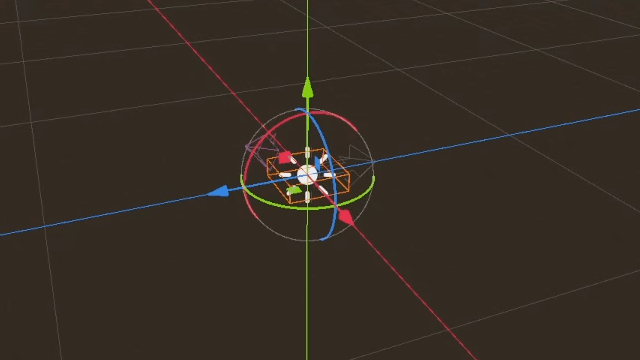

.. _doc_navigation_using_navigationobstacles:

Using NavigationObstacles
=========================

NavigationObstacles can be used either as static or dynamic obstacles to affect avoidance controlled agents.

- When used statically NavigationObstacles constrain avoidance controlled agents outside or inside a polygon defined area.
- When used dynamically NavigationObstacles push away avoidance controlled agents in a radius around them.

2D and 3D versions of NavigationObstacles nodes are available as
:ref:`NavigationObstacle2D<class_NavigationObstacle2D>` and
:ref:`NavigationObstacle3D<class_NavigationObstacle3D>`  respectively.

.. note::
    NavigationObstacles do not change or influence the pathfinding in any way.
    NavigationObstacles only affect the avoidance velocities of agents controlled by avoidance.

Static obstacles
~~~~~~~~~~~~~~~~

A NavigationObstacle is considered static when its ``vertices`` property is populated with an outline array of positions to form a polygon.

- Static obstacles act as hard do-not-cross boundaries for avoidance using agents, e.g. similar to physics collision but for avoidance.
- Static obstacles define their boundaries with an array of outline ``vertices`` (positions), and in case of 3D with an additional ``height`` property.
- Static obstacles only work for agents that use the 2D avoidance mode.
- Static obstacles define through winding order of the vertices if agents are pushed out or sucked in.
- Static obstacles can not change their position. They can only be warped to a new position and rebuild from scratch. Static obstacles as a result are ill-suited for usages where the position is changed every frame as the constant rebuild has a high performance cost.
- Static obstacles that are warped to another position can not be predicted by agents. This creates the risk of getting agents stuck should a static obstacle be warped on top of agents.

When the 2D avoidance is used in 3D the y-axis of Vector3 vertices is ignored. Instead, the global y-axis position of the obstacle is used as the elevation level. Agents will ignore static obstacles in 3D that are below or above them. This is automatically determined by global y-axis position of both obstacle and agent as the elevation level as well as their respective height properties.

Dynamic obstacles
~~~~~~~~~~~~~~~~~

A NavigationObstacle is considered dynamic when its ``radius`` property is greater than zero.

- Dynamic obstacles act as a soft please-move-away-from-me object for avoidance using agents, e.g. similar to how they avoid other agents.
- Dynamic obstacles define their boundaries with a single ``radius`` for a 2D circle, or in case of 3D avoidance a sphere shape.
- Dynamic obstacles can change their position every frame without additional performance cost.
- Dynamic obstacles with a set velocity can be predicted in their movement by agents.
- Dynamic obstacles are not a reliable way to constrain agents in crowded or narrow spaces.

While both static and dynamic properties can be active at the same time on the same obstacle this is not recommended for performance.
Ideally when an obstacle is moving the static vertices are removed and instead the radius activated. When the obstacle reaches the new final position it should gradually enlarge its radius to push all other agents away. With enough created save space around the obstacle it should add the static vertices again and remove the radius. This helps to avoid getting agents stuck in the suddenly appearing static obstacle when the rebuild static boundary is finished.

Similar to agents the obstacles can make use of the ``avoidance_layers`` bitmask.
All agents with a matching bit on their own avoidance mask will avoid the obstacle.

Procedual obstacles
~~~~~~~~~~~~~~~~~~~

New obstacles can be created without a Node directly on the NavigationServer.

Obstacles created with scripts require at least a ``map`` and a ``position``.
For dynamic use a ``radius`` is required.
For static use an array of ``vertices`` is required.

.. tabs::
 .. code-tab:: gdscript GDScript

    # For 2D

    # create a new "obstacle" and place it on the default navigation map.
    var new_obstacle_rid: RID = NavigationServer2D.obstacle_create()
    var default_2d_map_rid: RID = get_world_2d().get_navigation_map()

    NavigationServer2D.obstacle_set_map(new_obstacle_rid, default_2d_map_rid)
    NavigationServer2D.obstacle_set_position(new_obstacle_rid, global_position)

    # Use obstacle dynamic by increasing radius above zero.
    NavigationServer2D.obstacle_set_radius(new_obstacle_rid, 5.0)

    # Use obstacle static by adding a square that pushes agents out.
    var outline = PackedVector2Array([Vector2(-100, -100), Vector2(100, -100), Vector2(100, 100), Vector2(-100, 100)])
    NavigationServer2D.obstacle_set_vertices(new_obstacle_rid, outline)

    # Enable the obstacle.
    NavigationServer2D.obstacle_set_avoidance_enabled(new_obstacle_rid, true)

.. tabs::
 .. code-tab:: gdscript GDScript

    # For 3D

    # Create a new "obstacle" and place it on the default navigation map.
    var new_obstacle_rid: RID = NavigationServer3D.obstacle_create()
    var default_3d_map_rid: RID = get_world_3d().get_navigation_map()

    NavigationServer3D.obstacle_set_map(new_obstacle_rid, default_3d_map_rid)
    NavigationServer3D.obstacle_set_position(new_obstacle_rid, global_position)

    # Use obstacle dynamic by increasing radius above zero.
    NavigationServer3D.obstacle_set_radius(new_obstacle_rid, 0.5)

    # Use obstacle static by adding a square that pushes agents out.
    var outline = PackedVector3Array([Vector3(-5, 0, -5), Vector3(5, 0, -5), Vector3(5, 0, 5), Vector3(-5, 0, 5)])
    NavigationServer3D.obstacle_set_vertices(new_obstacle_rid, outline)
    # Set the obstacle height on the y-axis.
    NavigationServer3D.obstacle_set_height(new_obstacle_rid, 1.0)

    # Enable the obstacle.
    NavigationServer3D.obstacle_set_avoidance_enabled(new_obstacle_rid, true)
