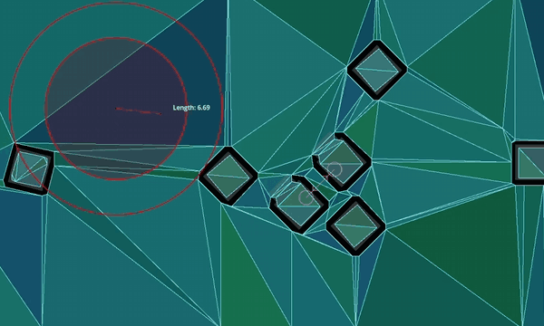

.. _doc_navigation_using_navigationpathqueryobjects:

Using NavigationPathQueryObjects
================================

.. tip::

    Path query parameters expose various options to improve pathfinding performance or lower memory consumption.
    
    They cater to more advanced pathfinding needs that the high-level nodes can not always cover.
    
    See the respective option sections below.

``NavigationPathQueryObjects`` can be used together with ``NavigationServer.query_path()``
to obtain a heavily **customized** navigation path including optional **metadata** about the path.

This requires more setup compared to obtaining a normal NavigationPath but lets you tailor
the pathfinding and provided path data to the different needs of a project.

NavigationPathQueryObjects consist of a pair of objects, a ``NavigationPathQueryParameters`` object holding the customization options
for the query and a ``NavigationPathQueryResult`` that receives (regular) updates with the resulting path and metadata from the query.

2D and 3D versions of ``NavigationPathQueryParameters`` are available as
:ref:`NavigationPathQueryParameters2D<class_NavigationPathQueryParameters2D>` and
:ref:`NavigationPathQueryParameters3D<class_NavigationPathQueryParameters3D>` respectively.

2D and 3D versions of ``NavigationPathQueryResult`` are available as
:ref:`NavigationPathQueryResult2D<class_NavigationPathQueryResult2D>` and
:ref:`NavigationPathQueryResult3D<class_NavigationPathQueryResult3D>` respectively.

Creating a basic path query
---------------------------

Both parameters and result are used as a pair with the ``NavigationServer.query_path()`` function.

For the available customization options, see further below. See also the descriptions for each parameter in the class reference.

While not a strict requirement, both objects are intended to be created once in advance, stored in a
persistent variable for the agent and reused for every followup path query with updated parameters.

Reusing the same objects improves performance when frequently creating objects or allocating memory.

The following script creates the objects and provides a ``query_path()`` function to create new navigation paths.
The resulting path is identical to using ``NavigationServer.map_get_path()`` while reusing the objects.

.. tabs::
 .. code-tab:: gdscript 2D GDScript

    extends Node2D

    # Prepare query objects.
    var query_parameters := NavigationPathQueryParameters2D.new()
    var query_result := NavigationPathQueryResult2D.new()

    func query_path(p_start_position: Vector2, p_target_position: Vector2, p_navigation_layers: int = 1) -> PackedVector2Array:
        if not is_inside_tree():
            return PackedVector2Array()

        var map: RID = get_world_2d().get_navigation_map()

        if NavigationServer2D.map_get_iteration_id(map) == 0:
            # This map has never synced and is empty, no point in querying it.
            return PackedVector2Array()

        query_parameters.map = map
        query_parameters.start_position = p_start_position
        query_parameters.target_position = p_target_position
        query_parameters.navigation_layers = p_navigation_layers

        NavigationServer2D.query_path(query_parameters, query_result)
        var path: PackedVector2Array = query_result.get_path()

        return path

 .. code-tab:: gdscript 3D GDScript

    extends Node3D

    # Prepare query objects.
    var query_parameters := NavigationPathQueryParameters3D.new()
    var query_result := NavigationPathQueryResult3D.new()

    func query_path(p_start_position: Vector3, p_target_position: Vector3, p_navigation_layers: int = 1) -> PackedVector3Array:
        if not is_inside_tree():
            return PackedVector3Array()

        var map: RID = get_world_3d().get_navigation_map()

        if NavigationServer3D.map_get_iteration_id(map) == 0:
            # This map has never synced and is empty, no point in querying it.
            return PackedVector3Array()

        query_parameters.map = map
        query_parameters.start_position = p_start_position
        query_parameters.target_position = p_target_position
        query_parameters.navigation_layers = p_navigation_layers

        NavigationServer3D.query_path(query_parameters, query_result)
        var path: PackedVector3Array = query_result.get_path()

        return path

Path postprocessing options
---------------------------

   Path post-processing differences depending on navigation mesh polygon layout.

A path query search travels from the closest navigation mesh polygon edge to the closest edge along the available polygons.
If possible it builds a polygon corridor towards the target position polygon.

This raw "search" polygon corridor path is not very optimized and usually a bad fit for agents to travel along.
E.g. the closest edge point on a navigation mesh polygon might cause a huge detour for agents on larger polygons.
In order to improve the quality of paths returned by the query various ``path_postprocessing`` options exist.

- The ``PATH_POSTPROCESSING_CORRIDORFUNNEL`` post-processing shortens paths by funneling paths around corners **inside the available polygon corridor**.
  
  This is the default post-processing and usually also the most useful as it gives the shortest path result **inside the available polygon corridor**.
  If the polygon corridor is already suboptimal, e.g. due to a suboptimal navigation mesh layout,
  the funnel can snap to unexpected polygon corners causing detours.

- The ``PATH_POSTPROCESSING_EDGECENTERED`` post-processing forces all path points to be placed in the middle of the crossed polygon edges  **inside the available polygon corridor**.
  
  This post-processing is usually only useful when used with strictly tile-like navigation mesh polygons that are all
  evenly sized and where the expected path following is also constrained to cell centers,
  e.g. typical grid game with movement constrained to grid cell centers.

- The ``PATH_POSTPROCESSING_NONE`` post-processing returns the path as is how the pathfinding traveled **inside the available polygon corridor**.
  
  This post-processing is very useful for debug as it shows how the path search traveled from closest edge point to closet edge point and what polygons it picked.
  A lot of unexpected or suboptimal path results can be immediately explained by looking at this raw path and polygon corridor.

Path simplification
-------------------

.. tip::

    Path simplification can help steering agents or agents that jitter on thin polygon edges.

   Path point difference with or without path simplification.

If ``simplify_path`` is enabled a variant of the Ramer-Douglas-Peucker path simplification algorithm is applied to the path.
This algorithm straightens paths by removing less relevant path points depending on the ``simplify_epsilon`` used.

Path simplification helps with all kinds of agent movement problems in "open fields" that are caused by having many unnecessary polygon edges.
E.g. a terrain mesh when baked to a navigation mesh can cause an excessive polygon count due to all the small (but for pathfinding almost meaningless) height variations in the terrain.

Path simplification also helps with "steering" agents because they only have more critical corner path points to aim for.

.. Warning::

    Path simplification is an additional final post-processing of the path. It adds extra performance costs to the query so only enable when actually needed.

.. note::

    Path simplification is exposed on the NavigationServer as a generic function. It can be used outside of navigation queries for all kinds of position arrays as well.

Path metadata
-------------

.. tip::

    Disabling unneeded path metadata options can improve performance and lower memory consumption.

A path query can return additional metadata for every path point.

- The ``PATH_METADATA_INCLUDE_TYPES`` flag collects an array with the primitive information about the point owners, e.g. if a point belongs to a region or link.
- The ``PATH_METADATA_INCLUDE_RIDS`` flag collects an array with the :ref:`RIDs<class_RID>` of the point owners. Depending on point owner primitive, these RIDs can be used with the various NavigationServer functions related to regions or links.
- The ``PATH_METADATA_INCLUDE_OWNERS`` flag collects an array with the ``ObjectIDs`` of the point owners. These object IDs can be used with :ref:`@GlobalScope.instance_from_id()<class_@GlobalScope_method_instance_from_id>` to retrieve the node behind that object instance, e.g. a NavigationRegion or NavigationLink node.

By default all path metadata is collected as this metadata can be essential for more advanced navigation gameplay.

- E.g. to know what path point maps to what object or node owner inside the SceneTree.
- E.g. to know if a path point is the start or end of a navigation link that requires scripted takeover.

For the most basic path uses metadata is not always needed.
Path metadata collection can be selectively disabled to gain some performance and reduce memory consumption.

Excluding or including regions
------------------------------

.. tip::

    Region filters can greatly help with performance on large navigation maps that are region partitioned.

Query parameters allow limiting the pathfinding to specific region navigation meshes.

If a large navigation map is well partitioned into smaller regions this can greatly help with performance as the
query can skip a large number of polygons at one of the earliest checks in the path search.

- By default and if left empty all regions of the queried navigation map are included.
- If a region :ref:`RID<class_RID>` is added to the ``excluded_regions`` array the region's navigation mesh will be ignored in the path search.
- If a region :ref:`RID<class_RID>` is added to the ``included_regions`` array the region's navigation mesh will be considered in the path search and also all other regions not included will be ignored as well.
- If a region ends up both included and excluded it is considered excluded.

Region filters are very effective for performance when paired with navigation region chunks that are aligned on a grid.
This way the filter can be set to only include the start position chunk and surrounding chunks instead of the entire navigation map.

Even if the target might be outside these surrounding chunks (can always add more "rings") the pathfinding will
try to create a path to the polygon closest to the target.
This usually creates half-paths heading in the general direction that are good enough,
all for a fraction of the performance cost of a full map search.

The following addition to the basic path query script showcases the idea how to integrate a region chunk mapping with the region filters.
This is not a full working example.

.. tabs::
 .. code-tab:: gdscript 2D GDScript

    extends Node2D

    # ...

    var chunk_id_to_region_rid: Dictionary[Vector2i, RID] = {}

    func query_path(p_start_position: Vector2, p_target_position: Vector2, p_navigation_layers: int = 1) -> PackedVector2Array:

        # ...

        var regions_around_start_position: Array[RID] = []

        var chunk_rings: int = 1 # Increase for very small regions or more quality.
        var start_chunk_id: Vector2i = floor(p_start_position / float(chunk_size))

        for y: int in range(start_chunk_id.y - chunk_rings, start_chunk_id.y + chunk_rings):
            for x: int in range(start_chunk_id.x - chunk_rings, start_chunk_id.x + chunk_rings):
                var chunk_id: Vector2i = Vector2i(x, y)
                if chunk_id_to_region_rid.has(chunk_id):
                    var region: RID = chunk_id_to_region_rid[chunk_id]
                    regions_around_start_position.push_back(region)

        query_parameters.included_regions = regions_around_start_position

        # ...

 .. code-tab:: gdscript 3D GDScript

    extends Node3D

    # ...

    var chunk_id_to_region_rid: Dictionary[Vector3i, RID] = {}

    func query_path(p_start_position: Vector3, p_target_position: Vector3, p_navigation_layers: int = 1) -> PackedVector3Array:

        # ...

        var regions_around_start_position: Array[RID] = []
        
        var chunk_rings: int = 1 # Increase for very small regions or more quality.
        var start_chunk_id: Vector3i = floor(p_start_position / float(chunk_size))
        var y: int = 0 # Assume a planar navigation map for simplicity.

        for z: int in range(start_chunk_id.z - chunk_rings, start_chunk_id.z + chunk_rings):
            for x: int in range(start_chunk_id.x - chunk_rings, start_chunk_id.x + chunk_rings):
                var chunk_id: Vector3i = Vector3i(x, y, z)
                if chunk_id_to_region_rid.has(chunk_id):
                    var region: RID = chunk_id_to_region_rid[chunk_id]
                    regions_around_start_position.push_back(region)

        query_parameters.included_regions = regions_around_start_position
        
        # ...

Path clipping and limits
------------------------

.. tip::

    Sensibly set limits can greatly help with performance on large navigation maps, especially when targets end up being unreachable.

   Clipping returned paths to specific distances.

Query parameters allow clipping returned paths to specific lengths.
These options clip the path as a part of post-processing. The path is still searched as if at full length,
so it will have the same quality.
Path length clipping can be helpful in creating paths that better fit constrained gameplay, e.g. tactical games with limited movement ranges.

- The ``path_return_max_length`` property can be used to clip the returned path to a specific max length.
- The ``path_return_max_radius`` property can be used to clip the returned path inside a circle (2D) or sphere (3D) radius around the start position.

Query parameters allow limiting the path search to only search up to a specific distance or a specific number of searched polygons.
These options are for performance and affect the path search directly.

- The ``path_search_max_distance`` property can be used to stop the path search when going over this distance from the start position.
- The ``path_search_max_polygons`` property can be used to stop the path search when going over this searched polygon number.

When the path search is stopped by reaching a limit the path resets and creates a path from the start position polygon
to the polygon found so far that is closest to the target position.

.. warning::

    While good for performance, if path search limit values are set too low they can affect the path quality very negatively.
    Depending on polygon layout and search pattern the returned paths might go into completely wrong directions instead of the direction of the target.
