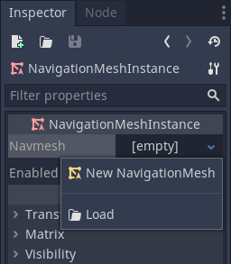

.. _doc_real_time_navigation_3d:

Real Time Navigation (3D)
=========================

Introduction
------------

Godot provides two nodes which can be used to achieve real time navigation
in a 3D environment, :ref:`Navigation <class_Navigation>` and :ref:`NavigationMeshInstance <class_NavigationMeshInstance>`.

A navigation mesh instance is used to hold a :ref:`NavigationMesh <class_NavigationMesh>`,
which defines what areas in a scene can be navigated to. The :ref:`Navigation <class_Navigation>`
node is then used for pathfinding with the navigation mesh.

Setting up navigation
---------------------

To add navigation to a scene you need to add a navigation node, then
a navigation mesh instance as a child of the navigation node. With the
navigation mesh instance selected you need to go to the inspector and
create a new navigation mesh.

Click on the navigation mesh and you can now alter the properties that
define how the navigation mesh is generated. You can find a full
description for each of the properties in the class reference here:
:ref:`NavigationMesh <class_NavigationMesh>`.

After making the changes you want the mesh can be generated by clicking
**Bake NavMesh** in the toolbar.

.. image:: img/bake_navmesh.png

Once the mesh has finished generating you should see the transparent
navigation mesh above the areas in your scene that can be navigated to.

.. image:: img/baked_navmesh.png

Keep in mind that the navmesh shows where the center of an entity can
go. For example, if you set the agent radius to 0.5 then your
navigation mesh will have a distance of 0.5 from any ledges or walls
to prevent clipping into the wall or hanging off of the edge.

Generating a path
-----------------

To get a path between two areas on a map you use the navigation node
method ``get_simple_path()``. The first argument is a Vector3 of the
starting location, the next is a Vector3 of the end location. And the
last argument is a boolean for whether or not agent properties of a
navmesh are considered when generating a path.

The method will return a :ref:`PoolVector3Array <class_PoolVector3Array>` consisting of
points that make a path. If there is no way to navigate to the end
location the method will return a blank :ref:`PoolVector3Array <class_PoolVector3Array>`.

Official example project
------------------------

There is an official example project on how to use 3D navigation.
You can find the repository `here <https://github.com/godotengine/godot-demo-projects/tree/master/3d/navmesh>`__.
It can also be found in the asset library.
