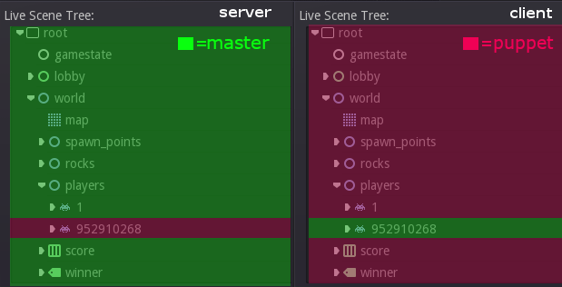

.. _doc_high_level_multiplayer:

High-level multiplayer
======================

High-level vs low-level API
---------------------------

The following explains the differences of high- and low-level networking in Godot as well as some fundamentals. If you want to jump in head-first and add networking to your first nodes, skip to `Initializing the network`_ below. But make sure to read the rest later on!

Godot always supported standard low-level networking via UDP, TCP and some higher level protocols such as SSL and HTTP.
These protocols are flexible and can be used for almost anything. However, using them to synchronize game state manually can be a large amount of work. Sometimes that work can't be avoided or is worth it, for example when working with a custom server implementation on the backend. But in most cases, it's worthwhile to consider Godot's high-level networking API, which sacrifices some of the fine-grained control of low-level networking for greater ease of use.

This is due to the inherent limitations of the low-level protocols:

- TCP ensures packets will always arrive reliably and in order, but latency is generally higher due to error correction.
  It's also quite a complex protocol because it understands what a "connection" is, and optimizes for goals that often don't suit applications like multiplayer games. Packets are buffered to be sent in larger batches, trading less per-packet overhead for higher latency. This can be useful for things like HTTP, but generally not for games. Some of this can be configured and disabled (e.g. by disabling "Nagle's algorithm" for the TCP connection).
- UDP is a simpler protocol, which only sends packets (and has no concept of a "connection"). No error correction
  makes it pretty quick (low latency), but packets may be lost along the way or received in the wrong order.
  Added to that, the MTU (maximum packet size) for UDP is generally low (only a few hundred bytes), so transmitting
  larger packets means splitting them, reorganizing them and retrying if a part fails.

In general, TCP can be thought of as reliable, ordered, and slow; UDP as unreliable, unordered and fast.
Because of the large difference in performance, it often makes sense to re-build the parts of TCP wanted for games (optional reliability and packet order), while avoiding the unwanted parts (congestion/traffic control features, Nagle's algorithm, etc). Due to this, most game engines come with such an implementation, and Godot is no exception.

In summary, you can use the low-level networking API for maximum control and implement everything on top of bare network protocols or use the high-level API based on :ref:`SceneTree <class_SceneTree>` that does most of the heavy lifting behind the scenes in a generally optimized way.

.. note:: Most of Godot's supported platforms offer all or most of the mentioned high- and low-level networking
          features. As networking is always largely hardware and operating system dependent, however,
          some features may change or not be available on some target platforms. Most notably,
          the HTML5 platform currently only offers WebSocket support and lacks some of the higher level features as
          well as raw access to low-level protocols like TCP and UDP.

.. note:: More about TCP/IP, UDP, and networking:
          https://gafferongames.com/post/udp_vs_tcp/

          Gaffer On Games has a lot of useful articles about networking in Games
          (`here <https://gafferongames.com/categories/game-networking/>`__), including the comprehensive
          `introduction to networking models in games <https://gafferongames.com/post/what_every_programmer_needs_to_know_about_game_networking/>`__.

          If you want to use your low-level networking library of choice instead of Godot's built-in networking,
          see here for an example:
          https://github.com/PerduGames/gdnet3

.. warning:: Adding networking to your game comes with some responsibility.
             It can make your application vulnerable if done wrong and may lead to cheats or exploits.
             It may even allow an attacker to compromise the machines your application runs on
             and use your servers to send spam, attack others or steal your users data if they play your game.

             This is always the case when networking is involved and has nothing to do with Godot.
             You can of course experiment, but when you release a networked application,
             always take care of any possible security concerns.

Mid level abstraction
---------------------

Before going into how we would like to synchronize a game across the network, it can be helpful to understand how the base network API for synchronization works.

Godot uses a mid-level object :ref:`NetworkedMultiplayerPeer <class_NetworkedMultiplayerPeer>`.
This object is not meant to be created directly, but is designed so that several C++ implementations can provide it.

This object extends from :ref:`PacketPeer <class_PacketPeer>`, so it inherits all the useful methods for serializing, sending and receiving data. On top of that, it adds methods to set a peer, transfer mode, etc. It also includes signals that will let you know when peers connect or disconnect.

This class interface can abstract most types of network layers, topologies and libraries. By default, Godot
provides an implementation based on ENet (:ref:`NetworkedMultiplayerEnet <class_NetworkedMultiplayerENet>`),
one based on WebRTC (:ref:`WebRTCMultiplayer <class_WebRTCMultiplayer>`), and one based on WebSocket
(:ref:`WebSocketMultiplayerPeer <class_WebSocketMultiplayerPeer>`), but this could be used to implement
mobile APIs (for ad hoc WiFi, Bluetooth) or custom device/console-specific networking APIs.

For most common cases, using this object directly is discouraged, as Godot provides even higher level networking facilities.
Yet it is made available in case a game has specific needs for a lower level API.

Initializing the network
------------------------

The object that controls networking in Godot is the same one that controls everything tree-related: :ref:`SceneTree <class_SceneTree>`.

To initialize high-level networking, the SceneTree must be provided a NetworkedMultiplayerPeer object.

To create that object, it first has to be initialized as a server or client.

Initializing as a server, listening on the given port, with a given maximum number of peers:

::

    var peer = NetworkedMultiplayerENet.new()
    peer.create_server(SERVER_PORT, MAX_PLAYERS)
    get_tree().network_peer = peer

Initializing as a client, connecting to a given IP and port:

::

    var peer = NetworkedMultiplayerENet.new()
    peer.create_client(SERVER_IP, SERVER_PORT)
    get_tree().network_peer = peer

Get the previously set network peer:

::

    get_tree().get_network_peer()

Checking whether the tree is initialized as a server or client:

::

    get_tree().is_network_server()

Terminating the networking feature:

::

    get_tree().network_peer = null

(Although it may make sense to send a message first to let the other peers know you're going away instead of letting the connection close or timeout, depending on your game.)

Managing connections
--------------------

Some games accept connections at any time, others during the lobby phase. Godot can be requested to no longer accept
connections at any point (see ``set_refuse_new_network_connections(bool)`` and related methods on :ref:`SceneTree <class_SceneTree>`). To manage who connects, Godot provides the following signals in SceneTree:

Server and Clients:

- ``network_peer_connected(int id)``
- ``network_peer_disconnected(int id)``

The above signals are called on every peer connected to the server (including on the server) when a new peer connects or disconnects.
Clients will connect with a unique ID greater than 1, while network peer ID 1 is always the server.
Anything below 1 should be handled as invalid.
You can retrieve the ID for the local system via :ref:`SceneTree.get_network_unique_id() <class_SceneTree_method_get_network_unique_id>`.
These IDs will be useful mostly for lobby management and should generally be stored, as they identify connected peers and thus players. You can also use IDs to send messages only to certain peers.

Clients:

- ``connected_to_server``
- ``connection_failed``
- ``server_disconnected``

Again, all these functions are mainly useful for lobby management or for adding/removing players on the fly.
For these tasks, the server clearly has to work as a server and you have to perform tasks manually such as sending a newly connected
player information about other already connected players (e.g. their names, stats, etc).

Lobbies can be implemented any way you want, but the most common way is to use a node with the same name across scenes in all peers.
Generally, an autoloaded node/singleton is a great fit for this, to always have access to, e.g. "/root/lobby".

RPC
---

To communicate between peers, the easiest way is to use RPCs (remote procedure calls). This is implemented as a set of functions
in :ref:`Node <class_Node>`:

- ``rpc("function_name", <optional_args>)``
- ``rpc_id(<peer_id>,"function_name", <optional_args>)``
- ``rpc_unreliable("function_name", <optional_args>)``
- ``rpc_unreliable_id(<peer_id>, "function_name", <optional_args>)``

Synchronizing member variables is also possible:

- ``rset("variable", value)``
- ``rset_id(<peer_id>, "variable", value)``
- ``rset_unreliable("variable", value)``
- ``rset_unreliable_id(<peer_id>, "variable", value)``

Functions can be called in two fashions:

- Reliable: the function call will arrive no matter what, but may take longer because it will be re-transmitted in case of failure.
- Unreliable: if the function call does not arrive, it will not be re-transmitted; but if it arrives, it will do it quickly.

In most cases, reliable is desired. Unreliable is mostly useful when synchronizing object positions (sync must happen constantly,
and if a packet is lost, it's not that bad because a new one will eventually arrive and it would likely be outdated because the object moved further in the meantime, even if it was resent reliably).

There is also the ``get_rpc_sender_id`` function in ``SceneTree``, which can be used to check which peer (or peer ID) sent an RPC.

Back to lobby
-------------

Let's get back to the lobby. Imagine that each player that connects to the server will tell everyone about it.

::

    # Typical lobby implementation; imagine this being in /root/lobby.

    extends Node

    # Connect all functions

    func _ready():
        get_tree().connect("network_peer_connected", self, "_player_connected")
        get_tree().connect("network_peer_disconnected", self, "_player_disconnected")
        get_tree().connect("connected_to_server", self, "_connected_ok")
        get_tree().connect("connection_failed", self, "_connected_fail")
        get_tree().connect("server_disconnected", self, "_server_disconnected")

    # Player info, associate ID to data
    var player_info = {}
    # Info we send to other players
    var my_info = { name = "Johnson Magenta", favorite_color = Color8(255, 0, 255) }

    func _player_connected(id):
        # Called on both clients and server when a peer connects. Send my info to it.
        rpc_id(id, "register_player", my_info)

    func _player_disconnected(id):
        player_info.erase(id) # Erase player from info.

    func _connected_ok():
        pass # Only called on clients, not server. Will go unused; not useful here.

    func _server_disconnected():
        pass # Server kicked us; show error and abort.

    func _connected_fail():
        pass # Could not even connect to server; abort.

    remote func register_player(info):
        # Get the id of the RPC sender.
        var id = get_tree().get_rpc_sender_id()
        # Store the info
        player_info[id] = info

        # Call function to update lobby UI here

You might have already noticed something different, which is the usage of the ``remote`` keyword on the ``register_player`` function:

::

    remote func register_player(info):

This keyword has two main uses. The first is to let Godot know that this function can be called from RPC. If no keywords are added,
Godot will block any attempts to call functions for security. This makes security work a lot easier (so a client can't call a function
to delete a file on another client's system).

The second use is to specify how the function will be called via RPC. There are four different keywords:

- ``remote``
- ``remotesync``
- ``master``
- ``puppet``

The ``remote`` keyword means that the ``rpc()`` call will go via network and execute remotely.

The ``remotesync`` keyword means that the ``rpc()`` call will go via network and execute remotely, but will also execute locally (do a normal function call).

The others will be explained further down.
Note that you could also use the ``get_rpc_sender_id`` function on ``SceneTree`` to check which peer actually made the RPC call to ``register_player``.

With this, lobby management should be more or less explained. Once you have your game going, you will most likely want to add some
extra security to make sure clients don't do anything funny (just validate the info they send from time to time, or before
game start). For the sake of simplicity and because each game will share different information, this is not shown here.

Starting the game
-----------------

Once enough players have gathered in the lobby, the server should probably start the game. This is nothing
special in itself, but we'll explain a few nice tricks that can be done at this point to make your life much easier.

Player scenes
^^^^^^^^^^^^^

In most games, each player will likely have its own scene. Remember that this is a multiplayer game, so in every peer
you need to instance **one scene for each player connected to it**. For a 4 player game, each peer needs to instance 4 player nodes.

So, how to name such nodes? In Godot, nodes need to have a unique name. It must also be relatively easy for a player to tell which
node represents each player ID.

The solution is to simply name the *root nodes of the instanced player scenes as their network ID*. This way, they will be the same in
every peer and RPC will work great! Here is an example:

::

    remote func pre_configure_game():
        var selfPeerID = get_tree().get_network_unique_id()

        # Load world
        var world = load(which_level).instance()
        get_node("/root").add_child(world)

        # Load my player
        var my_player = preload("res://player.tscn").instance()
        my_player.set_name(str(selfPeerID))
        my_player.set_network_master(selfPeerID) # Will be explained later
        get_node("/root/world/players").add_child(my_player)

        # Load other players
        for p in player_info:
            var player = preload("res://player.tscn").instance()
            player.set_name(str(p))
            player.set_network_master(p) # Will be explained later
            get_node("/root/world/players").add_child(player)

        # Tell server (remember, server is always ID=1) that this peer is done pre-configuring.
        rpc_id(1, "done_preconfiguring", selfPeerID)

.. note:: Depending on when you execute pre_configure_game(), you may need to change any calls to ``add_child()``
          to be deferred via ``call_deferred()``, as the SceneTree is locked while the scene is being created (e.g. when ``_ready()`` is being called).

Synchronizing game start
^^^^^^^^^^^^^^^^^^^^^^^^

Setting up players might take different amounts of time for every peer due to lag, different hardware, or other reasons.
To make sure the game will actually start when everyone is ready, pausing the game until all players are ready can be useful:

::

    remote func pre_configure_game():
        get_tree().set_pause(true) # Pre-pause
        # The rest is the same as in the code in the previous section (look above)

When the server gets the OK from all the peers, it can tell them to start, as for example:

::

    var players_done = []
    remote func done_preconfiguring(who):
        # Here are some checks you can do, for example
        assert(get_tree().is_network_server())
        assert(who in player_info) # Exists
        assert(not who in players_done) # Was not added yet

        players_done.append(who)

        if players_done.size() == player_info.size():
            rpc("post_configure_game")

    remote func post_configure_game():
        get_tree().set_pause(false)
        # Game starts now!

Synchronizing the game
----------------------

In most games, the goal of multiplayer networking is that the game runs synchronized on all the peers playing it.
Besides supplying an RPC and remote member variable set implementation, Godot adds the concept of network masters.

Network master
^^^^^^^^^^^^^^

The network master of a node is the peer that has the ultimate authority over it.

When not explicitly set, the network master is inherited from the parent node, which if not changed, is always going to be the server (ID 1). Thus the server has authority over all nodes by default.

The network master can be set
with the function :ref:`Node.set_network_master(id, recursive) <class_Node_method_set_network_master>` (recursive is ``true`` by default and means the network master is recursively set on all child nodes of the node as well).

Checking that a specific node instance on a peer is the network master for this node for all connected peers is done by calling :ref:`Node.is_network_master() <class_Node_method_is_network_master>`. This will return ``true`` when executed on the server and ``false`` on all client peers.

If you have paid attention to the previous example, it's possible you noticed that each peer was set to have network master authority for their own player (Node) instead of the server:

::

        [...]
        # Load my player
        var my_player = preload("res://player.tscn").instance()
        my_player.set_name(str(selfPeerID))
        my_player.set_network_master(selfPeerID) # The player belongs to this peer; it has the authority.
        get_node("/root/world/players").add_child(my_player)

        # Load other players
        for p in player_info:
            var player = preload("res://player.tscn").instance()
            player.set_name(str(p))
            player.set_network_master(p) # Each other connected peer has authority over their own player.
            get_node("/root/world/players").add_child(player)
        [...]

Each time this piece of code is executed on each peer, the peer makes itself master on the node it controls, and all other nodes remain as puppets with the server being their network master.

To clarify, here is an example of how this looks in the
`bomber demo <https://github.com/godotengine/godot-demo-projects/tree/master/networking/multiplayer_bomber>`_:

Master and puppet keywords
^^^^^^^^^^^^^^^^^^^^^^^^^^

.. FIXME: Clarify the equivalents to the GDScript keywords in C# and Visual Script.

The real advantage of this model is when used with the ``master``/``puppet`` keywords in GDScript (or their equivalent in C# and Visual Script).
Similarly to the ``remote`` keyword, functions can also be tagged with them:

Example bomb code:

::

    for p in bodies_in_area:
        if p.has_method("exploded"):
            p.rpc("exploded", bomb_owner)

Example player code:

::

    puppet func stun():
        stunned = true

    master func exploded(by_who):
        if stunned:
            return # Already stunned

        rpc("stun")
        stun() # Stun myself, could have used remotesync keyword too.

In the above example, a bomb explodes somewhere (likely managed by whoever is master). The bomb knows the bodies in the area, so it checks them
and checks that they contain an ``exploded`` function.

If they do, the bomb calls ``exploded`` on it. However, the ``exploded`` method in the player has a ``master`` keyword. This means that only the player
who is master for that instance will actually get the function.

This instance, then, calls the ``stun`` method in the same instances of that same player (but in different peers), and only those which are set as puppet,
making the player look stunned in all the peers (as well as the current, master one).

Note that you could also send the ``stun()`` message only to a specific player by using ``rpc_id(<id>, "exploded", bomb_owner)``.
This may not make much sense for an area-of-effect case like the bomb, but in other cases, like single target damage.

::

    rpc_id(TARGET_PEER_ID, "stun") # Only stun the target peer

Exporting for dedicated servers
-------------------------------

Once you've made a multiplayer game, you may want to export it to run it on
a dedicated server with no GPU available. See
:ref:`doc_exporting_for_dedicated_servers` for more information.

.. note::

    The code samples on this page aren't designed to run on a dedicated
    server. You'll have to modify them so the server isn't considered to be a
    player. You'll also have to modify the game starting mechanism so that the
    first player who joins can start the game.
