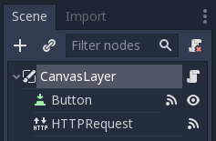

.. _doc_http_request_class:

Making HTTP requests
====================

The :ref:`HTTPRequest <class_HTTPRequest>` node is the easiest way to make HTTP requests in Godot.
It is backed by the more low-level :ref:`HTTPClient <class_HTTPClient>`, for which a tutorial is available :ref:`here <doc_http_client_class>`.

For the sake of this example, we will create a simple UI with a button, that when pressed will start the HTTP request to the specified URL.

Preparing scene
---------------

Create a new empty scene, add a CanvasLayer as the root node and add a script to it. Then add two child nodes to it: a Button and an HTTPRequest node. You will need to connect the following signals to the CanvasLayer script:

- Button.pressed: When the button is pressed, we will start the request.
- HTTPRequest.request_completed: When the request is completed, we will get the requested data as an argument.

Scripting
---------

Below is all the code we need to make it work. The URL points to an online API mocker; it returns a pre-defined JSON string, which we will then parse to get access to the data.

::

    extends CanvasLayer

    func _ready():
        $HTTPRequest.connect("request_completed", self, "_on_request_completed")

    func _on_Button_pressed():
        $HTTPRequest.request("http://www.mocky.io/v2/5185415ba171ea3a00704eed")

    func _on_request_completed(result, response_code, headers, body):
        var json = JSON.parse(body.get_string_from_utf8())
        print(json.result)

With this, you should see ``(hello:world)`` printed on the console; hello being a key, and world being a value, both of them strings.

For more information on parsing JSON, see the class references for :ref:`JSON <class_JSON>` and :ref:`JSONParseResult <class_JSONParseResult>`.

Note that you may want to check whether the ``result`` equals ``RESULT_SUCCESS`` and whether a JSON parsing error occurred, see the JSON class reference and :ref:`HTTPRequest <class_HTTPRequest>` for more.

Of course, you can also set custom HTTP headers. These are given as a string array, with each string containing a header in the format ``"header: value"``.
For example, to set a custom user agent (the HTTP ``user-agent`` header) you could use the following:

::

    $HTTPRequest.request("http://www.mocky.io/v2/5185415ba171ea3a00704eed", ["user-agent: YourCustomUserAgent"])

Please note that, for SSL/TLS encryption and thus HTTPS URLs to work, you may need to take some steps as described :ref:`here <doc_ssl_certificates>`.

Also, when calling APIs using authorization, be aware that someone might analyse and decompile your released application and thus may gain access to any embedded authorization information like tokens, usernames or passwords.
That means it is usually not a good idea to embed things such as database access credentials inside your game. Avoid providing information useful to an attacker whenever possible.

Sending data to server
----------------------

Until now, we have limited ourselves to requesting data from a server. But what if you need to send data to the server? Here is a common way of doing it:

::

    func _make_post_request(url, data_to_send, use_ssl):
        # Convert data to json string:
        var query = JSON.print(data_to_send)
        # Add 'Content-Type' header:
        var headers = ["Content-Type: application/json"]
        $HTTPRequest.request(url, headers, use_ssl, HTTPClient.METHOD_POST, query)

Keep in mind that you have to wait for a request to finish before sending another one. Making multiple request at once requires you to have one node per request.
A common strategy is to create and delete HTTPRequest nodes at runtime as necessary.
