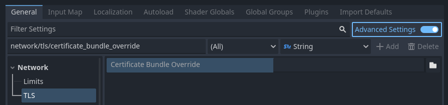

.. _doc_ssl_certificates:

TLS/SSL certificates
====================

Introduction
------------

It is often desired to use :abbr:`TLS (Transport Layer Security)` connections (also
known as :abbr:`SSL (Secure Sockets Layer)` connections) for communications
to avoid "man in the middle" attacks. Godot has a connection wrapper,
:ref:`StreamPeerTLS <class_StreamPeerTLS>`, which can take a regular connection
and add security around it. The :ref:`HTTPClient <class_HTTPClient>` and
:ref:`HTTPRequest <class_HTTPRequest>` classes also support HTTPS using
this same wrapper.

Godot will try to use the TLS certificate bundle provided by the operating system,
but also includes the
`TLS certificate bundle from Mozilla <https://github.com/godotengine/godot/blob/master/thirdparty/certs/ca-certificates.crt>`__
as a fallback.

You can alternatively force your own certificate bundle in the Project Settings:

   Setting the TLS certificate bundle override project setting

When set, this file *overrides* the operating system provided bundle by default.
This file should contain any number of public certificates in
`PEM format <https://en.wikipedia.org/wiki/Privacy-enhanced_Electronic_Mail>`__.

There are two ways to obtain certificates:

Obtain a certificate from a certificate authority
--------------------------------------------------

The main approach to getting a certificate is to use a certificate authority
(CA) such as `Let's Encrypt <https://letsencrypt.org/>`__. This is a more
cumbersome process than a self-signed certificate, but it's more "official" and
ensures your identity is clearly represented. The resulting certificate is also
trusted by applications such as web browsers, unlike a self-signed certificate
which requires additional configuration on the client side before it's
considered trusted.

These certificates do not require any configuration on the client to work, since
Godot already bundles the Mozilla certificate bundle in the editor and exported
projects.

Generate a self-signed certificate
----------------------------------

For most use cases, it's recommended to go through certificate authority as the
process is free with certificate authorities such as Let's Encrypt. However, if
using a certificate authority is not an option, then you can generate a
self-signed certificate and tell the client to consider your self-signed
certificate as trusted.

To create a self-signed certificate, generate a private and public key pair and
add the public key (in PEM format) to the CRT file specified in the Project
Settings.

.. warning::

    The private key should **only** go to your server. The client must not have
    access to it: otherwise, the security of the certificate will be
    compromised.

.. warning::

    When specifying a self-signed certificate as TLS bundle in the project
    settings, normal domain name validation is enforced via the certificate
    :abbr:`CN (common name)` and alternative names. See
    :ref:`TLSOptions <class_TLSOptions>` to customize domain name validation.

For development purposes Godot can generate self signed certificates via
:ref:`Crypto.generate_self_signed_certificate
<class_Crypto_method_generate_self_signed_certificate>`.

Alternatively, OpenSSL has some documentation about `generating keys
<https://raw.githubusercontent.com/openssl/openssl/master/doc/HOWTO/keys.txt>`__
and `certificates <https://raw.githubusercontent.com/openssl/openssl/master/doc/HOWTO/certificates.txt>`__.
