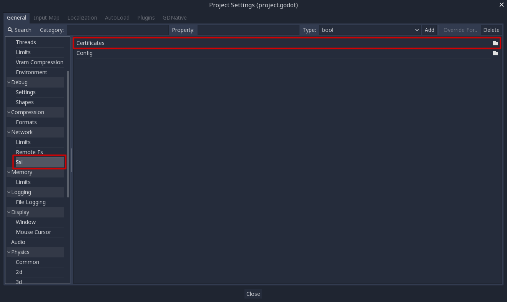
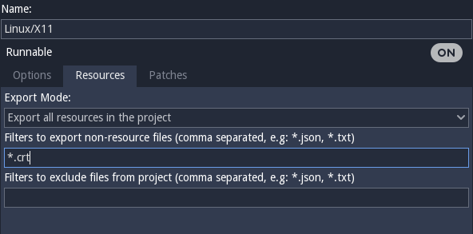

:article_outdated: True

.. _doc_ssl_certificates:

SSL certificates
================

Introduction
------------

It is often desired to use SSL connections for communications to avoid
"man in the middle" attacks. Godot has a connection wrapper,
:ref:`StreamPeerTLS <class_StreamPeerTLS>`,
which can take a regular connection and add security around it. The
:ref:`HTTPClient <class_HTTPClient>`
class also supports HTTPS by using this same wrapper.

Godot includes SSL certificates from Mozilla, but you can provide your own
with a .crt file in the project settings:

This file should contain any number of public certificates in
`PEM format <https://en.wikipedia.org/wiki/Privacy-enhanced_Electronic_Mail>`__.

Of course, remember to add .crt as filter so the exporter recognizes
this when exporting your project.

There are two ways to obtain certificates:

Approach 1: self signed cert
----------------------------

The first approach is the simplest: generate a private and public
key pair and add the public key (in PEM format) to the .crt file.
The private key should go to your server.

OpenSSL has `some
documentation <https://raw.githubusercontent.com/openssl/openssl/master/doc/HOWTO/keys.txt>`__ about
this. This approach also **does not require domain validation** nor
requires you to spend a considerable amount of money in purchasing
certificates from a CA.

Approach 2: CA cert
-------------------

The second approach consists of using a certificate authority (CA)
such as Verisign, Geotrust, etc. This is a more cumbersome process,
but it's more "official" and ensures your identity is clearly
represented.

Unless you are working with large companies or corporations, or need
to connect to someone else's servers (i.e., connecting to Google or some
other REST API provider via HTTPS), this method is not as useful.

Also, when using a CA issued cert, **you must enable domain
validation**, to ensure the domain you are connecting to is the one
intended, otherwise any website can issue any certificate in the same CA
and it will work.

If you are using Linux, you can use the supplied certs file, generally
located in:

.. code-block:: none

    /etc/ssl/certs/ca-certificates.crt

This file allows HTTPS connections to virtually any website (i.e.,
Google, Microsoft, etc.).

Or pick any of the more specific certificates there if you are
connecting to a specific one.
