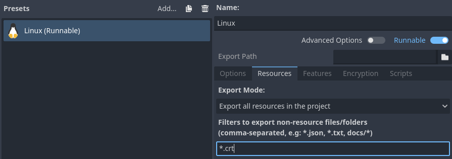

.. _doc_ssl_certificates:

SSL/TLS certificates
====================

Introduction
------------

It is often desired to use :abbr:`SSL (Secure Sockets Layer)` connections (also
known as :abbr:`TLS (Transport Layer Security)` connections) for communications
to avoid "man in the middle" attacks. Godot has a connection wrapper,
:ref:`StreamPeerTLS <class_StreamPeerTLS>`, which can take a regular connection
and add security around it. The :ref:`HTTPClient <class_HTTPClient>` and
:ref:`HTTPRequest <class_HTTPRequest>` classes also support HTTPS using
this same wrapper.

Godot includes the
`SSL certificate bundle from Mozilla <https://github.com/godotengine/godot/blob/master/thirdparty/certs/ca-certificates.crt>`__,
but you can provide your own with a CRT file in the Project Settings:

.. figure:: img/tls_certificates_project_setting.webp
   :align: center
   :alt: Setting the TLS certificate bundle override project setting

   Setting the TLS certificate bundle override project setting

When set, this file *overrides* the Mozilla certificate bundle Godot uses
by default. This file should contain any number of public certificates in
`PEM format <https://en.wikipedia.org/wiki/Privacy-enhanced_Electronic_Mail>`__.

Remember to add ``*.crt`` as the non-resource export filter to your export
preset, so that the exporter recognizes this when exporting your project:

   Adding ``*.crt`` to non-resource export filter in the export preset

There are two ways to obtain certificates:

Acquire a certificate from a certificate authority
--------------------------------------------------

The main approach to getting a certificate is to use a certificate authority
(CA) such as `Let's Encrypt <https://letsencrypt.org/>`__. This is a more
cumbersome process than a self-signed certificate, but it's more "official" and
ensures your identity is clearly represented. The resulting certificate is also
trusted by applications such as web browsers, unlike a self-signed certificate
which requires additional configuration on the client side before it's
considered trusted.

These certificates do not require any configuration on the client to work, since
Godot already bundles the Mozilla certificate bundle in the editor and exported
projects.

Generate a self-signed certificate
----------------------------------

For most use cases, it's recommended to go through certificate authority as the
process is free with certificate authorities such as Let's Encrypt. However, if
using a certificate authority is not an option, then you can generate a
self-signed certificate and tell the client to consider your self-signed
certificate as trusted.

To create a self-signed certificate, generate a private and public key pair and
add the public key (in PEM format) to the CRT file specified in the Project
Settings.

.. warning::

    The private key should **only** go to your server. The client must not have
    access to it: otherwise, the security of the certificate will be
    compromised.

OpenSSL has `some documentation
<https://raw.githubusercontent.com/openssl/openssl/master/doc/HOWTO/keys.txt>`__
about this. For local development purposes **only**, `mkcert
<https://github.com/FiloSottile/mkcert>`__ can be used as an alternative.
