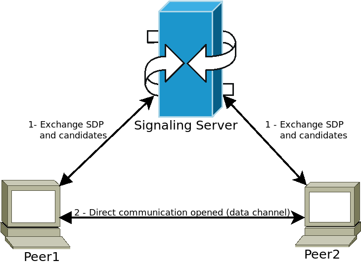

:article_outdated: True

.. _doc_webrtc:

WebRTC
======

HTML5, WebSocket, WebRTC
------------------------

One of Godot's great features is its ability to export to the HTML5/WebAssembly platform, allowing your game to run directly in the browser when a user visit your webpage.

This is a great opportunity for both demos and full games, but used to come with some limitations. In the area of networking, browsers used to support only HTTPRequests until recently, when first WebSocket and then WebRTC were proposed as standards.

WebSocket
^^^^^^^^^

When the WebSocket protocol was standardized in December 2011, it allowed browsers to create stable and bidirectional connections to a WebSocket server. The protocol is a very powerful tool to send push notifications to browsers, and has been used to implement chats, turn-based games, etc.

WebSockets, though, still use a TCP connection, which is good for reliability but not for latency, so not good for real-time applications like VoIP and fast-paced games.

WebRTC
^^^^^^

For this reason, since 2010, Google started working on a new technology called WebRTC, which later on, in 2017, became a W3C candidate recommendation. WebRTC is a much more complex set of specifications, and relies on many other technologies behind the scenes (ICE, DTLS, SDP) to provide fast, real-time, and secure communication between two peers.

The idea is to find the fastest route between the two peers and establish whenever possible a direct communication (i.e. try to avoid a relaying server).

However, this comes at a price, which is that some media information must be exchanged between the two peers before the communication can start (in the form of Session Description Protocol - SDP strings). This usually takes the form of a so-called WebRTC Signaling Server.

Peers connect to a signaling server (for example a WebSocket server) and send their media information. The server then relays this information to other peers, allowing them to establish the desired direct communication. Once this step is done, peers can disconnect from the signaling server and keep the direct Peer-to-Peer (P2P) connection open.

Using WebRTC in Godot
---------------------

WebRTC is implemented in Godot via two main classes :ref:`WebRTCPeerConnection <class_WebRTCPeerConnection>` and :ref:`WebRTCDataChannel <class_WebRTCDataChannel>`, plus the multiplayer API implementation :ref:`WebRTCMultiplayerPeer <class_WebRTCMultiplayerPeer>`. See section on :ref:`high-level multiplayer <doc_high_level_multiplayer>` for more details.

.. note:: These classes are available automatically in HTML5, but **require an external GDExtension plugin on native (non-HTML5) platforms**. Check out the `webrtc-native plugin repository <https://github.com/godotengine/webrtc-native>`__ for instructions and to get the latest `release <https://github.com/godotengine/webrtc-native/releases>`__.

.. warning::

    When exporting to Android, make sure to enable the ``INTERNET``
    permission in the Android export preset before exporting the project or
    using one-click deploy. Otherwise, network communication of any kind will be
    blocked by Android.

Minimal connection example
^^^^^^^^^^^^^^^^^^^^^^^^^^

This example will show you how to create a WebRTC connection between two peers in the same application.
This is not very useful in real life, but will give you a good overview of how a WebRTC connection is set up.

::

    extends Node

    # Create the two peers
    var p1 = WebRTCPeerConnection.new()
    var p2 = WebRTCPeerConnection.new()
    # And a negotiated channel for each each peer
    var ch1 = p1.create_data_channel("chat", {"id": 1, "negotiated": true})
    var ch2 = p2.create_data_channel("chat", {"id": 1, "negotiated": true})

    func _ready():
        # Connect P1 session created to itself to set local description.
        p1.session_description_created.connect(p1.set_local_description)
        # Connect P1 session and ICE created to p2 set remote description and candidates.
        p1.session_description_created.connect(p2.set_remote_description)
        p1.ice_candidate_created.connect(p2.add_ice_candidate)

        # Same for P2
        p2.session_description_created.connect(p2.set_local_description)
        p2.session_description_created.connect(p1.set_remote_description)
        p2.ice_candidate_created.connect(p1.add_ice_candidate)

        # Let P1 create the offer
        p1.create_offer()

        # Wait a second and send message from P1.
        await get_tree().create_timer(1).timeout
        ch1.put_packet("Hi from P1".to_utf8_buffer())

        # Wait a second and send message from P2.
        await get_tree().create_timer(1).timeout
        ch2.put_packet("Hi from P2".to_utf8_buffer())

    func _process(_delta):
        # Poll connections
        p1.poll()
        p2.poll()

        # Check for messages
        if ch1.get_ready_state() == ch1.STATE_OPEN and ch1.get_available_packet_count() > 0:
            print("P1 received: ", ch1.get_packet().get_string_from_utf8())
        if ch2.get_ready_state() == ch2.STATE_OPEN and ch2.get_available_packet_count() > 0:
            print("P2 received: ", ch2.get_packet().get_string_from_utf8())

This will print:

::

    P1 received: Hi from P1
    P2 received: Hi from P2

Local signaling example
^^^^^^^^^^^^^^^^^^^^^^^

This example expands on the previous one, separating the peers in two different scenes, and using a :ref:`singleton <doc_singletons_autoload>` as a signaling server.

::

    extends Node
    # An example p2p chat client.

    var peer = WebRTCPeerConnection.new()

    # Create negotiated data channel.
    var channel = peer.create_data_channel("chat", {"negotiated": true, "id": 1})

    func _ready():
        # Connect all functions.
        peer.ice_candidate_created.connect(self._on_ice_candidate)
        peer.session_description_created.connect(self._on_session)

        # Register to the local signaling server (see below for the implementation).
        Signaling.register(String(get_path()))

    func _on_ice_candidate(mid, index, sdp):
        # Send the ICE candidate to the other peer via signaling server.
        Signaling.send_candidate(String(get_path()), mid, index, sdp)

    func _on_session(type, sdp):
        # Send the session to other peer via signaling server.
        Signaling.send_session(String(get_path()), type, sdp)
        # Set generated description as local.
        peer.set_local_description(type, sdp)

    func _process(delta):
        # Always poll the connection frequently.
        peer.poll()
        if channel.get_ready_state() == WebRTCDataChannel.STATE_OPEN:
            while channel.get_available_packet_count() > 0:
                print(String(get_path()), " received: ", channel.get_packet().get_string_from_utf8())

    func send_message(message):
        channel.put_packet(message.to_utf8_buffer())

And now for the local signaling server:

.. note:: This local signaling server is supposed to be used as a :ref:`singleton <doc_singletons_autoload>` to connect two peers in the same scene.

::

    # A local signaling server. Add this to autoloads with name "Signaling" (/root/Signaling)
    extends Node

    # We will store the two peers here
    var peers = []

    func register(path):
        assert(peers.size() < 2)
        peers.append(path)
        if peers.size() == 2:
            get_node(peers[0]).peer.create_offer()

    func _find_other(path):
        # Find the other registered peer.
        for p in peers:
            if p != path:
                return p
        return ""

    func send_session(path, type, sdp):
        var other = _find_other(path)
        assert(other != "")
        get_node(other).peer.set_remote_description(type, sdp)

    func send_candidate(path, mid, index, sdp):
        var other = _find_other(path)
        assert(other != "")
        get_node(other).peer.add_ice_candidate(mid, index, sdp)

Then you can use it like this:

::

    # Main scene (main.gd)
    extends Node

    const Chat = preload("res://chat.gd")

    func _ready():
        var p1 = Chat.new()
        var p2 = Chat.new()
        add_child(p1)
        add_child(p2)

        # Wait a second and send message from P1
        await get_tree().create_timer(1).timeout
        p1.send_message("Hi from %s" % String(p1.get_path()))

        # Wait a second and send message from P2
        await get_tree().create_timer(1).timeout
        p2.send_message("Hi from %s" % String(p2.get_path()))

This will print something similar to this:

::

    /root/main/@@3 received: Hi from /root/main/@@2
    /root/main/@@2 received: Hi from /root/main/@@3

Remote signaling with WebSocket
^^^^^^^^^^^^^^^^^^^^^^^^^^^^^^^

A more advanced demo using WebSocket for signaling peers and :ref:`WebRTCMultiplayerPeer <class_WebRTCMultiplayerPeer>` is available in the `godot demo projects <https://github.com/godotengine/godot-demo-projects>`_ under `networking/webrtc_signaling`.
