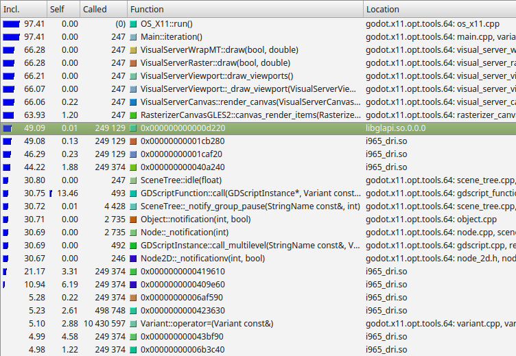

.. _doc_cpu_optimization:

CPU optimization
================

Measuring performance
---------------------

We have to know where the "bottlenecks" are to know how to speed up our program.
Bottlenecks are the slowest parts of the program that limit the rate that
everything can progress. Focusing on bottlenecks allows us to concentrate our
efforts on optimizing the areas which will give us the greatest speed
improvement, instead of spending a lot of time optimizing functions that will
lead to small performance improvements.

For the CPU, the easiest way to identify bottlenecks is to use a profiler.

CPU profilers
-------------

Profilers run alongside your program and take timing measurements to work out
what proportion of time is spent in each function.

The Godot IDE conveniently has a built-in profiler. It does not run every time
you start your project: it must be manually started and stopped. This is
because, like most profilers, recording these timing measurements can
slow down your project significantly.

After profiling, you can look back at the results for a frame.

.. figure:: img/godot_profiler.png
   :align: center
   :alt: Screenshot of the Godot profiler

   Results of a profile of one of the demo projects.

.. note:: We can see the cost of built-in processes such as physics and audio,
          as well as seeing the cost of our own scripting functions at the
          bottom.

          Time spent waiting for various built-in servers may not be counted in
          the profilers. This is a known bug.

When a project is running slowly, you will often see an obvious function or
process taking a lot more time than others. This is your primary bottleneck, and
you can usually increase speed by optimizing this area.

For more info about using Godot's built-in profiler, see
:ref:`doc_debugger_panel`.

External profilers
------------------

Although the Godot IDE profiler is very convenient and useful, sometimes you
need more power, and the ability to profile the Godot engine source code itself.

You can :ref:`use a number of third-party C++ profilers <doc_using_cpp_profilers>`
to do this.

   Example results from Callgrind, which is part of Valgrind.

From the left, Callgrind is listing the percentage of time within a function and
its children (Inclusive), the percentage of time spent within the function
itself, excluding child functions (Self), the number of times the function is
called, the function name, and the file or module.

In this example, we can see nearly all time is spent under the
``Main::iteration()`` function. This is the master function in the Godot source
code that is called repeatedly. It causes frames to be drawn, physics ticks to
be simulated, and nodes and scripts to be updated. A large proportion of the
time is spent in the functions to render a canvas (66%), because this example
uses a 2D benchmark. Below this, we see that almost 50% of the time is spent
outside Godot code in ``libglapi`` and ``i965_dri`` (the graphics driver).
This tells us the a large proportion of CPU time is being spent in the
graphics driver.

This is actually an excellent example because, in an ideal world, only a very
small proportion of time would be spent in the graphics driver. This is an
indication that there is a problem with too much communication and work being
done in the graphics API. This specific profiling led to the development of 2D
batching, which greatly speeds up 2D rendering by reducing bottlenecks in this
area.

Manually timing functions
-------------------------

Another handy technique, especially once you have identified the bottleneck
using a profiler, is to manually time the function or area under test.
The specifics vary depending on the language, but in GDScript, you would do
the following:

::

    var time_start = Time.get_ticks_usec()

    # Your function you want to time
    update_enemies()

    var time_end = Time.get_ticks_usec()
    print("update_enemies() took %d microseconds" % time_end - time_start)

When manually timing functions, it is usually a good idea to run the function
many times (1,000 or more times), instead of just once (unless it is a very slow
function). The reason for doing this is that timers often have limited accuracy.
Moreover, CPUs will schedule processes in a haphazard manner. Therefore, an
average over a series of runs is more accurate than a single measurement.

As you attempt to optimize functions, be sure to either repeatedly profile or
time them as you go. This will give you crucial feedback as to whether the
optimization is working (or not).

Caches
------

CPU caches are something else to be particularly aware of, especially when
comparing timing results of two different versions of a function. The results
can be highly dependent on whether the data is in the CPU cache or not. CPUs
don't load data directly from the system RAM, even though it's huge in
comparison to the CPU cache (several gigabytes instead of a few megabytes). This
is because system RAM is very slow to access. Instead, CPUs load data from a
smaller, faster bank of memory called cache. Loading data from cache is very
fast, but every time you try and load a memory address that is not stored in
cache, the cache must make a trip to main memory and slowly load in some data.
This delay can result in the CPU sitting around idle for a long time, and is
referred to as a "cache miss".

This means that the first time you run a function, it may run slowly because the
data is not in the CPU cache. The second and later times, it may run much faster
because the data is in the cache. Due to this, always use averages when timing,
and be aware of the effects of cache.

Understanding caching is also crucial to CPU optimization. If you have an
algorithm (routine) that loads small bits of data from randomly spread out areas
of main memory, this can result in a lot of cache misses, a lot of the time, the
CPU will be waiting around for data instead of doing any work. Instead, if you
can make your data accesses localised, or even better, access memory in a linear
fashion (like a continuous list), then the cache will work optimally and the CPU
will be able to work as fast as possible.

Godot usually takes care of such low-level details for you. For example, the
Server APIs make sure data is optimized for caching already for things like
rendering and physics. Still, you should be especially aware of caching when
writing GDExtensions.

Languages
---------

Godot supports a number of different languages, and it is worth bearing in mind
that there are trade-offs involved. Some languages are designed for ease of use
at the cost of speed, and others are faster but more difficult to work with.

Built-in engine functions run at the same speed regardless of the scripting
language you choose. If your project is making a lot of calculations in its own
code, consider moving those calculations to a faster language.

GDScript
^^^^^^^^

:ref:`GDScript <toc-learn-scripting-gdscript>` is designed to be easy to use and iterate,
and is ideal for making many types of games. However, in this language, ease of
use is considered more important than performance. If you need to make heavy
calculations, consider moving some of your project to one of the other
languages.

C#
^^

:ref:`C# <toc-learn-scripting-C#>` is popular and has first-class support in Godot. It
offers a good compromise between speed and ease of use. Beware of possible
garbage collection pauses and leaks that can occur during gameplay, though. A
common approach to workaround issues with garbage collection is to use *object
pooling*, which is outside the scope of this guide.

Other languages
^^^^^^^^^^^^^^^

Third parties provide support for several other languages, including `Rust
<https://github.com/godot-rust/gdext>`_.

C++
^^^

Godot is written in C++. Using C++ will usually result in the fastest code.
However, on a practical level, it is the most difficult to deploy to end users'
machines on different platforms. Options for using C++ include
GDExtensions and
:ref:`custom modules <doc_custom_modules_in_cpp>`.

Threads
-------

Consider using threads when making a lot of calculations that can run in
parallel to each other. Modern CPUs have multiple cores, each one capable of
doing a limited amount of work. By spreading work over multiple threads, you can
move further towards peak CPU efficiency.

The disadvantage of threads is that you have to be incredibly careful. As each
CPU core operates independently, they can end up trying to access the same
memory at the same time. One thread can be reading to a variable while another
is writing: this is called a *race condition*. Before you use threads, make sure
you understand the dangers and how to try and prevent these race conditions.
Threads can make debugging considerably more difficult.

For more information on threads, see :ref:`doc_using_multiple_threads`.

SceneTree
---------

Although Nodes are an incredibly powerful and versatile concept, be aware that
every node has a cost. Built-in functions such as ``_process()`` and
``_physics_process()`` propagate through the tree. This housekeeping can reduce
performance when you have a very large numbers of nodes (how many exactly
depends on the target platform and can range from thousands to tens of
thousands so ensure that you profile performance on all target platforms
during development).

Each node is handled individually in the Godot renderer. Therefore, a smaller
number of nodes with more in each can lead to better performance.

One quirk of the :ref:`SceneTree <class_SceneTree>` is that you can sometimes
get much better performance by removing nodes from the SceneTree, rather than by
pausing or hiding them. You don't have to delete a detached node. You can for
example, keep a reference to a node, detach it from the scene tree using
:ref:`Node.remove_child(node) <class_Node_method_remove_child>`, then reattach
it later using :ref:`Node.add_child(node) <class_Node_method_add_child>`.
This can be very useful for adding and removing areas from a game, for example.

You can avoid the SceneTree altogether by using Server APIs. For more
information, see :ref:`doc_using_servers`.

Physics
-------

In some situations, physics can end up becoming a bottleneck. This is
particularly the case with complex worlds and large numbers of physics objects.

Here are some techniques to speed up physics:

- Try using simplified versions of your rendered geometry for collision shapes.
  Often, this won't be noticeable for end users, but can greatly increase
  performance.
- Try removing objects from physics when they are out of view / outside the
  current area, or reusing physics objects (maybe you allow 8 monsters per area,
  for example, and reuse these).

Another crucial aspect to physics is the physics tick rate. In some games, you
can greatly reduce the tick rate, and instead of for example, updating physics
60 times per second, you may update them only 30 or even 20 times per second.
This can greatly reduce the CPU load.

The downside of changing physics tick rate is you can get jerky movement or
jitter when the physics update rate does not match the frames per second
rendered. Also, decreasing the physics tick rate will increase input lag.
It's recommended to stick to the default physics tick rate (60 Hz) in most games
that feature real-time player movement.

The solution to jitter is to use *fixed timestep interpolation*, which involves
smoothing the rendered positions and rotations over multiple frames to match the
physics. You can either implement this yourself or use a
`third-party addon <https://github.com/lawnjelly/smoothing-addon>`__.
Performance-wise, interpolation is a very cheap operation compared to running a
physics tick. It's orders of magnitude faster, so this can be a significant
performance win while also reducing jitter.
