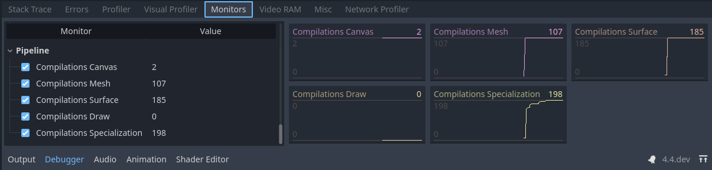

.. _doc_pipeline_compilations:

Reducing Stutter from Shader (Pipeline) Compilations
====================================================

Pipeline compilation, also commonly known as shader compilation, is an expensive operation required by the engine to be able to draw any kind of content with the GPU. 

In more precise terms, *Shader Compilation* involves the translation of the GLSL code that Godot generates into an intermediate format that can be shared across systems (such as SPIR-V when using Vulkan). However, this format can't be used by the GPU directly. *Pipeline Compilation* is the step the GPU driver performs where it'll convert the intermediate shader format (the result from shader compilation) to something the GPU can actually use for rendering. Drivers usually keep a cache of pipelines stored somewhere in the system to avoid repeating the process every time a game is run. This cache is usually deleted when the driver is updated.

Pipelines contain more information than just the shader code, which means that for each shader, there can be dozens of pipelines or more! This makes it difficult for an engine to compile them ahead of time, both because it would be very slow, and because it would take up a lot of memory. On top of that, this step can only be performed on the user's system and it is very tough to share the result between users unless they have the exact same hardware and driver version.

Before **Godot 4.4**, there was no solution to pipeline compilation other than generating them when an object shows up inside the camera's view, leading to the infamous *shader stutter* or hitches that only occur during the first playthrough. With **Godot 4.4**, new mechanisms have been introduced to mitigate stutters from pipeline compilation.

- **Ubershaders**: Godot makes use of specialization constants, a feature that allows the driver to optimize a pipeline's code around a set of parameters such as lighting, shadow quality, etc. Specialization constants are used to optimize a shader by limiting unnecessary features. Changing a specialization constant requires recompiling the pipeline. Ubershaders are a special version of the shader that are able to change these constants while rendering, which means Godot can pre-compile just one pipeline ahead of time and compile the more optimized versions on the background during gameplay. This reduces the amount of pipelines that need to be created significantly.
- **Pipeline Pre-Compilation**: By using ubershaders, the engine can pre-compile pipelines ahead of time in multiple places such as when meshes are loaded or when nodes are added to the scene. By being part of the resource loading process, pipelines can even be pre-compiled in multiple background threads if possible during loading screens or even gameplay.

Starting in Godot 4.4, Godot will detect which pipelines are needed and pre-compile them at load time. This detection system is mostly automatic, but it relies on the RenderingServer seeing evidence of all shaders, meshes, or rendering features at load time. For example, if you load a mesh and shader while the game is running, the pipeline for that mesh/shader combination won't be compiled until the mesh/shader is loaded. Similarly, things like enabling MSAA, or instancing a VoxelGI node while the game is running will trigger pipeline recompilations. Read on for more details.

Pipeline Pre-Compilation Monitors
---------------------------------

Compiling pipelines ahead of time is the main mechanism Godot uses to mitigate shader stutters, but it's not a perfect solution. Being aware of the situations that can lead to pipeline stutters can be very helpful, and the workarounds are pretty straightforward compared to previous versions. These workarounds may be less necessary over time with future versions of Godot as more detection techniques are implemented.

The Godot debugger offers monitors for tracking the amount of pipelines created by the game and the step that triggered their compilation. You can keep an eye on these monitors as the game runs to identify potential sources of shader stutters without having to wipe your driver cache every time you wish to test. Sudden increases of these values outside of loading screens can show up as hitches during gameplay the first time someone plays the game on their system. **It is recommended you take a look at these monitors to identify possible sources of stutter for your players**, as you might be unable to experience them yourself without deleting your driver cache or testing on a weaker system.

   Pipeline compilations of one of the demo projects.

.. note:: We can see the pipelines compiled during gameplay and
          verify which steps could possibly cause stuttters. Note
          that these values will only increase and never go down,
          as deleted pipelines are not tracked by these monitors
          and pipelines may be erased and recreated during gameplay.

- **Canvas**: Compiled when drawing a 2D node. The engine does not currently feature pre-compilation for 2D elements and the stutters will show up when the node is drawn for the first time.
- **Mesh**: Compiled as part of loading a 3D mesh and identifying what pipelines can be pre-compiled from its properties. These can lead to stutters if a mesh is loaded during gameplay, but they can be mitigated if the mesh is loaded by using a background thread. **Modifiers that are part of nodes such as material overrides can't be compiled on this step**. 
- **Surface**: Compiled when a frame is about to be drawn and 3D objects were instanced on the scene tree for the first time. This can also include compilation for nodes that aren't even visible on the scene tree. The stutter will occur only on the first frame the node is added to the scene, which won't result in an obvious stutter if it happens right after a loading screen.
- **Draw**: Compiled on demand when a 3D object needs to be drawn and an ubershader was not pre-compiled ahead of time. The engine is unable to pre-compile this pipeline due to triggering a case that hasn't been covered yet or a modification that was done to the engine's code. Leads to stutters during gameplay. This is identical to Godot versions before **4.4**. If you see compilations here, please let the devs know as this should never happen with the Ubershader system.
- **Specialization**: Compiled in the background during gameplay to optimize the framerate. Unable to cause stutters, but may result in reduced framerates if there are many happening per frame.

Pipeline Pre-Compilation Features
---------------------------------

Godot offers a lot of rendering features that are not necessarily used by every game. Unfortunately, pipeline pre-compilation can't know ahead of time if a particular feature is used by a project. Some of these features can only be detected when a user adds a node to the scene or toggles a particular setting in the project or the environment. The pipeline pre-compilation system will keep track of these features as they're encountered for the first time and enable pre-compilation of them for any meshes or surfaces that are created afterwards. 

If your game makes use of these features, **make sure to have an scene that uses them as early as possible** before loading the majority of the assets. This scene can be very simple and will do the job as long as it uses the features the game plans to use. It can even be rendered off-screen for at least one frame if necessary. You should also keep in mind that changing any of these features during gameplay will result in immediate stutters. Make sure to only change these features from configuration screens if necessary and insert loading screens and messages when the changes are applied.

- **MSAA Level**: Enabled when the level of 3D MSAA is changed on the project settings. Unfortunately, different MSAA levels being used on different viewports will lead to stutters as the engine only keeps track of one level at a time to perform pre-compilation.
- **Reflection Probes**: Enabled when a ReflectionProbe node is placed on the scene.
- **Separate Specular**: Enabled when using effects like sub-surface scattering or a compositor effect that relies on sampling the specularity directly off the screen.
- **Motion Vectors**: Enabled when using effects such as TAA, FSR2 or a compositor effect that requires motion vectors (such as motion blur).
- **Normal and Roughness**: Enabled when using SDFGI, VoxelGI, Screen Space Reflections, SSAO, SSIL, or using the normal_roughness_buffer in a custom shader or CompositorEffect. 
- **Lightmaps**: Enabled when a LightmapGI node is placed on the scene and a node uses a baked lightmap.
- **VoxelGI**: Enabled when a VoxelGI node is placed on the scene.
- **SDFGI**: Enabled when the WorldEnvironment enables SDFGI.
- **Multiview**: Enabled for XR projects.
- **16/32-bit Shadows**: Enabled when the configuration of the depth precision of shadowmaps is changed on the project settings.
- **Omni Shadow Dual Paraboloid**: Enabled when an omni light casts shadows and uses the dual paraboloid mode.
- **Omni Shadow Cubemap**: Enabled when an omni light casts shadows and uses the cubemap mode.

If you witness stutters during gameplay and the monitors report a sudden increase in compilations during the **Surface** step, it is very likely a feature was not enabled ahead of time. Ensuring that this effect is enabled while loading your game will likely mitigate the issue.

Pipeline Pre-Compilation Instancing
-----------------------------------

One common source of stutters in games is the fact that some effects are only instanced on the scene because of interactions that only happen during gameplay. For example, if you have a particle effect that is only added to the scene through a script when a player does an action. Even if the scene is preloaded, the engine might be unable to pre-compile the pipelines until the effect is added to the scene at least once. Luckily, it's possible for **Godot 4.4** to pre-compile these pipelines as long as the scene is instantiated at least once on the scene, even if it's completely invisible or outside of the camera's view.

   Hidden bullet node attached to the player in one of the demo
   projects.

.. note:: An example of a hidden node attached to the player to
   help the engine pre-compile the effect's pipelines ahead of time.

If you're aware of any effects that are added to the scene dynamically during gameplay and are seeing sudden increases on the compilations monitor when these effects show up, a very easy workaround is to attach a hidden version of the effect somewhere that is guaranteed to show up. For example, if the player character is able to cause some sort of explosion, you can attach the effect as a child of the player as an invisible node. Make sure to disable the script attached to the hidden node or to hide any other nodes that could cause issues, which can be easily done by enabling 'Editable Children' on the node.
