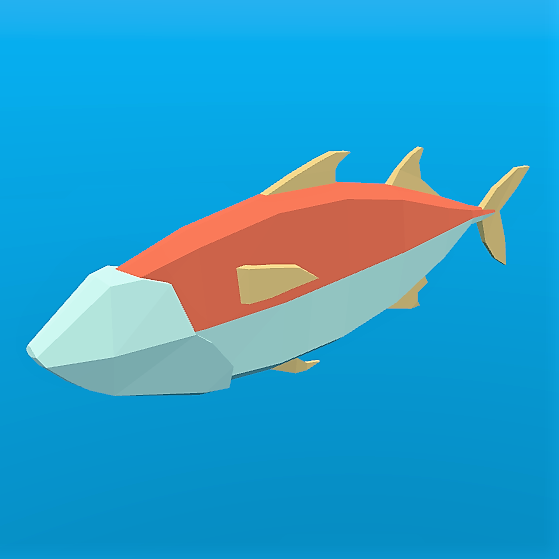
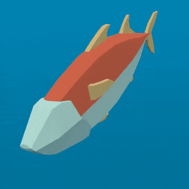
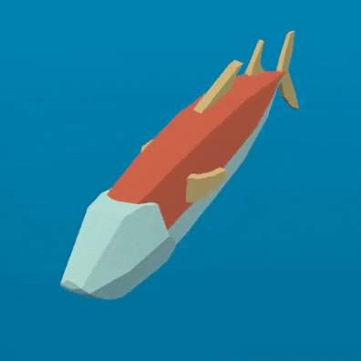
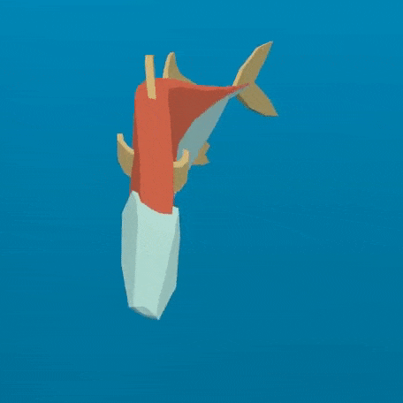
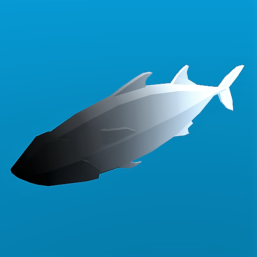

:article_outdated: True

.. _doc_animating_thousands_of_fish:

Animating thousands of fish with MultiMeshInstance3D
====================================================

This tutorial explores a technique used in the game `ABZU <https://www.gdcvault.com/play/1024409/Creating-the-Art-of-ABZ>`_
for rendering and animating thousands of fish using vertex animation and
static mesh instancing.

In Godot, this can be accomplished with a custom :ref:`Shader <class_Shader>` and
a :ref:`MultiMeshInstance3D <class_MultiMeshInstance3D>`. Using the following technique you
can render thousands of animated objects, even on low end hardware.

We will start by animating one fish. Then, we will see how to extend that animation to
thousands of fish.

Animating one Fish
------------------

We will start with a single fish. Load your fish model into a :ref:`MeshInstance3D <class_MeshInstance3D>`
and add a new :ref:`ShaderMaterial <class_ShaderMaterial>`.

Here is the fish we will be using for the example images, you can use any fish model you like.

.. note:: The fish model in this tutorial is made by `QuaterniusDev <https://quaternius.com>`_ and is
          shared with a creative commons license. CC0 1.0 Universal (CC0 1.0) Public Domain
          Dedication https://creativecommons.org/publicdomain/zero/1.0/

Typically, you would use bones and a :ref:`Skeleton3D <class_Skeleton3D>` to animate objects. However,
bones are animated on the CPU and so you end having to calculate thousands of operations every
frame and it becomes impossible to have thousands of objects. Using vertex animation in a vertex
shader, you avoid using bones and can instead calculate the full animation in a few lines of code
and completely on the GPU.

The animation will be made of four key motions:

  1. A side to side motion
  2. A pivot motion around the center of the fish
  3. A panning wave motion
  4. A panning twist motion

All the code for the animation will be in the vertex shader with uniforms controlling the amount of motion.
We use uniforms to control the strength of the motion so that you can tweak the animation in editor and see the
results in real time, without the shader having to recompile.

All the motions will be made using cosine waves applied to ``VERTEX`` in model space. We want the vertices to
be in model space so that the motion is always relative to the orientation of the fish. For example, side-to-side
will always move the fish back and forth in its left to right direction, instead of on the ``x`` axis in the
world orientation.

In order to control the speed of the animation, we will start by defining our own time variable using ``TIME``.

.. code-block:: glsl

  //time_scale is a uniform float
  float time = TIME * time_scale;

The first motion we will implement is the side to side motion. It can be made by offsetting ``VERTEX.x`` by
``cos`` of ``TIME``. Each time the mesh is rendered, all the vertices will move to the side by the amount
of ``cos(time)``.

.. code-block:: glsl

  //side_to_side is a uniform float
  VERTEX.x += cos(time) * side_to_side;

The resulting animation should look something like this:

Next, we add the pivot. Because the fish is centered at (0, 0), all we have to do is multiply ``VERTEX`` by a
rotation matrix for it to rotate around the center of the fish.

We construct a rotation matrix like so:

.. code-block:: glsl

  //angle is scaled by 0.1 so that the fish only pivots and doesn't rotate all the way around
  //pivot is a uniform float
  float pivot_angle = cos(time) * 0.1 * pivot;
  mat2 rotation_matrix = mat2(vec2(cos(pivot_angle), -sin(pivot_angle)), vec2(sin(pivot_angle), cos(pivot_angle)));

And then we apply it in the ``x`` and ``z`` axes by multiplying it by ``VERTEX.xz``.

.. code-block:: glsl

  VERTEX.xz = rotation_matrix * VERTEX.xz;

With only the pivot applied you should see something like this:

.. image:: img/pivot.gif

The next two motions need to pan down the spine of the fish. For that, we need a new variable, ``body``.
``body`` is a float that is ``0`` at the tail of the fish and ``1`` at its head.

.. code-block:: glsl

  float body = (VERTEX.z + 1.0) / 2.0; //for a fish centered at (0, 0) with a length of 2

The next motion is a cosine wave that moves down the length of the fish. To make
it move along the spine of the fish, we offset the input to ``cos`` by the position
along the spine, which is the variable we defined above, ``body``.

.. code-block:: glsl

  //wave is a uniform float
  VERTEX.x += cos(time + body) * wave;

This looks very similar to the side to side motion we defined above, but in this one, by
using ``body`` to offset ``cos`` each vertex along the spine has a different position in
the wave making it look like a wave is moving along the fish.

.. image:: img/wave.gif

The last motion is the twist, which is a panning roll along the spine. Similarly to the pivot,
we first construct a rotation matrix.

.. code-block:: glsl

  //twist is a uniform float
  float twist_angle = cos(time + body) * 0.3 * twist;
  mat2 twist_matrix = mat2(vec2(cos(twist_angle), -sin(twist_angle)), vec2(sin(twist_angle), cos(twist_angle)));

We apply the rotation in the ``xy`` axes so that the fish appears to roll around its spine. For
this to work, the fish's spine needs to be centered on the ``z`` axis.

.. code-block:: glsl

  VERTEX.xy = twist_matrix * VERTEX.xy;

Here is the fish with twist applied:

If we apply all these motions one after another, we get a fluid jelly-like motion.

Normal fish swim mostly with the back half of their body. Accordingly, we need to limit the
panning motions to the back half of the fish. To do this, we create a new variable, ``mask``.

``mask`` is a float that goes from ``0`` at the front of the fish to ``1`` at the end using
``smoothstep`` to control the point at which the transition from ``0`` to ``1`` happens.

.. code-block:: glsl

  //mask_black and mask_white are uniforms
  float mask = smoothstep(mask_black, mask_white, 1.0 - body);

Below is an image of the fish with ``mask`` used as ``COLOR``:

For the wave, we multiply the motion by ``mask`` which will limit it to the back half.

.. code-block:: glsl

  //wave motion with mask
  VERTEX.x += cos(time + body) * mask * wave;

In order to apply the mask to the twist, we use ``mix``. ``mix`` allows us to mix the
vertex position between a fully rotated vertex and one that is not rotated. We need to
use ``mix`` instead of multiplying ``mask`` by the rotated ``VERTEX`` because we are not
adding the motion to the ``VERTEX`` we are replacing the ``VERTEX`` with the rotated
version. If we multiplied that by ``mask``, we would shrink the fish.

.. code-block:: glsl

  //twist motion with mask
  VERTEX.xy = mix(VERTEX.xy, twist_matrix * VERTEX.xy, mask);

Putting the four motions together gives us the final animation.

.. image:: img/all_motions_mask.gif

Go ahead and play with the uniforms in order to alter the swim cycle of the fish. You will
find that you can create a wide variety of swim styles using these four motions.

Making a school of fish
-----------------------

Godot makes it easy to render thousands of the same object using a MultiMeshInstance3D node.

A MultiMeshInstance3D node is created and used the same way you would make a MeshInstance3D node.
For this tutorial, we will name the MultiMeshInstance3D node ``School``, because it will contain
a school of fish.

Once you have a MultiMeshInstance3D add a :ref:`MultiMesh <class_MultiMesh>`, and to that
MultiMesh add your :ref:`Mesh <class_Mesh>` with the shader from above.

MultiMeshes draw your Mesh with three additional per-instance properties: Transform (rotation,
translation, scale), Color, and Custom. Custom is used to pass in 4 multi-use variables using
a :ref:`Color <class_Color>`.

``instance_count`` specifies how many instances of the mesh you want to draw. For now, leave
``instance_count`` at ``0`` because you cannot change any of the other parameters while
``instance_count`` is larger than ``0``. We will set ``instance count`` in GDScript later.

``transform_format`` specifies whether the transforms used are 3D or 2D. For this tutorial, select 3D.

For both ``color_format`` and ``custom_data_format`` you can choose between ``None``, ``Byte``, and
``Float``. ``None`` means you won't be passing in that data (either a per-instance ``COLOR`` variable,
or ``INSTANCE_CUSTOM``) to the shader. ``Byte`` means each number making up the color you pass in will
be stored with 8 bits while ``Float`` means each number will be stored in a floating-point number
(32 bits). ``Float`` is slower but more precise, ``Byte`` will take less memory and be faster, but you
may see some visual artifacts.

Now, set ``instance_count`` to the number of fish you want to have.

Next we need to set the per-instance transforms.

There are two ways to set per-instance transforms for MultiMeshes. The first is entirely in editor
and is described in the :ref:`MultiMeshInstance3D tutorial <doc_using_multi_mesh_instance>`.

The second is to loop over all the instances and set their transforms in code. Below, we use GDScript
to loop over all the instances and set their transform to a random position.

::

  for i in range($School.multimesh.instance_count):
    var position = Transform3D()
    position = position.translated(Vector3(randf() * 100 - 50, randf() * 50 - 25, randf() * 50 - 25))
    $School.multimesh.set_instance_transform(i, position)

Running this script will place the fish in random positions in a box around the position of the
MultiMeshInstance3D.

.. note:: If performance is an issue for you, try running the scene with fewer fish.

Notice how all the fish are all in the same position in their swim cycle? It makes them look very
robotic. The next step is to give each fish a different position in the swim cycle so the entire
school looks more organic.

Animating a school of fish
--------------------------

One of the benefits of animating the fish using ``cos`` functions is that they are animated with
one parameter, ``time``. In order to give each fish a unique position in the
swim cycle, we only need to offset ``time``.

We do that by adding the per-instance custom value ``INSTANCE_CUSTOM`` to ``time``.

.. code-block:: glsl

  float time = (TIME * time_scale) + (6.28318 * INSTANCE_CUSTOM.x);

Next, we need to pass a value into ``INSTANCE_CUSTOM``. We do that by adding one line into
the ``for`` loop from above. In the ``for`` loop we assign each instance a set of four
random floats to use.

::

  $School.multimesh.set_instance_custom_data(i, Color(randf(), randf(), randf(), randf()))

Now the fish all have unique positions in the swim cycle. You can give them a little more
individuality by using ``INSTANCE_CUSTOM`` to make them swim faster or slower by multiplying
by ``TIME``.

.. code-block:: glsl

  //set speed from 50% - 150% of regular speed
  float time = (TIME * (0.5 + INSTANCE_CUSTOM.y) * time_scale) + (6.28318 * INSTANCE_CUSTOM.x);

You can even experiment with changing the per-instance color the same way you changed the per-instance
custom value.

One problem that you will run into at this point is that the fish are animated, but they are not
moving. You can move them by updating the per-instance transform for each fish every frame. Although
doing so will be faster than moving thousands of MeshInstance3Ds per frame, it'll still likely be
slow.

In the next tutorial we will cover how to use :ref:`GPUParticles3D <class_GPUParticles3D>` to take advantage
of the GPU and move each fish around individually while still receiving the benefits of instancing.
