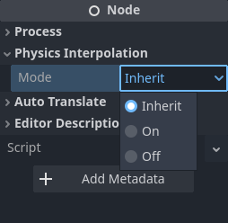

.. _doc_2d_and_3d_physics_interpolation:

2D and 3D physics interpolation
===============================

Generally 2D and 3D physics interpolation work in very similar ways. However, there
are a few differences, which will be described here.

Global versus local interpolation
---------------------------------

- In 3D, physics interpolation is performed *independently* on the **global
  transform** of each 3D instance.
- In 2D by contrast, physics interpolation is performed on the **local transform**
  of each 2D instance.

This has some implications:

- In 3D, it is easy to turn interpolation on and off at the level of each ``Node``,
  via the :ref:`physics_interpolation_mode<class_Node_property_physics_interpolation_mode>`
  property in the Inspector, which can be set to ``On``, ``Off``, or ``Inherited``.

- However this means that in 3D, pivots that occur in the ``SceneTree`` (due to
  parent child relationships) can only be interpolated **approximately** over the
  physics tick. In most cases this will not matter, but in some situations the
  interpolation can look slightly wrong.
- In 2D, interpolated local transforms are passed down to children during
  rendering. This means that if a parent has ``physics_interpolation_mode`` set to
  ``On``, but the child is set to ``Off``, the child will still be interpolated if
  the parent is moving. *Only the child's local transform is uninterpolated.*
  Controlling the on / off behavior of 2D nodes therefore requires a little more
  thought and planning.
- On the positive side, pivot behavior in the scene tree is perfectly preserved
  during interpolation in 2D, which gives super smooth behavior.

Resetting physics interpolation
-------------------------------

Whenever objects are moved to a completely new position, and interpolation is not
desired (so as to prevent a "streaking" artefact), it is the responsibility of the
user to call ``reset_physics_interpolation()``.

The good news is that in 2D, this is automatically done for you when nodes first
enter the tree. This reduces boiler plate, and reduces the effort required to get
an existing project working.

.. note:: If you move objects *after* adding to the scene tree, you will still need
          to call ``reset_physics_interpolation()`` as with 3D.

2D Particles
------------

Currently only ``CPUParticles2D`` are supported for physics interpolation in 2D. It
is recommended to use a physics tick rate of at least 20-30 ticks per second to
keep particles looking fluid.

``Particles2D`` (GPU particles) are not yet interpolated, so for now it is
recommended to convert to ``CPUParticles2D`` (but keep a backup of your
``Particles2D`` in case we get these working).

Other
-----

- ``get_global_transform_interpolated()`` is currently only available for 3D.
- ``MultiMeshes`` are supported in both 2D and 3D.

