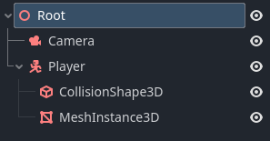

.. _doc_advanced_physics_interpolation:

Advanced physics interpolation
==============================

Although the previous instructions will give satisfactory results in a lot of games,
in some cases you will want to go a stage further to get the best possible results
and the smoothest possible experience.

Exceptions to automatic physics interpolation
---------------------------------------------

Even with physics interpolation active, there may be some local situations where
you would benefit from disabling automatic interpolation for a
:ref:`Node<class_Node>` (or branch of the :ref:`SceneTree<class_SceneTree>`), and
have the finer control of performing interpolation manually.

This is possible using the :ref:`Node.physics_interpolation_mode<class_Node_property_physics_interpolation_mode>`
property which is present in all Nodes. If you for example, turn off interpolation
for a Node, the children will recursively also be affected (as they default to
inheriting the parent setting). This means you can easily disable interpolation for
an entire subscene.

The most common situation where you may want to perform your own interpolation is
Cameras.

Cameras
~~~~~~~

In many cases, a :ref:`Camera3D<class_Camera3D>` can use automatic interpolation
just like any other node. However, for best results, especially at low physics tick
rates, it is recommended that you take a manual approach to camera interpolation.

This is because viewers are very sensitive to camera movement. For instance, a
Camera3D that realigns slightly every 1/10th of a second (at 10tps tick rate) will
often be noticeable. You can get a much smoother result by moving the camera each
frame in ``_process``, and following an interpolated target manually.

Manual camera interpolation
~~~~~~~~~~~~~~~~~~~~~~~~~~~

Ensure the camera is using global coordinate space
^^^^^^^^^^^^^^^^^^^^^^^^^^^^^^^^^^^^^^^^^^^^^^^^^^

The very first step when performing manual camera interpolation is to make sure the
Camera3D transform is specified in *global space* rather than inheriting the
transform of a moving parent. This is because feedback can occur between the
movement of a parent node of a Camera3D and the movement of the camera Node itself,
which can mess up the interpolation.

There are two ways of doing this:

1) Move the Camera3D so it is independent on its own branch, rather than being a child of a moving object.

2) Call :ref:`Node3D.top_level<class_Node3D_property_top_level>` and set this to ``true``, which will make the Camera ignore the transform of its parent.

Typical example
^^^^^^^^^^^^^^^

A typical example of a custom approach is to use the ``look_at`` function in the
Camera3D every frame in ``_process()`` to look at a target node (such as the player).

But there is a problem. If we use the traditional ``get_global_transform()`` on a
Camera3D "target" node, this transform will only focus the Camera3D on the target *at
the current physics tick*. This is *not* what we want, as the camera will jump
about on each physics tick as the target moves. Even though the camera may be
updated each frame, this does not help give smooth motion if the *target* is only
changing each physics tick.

get_global_transform_interpolated()
^^^^^^^^^^^^^^^^^^^^^^^^^^^^^^^^^^^

What we really want to focus the camera on, is not the position of the target on
the physics tick, but the *interpolated* position, i.e. the position at which the
target will be rendered.

We can do this using the :ref:`Spatial.get_global_transform_interpolated<class_Node3D_method_get_global_transform_interpolated>`
function. This acts exactly like getting :ref:`Spatial.global_transform<class_Node3D_property_global_transform>`
but it gives you the *interpolated* transform (during a ``_process()`` call).

.. important:: ``get_global_transform_interpolated()`` should only be used once or
               twice for special cases such as cameras. It should **not** be used
               all over the place in your code (both for performance reasons, and
               to give correct gameplay).

.. note:: Aside from exceptions like the camera, in most cases, your game logic
          should be in ``_physics_process()``. In game logic you should be calling
          ``get_global_transform()`` or ``get_transform()``, which will give the
          current physics transform (in global or local space respectively), which
          is usually what you will want for gameplay code.

Example manual camera script
^^^^^^^^^^^^^^^^^^^^^^^^^^^^

Here is an example of a simple fixed camera which follows an interpolated target:

.. code-block:: gdscript

    extends Camera3D
        
    # Node that the camera will follow
    var _target
        
    # We will smoothly lerp to follow the target
    # rather than follow exactly
    var _target_pos : Vector3 = Vector3()
        
    func _ready() -> void:
        # Find the target node
        _target = get_node("../Player")
        
        # Turn off automatic physics interpolation for the Camera3D,
        # we will be doing this manually
        set_physics_interpolation_mode(Node.PHYSICS_INTERPOLATION_MODE_OFF)
        
    func _process(delta: float) -> void:
        # Find the current interpolated transform of the target
        var tr : Transform = _target.get_global_transform_interpolated()
        
        # Provide some delayed smoothed lerping towards the target position 
        _target_pos = lerp(_target_pos, tr.origin, min(delta, 1.0))
        
        # Fixed camera position, but it will follow the target
        look_at(_target_pos, Vector3(0, 1, 0))

Mouse look
^^^^^^^^^^

Mouse look is a very common way of controlling cameras. But there is a problem.
Unlike keyboard input which can be sampled periodically on the physics tick, mouse
move events can come in continuously. The camera will be expected to react and
follow these mouse movements on the next frame, rather than waiting until the next
physics tick.

In this situation, it can be better to disable physics interpolation for the camera
node (using :ref:`Node.physics_interpolation_mode<class_Node_property_physics_interpolation_mode>`)
and directly apply the mouse input to the camera rotation, rather than apply it in
``_physics_process``.

Sometimes, especially with cameras, you will want to use a combination of
interpolation and non-interpolation:

* A first person camera may position the camera at a player location (perhaps using :ref:`Spatial.get_global_transform_interpolated<class_Node3D_method_get_global_transform_interpolated>`), but control the Camera rotation from mouse look *without* interpolation.
* A third person camera may similarly determine the look at (target location) of the camera using :ref:`Spatial.get_global_transform_interpolated<class_Node3D_method_get_global_transform_interpolated>`, but position the camera using mouse look *without* interpolation.

There are many permutations and variations of camera types, but it should be clear
that in many cases, disabling automatic physics interpolation and handling this
yourself can give a better result.

Disabling interpolation on other nodes
~~~~~~~~~~~~~~~~~~~~~~~~~~~~~~~~~~~~~~

Although cameras are the most common example, there are a number of cases when you
may wish other nodes to control their own interpolation, or be non-interpolated.
Consider for example, a player in a top view game whose rotation is controlled by
mouse look. Disabling physics rotation allows the player rotation to match the
mouse in real-time.

MultiMeshes
~~~~~~~~~~~

Although most visual Nodes follow the single Node single visual instance paradigm,
MultiMeshes can control several instances from the same Node. Therefore, they have
some extra functions for controlling interpolation functionality on a
*per-instance* basis. You should explore these functions if you are using
interpolated MultiMeshes.

- :ref:`MultiMesh.reset_instance_physics_interpolation<class_MultiMesh_method_reset_instance_physics_interpolation>`
- :ref:`MultiMesh.set_buffer_interpolated<class_MultiMesh_method_set_buffer_interpolated>`

Full details are in the :ref:`MultiMesh<class_MultiMesh>` documentation.
