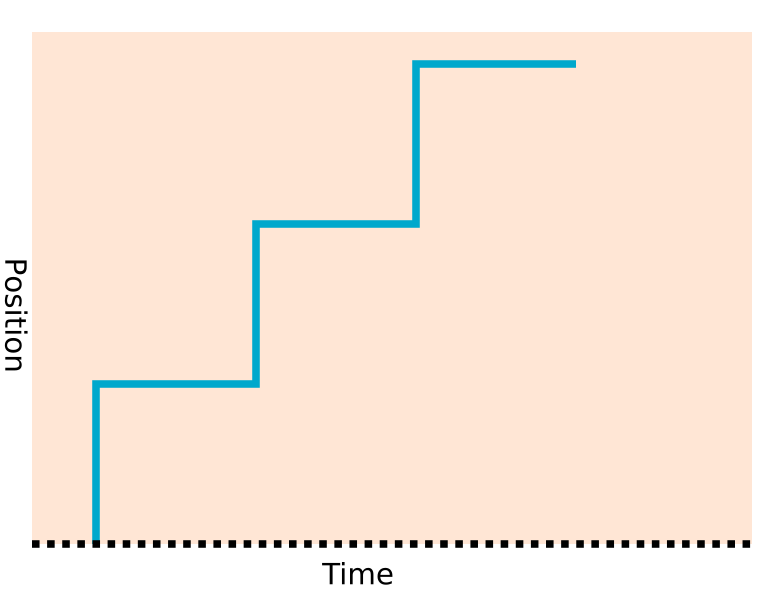
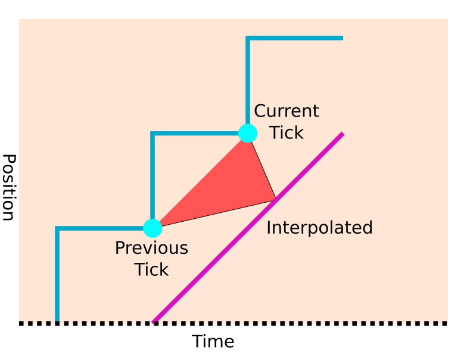

.. _doc_physics_interpolation_introduction:

Introduction
============

Physics ticks and rendered frames
---------------------------------

One key concept to understand in Godot is the distinction between physics ticks
(sometimes referred to as iterations or physics frames), and rendered frames. The
physics proceeds at a fixed tick rate (set in :ref:`Project Settings > Physics > Common > Physics Tick per Second<class_ProjectSettings_property_physics/common/physics_ticks_per_second>`),
which defaults to 60 ticks per second.

However, the engine does not necessarily **render** at the same rate. Although many
monitors refresh at 60 Hz (cycles per second), many refresh at completely different
frequencies (e.g. 75 Hz, 144 Hz, 240 Hz or more). Even though a monitor may be able
to show a new frame e.g. 60 times a second, there is no guarantee that the CPU and
GPU will be able to *supply* frames at this rate. For instance, when running with
V-Sync, the computer may be too slow for 60 and only reach the deadlines for 30
FPS, in which case the frames you see will change at 30 FPS (resulting in
stuttering).

But there is a problem here. What happens if the physics ticks do not coincide with
frames? What happens if the physics tick rate is out of phase with the frame rate?
Or worse, what happens if the physics tick rate is *lower* than the rendered frame
rate?

This problem is easier to understand if we consider an extreme scenario. If you set
the physics tick rate to 10 ticks per second, in a simple game with a rendered
frame rate of 60 FPS. If we plot a graph of the positions of an object against the
rendered frames, you can see that the positions will appear to "jump" every 1/10th
of a second, rather than giving a smooth motion. When the physics calculates a new
position for a new object, it is not rendered in this position for just one frame,
but for 6 frames.

This jump can be seen in other combinations of tick / frame rate as glitches, or
jitter, caused by this staircasing effect due to the discrepancy between physics
tick time and rendered frame time.

What can we do about frames and ticks being out of sync?
--------------------------------------------------------

Lock the tick / frame rate together?
~~~~~~~~~~~~~~~~~~~~~~~~~~~~~~~~~~~~~

The most obvious solution is to get rid of the problem, by ensuring there is a
physics tick that coincides with every frame. This used to be the approach on old
consoles and fixed hardware computers. If you know that every player will be using
the same hardware, you can ensure it is fast enough to calculate ticks and frames
at e.g. 50 FPS, and you will be sure it will work great for everybody.

However, modern games are often no longer made for fixed hardware. You will often
be planning to release on desktop computers, mobiles, and more. All of which have
huge variations in performance, as well as different monitor refresh rates. We need
to come up with a better way of dealing with the problem.

Adapt the tick rate?
~~~~~~~~~~~~~~~~~~~~

Instead of designing the game at a fixed physics tick rate, we could allow the tick
rate to scale according to the end user's hardware. We could for example use a fixed
tick rate that works for that hardware, or even vary the duration of each physics
tick to match a particular frame duration.

This works, but there is a problem. Physics (*and game logic*, which is often also
run in the ``_physics_process``) work best and most consistently when run at a
**fixed**, predetermined tick rate. If you attempt to run a racing game physics
that has been designed for 60 TPS (ticks per second) at e.g. 10 TPS, the physics
will behave completely differently. Controls may be less responsive, collisions /
trajectories can be completely different. You may test your game thoroughly at 60
TPS, then find it breaks on end users' machines when it runs at a different tick
rate.

This can make quality assurance difficult with hard to reproduce bugs, especially
in AAA games where problems of this sort can be very costly. This can also be
problematic for multiplayer games for competitive integrity, as running the game at
certain tick rates may be more advantageous than others.

Lock the tick rate, but use interpolation to smooth frames in between physics ticks
~~~~~~~~~~~~~~~~~~~~~~~~~~~~~~~~~~~~~~~~~~~~~~~~~~~~~~~~~~~~~~~~~~~~~~~~~~~~~~~~~~~

This has become one of the most popular approaches to deal with the problem,
although it is optional and disabled by default.

We have established that the most desirable physics/game logic arrangement for
consistency and predictability is a physics tick rate that is fixed at design-time.
The problem is the discrepancy between the physics position recorded, and where we
"want" a physics object to be shown on a frame to give smooth motion.

The answer turns out to be simple, but can be a little hard to get your head around
at first.

Instead of keeping track of just the current position of a physics object in the
engine, we keep track of *both the current position of the object, and the previous
position* on the previous physics tick.

Why do we need the previous position *(in fact the entire transform, including
rotation and scaling)*? By using a little math magic, we can use **interpolation**
to calculate what the transform of the object would be between those two points, in
our ideal world of smooth continuous movement.

Linear interpolation
~~~~~~~~~~~~~~~~~~~~

The simplest way to achieve this is linear interpolation, or lerping, which you may
have used before.

Let us consider only the position, and a situation where we know that the previous
physics tick X coordinate was 10 units, and the current physics tick X coordinate
is 30 units.

.. note:: Although the maths is explained here, you do not have to worry about the
          details, as this step will be performed for you. Under the hood, Godot
          may use more complex forms of interpolation, but linear interpolation is
          the easiest in terms of explanation.

The physics interpolation fraction
~~~~~~~~~~~~~~~~~~~~~~~~~~~~~~~~~~

If our physics ticks are happening 10 times per second (for this example), what
happens if our rendered frame takes place at time 0.12 seconds? We can do some math
to figure out where the object would be to obtain a smooth motion between the two
ticks.

First of all, we have to calculate how far through the physics tick we want the
object to be. If the last physics tick took place at 0.1 seconds, we are 0.02
seconds *(0.12 - 0.1)* through a tick that we know will take 0.1 seconds (10 ticks
per second). The fraction through the tick is thus:

.. code-block:: gdscript

	fraction = 0.02 / 0.10
	fraction = 0.2

This is called the **physics interpolation fraction**, and is handily calculated
for you by Godot. It can be retrieved on any frame by calling :ref:`Engine.get_physics_interpolation_fraction<class_Engine_method_get_physics_interpolation_fraction>`.

Calculating the interpolated position
~~~~~~~~~~~~~~~~~~~~~~~~~~~~~~~~~~~~~

Once we have the interpolation fraction, we can insert it into a standard linear
interpolation equation. The X coordinate would thus be:

.. code-block:: gdscript

	x_interpolated = x_prev + ((x_curr - x_prev) * 0.2)

So substituting our ``x_prev`` as 10, and ``x_curr`` as 30:

.. code-block:: gdscript

	x_interpolated = 10 + ((30 - 10) * 0.2)
	x_interpolated = 10 + 4
	x_interpolated = 14

Let's break that down:

- We know the X starts from the coordinate on the previous tick (``x_prev``) which
  is 10 units.
- We know that after the full tick, the difference between the current tick and the
  previous tick will have been added (``x_curr - x_prev``) (which is 20 units).
- The only thing we need to vary is the proportion of this difference we add,
  according to how far we are through the physics tick.

.. note:: Although this example interpolates the position, the same thing can be
          done with the rotation and scale of objects. It is not necessary to know
          the details as Godot will do all this for you.

Smoothed transformations between physics ticks?
~~~~~~~~~~~~~~~~~~~~~~~~~~~~~~~~~~~~~~~~~~~~~~~

Putting all this together shows that it should be possible to have a nice smooth
estimation of the transform of objects between the current and previous physics
tick.

But wait, you may have noticed something. If we are interpolating between the
current and previous ticks, we are not estimating the position of the object *now*,
we are estimating the position of the object in the past. To be exact, we are
estimating the position of the object *between 1 and 2 ticks* into the past.

In the past
~~~~~~~~~~~

What does this mean? This scheme does work, but it does mean we are effectively
introducing a delay between what we see on the screen, and where the objects
*should* be.

In practice, most people won't notice this delay, or rather, it is typically not
*objectionable*. There are already significant delays involved in games, we just
don't typically notice them. The most significant effect is there can be a slight
delay to input, which can be a factor in fast twitch games. In some of these fast
input situations, you may wish to turn off physics interpolation and use a
different scheme, or use a high tick rate, which mitigates these delays.

Why look into the past? Why not predict the future?
~~~~~~~~~~~~~~~~~~~~~~~~~~~~~~~~~~~~~~~~~~~~~~~~~~~

There is an alternative to this scheme, which is: instead of interpolating between
the previous and current tick, we use maths to *extrapolate* into the future. We
try to predict where the object *will be*, rather than show it where it was. This
can be done and may be offered as an option in future, but there are some
significant downsides:

- The prediction may not be correct, especially when an object collides with
  another object during the physics tick.
- Where a prediction was incorrect, the object may extrapolate into an "impossible"
  position, like inside a wall.
- Providing the movement speed is slow, these incorrect predictions may not be too
  much of a problem.
- When a prediction was incorrect, the object may have to jump or snap back onto
  the corrected path. This can be visually jarring.

Fixed timestep interpolation
~~~~~~~~~~~~~~~~~~~~~~~~~~~~

In Godot this whole system is referred to as physics interpolation, but you may
also hear it referred to as **"fixed timestep interpolation"**, as it is
interpolating between objects moved with a fixed timestep (physics ticks per
second). In some ways the second term is more accurate, because it can also be used
to interpolate objects that are not driven by physics.

.. tip:: Although physics interpolation is usually a good choice, there are
         exceptions where you may choose not to use Godot's built-in physics
         interpolation (or use it in a limited fashion). An example category is
         internet multiplayer games. Multiplayer games often receive tick or timing
         based information from other players or a server and these may not
         coincide with local physics ticks, so a custom interpolation technique can
         often be a better fit.
