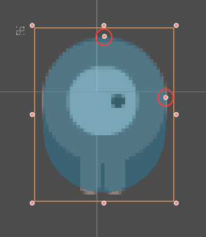
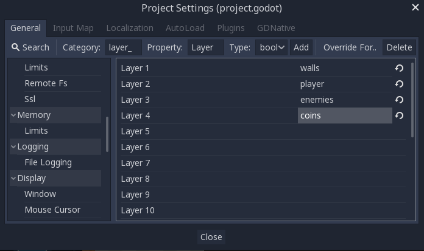
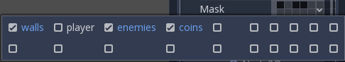

.. _doc_physics_introduction:

Physics introduction
====================

In game development, you often need to know when two objects in the game
intersect or come into contact. This is known as **collision detection**.
When a collision is detected, you typically want something to happen. This
is known as **collision response**.

Godot offers a number of collision objects in 2D and 3D to provide both collision detection
and response. Trying to decide which one to use for your project can be confusing.
You can avoid problems and simplify development if you understand how each works
and what their pros and cons are.

In this guide, you will learn:

-   Godot's four collision object types
-   How each collision object works
-   When and why to choose one type over another

.. note:: This document's examples will use 2D objects. Every 2D physics object
          and collision shape has a direct equivalent in 3D and in most cases
          they work in much the same way.

Collision objects
-----------------

Godot offers four kinds of collision objects which all extend :ref:`CollisionObject2D <class_CollisionObject2D>`.
The last three listed below are physics bodies and additionally extend :ref:`PhysicsBody2D <class_PhysicsBody2D>`.

- :ref:`Area2D <class_Area2D>`
    ``Area2D`` nodes provide **detection** and **influence**. They can detect when
    objects overlap and can emit signals when bodies enter or exit. An ``Area2D``
    can also be used to override physics properties, such as gravity or damping,
    in a defined area.

- :ref:`StaticBody2D <class_StaticBody2D>`
    A static body is one that is not moved by the physics engine. It participates
    in collision detection, but does not move in response to the collision. They
    are most often used for objects that are part of the environment or that do
    not need to have any dynamic behavior.

- :ref:`RigidBody2D <class_RigidBody2D>`
    This is the node that implements simulated 2D physics. You do not control a
    ``RigidBody2D`` directly, but instead you apply forces to it (gravity, impulses,
    etc.) and the physics engine calculates the resulting movement.
    :ref:`Read more about using rigid bodies. <doc_rigid_body>`

- :ref:`CharacterBody2D <class_CharacterBody2D>`
    A body that provides collision detection, but no physics. All movement and
    collision response must be implemented in code.

Physics material
~~~~~~~~~~~~~~~~

Static bodies and rigid bodies can be configured to use a :ref:`PhysicsMaterial
<class_PhysicsMaterial>`. This allows adjusting the friction and bounce of an object,
and set if it's absorbent and/or rough.

Collision shapes
~~~~~~~~~~~~~~~~

A physics body can hold any number of :ref:`Shape2D <class_Shape2D>` objects
as children. These shapes are used to define the object's collision bounds
and to detect contact with other objects.

.. note:: In order to detect collisions, at least one ``Shape2D`` must be
          assigned to the object.

The most common way to assign a shape is by adding a :ref:`CollisionShape2D <class_CollisionShape2D>`
or :ref:`CollisionPolygon2D <class_CollisionPolygon2D>` as a child of the object.
These nodes allow you to draw the shape directly in the editor workspace.

.. important:: Be careful to never scale your collision shapes in the editor.
                The "Scale" property in the Inspector should remain ``(1, 1)``. When changing
                the size of the collision shape, you should always use the size handles, **not**
                the ``Node2D`` scale handles. Scaling a shape can result in unexpected
                collision behavior.

Physics process callback
~~~~~~~~~~~~~~~~~~~~~~~~

The physics engine runs at a fixed rate (a default of 60 iterations per second). This rate
is typically different from the frame rate which fluctuates based on what is rendered and
available resources.

It is important that all physics related code runs at this fixed rate. Therefore Godot
differentiates :ref:`between physics and idle processing <doc_idle_and_physics_processing>`.
Code that runs each frame is called idle processing and code that runs on each physics
tick is called physics processing. Godot provides two different callbacks, one for each
of those processing rates.

The physics callback, :ref:`Node._physics_process() <class_Node_private_method__physics_process>`,
is called before each physics step. Any code that needs to access a body's properties should
be run in here. This method will be passed a ``delta``
parameter, which is a floating-point number equal to the time passed in
*seconds* since the last step. When using the default 60 Hz physics update rate,
it will typically be equal to ``0.01666...`` (but not always, see below).

.. note::

    It's recommended to always use the ``delta`` parameter when relevant in your
    physics calculations, so that the game behaves correctly if you change the
    physics update rate or if the player's device can't keep up.

.. _doc_physics_introduction_collision_layers_and_masks:

Collision layers and masks
~~~~~~~~~~~~~~~~~~~~~~~~~~

One of the most powerful, but frequently misunderstood, collision features
is the collision layer system. This system allows you to build up complex
interactions between a variety of objects. The key concepts are **layers**
and **masks**. Each ``CollisionObject2D`` has 32 different physics layers
it can interact with.

Let's look at each of the properties in turn:

- collision_layer
    This describes the layers that the object appears **in**. By default, all
    bodies are on layer ``1``.

- collision_mask
    This describes what layers the body will **scan** for collisions. If an
    object isn't in one of the mask layers, the body will ignore it. By default,
    all bodies scan layer ``1``.

These properties can be configured via code, or by editing them in the Inspector.

Keeping track of what you're using each layer for can be difficult, so you
may find it useful to assign names to the layers you're using. Names can
be assigned in Project Settings -> Layer Names.

GUI example
^^^^^^^^^^^

You have four node types in your game: Walls, Player, Enemy, and Coin. Both
Player and Enemy should collide with Walls. The Player node should detect
collisions with both Enemy and Coin, but Enemy and Coin should ignore each
other.

Start by naming layers 1-4 "walls", "player", "enemies", and "coins" and
place each node type in its respective layer using the "Layer" property.
Then set each node's "Mask" property by selecting the layers it should
interact with. For example, the Player's settings would look like this:

.. image:: img/player_collision_layers.png

.. _doc_physics_introduction_collision_layer_code_example:

Code example
^^^^^^^^^^^^

In function calls, layers are specified as a bitmask. Where a function enables
all layers by default, the layer mask will be given as ``0xffffffff``. Your code
can use binary, hexadecimal, or decimal notation for layer masks, depending
on your preference.

The code equivalent of the above example where layers 1, 3 and 4 were enabled
would be as follows::

    # Example: Setting mask value for enabling layers 1, 3 and 4

    # Binary - set the bit corresponding to the layers you want to enable (1, 3, and 4) to 1, set all other bits to 0.
    # Note: Layer 32 is the first bit, layer 1 is the last. The mask for layers 4,3 and 1 is therefore
    0b00000000_00000000_00000000_00001101
    # (This can be shortened to 0b1101)

    # Hexadecimal equivalent (1101 binary converted to hexadecimal)
    0x000d
    # (This value can be shortened to 0xd)

    # Decimal - Add the results of 2 to the power of (layer to be enabled - 1).
    # (2^(1-1)) + (2^(3-1)) + (2^(4-1)) = 1 + 4 + 8 = 13
    pow(2, 1-1) + pow(2, 3-1) + pow(2, 4-1)

Area2D
------

Area nodes provide **detection** and **influence**. They can detect when
objects overlap and emit signals when bodies enter or exit. Areas can also
be used to override physics properties, such as gravity or damping, in a
defined area.

There are three main uses for :ref:`Area2D <class_Area2D>`:

- Overriding physics parameters (such as gravity) in a given region.

- Detecting when other bodies enter or exit a region or what bodies are currently in a region.

- Checking other areas for overlap.

By default, areas also receive mouse and touchscreen input.

StaticBody2D
------------

A static body is one that is not moved by the physics engine. It participates
in collision detection, but does not move in response to the collision. However,
it can impart motion or rotation to a colliding body **as if** it were moving,
using its ``constant_linear_velocity`` and ``constant_angular_velocity`` properties.

``StaticBody2D`` nodes are most often used for objects that are part of the environment
or that do not need to have any dynamic behavior.

Example uses for ``StaticBody2D``:

-   Platforms (including moving platforms)
-   Conveyor belts
-   Walls and other obstacles

RigidBody2D
-----------

This is the node that implements simulated 2D physics. You do not control a
:ref:`RigidBody2D <class_RigidBody2D>` directly. Instead, you apply forces
to it and the physics engine calculates the resulting movement, including
collisions with other bodies, and collision responses, such as bouncing,
rotating, etc.

You can modify a rigid body's behavior via properties such as "Mass",
"Friction", or "Bounce", which can be set in the Inspector.

The body's behavior is also affected by the world's properties, as set in
`Project Settings -> Physics`, or by entering an :ref:`Area2D <class_Area2D>`
that is overriding the global physics properties.

When a rigid body is at rest and hasn't moved for a while, it goes to sleep.
A sleeping body acts like a static body, and its forces are not calculated by
the physics engine. The body will wake up when forces are applied, either by
a collision or via code.

Using RigidBody2D
~~~~~~~~~~~~~~~~~

One of the benefits of using a rigid body is that a lot of behavior can be had
"for free" without writing any code. For example, if you were making an
"Angry Birds"-style game with falling blocks, you would only need to create
RigidBody2Ds and adjust their properties. Stacking, falling, and bouncing would
automatically be calculated by the physics engine.

However, if you do wish to have some control over the body, you should take
care - altering the ``position``, ``linear_velocity``, or other physics properties
of a rigid body can result in unexpected behavior. If you need to alter any
of the physics-related properties, you should use the :ref:`_integrate_forces() <class_RigidBody2D_private_method__integrate_forces>`
callback instead of ``_physics_process()``. In this callback, you have access
to the body's :ref:`PhysicsDirectBodyState2D <class_PhysicsDirectBodyState2D>`,
which allows for safely changing properties and synchronizing them with
the physics engine.

For example, here is the code for an "Asteroids" style spaceship:

.. tabs::
 .. code-tab:: gdscript GDScript

    extends RigidBody2D

    var thrust = Vector2(0, -250)
    var torque = 20000

    func _integrate_forces(state):
        if Input.is_action_pressed("ui_up"):
            state.apply_force(thrust.rotated(rotation))
        else:
            state.apply_force(Vector2())
        var rotation_direction = 0
        if Input.is_action_pressed("ui_right"):
            rotation_direction += 1
        if Input.is_action_pressed("ui_left"):
            rotation_direction -= 1
        state.apply_torque(rotation_direction * torque)

 .. code-tab:: csharp

    using Godot;

    public partial class Spaceship : RigidBody2D
    {
        private Vector2 _thrust = new Vector2(0, -250);
        private float _torque = 20000;

        public override void _IntegrateForces(PhysicsDirectBodyState2D state)
        {
            if (Input.IsActionPressed("ui_up"))
                state.ApplyForce(_thrust.Rotated(Rotation));
            else
                state.ApplyForce(new Vector2());

            var rotationDir = 0;
            if (Input.IsActionPressed("ui_right"))
                rotationDir += 1;
            if (Input.IsActionPressed("ui_left"))
                rotationDir -= 1;
            state.ApplyTorque(rotationDir * _torque);
        }
    }

Note that we are not setting the ``linear_velocity`` or ``angular_velocity``
properties directly, but rather applying forces (``thrust`` and ``torque``) to
the body and letting the physics engine calculate the resulting movement.

.. note:: When a rigid body goes to sleep, the ``_integrate_forces()``
          function will not be called. To override this behavior, you will
          need to keep the body awake by creating a collision, applying a
          force to it, or by disabling the :ref:`can_sleep <class_RigidBody2D_property_can_sleep>`
          property. Be aware that this can have a negative effect on performance.

Contact reporting
~~~~~~~~~~~~~~~~~

By default, rigid bodies do not keep track of contacts, because this can
require a huge amount of memory if many bodies are in the scene. To enable
contact reporting, set the :ref:`max_contacts_reported <class_RigidBody2D_property_max_contacts_reported>`
property to a non-zero value. The contacts can then be obtained via
:ref:`PhysicsDirectBodyState2D.get_contact_count() <class_PhysicsDirectBodyState2D_method_get_contact_count>`
and related functions.

Contact monitoring via signals can be enabled via the :ref:`contact_monitor <class_RigidBody2D_property_contact_monitor>`
property. See :ref:`RigidBody2D <class_RigidBody2D>` for the list of available
signals.

CharacterBody2D
---------------

:ref:`CharacterBody2D <class_CharacterBody2D>` bodies detect collisions with
other bodies, but are not affected by physics properties like gravity or friction.
Instead, they must be controlled by the user via code. The physics engine will
not move a character body.

When moving a character body, you should not set its ``position`` directly.
Instead, you use the ``move_and_collide()`` or ``move_and_slide()`` methods.
These methods move the body along a given vector, and it will instantly stop
if a collision is detected with another body. After the body has collided,
any collision response must be coded manually.

Character collision response
~~~~~~~~~~~~~~~~~~~~~~~~~~~~

After a collision, you may want the body to bounce, to slide along a wall,
or to alter the properties of the object it hit. The way you handle collision
response depends on which method you used to move the CharacterBody2D.

:ref:`move_and_collide <class_PhysicsBody2D_method_move_and_collide>`
^^^^^^^^^^^^^^^^^^^^^^^^^^^^^^^^^^^^^^^^^^^^^^^^^^^^^^^^^^^^^^^^^^^^^^^

When using ``move_and_collide()``, the function returns a
:ref:`KinematicCollision2D <class_KinematicCollision2D>` object, which contains
information about the collision and the colliding body. You can use this
information to determine the response.

For example, if you want to find the point in space where the collision
occurred:

.. tabs::
 .. code-tab:: gdscript GDScript

    extends PhysicsBody2D

    var velocity = Vector2(250, 250)

    func _physics_process(delta):
        var collision_info = move_and_collide(velocity * delta)
        if collision_info:
            var collision_point = collision_info.get_position()

 .. code-tab:: csharp

    using Godot;

    public partial class Body : PhysicsBody2D
    {
        private Vector2 _velocity = new Vector2(250, 250);

        public override void _PhysicsProcess(double delta)
        {
            var collisionInfo = MoveAndCollide(_velocity * (float)delta);
            if (collisionInfo != null)
            {
                var collisionPoint = collisionInfo.GetPosition();
            }
        }
    }

Or to bounce off of the colliding object:

.. tabs::
 .. code-tab:: gdscript GDScript

    extends PhysicsBody2D

    var velocity = Vector2(250, 250)

    func _physics_process(delta):
        var collision_info = move_and_collide(velocity * delta)
        if collision_info:
            velocity = velocity.bounce(collision_info.get_normal())

 .. code-tab:: csharp

    using Godot;

    public partial class Body : PhysicsBody2D
    {
        private Vector2 _velocity = new Vector2(250, 250);

        public override void _PhysicsProcess(double delta)
        {
            var collisionInfo = MoveAndCollide(_velocity * (float)delta);
            if (collisionInfo != null)
                _velocity = _velocity.Bounce(collisionInfo.GetNormal());
        }
    }

:ref:`move_and_slide <class_CharacterBody2D_method_move_and_slide>`
^^^^^^^^^^^^^^^^^^^^^^^^^^^^^^^^^^^^^^^^^^^^^^^^^^^^^^^^^^^^^^^^^^^

Sliding is a common collision response; imagine a player moving along walls
in a top-down game or running up and down slopes in a platformer. While it's
possible to code this response yourself after using ``move_and_collide()``,
``move_and_slide()`` provides a convenient way to implement sliding movement
without writing much code.

.. warning:: ``move_and_slide()`` automatically includes the timestep in its
             calculation, so you should **not** multiply the velocity vector
             by ``delta``. This does **not** apply to ``gravity`` as it is an
             acceleration and is time dependent, and needs to be scaled by
             ``delta``.

For example, use the following code to make a character that can walk along
the ground (including slopes) and jump when standing on the ground:

.. tabs::
 .. code-tab:: gdscript GDScript

    extends CharacterBody2D

    var run_speed = 350
    var jump_speed = -1000
    var gravity = 2500

    func get_input():
        velocity.x = 0
        var right = Input.is_action_pressed('ui_right')
        var left = Input.is_action_pressed('ui_left')
        var jump = Input.is_action_just_pressed('ui_select')

        if is_on_floor() and jump:
            velocity.y = jump_speed
        if right:
            velocity.x += run_speed
        if left:
            velocity.x -= run_speed

    func _physics_process(delta):
        velocity.y += gravity * delta
        get_input()
        move_and_slide()

 .. code-tab:: csharp

    using Godot;

    public partial class Body : CharacterBody2D
    {
        private float _runSpeed = 350;
        private float _jumpSpeed = -1000;
        private float _gravity = 2500;

        private void GetInput()
        {
            var velocity = Velocity;
            velocity.X = 0;

            var right = Input.IsActionPressed("ui_right");
            var left = Input.IsActionPressed("ui_left");
            var jump = Input.IsActionPressed("ui_select");

            if (IsOnFloor() && jump)
                velocity.Y = _jumpSpeed;
            if (right)
                velocity.X += _runSpeed;
            if (left)
                velocity.X -= _runSpeed;

            Velocity = velocity;
        }

        public override void _PhysicsProcess(double delta)
        {
            var velocity = Velocity;
            velocity.Y += _gravity * (float)delta;
            Velocity = velocity;
            GetInput();
            MoveAndSlide();
        }
    }

See :ref:`doc_kinematic_character_2d` for more details on using ``move_and_slide()``,
including a demo project with detailed code.
