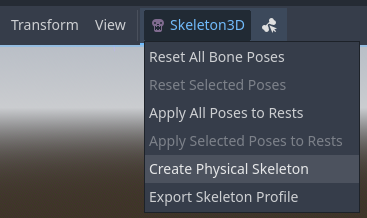
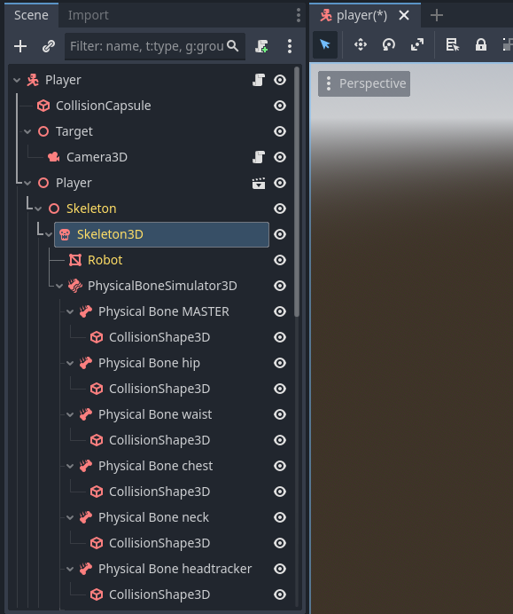
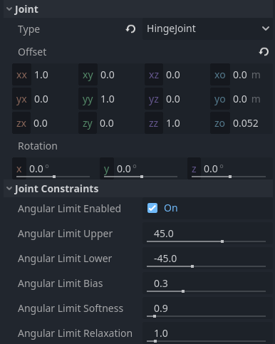
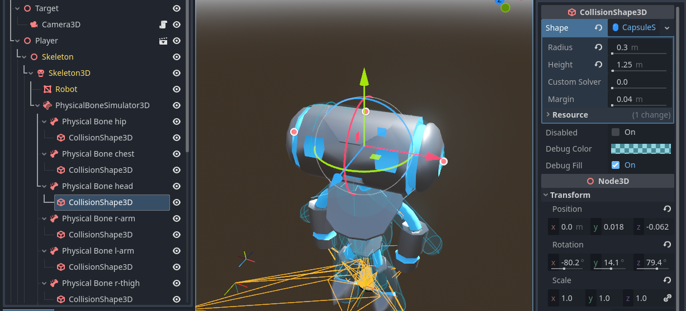
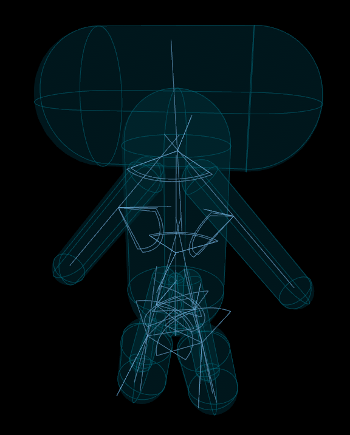
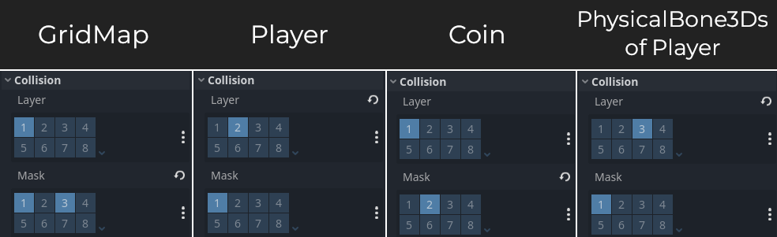

.. _doc_ragdoll_system:

Ragdoll system
==============

Introduction
------------

Godot supports ragdoll physics. Ragdolls rely on physics simulation to create
realistic procedural animation. They are used for death animations in many games.

In this tutorial, we will be using the Platformer 3D demo to set up a ragdoll.

.. note::

    You can download the Platformer 3D demo on
    `GitHub <https://github.com/godotengine/godot-demo-projects/tree/master/3d/platformer>`_
    or using the `Asset Library <https://godotengine.org/asset-library/asset/2748>`_.

    You can also check out an example of a complete ragdoll setup in the
    `Ragdoll Physics demo <https://github.com/godotengine/godot-demo-projects/tree/master/3d/ragdoll_physics>`_.

Setting up the ragdoll
----------------------

Creating physical bones
~~~~~~~~~~~~~~~~~~~~~~~

Like many other features in the engine, there are two nodes which are used
to set up a ragdoll:

- A :ref:`PhysicalBoneSimulator3D <class_PhysicalBoneSimulator3D>` node.
  This node is the parent of all physical bones and is responsible
  for controlling the simulation.
- One or more :ref:`PhysicalBone3D <class_PhysicalBone3D>` children.
  Each node represents a single bone in the ragdoll.

Open the platformer demo in Godot, and then the ``player/player.tscn`` scene.
Select the ``Skeleton3D`` node. A skeleton button appears at the top of the
3D editor viewport:

   Creating a physical skeleton in the editor

Click it and select the :menu:`Create Physical Skeleton` option. Godot will generate
PhysicalBone3D nodes and collision shapes for each bone in the skeleton and
pin joints to connect them together:

   Scene tree of the player scene after creating a physical skeleton

Some of the generated bones aren't necessary, such as the ``MASTER`` bone in this scene.
We're going to clean up the skeleton by removing them.

Clean up and optimize the skeleton
~~~~~~~~~~~~~~~~~~~~~~~~~~~~~~~~~~

For each PhysicalBone3D the engine needs to simulate, there is a performance cost.
You'll want to remove every bone that is too small to make a difference in the simulation,
as well as all utility bones.

For example, if we take a humanoid, you don't need to have physical bones for each finger.
You can use a single bone for the entire hand instead, or one for the palm, one for the thumb,
and a last one for the other four fingers.

Remove these PhysicalBone3D nodes: ``MASTER``, ``waist``, ``neck``, ``headtracker``.
This gives us an optimized skeleton and makes it easier to control the ragdoll.

Adjust joints and constraints
~~~~~~~~~~~~~~~~~~~~~~~~~~~~~

Once you adjusted the collision shapes, your ragdoll is almost ready. Now, you need
to adjust the pin joints to get a better simulation. PhysicalBone3D nodes have an
unconstrained pin joint assigned to them by default. To change the pin joint,
select a PhysicalBone3D node and change the constraint type in the :menu:`Joint` section
of the inspector. There, you can change the constraint's orientation and its limits.

Joints have a gizmo visible in the 3D editor as well, so you can see their constraints
in action.

   Adjusting joints in the inspector after selecting a PhysicalBone3D node

.. tip::

    To get a better view when editing joints and collision shapes, you can do the following:

    - Hide PhysicalBone3D nodes you aren't currently working on, so you can focus
      on the ones you're adjusting.
    - Hide the MeshInstance3D of the character by clicking the eye icon next to it
      in the scene tree dock.
    - Hide the Skeleton3D gizmos, so that the orange triangles that represent the skeleton
      don't clutter the viewport while leaving the rest visible.
      To do so, click :menu:`View > Gizmos > Skeleton3D` at the top of the 3D editor
      viewport until the eye icon appears closed.
    - Disable the preview environment by clicking the globe icon at the top of
      the 3D editor viewport.
    - Set the **Default Clear Color** project setting to pure black in the Project Settings.
      This is only effective if the preview environment is disabled.
    - Change the debug draw mode using the :menu:`Perspective` button
      in the top-left corner of the 3D editor viewport. The :menu:`Display Wireframe`
      and :menu:`Display Overdraw` options are particularly useful when adjusting
      collision shapes, as they allow you to see through the original mesh.
    - Use the orthographic camera by clicking the :button:`X`/:button:`Y`/:button:`Z`
      buttons in the top-right corner of the 3D editor viewport.

Here is the list of joints available:

- **None:** Does not perform any constraint.
- **ConeJoint:** Ball-and-socket. Useful for shoulders, hips, neck.
- **HingeJoint:** Provides an angular constraint; think of it like a door hinge.
  Useful for elbows and knees.
- **PinJoint:** Keeps two bodies connected *(default)*.
  Leads to "crumpling" of the bones, so it's recommended to use other joint types
  for most characters instead.
- **SliderJoint:** Slides one bone along another on a specific axis.
- **6DOFJoint:** Most powerful joint, offering both linear and angular constraints,
  but also the most complex to configure.

If in doubt, start with HingeJoint and ConeJoint, as they cover most use cases:

- For HingeJoint, make sure to enable **Angular Limit** in the
  :menu:`Joint Constraints` section of the inspector. After enabling it,
  you can see the angle that it's being constrained to in the viewport.
  You can rotate the PhysicalBone3D to change the axis where the joint
  is constrained, then adjust the angles.
- For ConeJoint, it's usually best to limit **Swing Span** between 20 and
  90 degrees, and the **Twist Span** between 20 and 45 degrees.

Adjust collision shapes
~~~~~~~~~~~~~~~~~~~~~~~

The next task is adjusting the collision shape and the size of the physical bones
to match the part of the body that each bone should simulate.

It's recommended to adjust collision shapes *after* adjusting joints and constraints,
as rotating a joint will also rotate the collision shape. To avoid having
to adjust collision shapes twice, it's better to adjust joints first.

Note that it's possible to have multiple collision shapes as a child of a
PhysicalBone3D node. This can be useful to represent particularly complex
shapes of limbs that are otherwise rigid.

.. tip::

    To pause animation playback while adjusting the ragdoll, select the
    ``AnimationTree`` node and disable the **Active** property in the Inspector.
    Remember to enable it again when you're done, as it controls animation playback
    during gameplay.

   Adjusting collision shapes in the 3D editor

This is the final result:

   Result after adjusting joints and collision shapes (player mesh is hidden for visibility)

Simulate the ragdoll
--------------------

The ragdoll is now ready to use. To start the simulation and play the ragdoll animation,
you need to call the
:ref:`PhysicalBoneSimulator3D.physical_bones_start_simulation() <class_PhysicalBoneSimulator3D_method_physical_bones_start_simulation>`
method. Attach a script to the :ref:`PhysicalBoneSimulator3D <class_PhysicalBoneSimulator3D>` node
that is the parent of all the PhysicalBone3D nodes in our scene, then call it in the script's
``_ready`` method:

.. tabs::
 .. code-tab:: gdscript GDScript

    func _ready():
        physical_bones_start_simulation()

 .. code-tab:: csharp

    public override void _Ready()
    {
        PhysicalBonesStartSimulation();
    }

To stop the simulation, call the
:ref:`PhysicalBoneSimulator3D.physical_bones_stop_simulation() <class_PhysicalBoneSimulator3D_method_physical_bones_stop_simulation>`
method.

.. video:: video/ragdoll_system_full_simulation.webm
    :alt: Full simulation of ragdoll system, with the player falling to the ground
    :autoplay:
    :loop:
    :muted:
    :align: default
    :width: 100%

You can also limit the simulation to only a few bones. This can be useful
to create effects such as ragdoll limbs or attachments that can interact
with the world. To do so, pass the bone names (*not* the PhysicalBone3D
node names) as a parameter. To see the bone name, look at the
**Bone Name** property in the inspector after selecting a PhysicalBone3D node.

.. tip::

    When using an automatically generated physical skeleton as shown in this tutorial,
    the bone name is also contained in the node name. For example, in
    ``Physical Bone l-arm``, ``l-arm`` is the bone name.

.. tabs::
 .. code-tab:: gdscript GDScript

    func _ready():
        physical_bones_start_simulation(["l-arm", "r-arm"])

 .. code-tab:: csharp

    public override void _Ready()
    {
        PhysicalBonesStartSimulation(["l-arm", "r-arm"]);
    }

Note that nonexistent bone names will not print any error or warning. If
nothing happens when starting the simulation (or if the whole body is ragdolled
instead of only specific bones), double-check the list of provided bones.

Here's an example of partial ragdoll simulation:

.. video:: video/ragdoll_system_partial_simulation.webm
    :alt: Partial simulation of ragdoll system, with arms flailing while the player is walking
    :autoplay:
    :loop:
    :muted:
    :align: default
    :width: 100%

.. tip::

    To control how strongly the partial ragdoll simulation affects the overall animation,
    you can adjust the **Influence** property in the
    :ref:`PhysicalBoneSimulator3D <class_PhysicalBoneSimulator3D>` node that is the
    parent of all PhysicalBone3D nodes. By default, it's set to ``1.0``, which means
    the ragdoll simulation fully overrides the rest of the animation.

Collision layer and mask
~~~~~~~~~~~~~~~~~~~~~~~~

Make sure to set up your collision layers and masks properly so the
CharacterBody3D's capsule doesn't get in the way of the physics simulation.
Remember to adjust the collision layer and mask in the coin scene
as well, so that the player can still collect coins:

   Layers and masks must be adjusted to these values in the inspector for each node

You can find the GridMap in the 3D platformer demo in ``stage/grid_map.scn``.
The coin's Area3D node (on which the layers and masks must be adjusted)
can be found at ``coin/coin.tscn``.

.. tip::

    To select all PhysicalBone3D nodes quickly, enter ``t:PhysicalBone3D`` in the
    search bar at the top of the scene tree dock. This filters the scene tree
    to only show PhysicalBone3D nodes, which allows you to select them all at once
    using :kbd:`Shift + Left mouse button` on the first and last entries.

If this is not done, collision will behave incorrectly as the player will collide
with its own (inactive) ragdoll. This can cause the player to wildly
bounce around or get stuck.

Like RigidBody3D, PhysicalBone3D supports collision exceptions through code
using the :ref:`physical_bones_add_collision_exception() <class_PhysicalBoneSimulator3D_method_physical_bones_add_collision_exception>`
and :ref:`physical_bones_remove_collision_exception() <class_PhysicalBoneSimulator3D_method_physical_bones_remove_collision_exception>`
methods. This can be used to prevent collisions with a specific object
without relying on layers and masks.

.. seealso::

    For more information, see :ref:`doc_physics_introduction_collision_layers_and_masks`.
