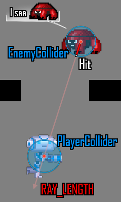
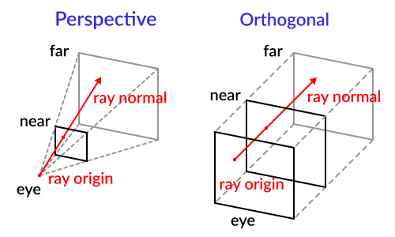

.. _doc_ray-casting:

Ray-casting
===========

Introduction
------------

One of the most common tasks in game development is casting a ray (or
custom shaped object) and checking what it hits. This enables complex
behaviors, AI, etc. to take place. This tutorial will explain how to
do this in 2D and 3D.

Godot stores all the low level game information in servers, while the
scene is only a frontend. As such, ray casting is generally a
lower-level task. For simple raycasts, nodes like
:ref:`RayCast3D <class_RayCast3D>` and :ref:`RayCast2D <class_RayCast2D>`
will work, as they return every frame what the result of a raycast
is.

Many times, though, ray-casting needs to be a more interactive process
so a way to do this by code must exist.

Space
-----

In the physics world, Godot stores all the low level collision and
physics information in a *space*. The current 2d space (for 2D Physics)
can be obtained by accessing
:ref:`CanvasItem.get_world_2d().space <class_CanvasItem_method_get_world_2d>`.
For 3D, it's :ref:`Node3D.get_world_3d().space <class_Node3D_method_get_world_3d>`.

The resulting space :ref:`RID <class_RID>` can be used in
:ref:`PhysicsServer3D <class_PhysicsServer3D>` and
:ref:`PhysicsServer2D <class_PhysicsServer2D>` respectively for 3D and 2D.

Accessing space
---------------

Godot physics runs by default in the same thread as game logic, but may
be set to run on a separate thread to work more efficiently. Due to
this, the only time accessing space is safe is during the
:ref:`Node._physics_process() <class_Node_private_method__physics_process>`
callback. Accessing it from outside this function may result in an error
due to space being *locked*.

To perform queries into physics space, the
:ref:`PhysicsDirectSpaceState2D <class_PhysicsDirectSpaceState2D>`
and :ref:`PhysicsDirectSpaceState3D <class_PhysicsDirectSpaceState3D>`
must be used.

Use the following code in 2D:

.. tabs::
 .. code-tab:: gdscript GDScript

    func _physics_process(delta):
        var space_rid = get_world_2d().space
        var space_state = PhysicsServer2D.space_get_direct_state(space_rid)

 .. code-tab:: csharp

    public override void _PhysicsProcess(double delta)
    {
        var spaceRid = GetWorld2D().Space;
        var spaceState = Physics2DServer.SpaceGetDirectState(spaceRid);
    }

Or more directly:

.. tabs::
 .. code-tab:: gdscript GDScript

    func _physics_process(delta):
        var space_state = get_world_2d().direct_space_state

 .. code-tab:: csharp

    public override void _PhysicsProcess(double delta)
    {
        var spaceState = GetWorld2D().DirectSpaceState;
    }

And in 3D:

.. tabs::
 .. code-tab:: gdscript GDScript

    func _physics_process(delta):
        var space_state = get_world_3d().direct_space_state

 .. code-tab:: csharp

    public override void _PhysicsProcess(double delta)
    {
        var spaceState = GetWorld3D().DirectSpaceState;
    }

Raycast query
-------------

For performing a 2D raycast query, the method
:ref:`PhysicsDirectSpaceState2D.intersect_ray() <class_PhysicsDirectSpaceState2D_method_intersect_ray>`
may be used. For example:

.. tabs::
 .. code-tab:: gdscript GDScript

    func _physics_process(delta):
        var space_state = get_world_2d().direct_space_state
        # use global coordinates, not local to node
        var query = PhysicsRayQueryParameters2D.create(Vector2(0, 0), Vector2(50, 100))
        var result = space_state.intersect_ray(query)

 .. code-tab:: csharp

    public override void _PhysicsProcess(double delta)
    {
        var spaceState = GetWorld2D().DirectSpaceState;
        // use global coordinates, not local to node
        var query = PhysicsRayQueryParameters2D.Create(Vector2.Zero, new Vector2(50, 100));
        var result = spaceState.IntersectRay(query);
    }

The result is a dictionary. If the ray didn't hit anything, the dictionary will
be empty. If it did hit something, it will contain collision information:

.. tabs::
 .. code-tab:: gdscript GDScript

        if result:
            print("Hit at point: ", result.position)

 .. code-tab:: csharp

        if (result.Count > 0)
            GD.Print("Hit at point: ", result["position"]);

The ``result`` dictionary when a collision occurs contains the following
data:

::

    {
       position: Vector2 # point in world space for collision
       normal: Vector2 # normal in world space for collision
       collider: Object # Object collided or null (if unassociated)
       collider_id: ObjectID # Object it collided against
       rid: RID # RID it collided against
       shape: int # shape index of collider
       metadata: Variant() # metadata of collider
    }

The data is similar in 3D space, using Vector3 coordinates. Note that to enable collisions
with Area3D, the boolean parameter ``collide_with_areas`` must be set to ``true``.

.. tabs::
 .. code-tab:: gdscript GDScript

        const RAY_LENGTH = 1000

        func _physics_process(delta):
            var space_state = get_world_3d().direct_space_state
            var cam = $Camera3D
            var mousepos = get_viewport().get_mouse_position()

            var origin = cam.project_ray_origin(mousepos)
            var end = origin + cam.project_ray_normal(mousepos) * RAY_LENGTH
            var query = PhysicsRayQueryParameters3D.create(origin, end)
            query.collide_with_areas = true

            var result = space_state.intersect_ray(query)

Collision exceptions
--------------------

A common use case for ray casting is to enable a character to gather data
about the world around it. One problem with this is that the same character
has a collider, so the ray will only detect its parent's collider,
as shown in the following image:

To avoid self-intersection, the ``intersect_ray()`` parameters object can take an
array of exceptions via its ``exclude`` property. This is an example of how to use it
from a CharacterBody2D or any other collision object node:

.. tabs::
 .. code-tab:: gdscript GDScript

    extends CharacterBody2D

    func _physics_process(delta):
        var space_state = get_world_2d().direct_space_state
        var query = PhysicsRayQueryParameters2D.create(global_position, player_position)
        query.exclude = [self]
        var result = space_state.intersect_ray(query)

 .. code-tab:: csharp

    using Godot;

    public partial class MyCharacterBody2D : CharacterBody2D
    {
        public override void _PhysicsProcess(double delta)
        {
            var spaceState = GetWorld2D().DirectSpaceState;
            var query = PhysicsRayQueryParameters2D.Create(globalPosition, playerPosition);
            query.Exclude = new Godot.Collections.Array<Rid> { GetRid() };
            var result = spaceState.IntersectRay(query);
        }
    }

The exceptions array can contain objects or RIDs.

Collision Mask
--------------

While the exceptions method works fine for excluding the parent body, it becomes
very inconvenient if you need a large and/or dynamic list of exceptions. In
this case, it is much more efficient to use the collision layer/mask system.

The ``intersect_ray()`` parameters object can also be supplied a collision mask.
For example, to use the same mask as the parent body, use the ``collision_mask``
member variable. The array of exceptions can be supplied as the last argument as well:

.. tabs::
 .. code-tab:: gdscript GDScript

    extends CharacterBody2D

    func _physics_process(delta):
        var space_state = get_world_2d().direct_space_state
        var query = PhysicsRayQueryParameters2D.create(global_position, target_position,
            collision_mask, [self])
        var result = space_state.intersect_ray(query)

 .. code-tab:: csharp

    using Godot;

    public partial class MyCharacterBody2D : CharacterBody2D
    {
        public override void _PhysicsProcess(double delta)
        {
            var spaceState = GetWorld2D().DirectSpaceState;
            var query = PhysicsRayQueryParameters2D.Create(globalPosition, targetPosition,
                CollisionMask, new Godot.Collections.Array<Rid> { GetRid() });
            var result = spaceState.IntersectRay(query);
        }
    }

See :ref:`doc_physics_introduction_collision_layer_code_example` for details on how to set the collision mask.

3D ray casting from screen
--------------------------

Casting a ray from screen to 3D physics space is useful for object
picking. There is not much need to do this because
:ref:`CollisionObject3D <class_CollisionObject3D>`
has an "input_event" signal that will let you know when it was clicked,
but in case there is any desire to do it manually, here's how.

To cast a ray from the screen, you need a :ref:`Camera3D <class_Camera3D>`
node. A ``Camera3D`` can be in two projection modes: perspective and
orthogonal. Because of this, both the ray origin and direction must be
obtained. This is because ``origin`` changes in orthogonal mode, while
``normal`` changes in perspective mode:

To obtain it using a camera, the following code can be used:

.. tabs::
 .. code-tab:: gdscript GDScript

    const RAY_LENGTH = 1000.0

    func _input(event):
        if event is InputEventMouseButton and event.pressed and event.button_index == 1:
              var camera3d = $Camera3D
              var from = camera3d.project_ray_origin(event.position)
              var to = from + camera3d.project_ray_normal(event.position) * RAY_LENGTH

 .. code-tab:: csharp

    private const float RayLength = 1000.0f;

    public override void _Input(InputEvent @event)
    {
        if (@event is InputEventMouseButton eventMouseButton && eventMouseButton.Pressed && eventMouseButton.ButtonIndex == MouseButton.Left)
        {
            var camera3D = GetNode<Camera3D>("Camera3D");
            var from = camera3D.ProjectRayOrigin(eventMouseButton.Position);
            var to = from + camera3D.ProjectRayNormal(eventMouseButton.Position) * RayLength;
        }
    }

Remember that during ``_input()``, the space may be locked, so in practice
this query should be run in ``_physics_process()``.
