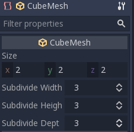
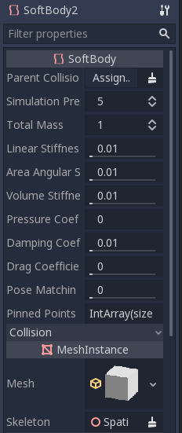
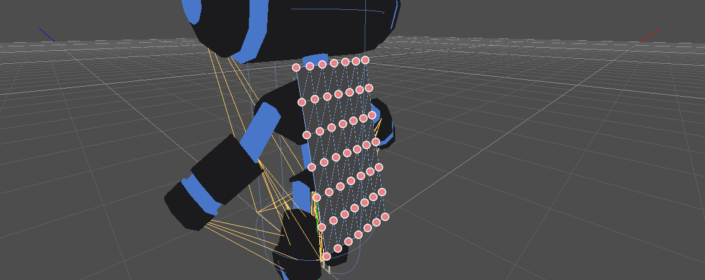
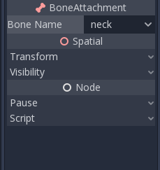
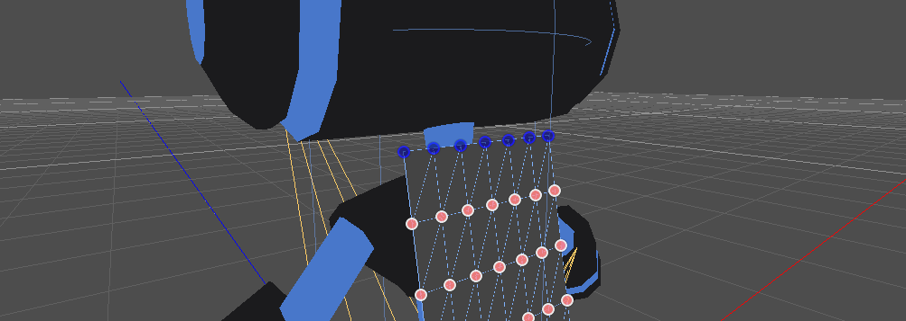
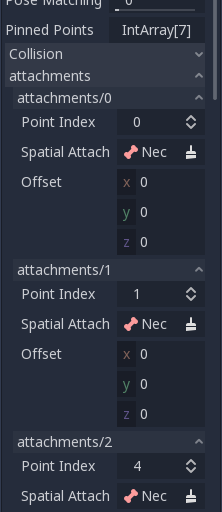
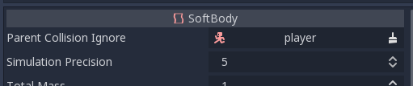
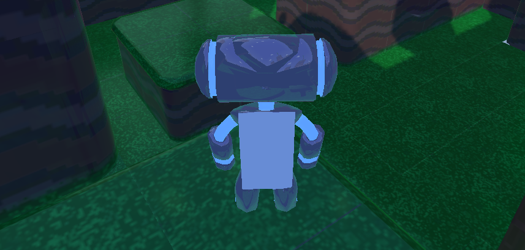

:article_outdated: True

.. _doc_soft_body:

Using SoftBody
==============

Soft bodies (or *soft-body dynamics*) simulate movement, changing shape and other physical properties of deformable objects.
This can for example be used to simulate cloth or to create more realistic characters.

Basic set-up
~~~~~~~~~~~~

A :ref:`SoftBody3D <class_SoftBody3D>` node is used for soft body simulations.

We will create a bouncy cube to demonstrate the setup of a soft body.

Create a new scene with a ``Node3D`` node as root. Then, create a ``Softbody`` node. Add a ``CubeMesh`` in the ``mesh`` property of the node in the inspector and increase the subdivision of the mesh for simulation.

Set the parameters to obtain the type of soft body you aim for. Try to keep the ``Simulation Precision`` above 5, otherwise, the soft body may collapse.

.. note:: Handle some parameters with care, as some value can lead to strange results. For example, if the shape is not completely closed and you set pressure to more than 0, the softbody will fly around like a plastic bag under strong wind.

Play the scene to view the simulation.

.. tip:: To improve the simulation's result, increase the ``Simulation Precision``, this will give significant improvement at the cost of performance.

Cloak simulation
~~~~~~~~~~~~~~~~

Let's make a cloak in the Platformer3D demo.

.. note:: You can download the Platformer3D demo on `GitHub <https://github.com/godotengine/godot-demo-projects/tree/master/3d/platformer>`_ or `the Asset Library <https://godotengine.org/asset-library/asset/125>`_.

Open the ``Player`` scene, add a ``SoftBody`` node and assign a ``PlaneMesh`` to it.

Open the ``PlaneMesh`` properties and set the size(x: 0.5 y: 1) then set ``Subdivide Width`` and ``Subdivide Depth`` to 5. Adjust the ``SoftBody``'s position. You should end up with something like this:

.. tip:: Subdivision generates a more tessellated mesh for better simulations.

Add a :ref:`BoneAttachment3D <class_BoneAttachment3D>` node under the skeleton node and select the Neck bone to attach the cloak to the character skeleton.

.. note:: ``BoneAttachment3D`` node is to attach objects to a bone of a armature. The attached object will follow the bone's movement, weapon of a character can be attached this way.

To create pinned joints, select the upper vertices in the ``SoftBody`` node:

The pinned joints can be found in ``SoftBody``'s ``Attachments`` property, choose the ``BoneAttachment`` as the ``SpatialAttachment`` for each pinned joints, the pinned joints are now attached to the neck.

Last step is to avoid clipping by adding the Kinematic Body `Player` to ``Parent Collision Ignore`` of the ``SoftBody``.

Play the scene and the cloak should simulate correctly.

This covers the basic settings of softbody, experiment with the parameters to achieve the effect you are aiming for when making your game.
