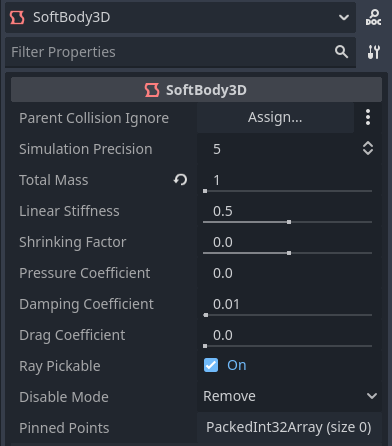
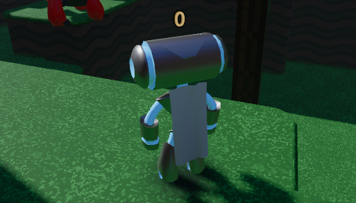

.. _doc_soft_body:

Using SoftBody3D
================

Soft bodies (or *soft-body dynamics*) simulate movement, changing shape and other
physical properties of deformable objects. For example, this can be used to simulate
cloth or to create more realistic characters.

Physics engine considerations
~~~~~~~~~~~~~~~~~~~~~~~~~~~~~

Support for soft bodies is generally more robust in Jolt Physics compared to GodotPhysics3D.
You can switch physics engines by changing **Physics > 3D > Physics Engine**
in the Project Settings. Projects created in Godot 4.6 and later use Jolt Physics
by default, but existing projects will have to be switched over manually.

Additionally, :ref:`physics interpolation <doc_physics_interpolation>` currently
does not affect soft bodies. If you want soft body simulation to look smoother at
higher framerates, you'll have to increase the **Physics > Common > Physics Ticks per Second**
project setting, which comes at a performance cost.

Basic setup
~~~~~~~~~~~

A :ref:`SoftBody3D <class_SoftBody3D>` node is used for soft body simulations.
Unlike other physics body nodes like :ref:`RigidBody3D <class_RigidBody3D>`
or :ref:`StaticBody3D <class_StaticBody3D>`, it does **not** have a
:ref:`CollisionShape3D <class_CollisionShape3D>` or a :ref:`MeshInstance3D <class_MeshInstance3D>`
child node. Instead, the collision shape is derived from the mesh assigned to the node.
This mesh is also directly used for rendering, which means you don't need to
create any child nodes for a functional, visible setup.

We will create a bouncy cube to demonstrate the setup of a soft body.

Create a new scene with a Node3D node as root. Then, create a SoftBody3D node.
Add a BoxMesh in the **Mesh** property of the node in the inspector
and increase the subdivision of the mesh for simulation.

The subdivision level determines the precision level of the deformation,
with higher values allowing for smaller and more detailed deformations,
at the cost of performance. In this example, we'll set it to 3 on each axis:

   Adjusting BoxMesh properties in the inspector

Now, set the parameters to obtain the type of soft body you aim for.
Try to keep the **Simulation Precision** above 5; otherwise,
the soft body may collapse.

   Adjusting SoftBody3D simulation properties in the inspector

.. note::

    Handle some parameters with care, as some values can lead to strange results.
    For example, if the shape is not completely closed and you set pressure
    to a value greater than ``0.0``, the soft body will fly around like a plastic bag
    under strong wind.

Run the scene to view the simulation. Here's an example of what it should look like:

.. video:: video/soft_body_box_simulation.webm
    :alt: Soft body box simulation example
    :autoplay:
    :loop:
    :muted:
    :align: default
    :width: 100%

.. tip::

    To improve the simulation's result, increase the **Simulation Precision**.
    This can give a significant improvement at the cost of performance.

    Alternatively, you can increase the **Physics > Common > Physics Ticks per Second**
    project setting, which will also affect soft body simulation quality.

Cloak simulation
~~~~~~~~~~~~~~~~

Let's make a cloak in the Platformer 3D demo.

.. note::

    You can download the Platformer 3D demo on
    `GitHub <https://github.com/godotengine/godot-demo-projects/tree/master/3d/platformer>`_
    or `the Asset Library <https://godotengine.org/asset-library/asset/2748>`_.

Open the ``player/player.tscn`` scene, add a ``SoftBody3D`` node below the root node,
then assign a PlaneMesh resource to it in its **Mesh** property.

Open the PlaneMesh's properties and set the size to ``(0.5, 1.0)``,
then set **Subdivide Width** and **Subdivide Depth** to ``5``. Adjust the
SoftBody3D node's position and rotation so that the plane appears to be close to
the character's back. You should end up with something like this:

   Subdividing the PlaneMesh and placing it on the character's back

.. tip::

    Subdivision generates a more tessellated mesh for better simulations.
    However, higher subdivision levels will impact performance. Try
    to find a balance between performance and quality. This depends on the number
    of soft body simulations that you expect to be active at a given time,
    as well as the distance between the camera and the soft body.

Add a :ref:`BoneAttachment3D <class_BoneAttachment3D>` node under the skeleton
node and select the Neck bone to attach the cloak to the character skeleton.

.. note::

    The BoneAttachment3D node is used to attach objects to a bone of an armature.
    The attached object will follow the bone's movement. For example, a character's
    held weapon can be attached this way.

    Do **not** move the SoftBody3D node under the BoneAttachment3D node as of now.
    Instead, we'll configure its *pinned points* to follow the BoneAttachment3D node.

   Configuring the BoneAttachment3D node in the inspector

To create pinned points, select the upper vertices in the SoftBody3D node. A pinned
point appears blue in the 3D editor viewport:

   Pinning the SoftBody3D's points in the inspector

The pinned joints can be found in SoftBody3D's **Attachments** section,
which is under the **Collision** section that must be expanded first.
Choose the BoneAttachment3D node as the **Spatial Attachment Path** for each
pinned joint. The pinned joints are now attached to the neck.

.. tip::

    To assign the properties faster, you can drag-and-drop the BoneAttachment3D node
    from the scene tree dock to the **Spatial Attachment Path** property field.

Note that you may have to deselect then reselect the SoftBody3D node for the
**Attachments** section to appear.

   Configuring pinned points to be attached to the BoneAttachment3D node in the SoftBody3D inspector

The last step is to avoid clipping by adding the CharacterBody3D ``Player`` (the scene's root node)
to the **Parent Collision Ignore** property of the SoftBody3D.

   Setting up the collision exception in the SoftBody3D inspector

Play the scene and the cloak should simulate correctly.

   Final result when running the project's main scene

This covers the basic settings of a soft body simulation. Experiment with the parameters
to achieve the effect you are aiming for when making your game.

.. note::

    The cloak will not appear when viewed from certain angles due to backface culling.
    To resolve this, you can disable backface culling by assigning a new StandardMaterial3D,
    then setting its cull mode to **Disabled**. This will make the material render
    both sides of the plane.

Using imported meshes
~~~~~~~~~~~~~~~~~~~~~

The **Save to File** option in the Advanced Import Settings dialog allows you
to save a mesh to a standalone resource file that you can then attach to
SoftBody3D nodes.

You may also want to disable LOD generation or change the LOD generation options
when importing a mesh for use with SoftBody3D. The default import settings
will produce an LOD that merges adjacent faces that are nearly flat with
respect to each other, even at very close render distances. This works well for
static meshes, but is often undesirable for use with SoftBody3D if you want
these faces to be able to bend and move with respect to each other, instead of
being rendered as a single plane.

See :ref:`doc_importing_3d_scenes_import_configuration` and :ref:`doc_mesh_lod`
for more details.
