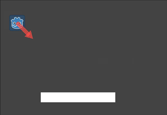
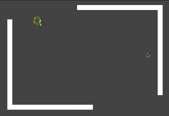
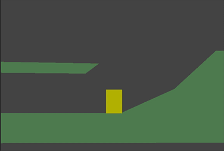

.. _doc_using_character_body_2d:

Using CharacterBody2D/3D
========================

Introduction
------------

Godot offers several collision objects to provide both collision detection
and response. Trying to decide which one to use for your project can be confusing.
You can avoid problems and simplify development if you understand how each of them
works and what their pros and cons are. In this tutorial, we'll look at the
:ref:`CharacterBody2D <class_CharacterBody2D>` node and show some examples
of how to use it.

.. note:: While this document uses ``CharacterBody2D`` in its examples, the same
          concepts apply in 3D as well.

What is a character body?
-------------------------

``CharacterBody2D`` is for implementing bodies that are controlled via code.
Character bodies detect collisions with other bodies when moving, but are not affected by
engine physics properties, like gravity or friction. While this means that you
have to write some code to create their behavior, it also means you have more
precise control over how they move and react.

.. note:: This document assumes you're familiar with Godot's various physics
          bodies. Please read :ref:`doc_physics_introduction` first, for an overview
          of the physics options.

.. tip:: A `CharacterBody2D` can be affected by gravity and other forces,
        but you must calculate the movement in code. The physics engine will
        not move a `CharacterBody2D`.

Movement and collision
----------------------

When moving a ``CharacterBody2D``, you should not set its ``position`` property
directly. Instead, you use the ``move_and_collide()`` or ``move_and_slide()`` methods.
These methods move the body along a given vector and detect collisions.

.. warning:: You should handle physics body movement in the ``_physics_process()`` callback.

The two movement methods serve different purposes, and later in this tutorial, you'll
see examples of how they work.

move_and_collide
~~~~~~~~~~~~~~~~

This method takes one required parameter: a :ref:`Vector2 <class_Vector2>` indicating
the body's relative movement. Typically, this is your velocity vector multiplied by the
frame timestep (``delta``). If the engine detects a collision anywhere along
this vector, the body will immediately stop moving. If this happens, the
method will return a :ref:`KinematicCollision2D <class_KinematicCollision2D>` object.

``KinematicCollision2D`` is an object containing data about the collision
and the colliding object. Using this data, you can calculate your collision
response.

``move_and_collide`` is most useful when you just want to move the body and
detect collision, but don't need any automatic collision response. For example,
if you need a bullet that ricochets off a wall, you can directly change the angle
of the velocity when you detect a collision. See below for an example.

move_and_slide
~~~~~~~~~~~~~~

The ``move_and_slide()`` method is intended to simplify the collision
response in the common case where you want one body to slide along the other.
It is especially useful in platformers or top-down games, for example.

When calling ``move_and_slide()``, the function uses a number of node properties
to calculate its slide behavior. These properties can be found in the Inspector,
or set in code.

- ``velocity`` - *default value:* ``Vector2( 0, 0 )``

    This property represents the body's velocity vector in pixels per second.
    ``move_and_slide()`` will modify this value automatically when colliding.

- ``motion_mode`` - *default value:* ``MOTION_MODE_GROUNDED``

    This property is typically used to distinguish between side-scrolling and
    top-down movement. When using the default value, you can use the ``is_on_floor()``,
    ``is_on_wall()``, and ``is_on_ceiling()`` methods to detect what type of
    surface the body is in contact with, and the body will interact with slopes.
    When using ``MOTION_MODE_FLOATING``, all collisions will be considered "walls".

- ``up_direction`` - *default value:* ``Vector2( 0, -1 )``

    This property allows you to define what surfaces the engine should consider
    being the floor. Its value lets you use the ``is_on_floor()``, ``is_on_wall()``,
    and ``is_on_ceiling()`` methods to detect what type of surface the body is
    in contact with. The default value means that the top side of horizontal surfaces
    will be considered "ground".

- ``floor_stop_on_slope`` - *default value:* ``true``

    This parameter prevents a body from sliding down slopes when standing still.

- ``wall_min_slide_angle`` - *default value:* ``0.261799`` (in radians, equivalent to ``15`` degrees)

    This is the minimum angle where the body is allowed to slide when it hits a
    slope.

- ``floor_max_angle`` - *default value:* ``0.785398`` (in radians, equivalent to ``45`` degrees)

    This parameter is the maximum angle before a surface is no longer considered a "floor."

There are many other properties that can be used to modify the body's behavior under
specific circumstances. See the :ref:`CharacterBody2D <class_CharacterBody2D>` docs
for full details.

Detecting collisions
--------------------

When using ``move_and_collide()`` the function returns a ``KinematicCollision2D``
directly, and you can use this in your code.

When using ``move_and_slide()`` it's possible to have multiple collisions occur,
as the slide response is calculated. To process these collisions, use ``get_slide_collision_count()``
and ``get_slide_collision()``:

.. tabs::
 .. code-tab:: gdscript GDScript

    # Using move_and_collide.
    var collision = move_and_collide(velocity * delta)
    if collision:
        print("I collided with ", collision.get_collider().name)

    # Using move_and_slide.
    move_and_slide()
    for i in get_slide_collision_count():
        var collision = get_slide_collision(i)
        print("I collided with ", collision.get_collider().name)

 .. code-tab:: csharp

    // Using MoveAndCollide.
    var collision = MoveAndCollide(Velocity * (float)delta);
    if (collision != null)
    {
        GD.Print("I collided with ", ((Node)collision.GetCollider()).Name);
    }

    // Using MoveAndSlide.
    MoveAndSlide();
    for (int i = 0; i < GetSlideCollisionCount(); i++)
    {
        var collision = GetSlideCollision(i);
        GD.Print("I collided with ", ((Node)collision.GetCollider()).Name);
    }

.. note:: `get_slide_collision_count()` only counts times the body has collided and changed direction.

See :ref:`KinematicCollision2D <class_KinematicCollision2D>` for details on what
collision data is returned.

Which movement method to use?
-----------------------------

A common question from new Godot users is: "How do you decide which movement
function to use?" Often, the response is to use ``move_and_slide()`` because
it seems simpler, but this is not necessarily the case. One way to think of it
is that ``move_and_slide()`` is a special case, and ``move_and_collide()``
is more general. For example, the following two code snippets result in
the same collision response:

.. tabs::
 .. code-tab:: gdscript GDScript

    # using move_and_collide
    var collision = move_and_collide(velocity * delta)
    if collision:
        velocity = velocity.slide(collision.get_normal())

    # using move_and_slide
    move_and_slide()

 .. code-tab:: csharp

    // using MoveAndCollide
    var collision = MoveAndCollide(Velocity * (float)delta);
    if (collision != null)
    {
        Velocity = Velocity.Slide(collision.GetNormal());
    }

    // using MoveAndSlide
    MoveAndSlide();

Anything you do with ``move_and_slide()`` can also be done with ``move_and_collide()``,
but it might take a little more code. However, as we'll see in the examples below,
there are cases where ``move_and_slide()`` doesn't provide the response you want.

In the example above, ``move_and_slide()`` automatically alters the ``velocity``
variable. This is because when the character collides with the environment,
the function recalculates the speed internally to reflect
the slowdown.

For example, if your character fell on the floor, you don't want it to
accumulate vertical speed due to the effect of gravity. Instead, you want its
vertical speed to reset to zero.

``move_and_slide()`` may also recalculate the kinematic body's velocity several
times in a loop as, to produce a smooth motion, it moves the character and
collides up to five times by default. At the end of the process, the character's
new velocity is available for use on the next frame.

Examples
--------

To see these examples in action, download the sample project:
`character_body_2d_starter.zip <https://github.com/godotengine/godot-docs-project-starters/releases/download/latest-4.x/character_body_2d_starter.zip>`_

Movement and walls
~~~~~~~~~~~~~~~~~~

If you've downloaded the sample project, this example is in "basic_movement.tscn".

For this example, add a ``CharacterBody2D`` with two children: a ``Sprite2D`` and a
``CollisionShape2D``. Use the Godot "icon.svg" as the Sprite2D's texture (drag it
from the Filesystem dock to the *Texture* property of the ``Sprite2D``). In the
``CollisionShape2D``'s *Shape* property, select "New RectangleShape2D" and
size the rectangle to fit over the sprite image.

.. note:: See :ref:`doc_2d_movement` for examples of implementing 2D movement schemes.

Attach a script to the CharacterBody2D and add the following code:

.. tabs::
 .. code-tab:: gdscript GDScript

    extends CharacterBody2D

    var speed = 300

    func get_input():
        var input_dir = Input.get_vector("ui_left", "ui_right", "ui_up", "ui_down")
        velocity = input_dir * speed

    func _physics_process(delta):
        get_input()
        move_and_collide(velocity * delta)

 .. code-tab:: csharp

    using Godot;

    public partial class MyCharacterBody2D : CharacterBody2D
    {
        private int _speed = 300;

        public void GetInput()
        {
            Vector2 inputDir = Input.GetVector("ui_left", "ui_right", "ui_up", "ui_down");
            Velocity = inputDir * _speed;
        }

        public override void _PhysicsProcess(double delta)
        {
            GetInput();
            MoveAndCollide(Velocity * (float)delta);
        }
    }

Run this scene and you'll see that ``move_and_collide()`` works as expected, moving
the body along the velocity vector. Now let's see what happens when you add
some obstacles. Add a :ref:`StaticBody2D <class_StaticBody2D>` with a
rectangular collision shape. For visibility, you can use a Sprite2D, a
Polygon2D, or turn on "Visible Collision Shapes" from the "Debug" menu.

Run the scene again and try moving into the obstacle. You'll see that the ``CharacterBody2D``
can't penetrate the obstacle. However, try moving into the obstacle at an angle and
you'll find that the obstacle acts like glue - it feels like the body gets stuck.

This happens because there is no *collision response*. ``move_and_collide()`` stops
the body's movement when a collision occurs. We need to code whatever response we
want from the collision.

Try changing the function to ``move_and_slide()`` and running again.

``move_and_slide()`` provides a default collision response of sliding the body along the
collision object. This is useful for a great many game types, and may be all you need
to get the behavior you want.

Bouncing/reflecting
~~~~~~~~~~~~~~~~~~~

What if you don't want a sliding collision response? For this example ("bounce_and_collide.tscn"
in the sample project), we have a character shooting bullets and we want the bullets to
bounce off the walls.

This example uses three scenes. The main scene contains the Player and Walls.
The Bullet and Wall are separate scenes so that they can be instanced.

The Player is controlled by the ``w`` and ``s`` keys for forward and back. Aiming
uses the mouse pointer. Here is the code for the Player, using ``move_and_slide()``:

.. tabs::
 .. code-tab:: gdscript GDScript

    extends CharacterBody2D

    var Bullet = preload("res://bullet.tscn")
    var speed = 200

    func get_input():
        # Add these actions in Project Settings -> Input Map.
        var input_dir = Input.get_axis("backward", "forward")
        velocity = transform.x * input_dir * speed
        if Input.is_action_just_pressed("shoot"):
            shoot()

    func shoot():
        # "Muzzle" is a Marker2D placed at the barrel of the gun.
        var b = Bullet.instantiate()
        b.start($Muzzle.global_position, rotation)
        get_tree().root.add_child(b)

    func _physics_process(delta):
        get_input()
        var dir = get_global_mouse_position() - global_position
        # Don't move if too close to the mouse pointer.
        if dir.length() > 5:
            rotation = dir.angle()
            move_and_slide()

 .. code-tab:: csharp

    using Godot;

    public partial class MyCharacterBody2D : CharacterBody2D
    {
        private PackedScene _bullet = GD.Load<PackedScene>("res://Bullet.tscn");
        private int _speed = 200;

        public void GetInput()
        {
            // Add these actions in Project Settings -> Input Map.
            float inputDir = Input.GetAxis("backward", "forward");
            Velocity = Transform.X * inputDir * _speed;
            if (Input.IsActionPressed("shoot"))
            {
                Shoot();
            }
        }

        public void Shoot()
        {
            // "Muzzle" is a Marker2D placed at the barrel of the gun.
            var b = (Bullet)_bullet.Instantiate();
            b.Start(GetNode<Node2D>("Muzzle").GlobalPosition, Rotation);
            GetTree().Root.AddChild(b);
        }

        public override void _PhysicsProcess(double delta)
        {
            GetInput();
            var dir = GetGlobalMousePosition() - GlobalPosition;
            // Don't move if too close to the mouse pointer.
            if (dir.Length() > 5)
            {
                Rotation = dir.Angle();
                MoveAndSlide();
            }
        }
    }

And the code for the Bullet:

.. tabs::
 .. code-tab:: gdscript GDScript

    extends CharacterBody2D

    var speed = 750

    func start(_position, _direction):
        rotation = _direction
        position = _position
        velocity = Vector2(speed, 0).rotated(rotation)

    func _physics_process(delta):
        var collision = move_and_collide(velocity * delta)
        if collision:
            velocity = velocity.bounce(collision.get_normal())
            if collision.get_collider().has_method("hit"):
                collision.get_collider().hit()

    func _on_VisibilityNotifier2D_screen_exited():
        # Deletes the bullet when it exits the screen.
        queue_free()

 .. code-tab:: csharp

    using Godot;

    public partial class Bullet : CharacterBody2D
    {
        public int _speed = 750;

        public void Start(Vector2 position, float direction)
        {
            Rotation = direction;
            Position = position;
            Velocity = new Vector2(speed, 0).Rotated(Rotation);
        }

        public override void _PhysicsProcess(double delta)
        {
            var collision = MoveAndCollide(Velocity * (float)delta);
            if (collision != null)
            {
                Velocity = Velocity.Bounce(collision.GetNormal());
                if (collision.GetCollider().HasMethod("Hit"))
                {
                    collision.GetCollider().Call("Hit");
                }
            }
        }

        private void OnVisibilityNotifier2DScreenExited()
        {
            // Deletes the bullet when it exits the screen.
            QueueFree();
        }
    }

The action happens in ``_physics_process()``. After using ``move_and_collide()``, if a
collision occurs, a ``KinematicCollision2D`` object is returned (otherwise, the return
is ``null``).

If there is a returned collision, we use the ``normal`` of the collision to reflect
the bullet's ``velocity`` with the ``Vector2.bounce()`` method.

If the colliding object (``collider``) has a ``hit`` method,
we also call it. In the example project, we've added a flashing color effect to
the Wall to demonstrate this.

Platformer movement
~~~~~~~~~~~~~~~~~~~

Let's try one more popular example: the 2D platformer. ``move_and_slide()``
is ideal for quickly getting a functional character controller up and running.
If you've downloaded the sample project, you can find this in "platformer.tscn".

For this example, we'll assume you have a level made of one or more ``StaticBody2D``
objects. They can be any shape and size. In the sample project, we're using
:ref:`Polygon2D <class_Polygon2D>` to create the platform shapes.

Here's the code for the player body:

.. tabs::
 .. code-tab:: gdscript GDScript

    extends CharacterBody2D

    var speed = 300.0
    var jump_speed = -400.0

    # Get the gravity from the project settings so you can sync with rigid body nodes.
    var gravity = ProjectSettings.get_setting("physics/2d/default_gravity")

    func _physics_process(delta):
        # Add the gravity.
        velocity.y += gravity * delta

        # Handle Jump.
        if Input.is_action_just_pressed("jump") and is_on_floor():
            velocity.y = jump_speed

        # Get the input direction.
        var direction = Input.get_axis("ui_left", "ui_right")
        velocity.x = direction * speed

        move_and_slide()

 .. code-tab:: csharp

    using Godot;

    public partial class MyCharacterBody2D : CharacterBody2D
    {
        private float _speed = 100.0f;
        private float _jumpSpeed = -400.0f;

        // Get the gravity from the project settings so you can sync with rigid body nodes.
        public float Gravity = ProjectSettings.GetSetting("physics/2d/default_gravity").AsSingle();

        public override void _PhysicsProcess(double delta)
        {
            Vector2 velocity = Velocity;

            // Add the gravity.
            velocity.Y += Gravity * (float)delta;

            // Handle jump.
            if (Input.IsActionJustPressed("jump") && IsOnFloor())
            {
                velocity.Y = _jumpSpeed;
            }

            // Get the input direction.
            float direction = Input.GetAxis("ui_left", "ui_right");
            velocity.X = direction * _speed;

            Velocity = velocity;
            MoveAndSlide();
        }
    }

In this code we're using ``move_and_slide()`` as described above - to move the body
along its velocity vector, sliding along any collision surfaces such as the ground
or a platform. We're also using ``is_on_floor()`` to check if a jump should be
allowed. Without this, you'd be able to "jump" in midair; great if you're making
Flappy Bird, but not for a platformer game.

There is a lot more that goes into a complete platformer character: acceleration,
double-jumps, coyote-time, and many more. The code above is just a starting point.
You can use it as a base to expand into whatever movement behavior you need for
your own projects.
