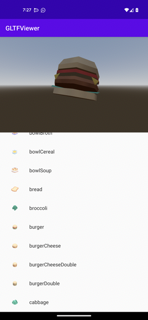

.. _doc_android_library:

Godot Android library
=====================

The Godot Engine for Android platforms is designed to be used as an `Android library <https://developer.android.com/studio/projects/android-library>`_.
This architecture enables several key features on Android platforms:

- Ability to integrate the Gradle build system within the Godot Editor, which provides the ability to leverage more components from the Android ecosystem such as libraries and tools

- Ability to make the engine portable and embeddable:

  - Key in enabling the port of the Godot Editor to Android and mobile XR devices
  - Key in allowing the integration and reuse of Godot's capabilities within existing codebase

Below we describe some of the use-cases and scenarios this architecture enables.

Using the Godot Android library
-------------------------------

The Godot Android library is packaged as an AAR archive file and hosted on `MavenCentral <https://central.sonatype.com/artifact/org.godotengine/godot>`_ along with `its documentation <https://javadoc.io/doc/org.godotengine/godot/latest/index.html>`_.

It provides access to Godot APIs and capabilities on Android platforms for the following non-exhaustive use-cases.

Godot Android plugins
---------------------

Android plugins are powerful tools to extend the capabilities of the Godot Engine
by tapping into the functionality provided by Android platforms and ecosystem.

An Android plugin is an Android library with a dependency on the Godot Android library
which the plugin uses to integrate into the engine's lifecycle and to access Godot APIs,
granting it powerful capabilities such as GDExtension support which allows to update / mod the engine behavior as needed.

For more information, see :ref:`Godot Android plugins <doc_android_plugin>`.

Embedding Godot in existing Android projects
--------------------------------------------

The Godot Engine can be embedded within existing Android applications or libraries,
allowing developers to leverage mature and battle-tested code and libraries better suited to a specific task.

The hosting component is responsible for driving the engine lifecycle via Godot's Android APIs.
These APIs can also be used to provide bidirectional communication between the host and the embedded
Godot instance allowing for greater control over the desired experience.

We showcase how this is done using a sample Android app that embeds the Godot Engine as an Android view,
and uses it to render 3D GLTF models.

The `GLTF Viewer <https://github.com/m4gr3d/Godot-Android-Samples/tree/master/apps/gltf_viewer>`_ sample app uses an `Android RecyclerView component <https://developer.android.com/develop/ui/views/layout/recyclerview>`_ to create
a list of GLTF items, populated from `Kenney's Food Kit pack <https://kenney.nl/assets/food-kit>`_.
When an item on the list is selected, the app's logic interacts with the embedded Godot Engine to render the selected GLTF item as a 3D model.

The sample app source code can be found `on GitHub <https://github.com/m4gr3d/Godot-Android-Samples/tree/master/apps/gltf_viewer>`_.
Follow the instructions on `its README <https://github.com/m4gr3d/Godot-Android-Samples/blob/master/apps/gltf_viewer/README.md>`_ to build and install it.

Below we break-down the steps used to create the GLTF Viewer app.

.. warning::

  Currently only a single instance of the Godot Engine is supported per process.
  You can configure the process the Android Activity runs under using the `android:process attribute <https://developer.android.com/guide/topics/manifest/activity-element#proc>`_.

.. warning::

  Automatic resizing / orientation configuration events are not supported and may cause a crash.
  You can disable those events:

  - By locking to a specific orientation using the `android:screenOrientation attribute <https://developer.android.com/guide/topics/manifest/activity-element#screen>`_.
  - By declaring that the Activity will handle these configuration events using the `android:configChanges attribute <https://developer.android.com/guide/topics/manifest/activity-element#config>`_.

1. Create the Android app
^^^^^^^^^^^^^^^^^^^^^^^^^

.. note::

  The Android sample app was created using `Android Studio <https://developer.android.com/studio>`_
  and using `Gradle <https://developer.android.com/build>`_ as the build system.

  The Android ecosystem provides multiple tools, IDEs, build systems for creating Android apps
  so feel free to use what you're familiar with, and update the steps below accordingly (contributions to this documentation are welcomed as well!).

- Set up an Android application project. It may be a brand new empty project, or an existing project
- Add the `maven dependency for the Godot Android library <https://central.sonatype.com/artifact/org.godotengine/godot>`_

  - If using ``gradle``, add the following to the ``dependency`` section of the app's gradle build file. Make sure to update ``<version>`` to the latest version of the Godot Android library:

  .. code-block:: kotlin

    implementation("org.godotengine:godot:<version>")

- If using ``gradle``, include the following ``aaptOptions`` configuration under the ``android > defaultConfig`` section of the app's gradle build file. Doing so allows ``gradle`` to include Godot's hidden directories when building the app binary.

  - If your build system does not support including hidden directories, you can `configure the Godot project to not use hidden directories <https://docs.godotengine.org/en/stable/classes/class_projectsettings.html#class-projectsettings-property-application-config-use-hidden-project-data-directory>`_ by deselecting ``Project Settings... > Application > Config > Use Hidden Project Data Directory``.

.. code-block:: groovy

  android {

    defaultConfig {
        // The default ignore pattern for the 'assets' directory includes hidden files and
        // directories which are used by Godot projects, so we override it with the following.
        aaptOptions {
            ignoreAssetsPattern "!.svn:!.git:!.gitignore:!.ds_store:!*.scc:<dir>_*:!CVS:!thumbs.db:!picasa.ini:!*~"
        }
      ...

- Create / update the application's Activity that will be hosting the Godot Engine instance. For the sample app, this is `MainActivity <https://github.com/m4gr3d/Godot-Android-Samples/blob/master/apps/gltf_viewer/src/main/java/fhuyakou/godot/app/android/gltfviewer/MainActivity.kt>`_

  - The host Activity should implement the `GodotHost interface <https://github.com/godotengine/godot/blob/master/platform/android/java/lib/src/org/godotengine/godot/GodotHost.java>`_
  - The sample app uses `Fragments <https://developer.android.com/guide/fragments>`_ to organize its UI, so it uses `GodotFragment <https://github.com/godotengine/godot/blob/master/platform/android/java/lib/src/org/godotengine/godot/GodotFragment.java>`_, a fragment component provided by the Godot Android library to automatically host and manage the Godot Engine instance.

  .. code-block:: kotlin

    private var godotFragment: GodotFragment? = null

    override fun onCreate(savedInstanceState: Bundle?) {
        super.onCreate(savedInstanceState)

        setContentView(R.layout.activity_main)

        val currentGodotFragment = supportFragmentManager.findFragmentById(R.id.godot_fragment_container)
        if (currentGodotFragment is GodotFragment) {
            godotFragment = currentGodotFragment
        } else {
            godotFragment = GodotFragment()
            supportFragmentManager.beginTransaction()
                .replace(R.id.godot_fragment_container, godotFragment!!)
                .commitNowAllowingStateLoss()
        }

        ...

.. note::

  The Godot Android library also provide `GodotActivity <https://github.com/godotengine/godot/blob/master/platform/android/java/lib/src/org/godotengine/godot/GodotActivity.kt>`_, an Activity component that can be extended to automatically host and manage the Godot Engine instance.

  Alternatively, applications can directly create a `Godot <https://github.com/godotengine/godot/blob/master/platform/android/java/lib/src/org/godotengine/godot/Godot.kt>`_ instance, host and manage it themselves.

- Using `GodotHost#getHostPlugins(...) <https://github.com/m4gr3d/Godot-Android-Samples/blob/0e3440f357f8be5b4c63a4fe75766793199a99d0/apps/gltf_viewer/src/main/java/fhuyakou/godot/app/android/gltfviewer/MainActivity.kt#L55>`_, the sample app creates a `runtime GodotPlugin instance <https://github.com/m4gr3d/Godot-Android-Samples/blob/master/apps/gltf_viewer/src/main/java/fhuyakou/godot/app/android/gltfviewer/AppPlugin.kt>`_ that's used to send :ref:`signals <doc_signals>` to the ``gdscript`` logic

  - The runtime ``GodotPlugin`` can also be used by ``gdscript`` logic to access JVM methods. For more information, see :ref:`Godot Android plugins <doc_android_plugin>`.

- Add any additional logic that will be used by your application

  - For the sample app, this includes adding the `ItemsSelectionFragment fragment <https://github.com/m4gr3d/Godot-Android-Samples/blob/master/apps/gltf_viewer/src/main/java/fhuyakou/godot/app/android/gltfviewer/ItemsSelectionFragment.kt>`_ (and related classes), a fragment used to build and show the list of GLTF items

- Open the ``AndroidManifest.xml`` file, and configure the orientation if needed using the `android:screenOrientation attribute <https://developer.android.com/guide/topics/manifest/activity-element#screen>`_

  - If needed, disable automatic resizing / orientation configuration changes using the `android:configChanges attribute <https://developer.android.com/guide/topics/manifest/activity-element#config>`_

.. code-block:: xml

  <activity android:name=".MainActivity"
      android:screenOrientation="fullUser"
      android:configChanges="orientation|screenSize|smallestScreenSize|screenLayout"
      android:exported="true">

      ...
  </activity>

2. Create the Godot project
^^^^^^^^^^^^^^^^^^^^^^^^^^^

.. note::

  On Android, Godot's project files are exported to the ``assets`` directory of the generated ``apk`` binary.

  We leverage that architecture to bind our Android app and Godot project together by creating the Godot project in the Android app's ``assets`` directory.

  Note that it's also possible to create the Godot project in a separate directory and export it as a `PCK or ZIP file <https://docs.godotengine.org/en/stable/tutorials/export/exporting_projects.html#pck-versus-zip-pack-file-formats>`_
  to the Android app's ``assets`` directory.
  Using this approach requires passing the ``--main-pack <pck_or_zip_filepath_relative_to_assets_dir>`` argument to the hosted Godot Engine instance using `GodotHost#getCommandLine() <https://github.com/godotengine/godot/blob/6916349697a4339216469e9bf5899b983d78db07/platform/android/java/lib/src/org/godotengine/godot/GodotHost.java#L45>`_.

  The instructions below and the sample app follow the first approach of creating the Godot project in the Android app's ``assets`` directory.

- As mentioned in the **note** above, open the Godot Editor and create a Godot project directly (no subfolder) in the ``assets`` directory of the Android application project

  - See the sample app's `Godot project <https://github.com/m4gr3d/Godot-Android-Samples/tree/master/apps/gltf_viewer/src/main/assets>`_ for reference

- Configure the Godot project as desired

  - Make sure the `orientation <https://docs.godotengine.org/en/stable/classes/class_projectsettings.html#class-projectsettings-property-display-window-handheld-orientation>`_ set for the Godot project matches the one set in the Android app's manifest
  - For Android, make sure `textures/vram_compression/import_etc2_astc <https://docs.godotengine.org/en/stable/classes/class_projectsettings.html#class-projectsettings-property-rendering-textures-vram-compression-import-etc2-astc>`_ is set to `true`

- Update the Godot project script logic as needed

  - For the sample app, the `script logic <https://github.com/m4gr3d/Godot-Android-Samples/blob/master/apps/gltf_viewer/src/main/assets/main.gd>`_ queries for the runtime ``GodotPlugin`` instance and uses it to register for signals fired by the app logic
  - The app logic fires a signal every time an item is selected in the list. The signal contains the filepath of the GLTF model, which is used by the ``gdscript`` logic to render the model.

  .. code-block:: gdscript

    extends Node3D

    # Reference to the gltf model that's currently being shown.
    var current_gltf_node: Node3D = null

    func _ready():
      # Default asset to load when the app starts
      _load_gltf("res://gltfs/food_kit/turkey.glb")

      var appPlugin = Engine.get_singleton("AppPlugin")
      if appPlugin:
        print("App plugin is available")

        # Signal fired from the app logic to update the gltf model being shown
        appPlugin.connect("show_gltf", _load_gltf)
      else:
        print("App plugin is not available")

    # Load the gltf model specified by the given path
    func _load_gltf(gltf_path: String):
      if current_gltf_node != null:
        remove_child(current_gltf_node)

      current_gltf_node = load(gltf_path).instantiate()

      add_child(current_gltf_node)

3. Build and run the app
^^^^^^^^^^^^^^^^^^^^^^^^

Once you complete configuration of your Godot project, build and run the Android app.
If set up correctly, the host Activity will initialize the embedded Godot Engine on startup.
The Godot Engine will check the ``assets`` directory for project files to load (unless configured to look for a ``main pack``), and will proceed to run the project.

While the app is running on device, you can check `Android logcat <https://developer.android.com/studio/debug/logcat>`_ to investigate any errors or crashes.

For reference, check the `build and install instructions <https://github.com/m4gr3d/Godot-Android-Samples/blob/master/apps/gltf_viewer/README.md>`_ for the GLTF Viewer sample app.
