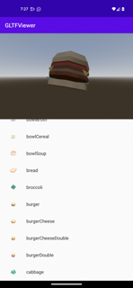

.. _doc_embedding_in_android_projects:

Embedding Godot in Android projects
===================================

The Godot Engine can be embedded within Android applications or libraries,
allowing developers to augment their projects with the full capabilities of the engine.

The component hosting the embedded engine is responsible for driving the engine lifecycle via its Android APIs.
These APIs can also be used to provide bidirectional communication between the host and the embedded
Godot instance allowing for greater control over the desired experience.

We showcase how this is done using a sample Android app that embeds the Godot Engine as an Android view,
and uses it to render 3D glTF models.

The `GLTF Viewer <https://github.com/m4gr3d/Godot-Android-Samples/tree/master/apps/gltf_viewer>`_ sample app
uses an `Android RecyclerView component <https://developer.android.com/develop/ui/views/layout/recyclerview>`_ to create
a list of glTF items, populated from `Kenney's Food Kit pack <https://kenney.nl/assets/food-kit>`_.
When an item on the list is selected, the app's logic interacts with the embedded Godot Engine to render
the selected glTF item as a 3D model.

The sample app source code can be found `on GitHub <https://github.com/m4gr3d/Godot-Android-Samples/tree/master/apps/gltf_viewer>`_.
Follow the instructions in `its README <https://github.com/m4gr3d/Godot-Android-Samples/blob/master/apps/gltf_viewer/README.md>`_ to build and install it.

Below we break down the steps used to create the GLTF Viewer app.

.. warning::

  Only a single instance of the Godot Engine is supported per Android process.
  You can configure the process the Android Activity runs under using the `android:process attribute <https://developer.android.com/guide/topics/manifest/activity-element#proc>`_.

.. warning::

  Automatic resizing / orientation configuration events are not supported and may cause a crash.
  You can disable those events:

  - By locking to a specific orientation using the `android:screenOrientation attribute <https://developer.android.com/guide/topics/manifest/activity-element#screen>`_.
  - By declaring that the Activity will handle these configuration events using the `android:configChanges attribute <https://developer.android.com/guide/topics/manifest/activity-element#config>`_.

1. Initial setup of the Android app
-----------------------------------

.. note::

  The Android sample app was created using `Android Studio <https://developer.android.com/studio>`_
  and using `Gradle <https://developer.android.com/build>`_ as the build system.

  The Android ecosystem provides multiple tools, IDEs, and build systems for creating Android apps
  so feel free to use what you're familiar with, and update the steps below accordingly.

- Set up an Android application project. It may be a brand new empty project, or an existing project
- Add the `maven dependency for the Godot Android library <https://central.sonatype.com/artifact/org.godotengine/godot>`_

  - If using ``gradle``, add the following to the ``dependency`` section of the app's gradle build file. Make sure to update ``<version>`` to the latest version of the Godot Android library:

  .. code-block:: groovy

    implementation("org.godotengine:godot:<version>")

- If using ``gradle``, include the following ``aaptOptions`` configuration under the ``android > defaultConfig`` section of the app's gradle build file. Doing so allows ``gradle`` to include Godot's hidden directories when building the app binary.

  - If your build system does not support hidden directories, you can
    configure the Godot project to not use hidden directories by deselecting
    :ref:`Application > Config > Use Hidden Project Data Directory <class_ProjectSettings_property_application/config/use_hidden_project_data_directory>`
    in the Project Settings.

.. code-block:: groovy

  android {

    defaultConfig {
        // The default ignore pattern for the 'assets' directory includes hidden files and
        // directories which are used by Godot projects, so we override it with the following.
        aaptOptions {
            ignoreAssetsPattern "!.svn:!.git:!.gitignore:!.ds_store:!*.scc:<dir>_*:!CVS:!thumbs.db:!picasa.ini:!*~"
        }
      ...

- Create / update the application's Activity that will be hosting the Godot Engine instance. For the sample app, this is `MainActivity <https://github.com/m4gr3d/Godot-Android-Samples/blob/master/apps/gltf_viewer/src/main/java/fhuyakou/godot/app/android/gltfviewer/MainActivity.kt>`_

  - The host Activity should implement the `GodotHost interface <https://javadoc.io/doc/org.godotengine/godot/latest/org/godotengine/godot/GodotHost.html>`_
  - The sample app uses `Fragments <https://developer.android.com/guide/fragments>`_ to organize its UI, so it leverages `GodotFragment <https://javadoc.io/doc/org.godotengine/godot/latest/org/godotengine/godot/GodotFragment.html>`_, a fragment component provided by the Godot Android library, to automatically host and manage the Godot Engine instance.

  .. code-block:: kotlin

    private var godotFragment: GodotFragment? = null

    override fun onCreate(savedInstanceState: Bundle?) {
        super.onCreate(savedInstanceState)

        setContentView(R.layout.activity_main)

        val currentGodotFragment = supportFragmentManager.findFragmentById(R.id.godot_fragment_container)
        if (currentGodotFragment is GodotFragment) {
            godotFragment = currentGodotFragment
        } else {
            godotFragment = GodotFragment()
            supportFragmentManager.beginTransaction()
                .replace(R.id.godot_fragment_container, godotFragment!!)
                .commitNowAllowingStateLoss()
        }

        ...

.. note::

  The Godot Android library provides `GodotActivity <https://javadoc.io/doc/org.godotengine/godot/latest/org/godotengine/godot/GodotActivity.html>`_, an abstract Activity component that can be extended to automatically host and manage the Godot Engine instance.

  And the embedded Godot project provides `GodotApp <https://github.com/godotengine/godot/blob/master/platform/android/java/app/dataLib/src/main/java/com/godot/game/GodotApp.java>`_,
  an implementation of ``GodotActivity`` that can be used as a ready standalone Activity
  to launch and manage the embedded Godot project in its own separate Activity.

  Alternatively, applications can directly create a `Godot <https://javadoc.io/doc/org.godotengine/godot/latest/org/godotengine/godot/Godot.html>`_ instance, host, and manage it themselves.

- Using `GodotHost#getHostPlugins(...) <https://github.com/m4gr3d/Godot-Android-Samples/blob/master/apps/gltf_viewer/src/main/java/fhuyakou/godot/app/android/gltfviewer/MainActivity.kt#L55>`_, the sample app creates a `runtime GodotPlugin instance <https://github.com/m4gr3d/Godot-Android-Samples/blob/master/apps/gltf_viewer/src/main/java/fhuyakou/godot/app/android/gltfviewer/AppPlugin.kt>`_ that's used to send :ref:`signals <doc_signals>` to the embedded Godot project scripts.

  - The runtime ``GodotPlugin`` can also be used by the embedded Godot project scripts to access methods from the host Android project. For more information, see :ref:`Godot Android plugins <doc_android_plugin>`.

- Add any additional logic that will be used by your application

  - For the sample app, this includes adding the `ItemsSelectionFragment fragment <https://github.com/m4gr3d/Godot-Android-Samples/blob/master/apps/gltf_viewer/src/main/java/fhuyakou/godot/app/android/gltfviewer/ItemsSelectionFragment.kt>`_ (and related classes), a fragment used to build and show the list of glTF items

- Open the ``AndroidManifest.xml`` file, and configure the orientation if needed using the `android:screenOrientation attribute <https://developer.android.com/guide/topics/manifest/activity-element#screen>`_

  - If needed, disable automatic resizing / orientation configuration changes using the `android:configChanges attribute <https://developer.android.com/guide/topics/manifest/activity-element#config>`_

.. code-block:: xml

  <activity android:name=".MainActivity"
      android:screenOrientation="fullUser"
      android:configChanges="orientation|screenSize|smallestScreenSize|screenLayout"
      android:exported="true">

      ...
  </activity>

2. Create and set up the Godot project
--------------------------------------

- In your Android project root directory, create a ``godot`` directory

- Open the Godot Editor and create a Godot project in the ``godot`` directory we just created above

  - See the sample app's `Godot project <https://github.com/m4gr3d/Godot-Android-Samples/tree/master/apps/gltf_viewer/godot>`_ for reference

- Configure the project settings:

  - Update the Godot project's :ref:`orientation <class_ProjectSettings_property_display/window/handheld/orientation>` to match the one set in the Android project's manifest
  - Set :ref:`textures/vram_compression/import_etc2_astc <class_ProjectSettings_property_rendering/textures/vram_compression/import_etc2_astc>` to ``true``

- Configure the project Android export preset:

  - Within the Godot Editor export window, create a new Android export preset
  - Enable ``Gradle Build > Use Gradle Build`` in the Android export preset
  - Set the ``Gradle Build > Export Format`` to ``Export AAR``
  - Set the ``Export Path`` for the generated ``AAR`` to a location accessible by the Android project. The exported project ``AAR`` binaries will be used as a build dependency for the Android project.
  - Update the ``Architectures`` options to match the architectures supported by the Android project
  - For this sample, we are not planning to use the ``GodotApp`` Android Activity provided by the Godot project, so we disable ``Package > Show in App Library``
  - Configure any other export options that makes sense for your project, then close the export window

- Update the Godot project script as needed

  - For the sample app, the `script logic <https://github.com/m4gr3d/Godot-Android-Samples/blob/master/apps/gltf_viewer/godot/main.gd>`_ queries for the registered ``GodotPlugin`` instance, and uses it to connect to signals fired by the app logic
  - The app logic emits a signal every time an item is selected in the list. The signal contains the filepath of the glTF model, which is used by the script logic to render the model.

  .. code-block:: gdscript

    extends Node3D

    # Reference to the gltf model that's currently being shown.
    var current_gltf_node: Node3D = null

    func _ready():
        # Default asset to load when the app starts.
        _load_gltf("res://gltfs/food_kit/turkey.glb")

        var app_plugin = Engine.get_singleton("AppPlugin")
        if app_plugin:
            print("App plugin is available")

            # Signal fired from the app logic to update the gltf model being shown.
            app_plugin.connect(&"show_gltf", _load_gltf)
        else:
            print("App plugin is not available")

    # Load the gltf model specified by the given path.
    func _load_gltf(gltf_path: String):
        if current_gltf_node != null:
            remove_child(current_gltf_node)

        current_gltf_node = load(gltf_path).instantiate()

        add_child(current_gltf_node)

3. Build and run the app
------------------------

Now that the Godot project is set up, the next step is complete the configuration of the Android project's dependencies.

We need to add dependencies to the ``AAR`` binaries generated by the Godot project export process:

- Add the following to the ``dependency`` section of the app's gradle build file, where ``<godot_project_export_path>`` points to the Godot project's export directory:

  .. code-block:: groovy

    implementation fileTree(dir: "<godot_project_export_path>", include: ["**/*.jar", "*.aar"])
    implementation fileTree(dir: "<godot_project_export_path>/aar_deps", include: ["**/*.jar", "*.aar"])

The export Godot project ``AAR`` binaries have dependencies on the ``androidx-fragment`` and ``androidx-core-splashscreen`` libraries, so they need to be included in the Android project dependencies as well.

- Add the following to the ``dependency`` section of the app's gradle build file:

  .. code-block:: groovy

    implementation "androidx.core:core-splashscreen:1.2.0"
    implementation "androidx.fragment:fragment:1.9.1"

The final step is to configure the build flow, such that the Godot project is built and exported every time the sample app is built. To do so, add the following code snippet to the app's gradle build file:

  .. code-block:: groovy

    def godotBinary = "<absolute_path_to_godot_binary>"

    tasks.register("exportGodotProject", Exec) {
        doFirst {
            if (godotBinary.isEmpty()) {
                throw new GradleException("The path to the Godot editor binary was not specified.")
            }

            File godotBinaryFile = new File(godotBinary)
            if (!godotBinaryFile.exists()) {
                throw new GradleException("The path to the Godot editor binary is invalid: $godotBinary")
            }
        }

        description = "Export the embedded Godot project"
        workingDir file("<path_to_godot_project>")
        executable godotBinary
        args "--headless", "--export-release", "<android_export_preset_name>", "<export_path_relative_to_workingDir>"
    }

    afterEvaluate {
        tasks.named("preBuild").configure {
            dependsOn("exportGodotProject")
        }
    }

Where:

- ``<absolute_path_to_godot_binary>`` is the absolute path to the Godot editor binary

- ``<path_to_godot_project>`` is the path to the Godot project

- ``<android_export_preset_name>`` is the name of the Android export preset configured in the Godot project

- ``<export_path_relative_to_workingDir>`` is the ``Export Path`` configured in the Godot project **relative to the project path or absolute**

Once this is completed, build and run the Android app.
If set up correctly, the host Activity will initialize the Godot Engine on startup, and run the embedded Godot project.

While the app is running on device, you can check `Android logcat <https://developer.android.com/studio/debug/logcat>`_ to investigate any errors or crashes.

For reference, check the `build and install instructions <https://github.com/m4gr3d/Godot-Android-Samples/blob/master/apps/gltf_viewer/README.md>`_ for the GLTF Viewer sample app.
