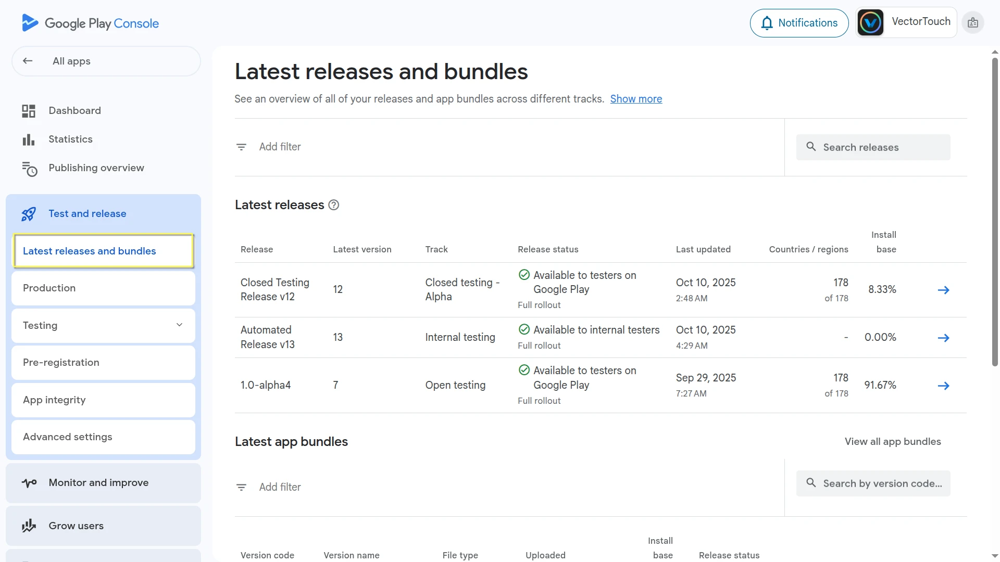
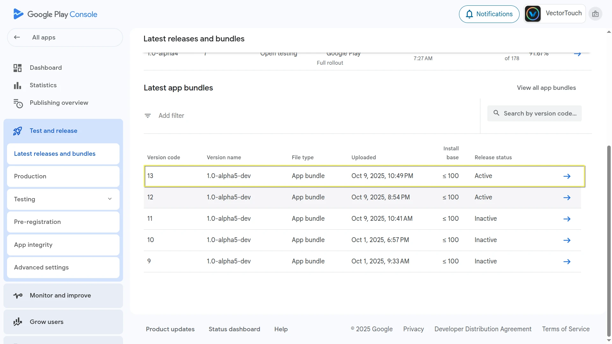
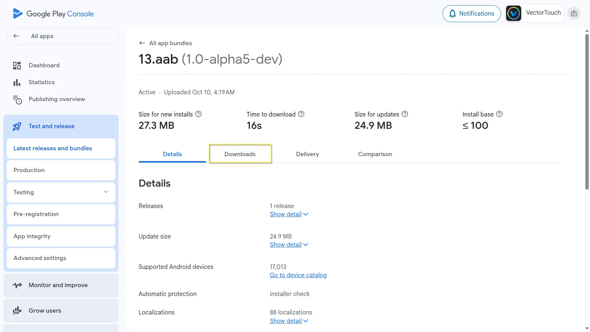
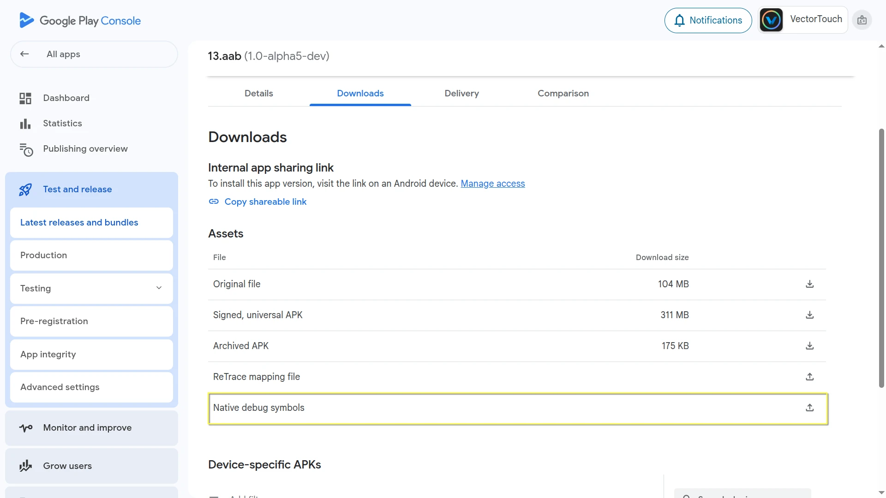
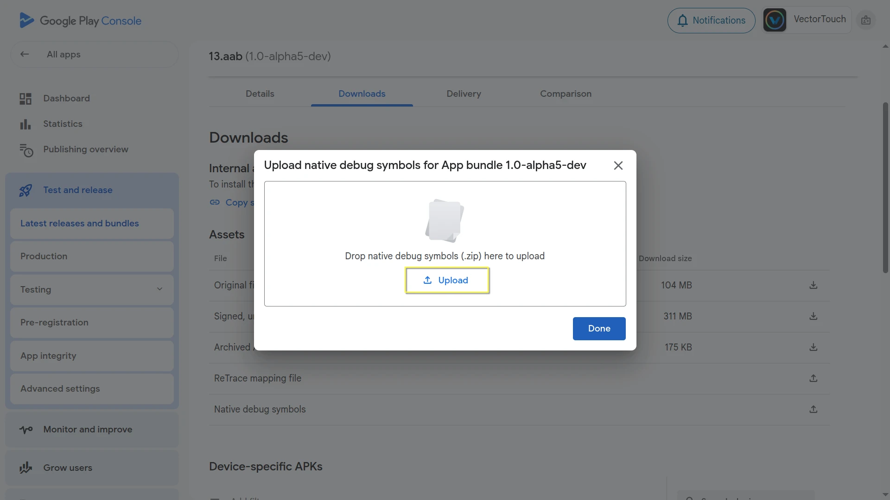
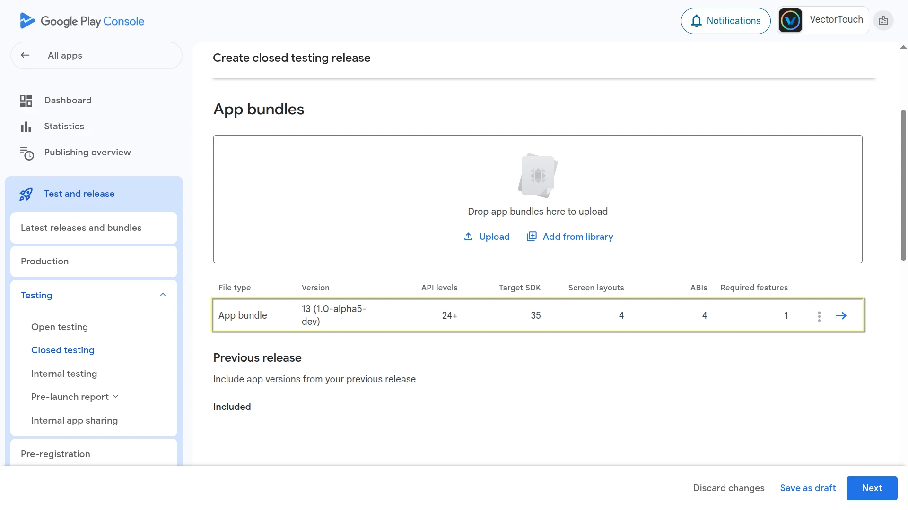
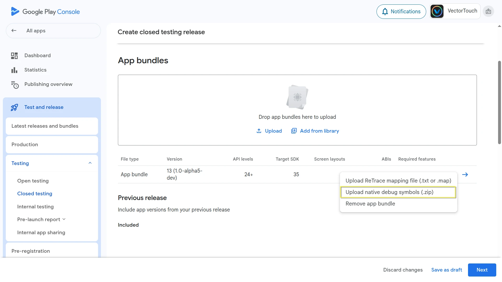

.. _doc_resolving_crashes_on_android:

Resolving crashes on Android
============================

When your game crashes on Android, you often see obfuscated stack traces in Play Console
or other crash reporting tools like Firebase Crashlytics. To make these stack traces human-readable (symbolicated),
you need native debug symbols that correspond to your game's exported build.

Godot now provides downloadable native debug symbols for each official export template.

Getting Native Debug symbols for official templates
---------------------------------------------------

Native debug symbol files are provided for every stable Godot release
and can be downloaded from the `GitHub release page <https://github.com/godotengine/godot/releases/>`_.

For example, to get the native debug symbols for version ``4.5.1.stable``:

- Go to the `4.5.1.stable release page <https://github.com/godotengine/godot/releases/>`_
- Download the release artifact ``Godot_native_debug_symbols.4.5.1.stable.template_release.android.zip``

Getting Native Debug symbols for custom builds
----------------------------------------------

Your exported template and its native debug symbols must come from the **same build**,
so you can use the official symbols only if you are using the **official export templates**.
If you are building **custom export templates**, you need to generate matching symbol files yourself.

To do so, add ``debug_symbols=yes separate_debug_symbols=yes`` to your scons build command.
This will generate a file named ``android-template-release-native-symbols.zip`` containing the native debug symbols for your custom build.

For example,

::

    scons platform=android target=template_release debug_symbols=yes separate_debug_symbols=yes generate_android_binaries=yes

If you are building for multiple architectures, you should include the ``separate_debug_symbols=yes`` only in the last build command,
similar to how ``generate_android_binaries=yes`` is used.

::

    scons platform=android arch=arm32 target=template_release debug_symbols=yes
    scons platform=android arch=arm64 target=template_release debug_symbols=yes
    scons platform=android arch=x86_32 target=template_release debug_symbols=yes
    scons platform=android arch=x86_64 target=template_release debug_symbols=yes separate_debug_symbols=yes generate_android_binaries=yes

Uploading Symbols to Google Play Console
----------------------------------------

Follow these steps to upload the native debug symbols:

1. Open `Play Console <https://play.google.com/console>`_.
2. Select any app.
3. In the left menu, navigate to ``Test and release > Latest releases and bundles``.

4. Now choose the relevant bundle and open it.

5. Select the ``Downloads`` tab, and scroll down to the ``Assets`` section.

6. Next to ``Native debug symbols``, click the upload arrow icon.

7. Select and upload the corresponding native debug symbols file for that build version.

Alternatively, you can upload the symbols when creating a new release:

1. On the Create release page, locate your new release bundle.

2. Click the three-dot menu beside it.
3. Choose ``Upload native debug symbols (.zip)`` from the menu.

4. Select and upload the corresponding native debug symbols file for that build version.

Manually Symbolicating Crash Logs
---------------------------------

You can also symbolicate the crash logs manually using the `ndk-stack <https://developer.android.com/ndk/guides/ndk-stack>`_ tool included in the Android NDK.

.. note::

    If you already have the Android SDK installed, you can find the ``ndk-stack`` tool inside the ``ndk`` folder in your SDK location.
    Otherwise, you can download the NDK directly from the `NDK downloads page <https://developer.android.com/ndk/downloads>`_.

1. Extract the native debug symbols zip you downloaded earlier (or generated with your custom build).
2. Save your crash log to a text file (for example, ``crash.txt``).
3. Run ndk-stack with the path to the symbol directory that matches the crash's CPU architecture (for example, ``arm64-v8a``):

::

    ndk-stack -sym path/to/native_debug_symbols/arm64-v8a/ -dump crash.txt

4. The output will display a symbolicated trace, showing file names and line numbers in Godot's source code (or your custom build).
