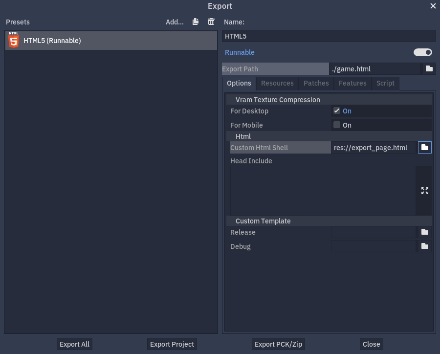

.. _doc_customizing_html5_shell:

Custom HTML page for Web export
====================================

While Web export templates provide a default HTML page fully capable of launching
the project without any further customization, it may be beneficial to create a custom
HTML page. While the game itself cannot be directly controlled from the outside,
such page allows to customize the initialization process for the engine.

Some use-cases where customizing the default page is useful include:

- Loading files from a different directory than the page;
- Loading a ``.zip`` file instead of a ``.pck`` file as the main pack;
- Loading the engine from a different directory than the main pack file;
- Adding a click-to-play button so that games can be started in the fullscreen mode;
- Loading some extra files before the engine starts, making them available in
  the project file system as soon as possible;
- Passing custom command line arguments, e.g. ``-s`` to start a ``MainLoop`` script.

The default HTML page is available in the Godot Engine repository at
`/misc/dist/html/full-size.html <https://github.com/godotengine/godot/blob/master/misc/dist/html/full-size.html>`__
and can be used as a reference implementation. Another sample HTML page is available at
`/misc/dist/html/fixed-size.html <https://github.com/godotengine/godot/blob/master/misc/dist/html/fixed-size.html>`__.
It differs from the default one by having a fixed size canvas area and an output widget below it.

.. note:: It is recommended to use developer tools provided by browser vendors to debug
          exported projects. Output generated by the engine may be limited and does not
          include WebGL errors.

Setup
-----
As evident by the default HTML page, it is mostly a regular HTML document. To work with
Godot projects it needs to be fully realized, to have a control code that calls
the :js:class:`Engine` class, and to provide places for several placeholders, which are
replaced with their actual values during export.

- ``$GODOT_BASENAME``:
  The base name from the *Export Path*, as set up in the export options; suffixes are omitted
  (e.g. ``game.html`` becomes ``game``). This variable can be used to generate a path
  to the main JavaScript file ``$GODOT_BASENAME.js``, which provides the :js:class:`Engine`
  class. A splash image shown during the booting process can be accessed using this variable
  as well: ``$GODOT_BASENAME.png``.

- ``$GODOT_PROJECT_NAME``:
  The project name as defined in the Project Settings.

- ``$GODOT_HEAD_INCLUDE``:
  A custom string to include in the HTML document just before the end of the ``<head>`` tag. It
  is customized in the export options under the *Html / Head Include* section. While you fully
  control the HTML page you create, this variable can be useful for configuring parts of the
  HTML ``head`` element from the Godot Editor, e.g. for different Web export presets.

- ``$GODOT_DEBUG_ENABLED``:
  A flag that tells if this is a debug build, or not. This variable is substituted by strings
  ``true`` and ``false``, and can be used to disable debug branches within your control code.

When the custom page is ready, it can be selected in the export options under the *Html / Custom Html Shell*
section.

Starting the project
--------------------
To be able to start the game, you need to write a script that initializes the engine — the control
code. This process consists of three steps, though some of them can be skipped and left for
a default behavior.

First, the engine must be loaded, then it needs to be initialized, and after this the project
can finally be started. You can perform every of these steps manually and with great control.
However, in the simplest case all you need to do is to create an instance of the :js:class:`Engine`
class and then call the :js:meth:`engine.startGame` method.

.. code-block:: js

    const execName = "path://to/executable"
    const mainPack = "path://to/main_pack"

    const engine = new Engine();
    engine.startGame(execName, mainPack)

This snippet of code automatically loads and initializes the engine before starting the game.
It uses the given path to the executable to deduce the path to load the engine. The :js:meth:`engine.startGame`
method is asynchronous and returns a ``Promise``. This allows your control code to track if
the game was loaded correctly without blocking execution or relying on polling.

In case your project needs to have special arguments passed to it by the start-up script,
:js:meth:`engine.startGame` can be replaced by :js:meth:`engine.start`. This method takes an
arbitrary list of string arguments. As it does not have a defined list of arguments, :js:meth:`engine.start`
cannot automatically load the engine.

To load the engine manually the :js:meth:`Engine.load` static method must be called. As
this method is static, multiple engine instances can be spawned with the exact same ``basePath``.
If an instance requires a different ``basePath``, you can call the :js:meth:`engine.init`
method with that path before starting the game.

.. note:: Multiple instances cannot be spawned by default, as the engine is immediately unloaded after it is initialized.
          To prevent this from happening the :js:meth:`engine.setUnloadAfterInit` method can be called. It is still possible
          to unload the engine manually afterwards by calling the :js:meth:`Engine.unload` static method. Unloading the engine
          frees browser memory by unloading files that are no longer needed once the instance is initialized.

To correctly load the engine on some hosting providers and network configurations you may
need to change the default filename extension by using :js:meth:`Engine.setWebAssemblyFilenameExtension`.
By default, the extension is assumed to be ``wasm``. If your hosting provider blocks this
extension, this static method can be used to change it to something that is supported.

.. code-block:: js

    Engine.setWebAssemblyFilenameExtension("dat");
    // Load mygame.dat as WebAssembly module.
    Engine.load("mygame");

.. warning:: If a different filename extension is used, some web servers may automatically
             set the MIME-type of the file to something other than :mimetype:`application/wasm`.
             In that case some start-up optimizations may be skipped.

Customizing the behavior
------------------------
In the Web environment several methods can be used to guarantee that the game will work as intended.

If you target a specific version of WebGL, or just want to check if WebGL is available at all,
you can call the :js:meth:`Engine.isWebGLAvailable` method. It optionally takes an argument that
allows to test for a specific major version of WebGL.

As the real executable file does not exist in the Web environment, the engine only stores a virtual
filename formed from the base name of loaded engine files. This value affects the output of the
:ref:`OS.get_executable_path() <class_OS_method_get_executable_path>` method and defines the name of
the automatically started main pack. The :js:meth:`engine.setExecutableName` method can be used
to override this value.

If your project requires some files to be available the moment it is loaded, you can preload
them by calling the :js:meth:`engine.preloadFile` method with a path to a file or by providing it
with an ``ArrayBuffer`` object. In case of the ``ArrayBuffer``, or one of its views, a second argument
must be specified to define an internal path for the loaded resource.

Customizing the presentation
----------------------------
Several methods can be used to further customize the look and behavior of the game on your page.

By default, the first canvas element on the page is used for rendering. To use a different canvas
element the :js:meth:`engine.setCanvas` method can be used. It requires a reference to the DOM
element itself.

.. code-block:: js

    const canvasElement = document.querySelector("#my-canvas-element");
    engine.setCanvas(canvasElement);

If the width and height of this canvas element differ from values set in the project settings, it
will be resized on the project start. This behavior can be disabled by calling the :js:meth:`engine.setCanvasResizedOnStart`
method.

If your game takes some time to load, it may be useful to display a custom loading UI which tracks
the progress. This can be achieved with the :js:meth:`engine.setProgressFunc` method which allows
to set up a callback function to be called regularly as the engine loads new bytes.

.. code-block:: js

    function printProgress(current, total) {
        console.log("Loaded " + current + " of " + total + " bytes");
    }
    engine.setProgressFunc(printProgress);

Be aware that in some cases ``total`` can be ``0``. This means that it cannot be calculated.

If your game supports multiple languages, the :js:meth:`engine.setLocale` method can be used to set
a specific locale, provided you have a valid language code string. It may be good to use server-side
logic to determine which languages a user may prefer. This way the language code can be taken from the
``Accept-Language`` HTTP header, or determined by a GeoIP service.

Debugging
---------
To debug exported projects, it may be useful to read the standard output and error streams generated
by the engine. This is similar to the output shown in the editor console window. By default, standard
``console.log`` and ``console.warn`` are used for the output and error streams respectively. This
behavior can be customized by setting your own functions to handle messages.

Use the :js:meth:`engine.setStdoutFunc` method to set a callback function for the output stream. Default
behavior is similar to this:

.. code-block:: js

    function printStdout(text) {
        console.log(text);
    }
    engine.setStdoutFunc(printStdout);

Use the :js:meth:`engine.setStderrFunc` method to set a callback function for the error stream. Default
behavior is similar to this:

.. code-block:: js

    function printStderr(text) {
        console.warn("Error: " + text);
    }
    engine.setStderrFunc(printStderr);

When handling the engine output keep in mind, that it may not be desirable to print it out in the
finished product. To control whether or not the current execution is actually a debug build you can
use ``$GODOT_DEBUG_ENABLED`` placeholder.

Further debugging options and a low level access to the execution environment are available in a form
of Emscripten's ``Module`` object. It can be accessed using the :js:attr:`engine.rtenv` property on the
engine instance.
