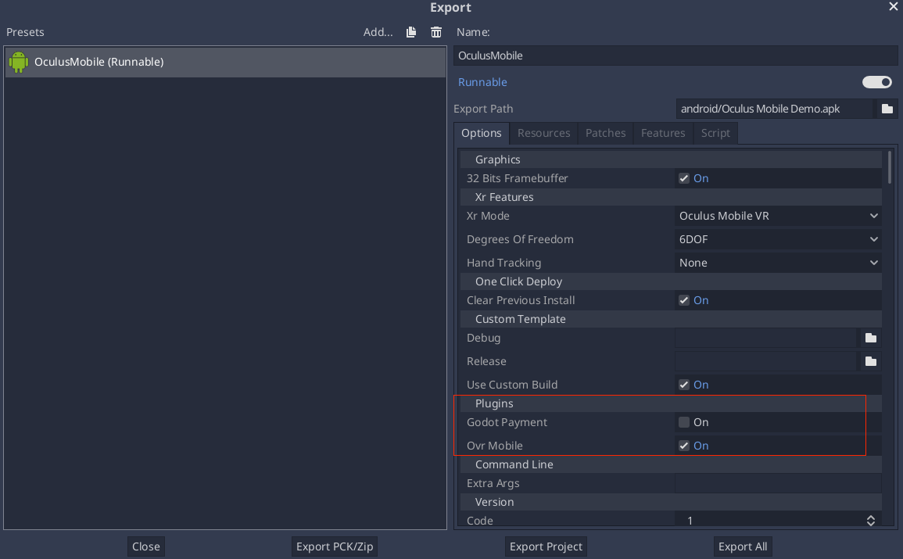

.. _doc_android_plugin:

Creating Android plugins (Godot 3.2.2+)
=======================================

Introduction
------------

Android plugins are powerful tools to extend the capabilities of the Godot engine
by tapping into the functionality provided by the Android platform and ecosystem.

Mobile gaming monetization is one such example since it requires features
and capabilities that don't belong to the core feature set of a game engine:

-  Analytics
-  In-app purchases
-  Receipt validation
-  Install tracking
-  Ads
-  Video ads
-  Cross-promotion
-  In-game soft & hard currencies
-  Promo codes
-  A/B testing
-  Login
-  Cloud saves
-  Leaderboards and scores
-  User support & feedback
-  Posting to Facebook, Twitter, etc.
-  Push notifications

Android plugin
--------------

While introduced in Godot 3.2.0, the Android plugin system got a significant architecture update starting with Godot 3.2.2. The new plugin system is backward-incompatible with the previous one, but both systems are kept functional in future releases of the 3.2.x branch. Since we previously did not version the Android plugin systems, the new one is now labelled ``v1`` and is the starting point for the modern Godot Android ecosystem.

**Note:** In Godot 4.0, the previous system will be fully deprecated and removed.

As a prerequisite, make sure you understand how to set up a :ref:`custom build environment<doc_android_custom_build>` for Android.

At its core, a Godot Android plugin is a `Android archive library <https://developer.android.com/studio/projects/android-library#aar-contents>`_ (*aar* archive file)
with the following caveats:

-  The library must have a dependency on the Godot engine library (``godot-lib.x.y.aar``). A stable version is made available for each Godot release.

-  The library must include a specifically configured ``<meta-data>`` tag in its manifest file.

Building a Android plugin
^^^^^^^^^^^^^^^^^^^^^^^^^

**Prerequisite:** `Android Studio <https://developer.android.com/studio>`_ is strongly recommended as the IDE to use to create Android plugins.
The instructions below assumes that you're using Android Studio.

1.  Follow `these instructions <https://developer.android.com/studio/projects/android-library>`__ to create an Android library module for your plugin.

2.  Add the Godot engine library as a dependency to your plugin module:

    -  Download the Godot engine library (godot-lib.x.y.aar)

    -   Follow `these instructions <https://developer.android.com/studio/projects/android-library#AddDependency>`__ to add 
        the Godot engine library as a dependency for your plugin.

    -  In the plugin module's ``build.gradle`` file, replace ``implementation`` with ``compileOnly`` for the dependency line for the Godot engine library.

3.  Create a new class in the plugin module and make sure it extends ``org.godotengine.godot.plugin.GodotPlugin``.
    At runtime, it will be used to instantiate a singleton object that will be used by the Godot engine to load, initialize and run the plugin.

4.  Update the plugin ``AndroidManifest.xml`` file:

    -   Open the plugin ``AndroidManifest.xml`` file.

    -   Add the ``<application></application>`` tag if it's missing.

    -   In the ``<application>`` tag, add a ``<meta-data>`` tag setup as follow::

            <meta-data
                android:name="org.godotengine.plugin.v1.[PluginName]"
                android:value="[plugin.init.ClassFullName]" />

        Where ``PluginName`` is the name of the plugin, and ``plugin.init.ClassFullName`` is the full name (package + class name) of the plugin loading class.

5.  Add the remaining logic for your plugin and run the ``gradlew build`` command to generate the plugin's ``aar`` file.
    The build will likely generate both a ``debug`` and ``release`` ``aar`` files. 
    Depending on your need, pick only one version (usually the ``release`` one) which to provide your users with.

    It's recommended that the ``aar`` filename matches the following pattern: ``[PluginName]*.aar`` where ``PluginName`` is the name of the plugin in PascalCase (e.g.: ``GodotPayment.release.aar``).

6.  Create a Godot Android Plugin configuration file to help the system detect and load your plugin:

    -   The configuration file extension must be ``gdap`` (e.g.: ``MyPlugin.gdap``).
    
    -   The configuration file format is as follow::
    
            [config]
            
            name="MyPlugin"
            binary_type="local"
            binary="MyPlugin.aar"
            
            [dependencies]
            
            local=["local_dep1.aar", "local_dep2.aar"]
            remote=["example.plugin.android:remote-dep1:0.0.1", "example.plugin.android:remote-dep2:0.0.1"]
            custom_maven_repos=["http://repo.mycompany.com/maven2"]
            
        The ``config`` section and fields are required and defined as follow:
        
            -   **name**: name of the plugin

            -   **binary_type**: can be either ``local`` or ``remote``. The type affects the **binary** field

            -   **binary**:
            
                -   if **binary_type** is ``local``, then this should be the filepath of the plugin ``aar`` file.
                
                    -   The filepath can be relative (e.g.: ``MyPlugin.aar``) in which case it's relative to the ``res://android/plugins`` directory.

                    -   The filepath can be absolute: ``res://some_path/MyPlugin.aar``.
                    
                -   if **binary_type** is ``remote``, then this should be a declaration for a `remote gradle binary <https://developer.android.com/studio/build/dependencies#dependency-types>`_ (e.g.: ``org.godot.example:my-plugin:0.0.0``).
                
        The ``dependencies`` section and fields are optional and defined as follow:
        
            -   **local**: contains a list of filepaths to the local ``.aar`` binary files the plugin depends on. Similarly to the ``binary`` field (when the ``binary_type`` is ``local``), the local binaries' filepaths can be relative or absolute.

            -   **remote**: contains a list of remote binary gradle dependencies for the plugin.

            -   **custom_maven_repos**: contains a list of URLs specifying the custom maven repositories required for the plugin's dependencies

Loading and using a Android plugin
^^^^^^^^^^^^^^^^^^^^^^^^^^^^^^^^^^

Move the plugin configuration file (e.g.: ``MyPlugin.gdap``) and, if any, its local binary (e.g.: ``MyPlugin.aar``) and dependencies to the Godot project's ``res://android/plugins`` directory.

The Godot editor will automatically parse all ``.gdap`` files in the ``res://android/plugins`` directory and show a list of detected and toggleable plugins in the Android export presets window under the **Plugins** section.

From your script:

.. code::

    if Engine.has_singleton("MyPlugin"):
        var singleton = Engine.get_singleton("MyPlugin")
        print(singleton.myPluginFunction("World"))

Bundling GDNative resources
^^^^^^^^^^^^^^^^^^^^^^^^^^^
A Android plugin can define and provide C/C++ GDNative resources, either to provide and/or access functionality from the game logic.
The GDNative resources can be bundled within the plugin ``aar`` file which simplifies the distribution and deployment process:

    -   The shared libraries (``.so``) for the defined GDNative libraries will be automatically bundled by the ``aar`` build system.

    -   Godot ``*.gdnlib`` and ``*.gdns`` resource files must be manually defined in the plugin ``assets`` directory.
        The recommended path for these resources relative to the ``assets`` directory should be: ``godot/plugin/v1/[PluginName]/``.

For GDNative libraries, the plugin singleton object must override the ``org.godotengine.godot.plugin.GodotPlugin::getPluginGDNativeLibrariesPaths()`` method,
and return the paths to the bundled GDNative libraries config files (``*.gdnlib``). The paths must be relative to the ``assets`` directory.
At runtime, the plugin will provide these paths to Godot core which will use them to load and initialize the bundled GDNative libraries.

Reference implementations
^^^^^^^^^^^^^^^^^^^^^^^^^
-   `Godot Oculus Mobile plugin <https://github.com/GodotVR/godot_oculus_mobile>`_

    -   `Bundled gdnative resources <https://github.com/GodotVR/godot_oculus_mobile/tree/master/plugin/src/main/assets/addons/godot_ovrmobile>`_

-   `Godot Payment plugin <https://github.com/godotengine/godot/tree/master/platform/android/java/plugins/godotpayment>`_

Troubleshooting
---------------

Godot crashes upon load
^^^^^^^^^^^^^^^^^^^^^^^

Check ``adb logcat`` for possible problems, then:

-  Check that the methods used in the Java singleton only use simple
   Java datatypes. More complex datatypes are not supported.
