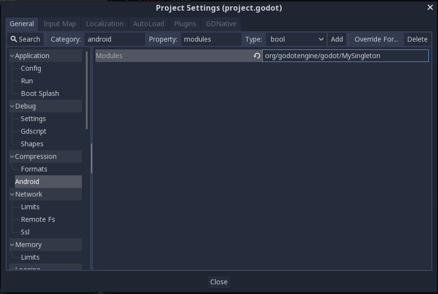

.. _doc_android_plugin:

Creating Android plugins
========================

Introduction
------------

Making video games portable is all fine and dandy, until mobile
gaming monetization shows up.

This area is complex, usually a mobile game that monetizes needs
special connections to a server for things like:

-  Analytics
-  In-app purchases
-  Receipt validation
-  Install tracking
-  Ads
-  Video ads
-  Cross-promotion
-  In-game soft & hard currencies
-  Promo codes
-  A/B testing
-  Login
-  Cloud saves
-  Leaderboards and scores
-  User support & feedback
-  Posting to Facebook, Twitter, etc.
-  Push notifications

On iOS, you can write a C++ module and take advantage of the C++/ObjC
intercommunication. Even using GDNative is possible to make it a plug-in.

On Android, interfacing with C++ through JNI (Java Native Interface) isn't as flexible, so writing plugins
is considerably more work.

It is also possible that you just want to do modifications to the Android export template, and by using a plugin your project
can remain compatible with newer Godot versions (as the android source template will get updated on each release).

Maybe REST
----------

Most of these APIs allow communication via REST/JSON APIs. If the API is relatively simple and does not require
complex authentication, this may be a better idea than writing a specific Android plugin.

Godot has great support for HTTP, HTTPS and JSON, so an API implemented this way
will work on every platform, too. 

Of course, in most of the cases, it's easier to just write an Android plugin, so keep reading.

Android plugin
--------------

Writing an Android plugin is now possible, beginning with Godot 3.2. It's also pretty easy! Re-compiling the engine is no longer needed.

Before anything, make sure you understand how to set up a :ref:`custom build environment<doc_android_custom_build>` for Android.

Your plugin needs to be in a folder other than *"build/"* inside the *"res://android"* directory (which was created by following the link above). Any name is fine, so name it according to the SDK you will implement (or just your plugin name).

Once created, there are certain rules to follow, but they are simple.

Android directories
^^^^^^^^^^^^^^^^^^^

Inside your plugin folder, you can use the standard folders as if they were from an Android Gradle project. Examples of this are:

.. code-block:: none

   src/ - For Java source code, same as in your Android project
   res/ - For resources
   aidl/ - For interfaces
   assets/ - For assets that will be included as-is on export
   libs/debug - For debug JNI libraries
   libs/release - For release JNI libraries

Gradle will treat them as part of the project automatically when building, same as the default project files.

"Chunk" files
^^^^^^^^^^^^^

It is now possible to modify *"AndroidManifest.xml"* and *build.gradle* in *"res://android/build"* directly and Godot will keep your
changes when building. The problem, however, is that if you update Godot, you will also need to update the *build/* folder and your
changes will be lost.

To overcome this, the Godot Android Plugin system lets you create *chunk* files, where you can specify little bits that can be
inserted in both *"AndroidManifest.xml"* and *build.gradle*. They are inserted every time Godot builds the project for export or deploy.

AndroidManifest.conf
~~~~~~~~~~~~~~~~~~~~

This file allows to insert bits of chunk into *AndroidManifest.xml*, the following are supported tags and are entirely optional:

.. code-block:: none

   [user_permissions]

Any bit of text below this tag is inserted inside the <manifest> tag of the file. This is often used for permission tags.

.. code-block:: none

   [application]

Any bit of text below this tag inside the <application> tag of the file. Many SDKs require this.

.. code-block:: none

   [application_attribs]

These are attributes you can add at the end of the <application> tag. Some SDKs require this.

gradle.conf
~~~~~~~~~~~

This file allows to insert bits of chunk into *build.gradle*, the following are supported and are entirely optional:

.. code-block:: none

   [buildscript_repositories]

Any bit of text below this tag is inserted inside the buildscript.repositories section of the build file.

.. code-block:: none

   [buildscript_dependencies]

Any bit of text below this tag is inserted inside the buildscript.dependencies section of the build file.

.. code-block:: none

   [allprojects_repositories]

Any bit of text below this tag is inserted inside the allprojects.repositories section of the build file.

.. code-block:: none

   [dependencies]

Any bit of text below this tag is inserted inside the dependencies section of the build file.

.. code-block:: none

   [android_defaultconfig]

Any bit of text below this tag is inserted inside the android.defaultconfig section of the build file.

.. code-block:: none

   [global]

Any bit of text below this tag is inserted inside the global scope of the build file.

Java singleton
--------------

An Android plugin will usually have a singleton class that will load it,
this class inherits from ``Godot.SingletonBase``. Resource identifiers for
any additional resources you have provided for the module will be in the
``com.godot.game.R`` class, so you'll likely want to import it.

A singleton object template follows:

.. code-block:: java

    package org.godotengine.godot;

    import android.app.Activity;
    import android.content.Intent;
    import android.content.Context;
    import com.godot.game.R;
    import javax.microedition.khronos.opengles.GL10;

    public class MySingleton extends Godot.SingletonBase {

        protected Activity appActivity;
        protected Context appContext;
        private Godot activity = null;
        private int instanceId = 0;

        public String myFunction(String p_str) {
            // A function to bind.
            return "Hello " + p_str;
        }

        public void getInstanceId(int pInstanceId) {
            // You will need to call this method from Godot and pass in the get_instance_id().
            instanceId = pInstanceId;
        }

        static public Godot.SingletonBase initialize(Activity p_activity) {
            return new MySingleton(p_activity);
        }

        public MySingleton(Activity p_activity) {
            // Register class name and functions to bind.
            registerClass("MySingleton", new String[]
                {
                    "myFunction",
                    "getInstanceId"
                });
            this.appActivity = p_activity;
            this.appContext = appActivity.getApplicationContext();
            // You might want to try initializing your singleton here, but android
            // threads are weird and this runs in another thread, so to interact with Godot you usually have to do.
            this.activity = (Godot)p_activity;
            this.activity.runOnUiThread(new Runnable() {
                    public void run() {
                        // Useful way to get config info from "project.godot".
                        String key = GodotLib.getGlobal("plugin/api_key");
                        // SDK.initializeHere();
                    }
            });

        }

        // Forwarded callbacks you can reimplement, as SDKs often need them.

        protected void onMainActivityResult(int requestCode, int resultCode, Intent data) {}
        protected void onMainRequestPermissionsResult(int requestCode, String[] permissions, int[] grantResults) {}

        protected void onMainPause() {}
        protected void onMainResume() {}
        protected void onMainDestroy() {}

        protected void onGLDrawFrame(GL10 gl) {}
        protected void onGLSurfaceChanged(GL10 gl, int width, int height) {} // Singletons will always miss first 'onGLSurfaceChanged' call.

    }

Calling back to Godot
^^^^^^^^^^^^^^^^^^^^^

Calling back to Godot from Java is a little more difficult. The instance
ID of the script must be known first, this is obtained by calling
``get_instance_ID()`` on the script. This returns an integer that can be
passed to Java.

From Java, use the ``calldeferred`` function to communicate back with Godot.
Java will most likely run in a separate thread, so calls are deferred:

.. code-block:: java

    GodotLib.calldeferred(<instanceid>, "<function>", new Object[]{param1, param2, etc});

Godot will detect this singleton and initialize it at the proper time.

Using it from GDScript
^^^^^^^^^^^^^^^^^^^^^^

First you will need to add your singleton into the android modules to be loaded. Go to "Project > Project Settings".
Then on the tab "General" go to the "Android" section, and fill the Modules part with your module name. 
The module should include the full Java path. For our example: ``org/godotengine/godot/MySingleton``.

Then, from your script:

::

    if Engine.has_singleton("MySingleton"):
        var singleton = Engine.get_singleton("MySingleton")
        print(singleton.myFunction("World"))

Troubleshooting
---------------

Godot crashes upon load
^^^^^^^^^^^^^^^^^^^^^^^

Check ``adb logcat`` for possible problems, then:

-  Make sure libgodot_android.so is in the ``libs/armeabi`` folder
-  Check that the methods used in the Java singleton only use simple
   Java datatypes, more complex ones are not supported.

Future
------

Godot has an experimental Java API Wrapper that allows to use the
entire Java API from GDScript.

It's simple to use and it's used like this:

.. code-block:: none

    class = JavaClassWrapper.wrap(<javaclass as text>)

This is most likely not functional yet, if you want to test it and help
us make it work, contact us on irc.freenode.org:#godotengine-devel.
