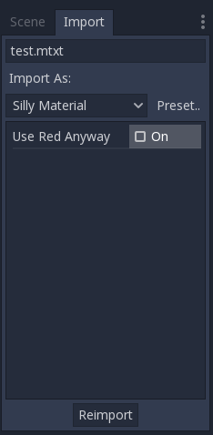
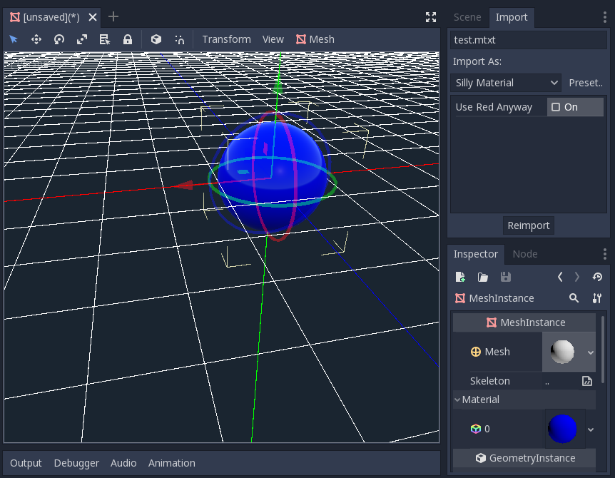

:article_outdated: True

.. _doc_import_plugins:

Import plugins
==============

.. note:: This tutorial assumes you already know how to make generic plugins. If
          in doubt, refer to the :ref:`doc_making_plugins` page. This also
          assumes you are acquainted with Godot's import system.

Introduction
------------

An import plugin is a special type of editor tool that allows custom resources
to be imported by Godot and be treated as first-class resources. The editor
itself comes bundled with a lot of import plugins to handle the common resources
like PNG images, Collada and glTF models, Ogg Vorbis sounds, and many more.

This tutorial shows how to create an import plugin to load a
custom text file as a material resource. This text file will contain three
numeric values separated by comma, which represents the three channels of a
color, and the resulting color will be used as the albedo (main color) of the
imported material. In this example it contains the pure blue color
(zero red, zero green, and full blue):

.. code-block:: none

    0,0,255

Configuration
-------------

First we need a generic plugin that will handle the initialization and
destruction of our import plugin. Let's add the ``plugin.cfg`` file first:

.. code-block:: ini

    [plugin]

    name="Silly Material Importer"
    description="Imports a 3D Material from an external text file."
    author="Yours Truly"
    version="1.0"
    script="material_import.gd"

Then we need the ``material_import.gd`` file to add and remove the import plugin
when needed:

::

    # material_import.gd
    @tool
    extends EditorPlugin

    var import_plugin

    func _enter_tree():
        import_plugin = preload("import_plugin.gd").new()
        add_import_plugin(import_plugin)

    func _exit_tree():
        remove_import_plugin(import_plugin)
        import_plugin = null

When this plugin is activated, it will create a new instance of the import
plugin (which we'll soon make) and add it to the editor using the
:ref:`add_import_plugin() <class_EditorPlugin_method_add_import_plugin>` method. We store
a reference to it in a class member ``import_plugin`` so we can refer to it
later when removing it. The
:ref:`remove_import_plugin() <class_EditorPlugin_method_remove_import_plugin>` method is
called when the plugin is deactivated to clean up the memory and let the editor
know the import plugin isn't available anymore.

Note that the import plugin is a reference type, so it doesn't need to be
explicitly released from memory with the ``free()`` function. It will be
released automatically by the engine when it goes out of scope.

The EditorImportPlugin class
----------------------------

The main character of the show is the
:ref:`EditorImportPlugin class <class_EditorImportPlugin>`. It is responsible for
implementing the methods that are called by Godot when it needs to know how to deal
with files.

Let's begin to code our plugin, one method at time:

::

    # import_plugin.gd
    @tool
    extends EditorImportPlugin

    func _get_importer_name():
        return "demos.sillymaterial"

The first method is the
:ref:`_get_importer_name()<class_EditorImportPlugin_private_method__get_importer_name>`. This is a
unique name for your plugin that is used by Godot to know which import was used
in a certain file. When the files needs to be reimported, the editor will know
which plugin to call.

::

    func _get_visible_name():
        return "Silly Material"

The :ref:`_get_visible_name()<class_EditorImportPlugin_private_method__get_visible_name>` method is
responsible for returning the name of the type it imports and it will be shown to the
user in the Import dock.

You should choose this name as a continuation to "Import as", e.g. *"Import as
Silly Material"*. You can name it whatever you want but we recommend a
descriptive name for your plugin.

::

    func _get_recognized_extensions():
        return ["mtxt"]

Godot's import system detects file types by their extension. In the
:ref:`_get_recognized_extensions()<class_EditorImportPlugin_private_method__get_recognized_extensions>`
method you return an array of strings to represent each extension that this
plugin can understand. If an extension is recognized by more than one plugin,
the user can select which one to use when importing the files.

.. tip:: Common extensions like ``.json`` and ``.txt`` might be used by many
         plugins. Also, there could be files in the project that are just data
         for the game and should not be imported. You have to be careful when
         importing to validate the data. Never expect the file to be well-formed.

::

    func _get_save_extension():
        return "material"

The imported files are saved in the ``.import`` folder at the project's root.
Their extension should match the type of resource you are importing, but since
Godot can't tell what you'll use (because there might be multiple valid
extensions for the same resource), you need to declare what will be used in
the import.

Since we're importing a Material, we'll use the special extension for such
resource types. If you are importing a scene, you can use ``scn``. Generic
resources can use the ``res`` extension. However, this is not enforced in any
way by the engine.

::

    func _get_resource_type():
        return "StandardMaterial3D"

The imported resource has a specific type, so the editor can know which property
slot it belongs to. This allows drag and drop from the FileSystem dock to a
property in the Inspector.

In our case it's a :ref:`class_StandardMaterial3D`, which can be applied to 3D
objects.

.. note:: If you need to import different types from the same extension, you
          have to create multiple import plugins. You can abstract the import
          code on another file to avoid duplication in this regard.

Options and presets
-------------------

Your plugin can provide different options to allow the user to control how the
resource will be imported. If a set of selected options is common, you can also
create different presets to make it easier for the user. The following image
shows how the options will appear in the editor:

Since there might be many presets and they are identified with a number, it's a
good practice to use an enum so you can refer to them using names.

::

    @tool
    extends EditorImportPlugin

    enum Presets { DEFAULT }

    ...

Now that the enum is defined, let's keep looking at the methods of an import
plugin:

::

    func _get_preset_count():
        return Presets.size()

The :ref:`_get_preset_count() <class_EditorImportPlugin_private_method__get_preset_count>` method
returns the amount of presets that this plugins defines. We only have one preset
now, but we can make this method future-proof by returning the size of our
``Presets`` enumeration.

::

    func _get_preset_name(preset_index):
        match preset_index:
            Presets.DEFAULT:
                return "Default"
            _:
                return "Unknown"

Here we have the
:ref:`_get_preset_name() <class_EditorImportPlugin_private_method__get_preset_name>` method, which
gives names to the presets as they will be presented to the user, so be sure to
use short and clear names.

We can use the ``match`` statement here to make the code more structured. This
way it's easy to add new presets in the future. We use the catch all pattern to
return something too. Although Godot won't ask for presets beyond the preset
count you defined, it's always better to be on the safe side.

If you have only one preset you could simply return its name directly, but if
you do this you have to be careful when you add more presets.

::

    func _get_import_options(path, preset_index):
        match preset_index:
            Presets.DEFAULT:
                return [{
                           "name": "use_red_anyway",
                           "default_value": false
                        }]
            _:
                return []

This is the method which defines the available options.
:ref:`_get_import_options() <class_EditorImportPlugin_private_method__get_import_options>` returns
an array of dictionaries, and each dictionary contains a few keys that are
checked to customize the option as its shown to the user. The following table
shows the possible keys:

+-------------------+------------+----------------------------------------------------------------------------------------------------------+
| Key               | Type       | Description                                                                                              |
+===================+============+==========================================================================================================+
| ``name``          | String     | The name of the option. When showed, underscores become spaces and first letters are capitalized.        |
+-------------------+------------+----------------------------------------------------------------------------------------------------------+
| ``default_value`` | Any        | The default value of the option for this preset.                                                         |
+-------------------+------------+----------------------------------------------------------------------------------------------------------+
| ``property_hint`` | Enum value | One of the :ref:`PropertyHint <enum_@GlobalScope_PropertyHint>` values to use as hint.                   |
+-------------------+------------+----------------------------------------------------------------------------------------------------------+
| ``hint_string``   | String     | The hint text of the property. The same as you'd add in the ``export`` statement in GDScript.            |
+-------------------+------------+----------------------------------------------------------------------------------------------------------+
| ``usage``         | Enum value | One of the :ref:`PropertyUsageFlags <enum_@GlobalScope_PropertyUsageFlags>` values to define the usage.  |
+-------------------+------------+----------------------------------------------------------------------------------------------------------+

The ``name`` and ``default_value`` keys are **mandatory**, the rest are optional.

Note that the ``_get_import_options`` method receives the preset number, so you
can configure the options for each different preset (especially the default
value). In this example we use the ``match`` statement, but if you have lots of
options and the presets only change the value you may want to create the array
of options first and then change it based on the preset.

.. warning:: The ``_get_import_options`` method is called even if you don't
             define presets (by making ``_get_preset_count`` return zero). You
             have to return an array even it's empty, otherwise you can get
             errors.

::

    func _get_option_visibility(path, option_name, options):
        return true

For the
:ref:`_get_option_visibility() <class_EditorImportPlugin_private_method__get_option_visibility>`
method, we simply return ``true`` because all of our options (i.e. the single
one we defined) are visible all the time.

If you need to make certain option visible only if another is set with a certain
value, you can add the logic in this method.

The ``import`` method
---------------------

The heavy part of the process, responsible for converting the files into
resources, is covered by the :ref:`_import() <class_EditorImportPlugin_private_method__import>`
method. Our sample code is a bit long, so let's split in a few parts:

::

    func _import(source_file, save_path, options, r_platform_variants, r_gen_files):
        var file = FileAccess.open(source_file, FileAccess.READ)
        if file == null:
            return FileAccess.get_open_error()

        var line = file.get_line()

The first part of our import method opens and reads the source file. We use the
:ref:`FileAccess <class_FileAccess>` class to do that, passing the ``source_file``
parameter which is provided by the editor.

If there's an error when opening the file, we return it to let the editor know
that the import wasn't successful.

::

    var channels = line.split(",")
    if channels.size() != 3:
        return ERR_PARSE_ERROR

    var color
    if options.use_red_anyway:
        color = Color8(255, 0, 0)
    else:
        color = Color8(int(channels[0]), int(channels[1]), int(channels[2]))

This code takes the line of the file it read before and splits it in pieces
that are separated by a comma. If there are more or less than the three values,
it considers the file invalid and reports an error.

Then it creates a new :ref:`Color <class_Color>` variable and sets its values
according to the input file. If the ``use_red_anyway`` option is enabled, then
it sets the color as a pure red instead.

::

    var material = StandardMaterial3D.new()
    material.albedo_color = color

This part makes a new :ref:`StandardMaterial3D <class_StandardMaterial3D>` that is the
imported resource. We create a new instance of it and then set its albedo color
as the value we got before.

::

    return ResourceSaver.save(material, "%s.%s" % [save_path, _get_save_extension()])

This is the last part and quite an important one, because here we save the made
resource to the disk. The path of the saved file is generated and informed by
the editor via the ``save_path`` parameter. Note that this comes **without** the
extension, so we add it using :ref:`string formatting <doc_gdscript_printf>`. For
this we call the ``_get_save_extension`` method that we defined earlier, so we
can be sure that they won't get out of sync.

We also return the result from the
:ref:`ResourceSaver.save() <class_ResourceSaver_method_save>` method, so if there's an
error in this step, the editor will know about it.

Platform variants and generated files
-------------------------------------

You may have noticed that our plugin ignored two arguments of the ``import``
method. Those are *return arguments* (hence the ``r`` at the beginning of their
name), which means that the editor will read from them after calling your import
method. Both of them are arrays that you can fill with information.

The ``r_platform_variants`` argument is used if you need to import the resource
differently depending on the target platform. While it's called *platform*
variants, it is based on the presence of :ref:`feature tags <doc_feature_tags>`,
so even the same platform can have multiple variants depending on the setup.

To import a platform variant, you need to save it with the feature tag before
the extension, and then push the tag to the ``r_platform_variants`` array so the
editor can know that you did.

For example, let's say we save a different material for a mobile platform. We
would need to do something like the following:

::

    r_platform_variants.push_back("mobile")
    return ResourceSaver.save(mobile_material, "%s.%s.%s" % [save_path, "mobile", _get_save_extension()])

The ``r_gen_files`` argument is meant for extra files that are generated during
your import process and need to be kept. The editor will look at it to
understand the dependencies and make sure the extra file is not inadvertently
deleted.

This is also an array and should be filled with full paths of the files you
save. As an example, let's create another material for the next pass and save it
in a different file:

::

    var next_pass = StandardMaterial3D.new()
    next_pass.albedo_color = color.inverted()
    var next_pass_path = "%s.next_pass.%s" % [save_path, _get_save_extension()]

    err = ResourceSaver.save(next_pass, next_pass_path)
    if err != OK:
        return err
    r_gen_files.push_back(next_pass_path)

Trying the plugin
-----------------

This has been theoretical, but now that the import plugin is done, let's
test it. Make sure you created the sample file (with the contents described in
the introduction section) and save it as ``test.mtxt``. Then activate the plugin
in the Project Settings.

If everything goes well, the import plugin is added to the editor and the file
system is scanned, making the custom resource appear on the FileSystem dock. If
you select it and focus the Import dock, you can see the only option to select
there.

Create a MeshInstance3D node in the scene, and for its Mesh property set up a new
SphereMesh. Unfold the Material section in the Inspector and then drag the file
from the FileSystem dock to the material property. The object will update in the
viewport with the blue color of the imported material.

Go to Import dock, enable the "Use Red Anyway" option, and click on "Reimport".
This will update the imported material and should automatically update the view
showing the red color instead.

And that's it! Your first import plugin is done! Now get creative and make
plugins for your own beloved formats. This can be quite useful to write your
data in a custom format and then use it in Godot as if they were native
resources. This shows how the import system is powerful and extendable.
