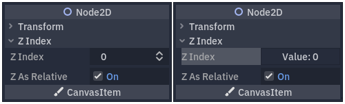

.. _doc_inspector_plugins:

Inspector plugins
=================

The inspector dock allows you to create custom widgets to edit properties
through plugins. This can be beneficial when working with custom datatypes and
resources, although you can use the feature to change the inspector widgets for
built-in types. You can design custom controls for specific properties, entire
objects, and even separate controls associated with particular datatypes.

This guide explains how to use the :ref:`class_EditorInspectorPlugin` and
:ref:`class_EditorProperty` classes to create a custom interface for integers,
replacing the default behavior with a button that generates random values
between 0 and 99.

   The default behavior on the left and the end result on the right.

Setting up your plugin
----------------------

Create a new empty plugin to get started.

.. seealso:: See :ref:`doc_making_plugins` guide to set up your new plugin.

Let's assume you've called your plugin folder ``my_inspector_plugin``. If so,
you should end up with a new ``addons/my_inspector_plugin`` folder that contains
two files: ``plugin.cfg`` and ``plugin.gd``.

As before, ``plugin.gd`` is a script extending :ref:`class_EditorPlugin` and you
need to introduce new code for its ``_enter_tree`` and ``_exit_tree`` methods.
To set up your inspector plugin, you must load its script, then create and add
the instance by calling ``add_inspector_plugin()``. If the plugin is disabled,
you should remove the instance you have added by calling
``remove_inspector_plugin()``.

.. note:: Here, you are loading a script and not a packed scene. Therefore you
          should use ``new()`` instead of ``instantiate()``.

.. tabs::
  .. code-tab:: gdscript GDScript

    # plugin.gd
    @tool
    extends EditorPlugin

    var plugin

    func _enter_tree():
        plugin = preload("res://addons/my_inspector_plugin/my_inspector_plugin.gd").new()
        add_inspector_plugin(plugin)

    func _exit_tree():
        remove_inspector_plugin(plugin)

  .. code-tab:: csharp

    // Plugin.cs
    #if TOOLS
    using Godot;

    [Tool]
    public partial class Plugin : EditorPlugin
    {
        private MyInspectorPlugin _plugin;

        public override void _EnterTree()
        {
            _plugin = new MyInspectorPlugin();
            AddInspectorPlugin(_plugin);
        }

        public override void _ExitTree()
        {
            RemoveInspectorPlugin(_plugin);
        }
    }
    #endif

Interacting with the inspector
------------------------------

To interact with the inspector dock, your ``my_inspector_plugin.gd`` script must
extend the :ref:`class_EditorInspectorPlugin` class. This class provides several
virtual methods that affect how the inspector handles properties.

To have any effect at all, the script must implement the ``_can_handle()``
method. This function is called for each edited :ref:`class_Object` and must
return ``true`` if this plugin should handle the object or its properties.

.. note:: This includes any :ref:`class_Resource` attached to the object.

You can implement four other methods to add controls to the inspector at
specific positions. The ``_parse_begin()`` and ``_parse_end()`` methods are called
only once at the beginning and the end of parsing for each object, respectively.
They can add controls at the top or bottom of the inspector layout by calling
``add_custom_control()``.

As the editor parses the object, it calls the ``_parse_category()`` and
``_parse_property()`` methods. There, in addition to ``add_custom_control()``,
you can call both ``add_property_editor()`` and
``add_property_editor_for_multiple_properties()``. Use these last two methods to
specifically add :ref:`class_EditorProperty`-based controls.

.. tabs::
 .. code-tab:: gdscript GDScript

    # my_inspector_plugin.gd
    extends EditorInspectorPlugin

    var RandomIntEditor = preload("res://addons/my_inspector_plugin/random_int_editor.gd")

    func _can_handle(object):
        # We support all objects in this example.
        return true

    func _parse_property(object, type, name, hint_type, hint_string, usage_flags, wide):
        # We handle properties of type integer.
        if type == TYPE_INT:
            # Create an instance of the custom property editor and register
            # it to a specific property path.
            add_property_editor(name, RandomIntEditor.new())
            # Inform the editor to remove the default property editor for
            # this property type.
            return true
        else:
            return false

 .. code-tab:: csharp

    // MyInspectorPlugin.cs
    #if TOOLS
    using Godot;

    public partial class MyInspectorPlugin : EditorInspectorPlugin
    {
        public override bool _CanHandle(GodotObject @object)
        {
            // We support all objects in this example.
            return true;
        }

        public override bool _ParseProperty(GodotObject @object, Variant.Type type,
            string name, PropertyHint hintType, string hintString,
            PropertyUsageFlags usageFlags, bool wide)
        {
            // We handle properties of type integer.
            if (type == Variant.Type.Int)
            {
                // Create an instance of the custom property editor and register
                // it to a specific property path.
                AddPropertyEditor(name, new RandomIntEditor());
                // Inform the editor to remove the default property editor for
                // this property type.
                return true;
            }

            return false;
        }
    }
    #endif

Adding an interface to edit properties
--------------------------------------

The :ref:`class_EditorProperty` class is a special type of :ref:`class_Control`
that can interact with the inspector dock's edited objects. It doesn't display
anything but can house any other control nodes, including complex scenes.

There are three essential parts to the script extending
:ref:`class_EditorProperty`:

1. You must define the ``_init()`` method to set up the control nodes'
   structure.

2. You should implement the ``_update_property()`` to handle changes to the data
   from the outside.

3. A signal must be emitted at some point to inform the inspector that the
   control has changed the property using ``emit_changed``.

You can display your custom widget in two ways. Use just the default ``add_child()``
method to display it to the right of the property name, and use ``add_child()``
followed by ``set_bottom_editor()`` to position it below the name.

.. FIXME: The second tab has the C# lexer for hightlighting disabled for now, as the provided code causes errors.

.. tabs::
 .. code-tab:: gdscript GDScript

    # random_int_editor.gd
    extends EditorProperty

    # The main control for editing the property.
    var property_control = Button.new()
    # An internal value of the property.
    var current_value = 0
    # A guard against internal changes when the property is updated.
    var updating = false

    func _init():
        # Add the control as a direct child of EditorProperty node.
        add_child(property_control)
        # Make sure the control is able to retain the focus.
        add_focusable(property_control)
        # Setup the initial state and connect to the signal to track changes.
        refresh_control_text()
        property_control.pressed.connect(_on_button_pressed)

    func _on_button_pressed():
        # Ignore the signal if the property is currently being updated.
        if (updating):
            return

        # Generate a new random integer between 0 and 99.
        current_value = randi() % 100
        refresh_control_text()
        emit_changed(get_edited_property(), current_value)

    func _update_property():
        # Read the current value from the property.
        var new_value = get_edited_object()[get_edited_property()]
        if (new_value == current_value):
            return

        # Update the control with the new value.
        updating = true
        current_value = new_value
        refresh_control_text()
        updating = false

    func refresh_control_text():
        property_control.text = "Value: " + str(current_value)

 .. code-tab:: csharp

    // RandomIntEditor.cs
    #if TOOLS
    using Godot;

    public partial class RandomIntEditor : EditorProperty
    {
        // The main control for editing the property.
        private Button _propertyControl = new Button();
        // An internal value of the property.
        private int _currentValue = 0;
        // A guard against internal changes when the property is updated.
        private bool _updating = false;

        public RandomIntEditor()
        {
            // Add the control as a direct child of EditorProperty node.
            AddChild(_propertyControl);
            // Make sure the control is able to retain the focus.
            AddFocusable(_propertyControl);
            // Setup the initial state and connect to the signal to track changes.
            RefreshControlText();
            _propertyControl.Pressed += OnButtonPressed;
        }

        private void OnButtonPressed()
        {
            // Ignore the signal if the property is currently being updated.
            if (_updating)
            {
                return;
            }

            // Generate a new random integer between 0 and 99.
            _currentValue = (int)GD.Randi() % 100;
            RefreshControlText();
            EmitChanged(GetEditedProperty(), _currentValue);
        }

        public override void _UpdateProperty()
        {
            // Read the current value from the property.
            var newValue = (int)GetEditedObject().Get(GetEditedProperty());
            if (newValue == _currentValue)
            {
                return;
            }

            // Update the control with the new value.
            _updating = true;
            _currentValue = newValue;
            RefreshControlText();
            _updating = false;
        }

        private void RefreshControlText()
        {
            _propertyControl.Text = $"Value: {_currentValue}";
        }
    }
    #endif

Using the example code above you should be able to make a custom widget that
replaces the default :ref:`class_SpinBox` control for integers with a
:ref:`class_Button` that generates random values.
