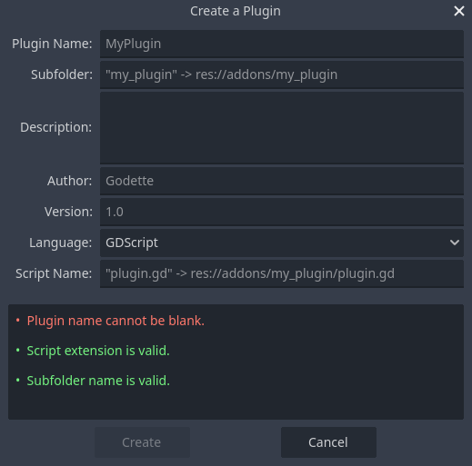
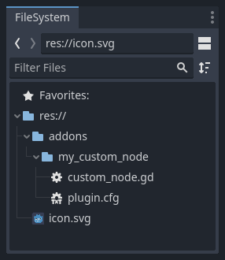
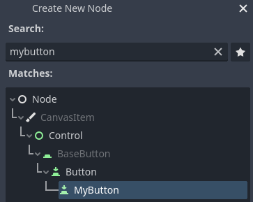
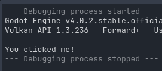
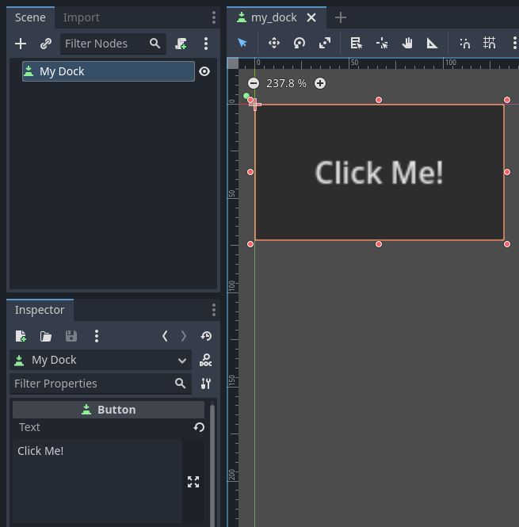
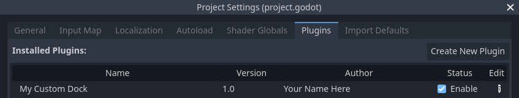
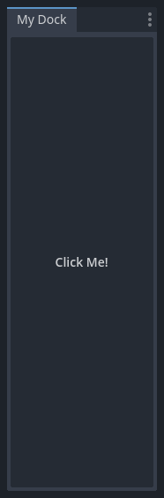
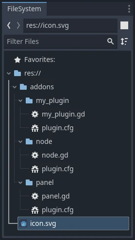
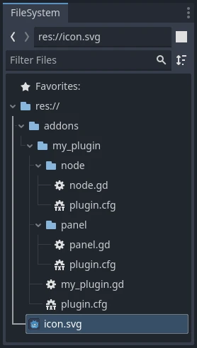

.. _doc_making_plugins:

Making plugins
==============

About plugins
-------------

A plugin is a great way to extend the editor with useful tools. It can be made
entirely with GDScript and standard scenes, without even reloading the editor.
Unlike modules, you don't need to create C++ code nor recompile the engine.
While this makes plugins less powerful, there are still many things you can
do with them. Note that a plugin is similar to any scene you can already
make, except it is created using a script to add editor functionality.

This tutorial will guide you through the creation of two plugins so
you can understand how they work and be able to develop your own. The first
is a custom node that you can add to any scene in the project, and the
other is a custom dock added to the editor.

Creating a plugin
-----------------

Before starting, create a new empty project wherever you want. This will serve
as a base to develop and test the plugins.

The first thing you need for the editor to identify a new plugin is to
create two files: a ``plugin.cfg`` for configuration and a tool script with the
functionality. Plugins have a standard path like ``addons/plugin_name`` inside
the project folder. Godot provides a dialog for generating those files and
placing them where they need to be.

In the main toolbar, click the ``Project`` dropdown. Then click
``Project Settings...``. Go to the ``Plugins`` tab and then click
on the :button:`Create New Plugin` button in the top-right.

You will see the dialog appear, like so:

The placeholder text in each field describes how it affects the plugin's
creation of the files and the config file's values.

To continue with the example, use the following values:

.. tabs::
 .. code-tab:: ini GDScript

    Plugin Name: My Custom Node
    Subfolder: my_custom_node
    Description: A custom node made to extend the Godot Engine.
    Author: Your Name Here
    Version: 1.0.0
    Language: GDScript
    Script Name: custom_node.gd
    Activate now: No

 .. code-tab:: ini C#

    Plugin Name: My Custom Node
    Subfolder: MyCustomNode
    Description: A custom node made to extend the Godot Engine.
    Author: Your Name Here
    Version: 1.0.0
    Language: C#
    Script Name: CustomNode.cs
    Activate now: No

.. warning::

    Unchecking the ``Activate now?`` option in C# is always required because,
    like every other C# script, the EditorPlugin script needs to be compiled which
    requires building the project. After building the project the plugin can be
    enabled in the ``Plugins`` tab of ``Project Settings``.

You should end up with a directory structure like this:

``plugin.cfg`` is an INI file with metadata about your plugin.
The name and description help people understand what it does.
Your name helps you get properly credited for your work.
The version number helps others know if they have an outdated version;
if you are unsure on how to come up with the version number, check out `Semantic Versioning <https://semver.org/>`_.
The main script file will instruct Godot what your plugin does in the editor
once it is active.

The script file
~~~~~~~~~~~~~~~

Upon creation of the plugin, the dialog will automatically open the
EditorPlugin script for you. The script has two requirements that you cannot
change: it must be a ``@tool`` script, or else it will not load properly in the
editor, and it must inherit from :ref:`class_EditorPlugin`.

.. warning::

    In addition to the EditorPlugin script, any other GDScript that your plugin uses
    must *also* be a tool. Any GDScript without ``@tool`` used by the editor
    will act like an empty file!

It's important to deal with initialization and clean-up of resources.
A good practice is to use the virtual function
:ref:`_enter_tree() <class_Node_private_method__enter_tree>` to initialize your plugin and
:ref:`_exit_tree() <class_Node_private_method__exit_tree>` to clean it up. Thankfully,
the dialog generates these callbacks for you. Your script should look something
like this:

.. _doc_making_plugins_template_code:
.. tabs::
 .. code-tab:: gdscript GDScript

    @tool
    extends EditorPlugin

    func _enter_tree():
        # Initialization of the plugin goes here.
        pass

    func _exit_tree():
        # Clean-up of the plugin goes here.
        pass

 .. code-tab:: csharp

    #if TOOLS
    using Godot;

    [Tool]
    public partial class CustomNode : EditorPlugin
    {
        public override void _EnterTree()
        {
            // Initialization of the plugin goes here.
        }

        public override void _ExitTree()
        {
            // Clean-up of the plugin goes here.
        }
    }
    #endif

This is a good template to use when creating new plugins.

A custom node
-------------

Sometimes you want a certain behavior in many nodes, such as a custom scene
or control that can be reused. Instancing is helpful in a lot of cases, but
sometimes it can be cumbersome, especially if you're using it in many
projects. A good solution to this is to make a plugin that adds a node with a
custom behavior.

.. warning::

  Nodes added via an EditorPlugin are "CustomType" nodes. While they work
  with any scripting language, they have fewer features than
  :ref:`the Script Class system <doc_gdscript_basics_class_name>`. If you
  are writing GDScript or NativeScript, we recommend using Script Classes instead.

To create a new node type, you can use the function
:ref:`add_custom_type() <class_EditorPlugin_method_add_custom_type>` from the
:ref:`class_EditorPlugin` class. This function can add new types to the editor
(nodes or resources). However, before you can create the type, you need a script
that will act as the logic for the type. While that script doesn't have to use
the ``@tool`` annotation, it can be added so the script runs in the editor.

For this tutorial, we'll create a button that prints a message when
clicked. For that, we'll need a script that extends from
:ref:`class_Button`. It could also extend
:ref:`class_BaseButton` if you prefer:

.. tabs::
 .. code-tab:: gdscript GDScript

    @tool
    extends Button

    func _enter_tree():
        pressed.connect(clicked)

    func clicked():
        print("You clicked me!")

 .. code-tab:: csharp

    using Godot;

    [Tool]
    public partial class MyButton : Button
    {
        public override void _EnterTree()
        {
            Pressed += Clicked;
        }

        public void Clicked()
        {
            GD.Print("You clicked me!");
        }
    }

That's it for our basic button. You can save this as ``my_button.gd`` inside the
plugin folder. You'll also need a 16×16 icon to show in the scene tree. If you
don't have one, you can grab the default one from the engine and save it in your
`addons/my_custom_node` folder as `icon.png`, or use the default Godot logo
(`preload("res://icon.svg")`).

.. tip::

    SVG images that are used as custom node icons should have the
    **Editor > Scale With Editor Scale** and **Editor > Convert Colors With Editor Theme**
    :ref:`import options <doc_importing_images_editor_import_options>` enabled. This allows
    icons to follow the editor's scale and theming settings if the icons are designed with
    the same color palette as Godot's own icons.

Now, we need to add it as a custom type so it shows on the **Create New Node**
dialog. For that, change the ``custom_node.gd`` script to the following:

.. tabs::
 .. code-tab:: gdscript GDScript

    @tool
    extends EditorPlugin

    func _enter_tree():
        # Initialization of the plugin goes here.
        # Add the new type with a name, a parent type, a script and an icon.
        add_custom_type("MyButton", "Button", preload("my_button.gd"), preload("icon.png"))

    func _exit_tree():
        # Clean-up of the plugin goes here.
        # Always remember to remove it from the engine when deactivated.
        remove_custom_type("MyButton")

 .. code-tab:: csharp

    #if TOOLS
    using Godot;

    [Tool]
    public partial class CustomNode : EditorPlugin
    {
        public override void _EnterTree()
        {
            // Initialization of the plugin goes here.
            // Add the new type with a name, a parent type, a script and an icon.
            var script = GD.Load<Script>("res://addons/MyCustomNode/MyButton.cs");
            var texture = GD.Load<Texture2D>("res://addons/MyCustomNode/Icon.png");
            AddCustomType("MyButton", "Button", script, texture);
        }

        public override void _ExitTree()
        {
            // Clean-up of the plugin goes here.
            // Always remember to remove it from the engine when deactivated.
            RemoveCustomType("MyButton");
        }
    }
    #endif

With that done, the plugin should already be available in the plugin list in the
**Project Settings**, so activate it as explained in `Checking the results`_.

Then try it out by adding your new node:

When you add the node, you can see that it already has the script you created
attached to it. Set a text to the button, save and run the scene. When you
click the button, you can see some text in the console:

A custom dock
-------------

Sometimes, you need to extend the editor and add tools that are always available.
An easy way to do it is to add a new dock with a plugin. Docks are just scenes
based on Control, so they are created in a way similar to usual GUI scenes.

Creating a custom dock is done just like a custom node. Create a new
``plugin.cfg`` file in the ``addons/my_custom_dock`` folder, then
add the following content to it:

.. tabs::
 .. code-tab:: gdscript GDScript

    [plugin]

    name="My Custom Dock"
    description="A custom dock made so I can learn how to make plugins."
    author="Your Name Here"
    version="1.0"
    script="custom_dock.gd"

 .. code-tab:: csharp

    [plugin]

    name="My Custom Dock"
    description="A custom dock made so I can learn how to make plugins."
    author="Your Name Here"
    version="1.0"
    script="CustomDock.cs"

Then create the script ``custom_dock.gd`` in the same folder. Fill it with the
:ref:`template we've seen before <doc_making_plugins_template_code>` to get a
good start.

Since we're trying to add a new custom dock, we need to create the contents of
the dock. This is nothing more than a standard Godot scene: just create
a new scene in the editor then edit it.

For an editor dock, the root node **must** be a :ref:`Control <class_Control>`
or one of its child classes. For this tutorial, you can create a single button.
The name of the root node will also be the name that appears on the dock tab,
so be sure to give it a short and descriptive name.
Also, don't forget to add some text to your button.

Save this scene as ``my_dock.tscn``. Now, we need to grab the scene we created
then add it as a dock in the editor. For this, you can rely on the function
:ref:`add_control_to_dock() <class_EditorPlugin_method_add_control_to_dock>` from the
:ref:`EditorPlugin <class_EditorPlugin>` class.

You need to select a dock position and define the control to add
(which is the scene you just created). Don't forget to
**remove the dock** when the plugin is deactivated.
The script could look like this:

.. tabs::
 .. code-tab:: gdscript GDScript

    @tool
    extends EditorPlugin

    # A class member to hold the dock during the plugin life cycle.
    var dock

    func _enter_tree():
        # Initialization of the plugin goes here.
        # Load the dock scene and instantiate it.
        dock = preload("res://addons/my_custom_dock/my_dock.tscn").instantiate()

        # Add the loaded scene to the docks.
        add_control_to_dock(DOCK_SLOT_LEFT_UL, dock)
        # Note that LEFT_UL means the left of the editor, upper-left dock.

    func _exit_tree():
        # Clean-up of the plugin goes here.
        # Remove the dock.
        remove_control_from_docks(dock)
        # Erase the control from the memory.
        dock.free()

 .. code-tab:: csharp

    #if TOOLS
    using Godot;

    [Tool]
    public partial class CustomDock : EditorPlugin
    {
        private Control _dock;

        public override void _EnterTree()
        {
            _dock = GD.Load<PackedScene>("res://addons/MyCustomDock/MyDock.tscn").Instantiate<Control>();
            AddControlToDock(DockSlot.LeftUl, _dock);
        }

        public override void _ExitTree()
        {
            // Clean-up of the plugin goes here.
            // Remove the dock.
            RemoveControlFromDocks(_dock);
            // Erase the control from the memory.
            _dock.Free();
        }
    }
    #endif

Note that, while the dock will initially appear at its specified position,
the user can freely change its position and save the resulting layout.

Checking the results
~~~~~~~~~~~~~~~~~~~~

It's now time to check the results of your work. Open the **Project
Settings** and click on the **Plugins** tab. Your plugin should be the only one
on the list.

You can see the plugin is not enabled.
Click the **Enable** checkbox to activate the plugin.
The dock should become visible before you even close
the settings window. You should now have a custom dock:

.. _doc_making_plugins_autoload:

Registering autoloads/singletons in plugins
-------------------------------------------

It is possible for editor plugins to automatically register
:ref:`autoloads <doc_singletons_autoload>` when the plugin is enabled.
This also includes unregistering the autoload when the plugin is disabled.

This makes setting up plugins faster for users, as they no longer have to manually
add autoloads to their project settings if your editor plugin requires the use of
an autoload.

Use the following code to register a singleton from an editor plugin:

.. tabs::
 .. code-tab:: gdscript GDScript

    @tool
    extends EditorPlugin

    # Replace this value with a PascalCase autoload name, as per the GDScript style guide.
    const AUTOLOAD_NAME = "SomeAutoload"

    func _enable_plugin():
        # The autoload can be a scene or script file.
        add_autoload_singleton(AUTOLOAD_NAME, "res://addons/my_addon/some_autoload.tscn")

    func _disable_plugin():
        remove_autoload_singleton(AUTOLOAD_NAME)

 .. code-tab:: csharp

    #if TOOLS
    using Godot;

    [Tool]
    public partial class MyEditorPlugin : EditorPlugin
    {
        // Replace this value with a PascalCase autoload name.
        private const string AutoloadName = "SomeAutoload";

        public override void _EnablePlugin()
        {
            // The autoload can be a scene or script file.
            AddAutoloadSingleton(AutoloadName, "res://addons/MyAddon/SomeAutoload.tscn");
        }

        public override void _DisablePlugin()
        {
            RemoveAutoloadSingleton(AutoloadName);
        }
    }
    #endif

Using sub-plugins
-----------------

Often a plugin adds multiple things, for example a custom node and a panel.
In those cases it might be easier to have a separate plugin script for each of those features.
Sub-plugins can be used for this.

First create all plugins and sub plugins as normal plugins:

Then move the sub plugins into the main plugin folder:

Godot will hide sub-plugins from the plugin list, so that a user can't enable or disable them.
Instead the main plugin script should enable and disable sub-plugins like this:

.. tabs::
 .. code-tab:: gdscript GDScript

    @tool
    extends EditorPlugin

    # The main plugin is located at res://addons/my_plugin/
    const PLUGIN_NAME = "my_plugin"

    func _enable_plugin():
        EditorInterface.set_plugin_enabled(PLUGIN_NAME + "/node", true)
        EditorInterface.set_plugin_enabled(PLUGIN_NAME + "/panel", true)

    func _disable_plugin():
        EditorInterface.set_plugin_enabled(PLUGIN_NAME + "/node", false)
        EditorInterface.set_plugin_enabled(PLUGIN_NAME + "/panel", false)

Going beyond
------------

Now that you've learned how to make basic plugins, you can extend the editor in
several ways. Lots of functionality can be added to the editor with GDScript;
it is a powerful way to create specialized editors without having to delve into
C++ modules.

You can make your own plugins to help yourself and share them in the
`Asset Library <https://godotengine.org/asset-library/>`_ so that people
can benefit from your work.
