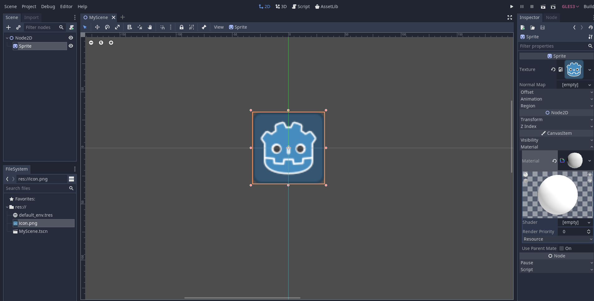
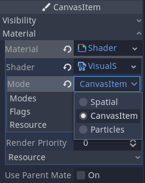
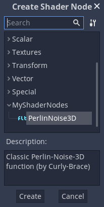
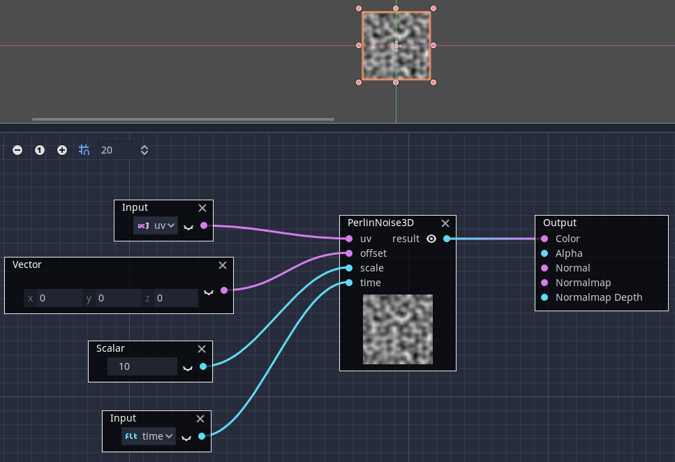

.. _doc_visual_shader_plugins:

Visual Shader plugins
=====================

Visual Shader plugins are used to create custom :ref:`class_VisualShader` nodes
in GDScript.

The creation process is different from usual editor plugins. You do not need to
create a ``plugin.cfg`` file to register it; instead, create and save a script
file and it will be ready to use, provided the custom node is registered with
``class_name``.

This short tutorial will explain how to make a Perlin-3D noise node (original
code from this `GPU noise shaders plugin
<https://github.com/curly-brace/Godot-3.0-Noise-Shaders/blob/master/assets/gpu_noise_shaders/classic_perlin3d.tres>`_.

Create a Sprite2D and assign a :ref:`class_ShaderMaterial` to its material slot:

Assign :ref:`class_VisualShader` to the shader slot of the material:

.. image:: img/visual_shader_plugins_start2.png

Don't forget to change its mode to "CanvasItem" (if you are using a Sprite2D):

Create a script which derives from :ref:`class_VisualShaderNodeCustom`. This is
all you need to initialize your plugin.

::

    # perlin_noise_3d.gd
    @tool
    extends VisualShaderNodeCustom
    class_name VisualShaderNodePerlinNoise3D

    func _get_name():
        return "PerlinNoise3D"

    func _get_category():
        return "MyShaderNodes"

    func _get_description():
        return "Classic Perlin-Noise-3D function (by Curly-Brace)"

    func _init():
        set_input_port_default_value(2, 0.0)

    func _get_return_icon_type():
        return VisualShaderNode.PORT_TYPE_SCALAR

    func _get_input_port_count():
        return 4

    func _get_input_port_name(port):
        match port:
            0:
                return "uv"
            1:
                return "offset"
            2:
                return "scale"
            3:
                return "time"

    func _get_input_port_type(port):
        match port:
            0:
                return VisualShaderNode.PORT_TYPE_VECTOR_3D
            1:
                return VisualShaderNode.PORT_TYPE_VECTOR_3D
            2:
                return VisualShaderNode.PORT_TYPE_SCALAR
            3:
                return VisualShaderNode.PORT_TYPE_SCALAR

    func _get_output_port_count():
        return 1

    func _get_output_port_name(port):
        return "result"

    func _get_output_port_type(port):
        return VisualShaderNode.PORT_TYPE_SCALAR

    func _get_global_code(mode):
        return """
            vec3 mod289_3(vec3 x) {
                return x - floor(x * (1.0 / 289.0)) * 289.0;
            }

            vec4 mod289_4(vec4 x) {
                return x - floor(x * (1.0 / 289.0)) * 289.0;
            }

            vec4 permute(vec4 x) {
                return mod289_4(((x * 34.0) + 1.0) * x);
            }

            vec4 taylorInvSqrt(vec4 r) {
                return 1.79284291400159 - 0.85373472095314 * r;
            }

            vec3 fade(vec3 t) {
                return t * t * t * (t * (t * 6.0 - 15.0) + 10.0);
            }

            // Classic Perlin noise.
            float cnoise(vec3 P) {
                vec3 Pi0 = floor(P); // Integer part for indexing.
                vec3 Pi1 = Pi0 + vec3(1.0); // Integer part + 1.
                Pi0 = mod289_3(Pi0);
                Pi1 = mod289_3(Pi1);
                vec3 Pf0 = fract(P); // Fractional part for interpolation.
                vec3 Pf1 = Pf0 - vec3(1.0); // Fractional part - 1.0.
                vec4 ix = vec4(Pi0.x, Pi1.x, Pi0.x, Pi1.x);
                vec4 iy = vec4(Pi0.yy, Pi1.yy);
                vec4 iz0 = vec4(Pi0.z);
                vec4 iz1 = vec4(Pi1.z);

                vec4 ixy = permute(permute(ix) + iy);
                vec4 ixy0 = permute(ixy + iz0);
                vec4 ixy1 = permute(ixy + iz1);

                vec4 gx0 = ixy0 * (1.0 / 7.0);
                vec4 gy0 = fract(floor(gx0) * (1.0 / 7.0)) - 0.5;
                gx0 = fract(gx0);
                vec4 gz0 = vec4(0.5) - abs(gx0) - abs(gy0);
                vec4 sz0 = step(gz0, vec4(0.0));
                gx0 -= sz0 * (step(0.0, gx0) - 0.5);
                gy0 -= sz0 * (step(0.0, gy0) - 0.5);

                vec4 gx1 = ixy1 * (1.0 / 7.0);
                vec4 gy1 = fract(floor(gx1) * (1.0 / 7.0)) - 0.5;
                gx1 = fract(gx1);
                vec4 gz1 = vec4(0.5) - abs(gx1) - abs(gy1);
                vec4 sz1 = step(gz1, vec4(0.0));
                gx1 -= sz1 * (step(0.0, gx1) - 0.5);
                gy1 -= sz1 * (step(0.0, gy1) - 0.5);

                vec3 g000 = vec3(gx0.x, gy0.x, gz0.x);
                vec3 g100 = vec3(gx0.y, gy0.y, gz0.y);
                vec3 g010 = vec3(gx0.z, gy0.z, gz0.z);
                vec3 g110 = vec3(gx0.w, gy0.w, gz0.w);
                vec3 g001 = vec3(gx1.x, gy1.x, gz1.x);
                vec3 g101 = vec3(gx1.y, gy1.y, gz1.y);
                vec3 g011 = vec3(gx1.z, gy1.z, gz1.z);
                vec3 g111 = vec3(gx1.w, gy1.w, gz1.w);

                vec4 norm0 = taylorInvSqrt(vec4(dot(g000, g000), dot(g010, g010), dot(g100, g100), dot(g110, g110)));
                g000 *= norm0.x;
                g010 *= norm0.y;
                g100 *= norm0.z;
                g110 *= norm0.w;
                vec4 norm1 = taylorInvSqrt(vec4(dot(g001, g001), dot(g011, g011), dot(g101, g101), dot(g111, g111)));
                g001 *= norm1.x;
                g011 *= norm1.y;
                g101 *= norm1.z;
                g111 *= norm1.w;

                float n000 = dot(g000, Pf0);
                float n100 = dot(g100, vec3(Pf1.x, Pf0.yz));
                float n010 = dot(g010, vec3(Pf0.x, Pf1.y, Pf0.z));
                float n110 = dot(g110, vec3(Pf1.xy, Pf0.z));
                float n001 = dot(g001, vec3(Pf0.xy, Pf1.z));
                float n101 = dot(g101, vec3(Pf1.x, Pf0.y, Pf1.z));
                float n011 = dot(g011, vec3(Pf0.x, Pf1.yz));
                float n111 = dot(g111, Pf1);

                vec3 fade_xyz = fade(Pf0);
                vec4 n_z = mix(vec4(n000, n100, n010, n110), vec4(n001, n101, n011, n111), fade_xyz.z);
                vec2 n_yz = mix(n_z.xy, n_z.zw, fade_xyz.y);
                float n_xyz = mix(n_yz.x, n_yz.y, fade_xyz.x);
                return 2.2 * n_xyz;
            }
        """

    func _get_code(input_vars, output_vars, mode, type):
        return output_vars[0] + " = cnoise(vec3((%s.xy + %s.xy) * %s, %s)) * 0.5 + 0.5;" % [input_vars[0], input_vars[1], input_vars[2], input_vars[3]]

Save it and open the Visual Shader. You should see your new node type within the member's dialog under the Addons category (if you can't see your new node, try restarting the editor):

Place it on a graph and connect the required ports:

That is everything you need to do, as you can see it is easy to create your own custom VisualShader nodes!
