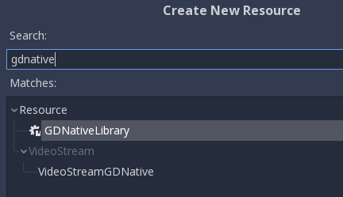
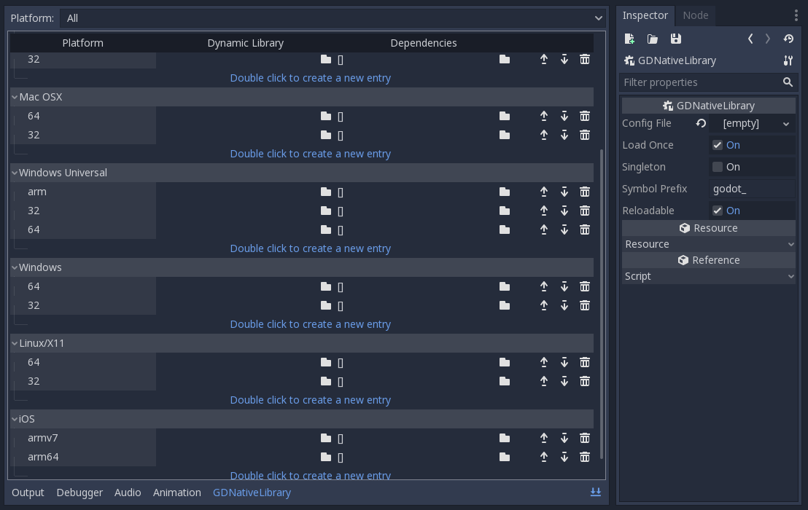
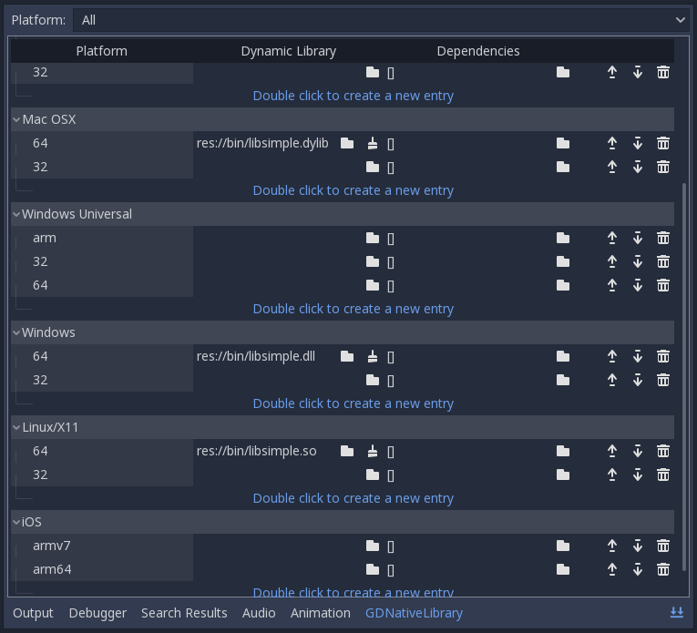
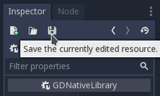
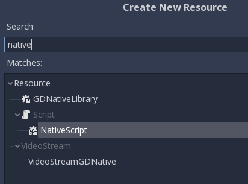
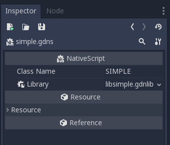
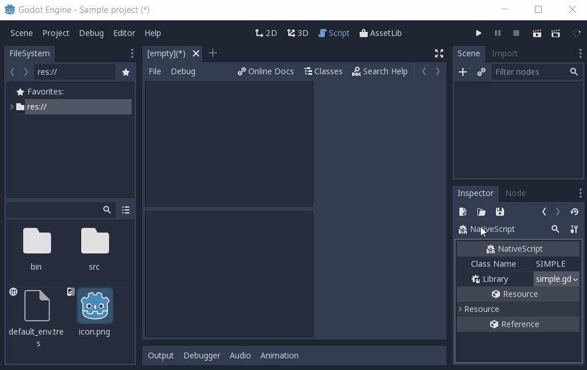
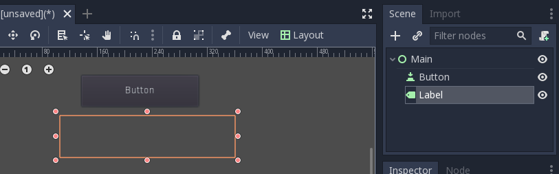
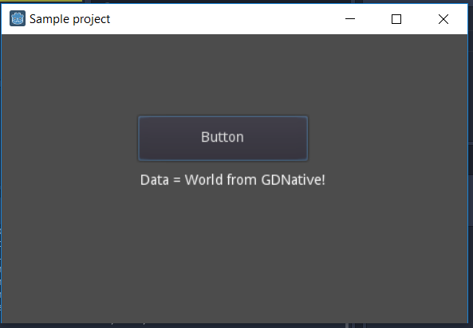

.. _doc_gdnative_c_example:

GDNative C example
==================

Introduction
------------

This tutorial will introduce you to the bare minimum required to create GDNative
modules. This should be your starting point into the world of GDNative.
Understanding the contents of this tutorial will help you in understanding all
that is to come after this.

Before we begin, you can download the source code to the example object we
describe below in the `GDNative-demos repository
<https://github.com/GodotNativeTools/GDNative-demos/tree/master/c/SimpleDemo>`_.

This example project also contains a SConstruct file that makes compiling a
little easier, but in this tutorial we'll be doing things by hand to
understand the process.

:ref:`GDNative <class_GDNative>` can be used to create several types of
additions to Godot, using interfaces such as
:ref:`PluginScript <class_PluginScript>` or
:ref:`ARVRInterfaceGDNative <class_ARVRInterfaceGDNative>`. In this tutorial we
are going to look at creating a :ref:`NativeScript <class_NativeScript>`
module. NativeScript allows you to write logic in C or C++ in a similar fashion
as you would write a GDScript file. We'll be creating the C equivalent of this
GDScript:

::

    extends Reference

    var data

    func _ready():
        data = "World from GDScript!"

    func get_data():
        return data

Future tutorials will focus on the other types of GDNative modules and explain
when and how to use each of them.

Prerequisites
-------------

Before we start you'll need a few things:

1) A Godot executable for your target version.
2) A C compiler. On Linux, install ``gcc`` or ``clang`` from your package
   manager. On macOS, you can install Xcode from the Mac App Store. On Windows,
   you can use Visual Studio 2015 or later, or MinGW-w64.
3) A Git clone of the `godot_headers
   repository <https://github.com/GodotNativeTools/godot_headers>`_: these are
   the C headers for Godot's public API exposed to GDNative.

For the latter, we suggest that you create a dedicated folder for this GDNative
example project, open a terminal in that folder and execute:

.. code-block:: none

    git clone https://github.com/GodotNativeTools/godot_headers

This will download the required files into that folder.

.. tip::

    If you plan to use Git for your GDNative project, you can also add
    ``godot_headers`` as a Git submodule.

.. note::

    The ``godot_headers`` repository has different branches. As Godot evolves,
    so does GDNative. While we try to preserve compatibility between version,
    you should always build your GDNative module against headers matching the
    Godot stable branch (e.g. ``3.1``) and ideally actual release (e.g.
    ``3.1.1-stable``) that you use.
    GDNative modules built against older versions of the Godot headers *may*
    work with newer versions of the engine, but not the other way around.

The ``master`` branch of the ``godot_headers`` repository is kept in line with
the ``master`` branch of Godot and thus contains the GDNative class and
structure definitions that will work with the latest development builds.

If you want to write a GDNative module for a stable version of Godot, look at
the available Git tags (with ``git tags``) for the one matching your engine
version. In the ``godot_headers`` repository, such tags are prefixed with
``godot-``, so you can e.g. checkout the ``godot-3.1.1-stable`` tag for use with
Godot 3.1.1. In your cloned repository, you can do:

.. code-block:: none

    git checkout godot-3.1.1-stable

If a tag matching your stable release is missing for any reason, you can fall
back to the matching stable branch (e.g. ``3.1``), which you would also check
out with ``git checkout 3.1``.

If you are building Godot from source with your own changes that impact
GDNative, you can find the updated class and structure definition in
``<godotsource>/modules/gdnative/include``

Our C source
------------

Let's start by writing our main code. Eventually, we want to end up with a file
structure that looks along those lines:

.. code-block:: none

    + <your development folder>
      + godot_headers
        - <lots of files here>
      + simple
        + bin
          - libsimple.dll/so/dylib
          - libsimple.gdnlib
          - simple.gdns
        main.tscn
        project.godot
      + src
        - simple.c

Open up Godot and create a new project called "simple" alongside your
``godot_headers`` Git clone. This will create the ``simple`` folder and
``project.godot`` file. Then manually create a ``src`` folder alongside the
``simple`` folder, and a ``bin`` subfolder in the ``simple`` folder.

We're going to start by having a look at what our ``simple.c`` file contains.
Now, for our example here we're making a single C source file without a header
to keep things simple. Once you start writing bigger projects it is advisable
to break your project up into multiple files. That however falls outside of the
scope of this tutorial.

We'll be looking at the source code bit by bit so all the parts below should all
be put together into one big file. Each section will be explained as we add it.

.. code-block:: C

    #include <gdnative_api_struct.gen.h>

    #include <string.h>

    const godot_gdnative_core_api_struct *api = NULL;
    const godot_gdnative_ext_nativescript_api_struct *nativescript_api = NULL;

The above code includes the GDNative API struct header and a standard header
that we will use further down for string operations.
It then defines two pointers to two different structs. GDNative supports a large
collection of functions for calling back into the main Godot executable. In
order for your module to have access to these functions, GDNative provides your
application with a struct containing pointers to all these functions.

To keep this implementation modular and easily extendable, the core functions
are available directly through the "core" API struct, but additional functions
have their own "GDNative structs" that are accessible through extensions.

In our example, we access one of these extension to gain access to the functions
specifically needed for NativeScript.

A NativeScript behaves like any other script in Godot. Because the NativeScript
API is rather low level, it requires the library to specify many things more
verbosely than other scripting systems, such as GDScript. When a NativeScript
instance gets created, a library-given constructor gets called. When that
instance gets destroyed, the given destructor will be executed.

.. code-block:: C

    void *simple_constructor(godot_object *p_instance, void *p_method_data);
    void simple_destructor(godot_object *p_instance, void *p_method_data, void *p_user_data);
    godot_variant simple_get_data(godot_object *p_instance, void *p_method_data,
            void *p_user_data, int p_num_args, godot_variant **p_args);

These are forward declarations for the functions we'll be implementing for our
object. A constructor and destructor is needed. Additionally, the object will
have a single method called ``get_data``.

Next up is the first of the entry points Godot will call when our dynamic
library is loaded. These methods are all prefixed with ``godot_`` (you can
change this later on) followed by their name. ``gdnative_init`` is a function
that initializes our dynamic library. Godot will give it a pointer to a
structure that contains various bits of information we may find useful among
which the pointers to our API structures.

For any additional API structures we need to loop through our extensions array
and check the type of extension.

.. code-block:: C

    void GDN_EXPORT godot_gdnative_init(godot_gdnative_init_options *p_options) {
        api = p_options->api_struct;

        // Now find our extensions.
        for (int i = 0; i < api->num_extensions; i++) {
            switch (api->extensions[i]->type) {
                case GDNATIVE_EXT_NATIVESCRIPT: {
                    nativescript_api = (godot_gdnative_ext_nativescript_api_struct *)api->extensions[i];
                }; break;
                default: break;
            }
        }
    }

Next up is ``gdnative_terminate`` which is called before the library is
unloaded. Godot will unload the library when no object uses it anymore. Here,
you can do any cleanup you may need to do. For our example, we're simply going
to clear our API pointers.

.. code-block:: C

    void GDN_EXPORT godot_gdnative_terminate(godot_gdnative_terminate_options *p_options) {
        api = NULL;
        nativescript_api = NULL;
    }

Finally, we have ``nativescript_init`` which is the most important function we'll
need today. This function will be called by Godot as part of loading a GDNative
library and communicates back to the engine what objects we make available.

.. code-block:: C

    void GDN_EXPORT godot_nativescript_init(void *p_handle) {
        godot_instance_create_func create = { NULL, NULL, NULL };
        create.create_func = &simple_constructor;

        godot_instance_destroy_func destroy = { NULL, NULL, NULL };
        destroy.destroy_func = &simple_destructor;

        nativescript_api->godot_nativescript_register_class(p_handle, "Simple", "Reference",
                create, destroy);

        godot_instance_method get_data = { NULL, NULL, NULL };
        get_data.method = &simple_get_data;

        godot_method_attributes attributes = { GODOT_METHOD_RPC_MODE_DISABLED };

        nativescript_api->godot_nativescript_register_method(p_handle, "Simple", "get_data",
                attributes, get_data);
    }

We first tell the engine which classes are implemented by calling
``nativescript_register_class``. The first parameter here is the handle pointer
given to us. The second is the name of our object class. The third is the type
of object in Godot that we 'inherit' from; this is not true inheritance but it's
close enough. Finally, our fourth and fifth parameters are descriptions for our
constructor and destructor.

We then tell Godot about our methods (well our one method in this case), by
calling ``nativescript_register_method`` for each method of our class. In our
case, that is just ``get_data``. Our first parameter is yet again our handle
pointer. The second is again the name of the object class we're registering. The
third is the name of our function as it will be known to GDScript. The fourth is
our attributes setting (see ``godot_method_rpc_mode`` enum in
``godot_headers/nativescript/godot_nativescript.h`` for possible values). The
fifth and final parameter is a description of which function to call when the
method gets called.

The description struct ``instance_method`` contains the function pointer to the
function itself as first field. The other two fields in these structs are for
specifying per-method userdata. The second is the ``method_data`` field which is
passed on every function call as the ``p_method_data`` argument. This is useful
to reuse one function for different methods on possibly multiple different
script-classes. If the ``method_data`` value is a pointer to memory that needs
to be freed, the third ``free_func`` field can contain a pointer to a function
that will free that memory. That free function gets called when the script
itself (not instance!) gets unloaded (so usually at library-unload time).

Now, it's time to start working on the functions of our object. First, we define
a structure that we use to store the member data of an instance of our GDNative
class.

.. code-block:: C

    typedef struct user_data_struct {
        char data[256];
    } user_data_struct;

And then, we define our constructor. All we do in our constructor is allocate
memory for our structure and fill it with some data. Note that we use Godot's
memory functions so the memory gets tracked and then return the pointer to our
new structure. This pointer will act as our instance identifier in case multiple
objects are instantiated.

This pointer will be passed to any of our functions related to our object as a
parameter called ``p_user_data``, and can both be used to identify our instance
and to access its member data.

.. code-block:: C

    void *simple_constructor(godot_object *p_instance, void *p_method_data) {
        user_data_struct *user_data = api->godot_alloc(sizeof(user_data_struct));
        strcpy(user_data->data, "World from GDNative!");

        return user_data;
    }

Our destructor is called when Godot is done with our object and we free our
instances' member data.

.. code-block:: C

    void simple_destructor(godot_object *p_instance, void *p_method_data, void *p_user_data) {
        api->godot_free(p_user_data);
    }

And finally, we implement our ``get_data`` function. Data is always sent and
returned as variants so in order to return our data, which is a string, we first
need to convert our C string to a Godot string object, and then copy that string
object into the variant we are returning.

.. code-block:: C

    godot_variant simple_get_data(godot_object *p_instance, void *p_method_data,
            void *p_user_data, int p_num_args, godot_variant **p_args) {
        godot_string data;
        godot_variant ret;
        user_data_struct *user_data = (user_data_struct *)p_user_data;

        api->godot_string_new(&data);
        api->godot_string_parse_utf8(&data, user_data->data);
        api->godot_variant_new_string(&ret, &data);
        api->godot_string_destroy(&data);

        return ret;
    }

Strings are heap-allocated in Godot, so they have a destructor which frees the
memory. Destructors are named ``godot_TYPENAME_destroy``. When a Variant gets
created with a String, it references the String. That means that the original
String can be "destroyed" to decrease the ref-count. If that does not happen the
String memory will leak since the ref-count will never be zero and the memory
never deallocated. The returned variant gets automatically destroyed by Godot.

.. note::

    In more complex operations it can be confusing the keep track of which value
    needs to be deallocated and which does not. As a general rule: call
    ``godot_TYPENAME_destroy`` when a C++ destructor would be called instead.
    The String destructor would be called in C++ after the Variant was created,
    so the same is necessary in C.

The variant we return is destroyed automatically by Godot.

And that is the whole source code of our module.

Compiling
---------

We now need to compile our source code. As mentioned our example project on
GitHub contains a SCons configuration that does all the hard work for you, but
for our tutorial here we are going to call the compilers directly.

Assuming you are sticking to the folder structure suggested above, it is best to
open a terminal session in the ``src`` folder and execute the commands from
there. Make sure to create the ``bin`` folder before you proceed.

On Linux:

.. code-block:: none

    gcc -std=c11 -fPIC -c -I../godot_headers simple.c -o simple.o
    gcc -rdynamic -shared simple.o -o ../simple/bin/libsimple.so

On macOS:

.. code-block:: none

    clang -std=c11 -fPIC -c -I../godot_headers simple.c -o simple.os
    clang -dynamiclib simple.os -o ../simple/bin/libsimple.dylib

On Windows:

.. code-block:: none

    cl /Fosimple.obj /c simple.c /nologo -EHsc -DNDEBUG /MD /I. /I..\godot_headers
    link /nologo /dll /out:..\simple\bin\libsimple.dll /implib:..\simple\bin\libsimple.lib simple.obj

.. note::

    On the Windows build you also end up with a ``libsimple.lib`` library. This
    is a library that you can compile into a project to provide access to the
    DLL. We get it as a byproduct and we do not need it :)
    When exporting your game for release this file will be ignored.

Creating the GDNativeLibrary (``.gdnlib``) file
-----------------------------------------------

With our module compiled, we now need to create a corresponding
:ref:`GDNativeLibrary <class_GDNativeLibrary>` resource with ``.gdnlib``
extension which we place alongside our dynamic libraries. This file tells Godot
what dynamic libraries are part of our module and need to be loaded per
platform.

We can use Godot to generate this file, so open the "simple" project in the
editor.

Start by clicking the create resource button in the Inspector:

.. image:: img/new_resource.gif

And select ``GDNativeLibrary``:

You should see a contextual editor appear in the bottom panel. Use the "Expand
Bottom Panel" button in the bottom right to expand it to full height:

General properties
~~~~~~~~~~~~~~~~~~

In the Inspector, you have various properties to control loading the library.

If *Load Once* is enabled, our library is loaded only once and each individual
script that uses our library will use the same data. Any variable you define
globally will be accessible from any instance of your object you create. If
*Load Once* is disabled, a new copy of the library is loaded into memory each
time a script accesses the library.

If *Singleton* is enabled, our library is automatically loaded and a function
called ``godot_gdnative_singleton`` is called. We'll leave that for another
tutorial.

The *Symbol Prefix* is a prefix for our core functions, such as ``godot_`` in
``godot_nativescript_init`` seen earlier. If you use multiple GDNative libraries
that you wish to statically link, you will have to use different prefixes. This
again is a subject to dive into deeper in a separate tutorial, it is only needed
at this time for deployment to iOS as this platform does not like dynamic
libraries.

*Reloadable* defines whether the library should be reloaded when the editor
loses and gains focus, typically to pick up new or modified symbols from any
change made to the library externally.

Platform libraries
~~~~~~~~~~~~~~~~~~

The GDNativeLibrary editor plugin lets you configure two things for each
platform and architecture that you aim to support.

The *Dynamic Library* column (``entry`` section in the saved file) tells us for
each platform and feature combination which dynamic library has to be loaded.
This also informs the exporter which files need to be exported when exporting to
a specific platform.

The *Dependencies* column (also ``dependencies`` section) tells Godot what other
files need to be exported for each platform in order for our library to work.
Say that your GDNative module uses another DLL to implement functionality from a
3rd party library, this is where you list that DLL.

For our example, we only built libraries for Linux, macOS and/or Windows, so you
can link them in the relevant fields by clicking the folder button. If you built
all three libraries, you should have something like this:

Saving the resource
~~~~~~~~~~~~~~~~~~~

We can then save our GDNativeLibrary resource as ``bin/libsimple.gdnlib`` with
the Save button in the Inspector:

The file is saved in a text-based format and should have contents similar to
this:

.. code-block:: none

    [general]

    singleton=false
    load_once=true
    symbol_prefix="godot_"
    reloadable=true

    [entry]

    OSX.64="res://bin/libsimple.dylib"
    OSX.32="res://bin/libsimple.dylib"
    Windows.64="res://bin/libsimple.dll"
    X11.64="res://bin/libsimple.so"

    [dependencies]

    OSX.64=[  ]
    OSX.32=[  ]
    Windows.64=[  ]
    X11.64=[  ]

Creating the NativeScript (``.gdns``) file
------------------------------------------

With our ``.gdnlib`` file we've told Godot how to load our library, now we need
to tell it about our "Simple" object class. We do this by creating a
:ref:`NativeScript <class_NativeScript>` resource file with ``.gdns`` extension.

Like done for the GDNativeLibrary resource, click the button to create a new
resource in the Inspector and select ``NativeScript``:

The inspector will show a few properties that we need to fill. As *Class Name*
we enter "Simple" which is the object class name that we declared in our C
source when calling ``godot_nativescript_register_class``. We also need to
select our ``.gdnlib`` file by clicking on *Library* and selecting *Load*:

Finally, click on the save icon and save this as ``bin/simple.gdns``:

Now it's time to build our scene. Add a Control node to your scene as your root
and call it ``main``. Then add a Button and a Label as child nodes. Place them
somewhere nice on screen and give your button a name.

Select the control node and attach a script to it:

.. image:: img/add_main_script.gif

Next link up the ``pressed`` signal on the button to your script:

.. image:: img/connect_button_signal.gif

Don't forget to save your scene, call it ``main.tscn``.

Now we can implement our ``main.gd`` code:

::

    extends Control

    # load the Simple library
    onready var data = preload("res://bin/simple.gdns").new()

    func _on_Button_pressed():
        $Label.text = "Data = " + data.get_data()

After all that, our project should work. The first time you run it Godot will
ask you what your main scene is and you select your ``main.tscn`` file and
presto:

