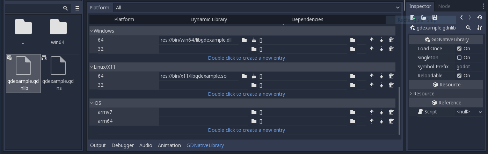
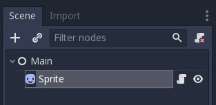
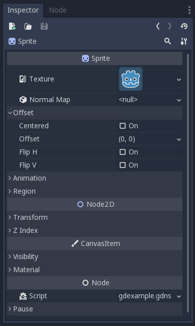
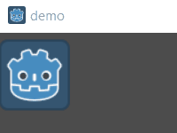

.. _doc_gdnative_cpp_example:

GDNative C++ example
====================

Introduction
------------

This tutorial builds on top of the information given in the
:ref:`GDNative C example <doc_gdnative_c_example>`, so we highly
recommend you read that first.

The C++ bindings for GDNative are built on top of the
NativeScript GDNative API and provide a nicer way to "extend" nodes
in Godot using C++. This is equivalent to writing scripts in GDScript,
but in C++ instead.

We'll be looking at NativeScript 1.0 which is available in Godot 3.0.
Godot 3.1 will see the introduction of NativeScript 1.1, which comes with a
number of improvements. We'll update this tutorial once it is
officially released, but the overall structure remains similar.

You can download the full example we'll be creating in this tutorial
`on GitHub <https://github.com/BastiaanOlij/gdnative_cpp_example>`_.

Setting up the project
----------------------

There are a few prerequisites you'll need:

- a Godot 3.x executable,
- a C++ compiler,
- SCons as a build tool,
- a copy of the `godot_headers repository <https://github.com/GodotNativeTools/godot_headers>`_,
- a copy of the `godot-cpp repository <https://github.com/GodotNativeTools/godot-cpp>`_.

See also :ref:`Compiling <toc-devel-compiling>` as the build tools are identical
to the ones you need to compile Godot from source.

You can download these repositories from GitHub or let Git
do the work for you. 
Note that these repositories now have different branches for different versions of Godot. GDNative modules written for an earlier version of Godot will work in newer versions (with the exception of one breaking change in ARVR interfaces between 3.0 and 3.1) but not vise versa so make sure you download the correct branch.

If you are versioning your project using Git,
it is a good idea to add them as Git submodules:

.. code-block:: none

    mkdir gdnative_cpp_example
    cd gdnative_cpp_example
    git init
    git submodule add -b 3.0 https://github.com/GodotNativeTools/godot-cpp
    cd godot-cpp
    git submodule init
    git submodule update
    cd ..

If you decide to just download the repositories or clone them
into your project folder, make sure to keep the folder layout identical
to the one described here, as much of the code we'll be showcasing here
assumes the project follows this layout.

Do make sure you clone recursive to pull in both repositories:
.. code-block:: none

    mkdir gdnative_cpp_example
    cd gdnative_cpp_example
    git clone --recursive -b 3.0 https://github.com/GodotNativeTools/godot-cpp

.. note:: The ``-b 3.0`` I've added as an example to show how to select a specific branch for a specific version of Godot.
          Also ``godot-cpp`` now includes ``godot_headers`` as a nested submodule, if you've manually downloaded them please make sure to place ``godot_headers`` inside of the ``godot-cpp`` folder.
          
          You don't have to do it this way but I've found it easiest to manage. If you decide to just download the repositories or just clone them into your folder, makes sure to keep the folder layout the same as I've setup here as much of the code we'll be showcasing here assumes the project has this layout.

If you cloned the example from the link specified in
the introduction, the submodules are not automatically initialized.
You will need to execute the following commands:

.. code-block:: none

    cd gdnative_cpp_example
    git submodule --init update --recursive

This will clone these two repositories into your project folder.

Building the C++ bindings
-------------------------

Now that we've downloaded our prerequisites, it is time to build
the C++ bindings.

The repository contains a copy of the metadata for the current Godot release,
but if you need to build these bindings for a newer version of Godot,
simply call the Godot executable:

.. code-block:: none

    godot --gdnative-generate-json-api api.json

Place the resulting ``api.json`` file in the project folder and add ``use_custom_api_file=yes custom_api_file=../api.json`` to the scons command below.

To generate and compile the bindings, use this command (replacing
``<platform>`` with ``windows``, ``x11`` or ``osx`` depending on your OS):

.. code-block:: none

    cd godot-cpp
    scons platform=<platform> generate_bindings=yes
    cd ..

This step will take a while. When it is completed, you should have static
libraries that can be compiled into your project stored in ``godot-cpp/bin/``.

At some point in the future, compiled binaries will be available,
making this step optional.

Creating a simple plugin
------------------------

Now it's time to build an actual plugin. We'll start by creating an
empty Godot project in which we'll place a few files.

Open Godot and create a new project. For this example, we will place it
in a folder called ``demo`` inside our GDNative module's folder structure.

In our demo project, we'll create a scene containing a Node called "Main"
and we'll save it as ``main.tscn``. We'll come back to that later.

Back in the top-level GDNative module folder, we're also going to create
a subfolder called ``src`` in which we'll place our source files.

You should now have ``demo``, ``godot-cpp``, ``godot_headers``,
and ``src`` directories in your GDNative module.

In the ``src`` folder, we'll start with creating our header file
for the GDNative node we'll be creating. We will name it ``gdexample.h``:

.. code:: C++

    #ifndef GDEXAMPLE_H
    #define GDEXAMPLE_H

    #include <Godot.hpp>
    #include <Sprite.hpp>

    namespace godot {

    class gdexample : public godot::GodotScript<Sprite> {
        GODOT_CLASS(gdexample)

    private:
        float time_passed;

    public:
        static void _register_methods();

        gdexample();
        ~gdexample();

        void _process(float delta);
    };

    }

    #endif

There are a few things of note to the above.
We're including ``Godot.hpp`` which contains all our basic definitions.
After that, we include ``Sprite.hpp`` which contains bindings
to the Sprite class. We'll be extending this class in our module.

We're using the namespace ``godot``, since everything in GDNative
is defined within this namespace.

Then we have our class definition, which inherits from our Sprite
through a container class. We'll see a few side effects of this later on.
This is also the main bit that is going to improve in NativeScript 1.1.
The ``GODOT_CLASS`` macro sets up a few internal things for us.

After that, we declare a single member variable called ``time_passed``.

In the next block we're defining our methods, we obviously have
our constructor and destructor defined, but there are two other
functions that will likely look familiar to some.

The first is ``_register_methods``, which is a static function that Godot
will call to find out which methods can be called on our NativeScript
and which properties it exposes. The second is our ``_process`` function,
which will work exactly the same as the ``_process`` function
you're used to in GDScript.

So, let's implement our functions by creating our ``gdexample.cpp`` file:

.. code:: C++

    #include "gdexample.h"

    using namespace godot;

    void gdexample::_register_methods() {
        register_method((char *)"_process", &gdexample::_process);
    }

    gdexample::gdexample() {
        // Initialize any variables here
        time_passed = 0.0;
    }

    gdexample::~gdexample() {
        // Add your cleanup procedure here
    }

    void gdexample::_process(float delta) {
        time_passed += delta;

        Vector2 new_position = Vector2(10.0 + (10.0 * sin(time_passed * 2.0)), 10.0 + (10.0 * cos(time_passed * 1.5)));

        owner->set_position(new_position);
    }

This one should be straightforward. We're implementing each method of
our class that we defined in our header file.
Note that the ``register_method`` call **must** expose the ``_process`` method,
otherwise Godot will not be able to use it. However, we do not have to tell Godot
about our constructor and destructor.

The other method of note is our ``_process`` function, which simply keeps track
of how much time has passed and calculates a new position for our sprite
using a simple sine and cosine function.
What stands out is calling ``owner->set_position`` to call one of the build
in methods of our Sprite. This is because our class is a container class;
``owner`` points to the actual Sprite node our script relates to.
In the upcoming NativeScript 1.1, ``set_position`` can be called
directly on our class.

There is one more C++ file we need; we'll name it ``gdlibrary.cpp``.
Our GDNative plugin can contain multiple NativeScripts, each with their
own header and source file like we've implemented ``gdexample`` up above.
What we need now is a small bit of code that tells Godot about all the
NativeScripts in our GDNative plugin.

.. code:: C++

    #include "gdexample.h"

    extern "C" void GDN_EXPORT godot_gdnative_init(godot_gdnative_init_options *o) {
        godot::Godot::gdnative_init(o);
    }

    extern "C" void GDN_EXPORT godot_gdnative_terminate(godot_gdnative_terminate_options *o) {
        godot::Godot::gdnative_terminate(o);
    }

    extern "C" void GDN_EXPORT godot_nativescript_init(void *handle) {
        godot::Godot::nativescript_init(handle);

        godot::register_class<godot::gdexample>();
    }

Note that we are not using the ``godot`` namespace here, since the
three functions implemented here need to be defined without a namespace.

The ``godot_gdnative_init`` and ``godot_gdnative_terminate`` functions
get called respectively when Godot loads our plugin and when it unloads it.
All we're doing here is parse through the functions in our bindings module
to initialize them, but you might have to set up more things depending
on your needs.

The important function is the third function called
``godot_nativescript_init``. We first call a function in our bindings
library that does its usual stuff. After that, we call the function
``register_class`` for each of our classes in our library.

Compiling the plugin
--------------------

We cannot easily write by hand a ``SConstruct`` file that SCons would
use for building. For the purpose of this example, just use
:download:`this hardcoded SConstruct file <files/cpp_example/SConstruct>`
we've prepared. We'll cover a more customizable, detailed example on
how to use these build files in a subsequent tutorial.

Once you've downloaded the ``SConstruct`` file, place it in your
GDNative module folder besides ``godot-cpp``, ``godot_headers``
and ``demo``, then run:

.. code-block:: none

    scons platform=<platform>

You should now be able to find the module in ``demo/bin/<platform>``.

.. note::

    Here, we've compiled both godot-cpp and our gdexample library
    as debug builds. For optimized builds, you should compile them using
    the ``target=release`` switch.

Using the GDNative module
-------------------------

Before we jump back into Godot, we need to create two more files
in ``demo/bin/``. Both can be created using the Godot editor,
but it may be faster to create them directly.

The first one is a file that lets Godot know what dynamic libraries
should be loaded for each platform and is called ``gdexample.gdnlib``.

.. code-block:: none

    [general]

    singleton=false
    load_once=true
    symbol_prefix="godot_"

    [entry]

    X11.64="res://bin/x11/libgdexample.so"
    Windows.64="res://bin/win64/libgdexample.dll"
    OSX.64="res://bin/osx/libgdexample.dylib"

    [dependencies]

    X11.64=[]
    Windows.64=[]
    OSX.64=[]

This file contains a ``general`` section that controls how the module is loaded.
It also contains a prefix section which should be left on ``godot_`` for now.
If you change this, you'll need to rename various functions that are
used as entry points. This was added for the iPhone platform because it doesn't
allow dynamic libraries to be deployed, yet GDNative modules
are linked statically.

The ``entry`` section is the important bit: it tells Godot the location of
the dynamic library in the project's filesystem for each supported platform.
It will also result in *just* that file being exported when you export the
project, which means the data pack won't contain libraries that are
incompatible with the target platform.

Finally, the ``dependencies`` section allows you to name additional
dynamic libraries that should be included as well. This is important when
your GDNative plugin implements someone else's library and requires you
to supply a third-party dynamic library with your project.

If you double click on the ``gdexample.gdnlib`` file within Godot,
you'll see there are far more options to set:

The second file we need to create is a file used by each NativeScript
we've added to our plugin. We'll name it ``gdexample.gdns`` for our
gdexample NativeScript.

.. code-block:: none

    [gd_resource type="NativeScript" load_steps=2 format=2]

    [ext_resource path="res://bin/gdexample.gdnlib" type="GDNativeLibrary" id=1]

    [resource]

    resource_name = "gdexample"
    class_name = "gdexample"
    library = ExtResource( 1 )
    _sections_unfolded = [ "Resource" ]

This is a standard Godot resource; you could just create it directly
in of your scene, but saving it to a file makes it much easier to reuse it
in other places. This resource points to our gdnlib file, so that Godot
can know which dynamic library contains our NativeScript. It also defines
the ``class_name`` which identifies the NativeScript in our plugin
we want to use.

Time to jump back into Godot. We load up the main scene we created way back
in the beginning and now add a Sprite to our scene:

We're going to assign the Godot logo to this sprite as our texture,
disable the ``centered`` property and drag our ``gdexample.gdns`` file
onto the ``script`` property of the sprite:

We're finally ready to run the project:

Next steps
----------

The above is only a simple example, but we hope it shows you the basics.
You can build upon this example to create full-fledged scripts to control
nodes in Godot using C++.

You should be able to edit and recompile the plugin while the Godot editor
remains open; just rerun the project after the library has finished building.
