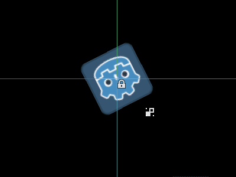
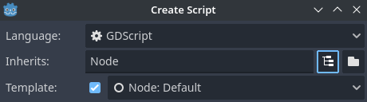

.. _doc_running_code_in_the_editor:

Running code in the editor
==========================

What is ``@tool``?
------------------

``@tool`` is a powerful line of code that, when added at the top of your script,
makes it execute in the editor. You can also decide which parts of the script
execute in the editor, which in game, and which in both.

You can use it for doing many things, but it is mostly useful in level design
for visually presenting things that are hard to predict ourselves. Here are some
use cases:

- If you have a cannon that shoots cannonballs affected by physics (gravity),
  you can draw the cannonball's trajectory in the editor, making level design a
  lot easier.
- If you have jumppads with varying jump heights, you can draw the maximum jump
  height a player would reach if it jumped on one, also making level design
  easier.
- If your player doesn't use a sprite, but draws itself using code, you can make
  that drawing code execute in the editor to see your player.

.. danger::

    ``@tool`` scripts run inside the editor, and let you access the scene tree
    of the currently edited scene. This is a powerful feature which also comes
    with caveats, as the editor does not include protections for potential
    misuse of ``@tool`` scripts.
    Be **extremely** cautious when manipulating the scene tree, especially via
    :ref:`Node.queue_free<class_Node_method_queue_free>`, as it can cause
    crashes if you free a node while the editor runs logic involving it.

How to use ``@tool``
--------------------

To turn a script into a tool, add the ``@tool`` annotation at the top of your code.

To check if you are currently in the editor, use: ``Engine.is_editor_hint()``.

For example, if you want to execute some code only in the editor, use:

.. tabs::
 .. code-tab:: gdscript GDScript

    if Engine.is_editor_hint():
        # Code to execute when in editor.

 .. code-tab:: csharp

    if (Engine.IsEditorHint())
    {
        // Code to execute when in editor.
    }

On the other hand, if you want to execute code only in game, simply negate the
same statement:

.. tabs::
 .. code-tab:: gdscript GDScript

    if not Engine.is_editor_hint():
        # Code to execute when in game.

 .. code-tab:: csharp

    if (!Engine.IsEditorHint())
    {
        // Code to execute when in game.
    }

Pieces of code that do not have either of the 2 conditions above will run both
in-editor and in-game.

Here is how a ``_process()`` function might look for you:

.. tabs::
 .. code-tab:: gdscript GDScript

    func _process(delta):
        if Engine.is_editor_hint():
            # Code to execute in editor.

        if not Engine.is_editor_hint():
            # Code to execute in game.

        # Code to execute both in editor and in game.

 .. code-tab:: csharp

    public override void _Process(double delta)
    {
        if (Engine.IsEditorHint())
        {
            // Code to execute in editor.
        }

        if (!Engine.IsEditorHint())
        {
            // Code to execute in game.
        }

        // Code to execute both in editor and in game.
    }

.. _doc_running_code_in_the_editor_important_information:

Important information
---------------------

The general rule is that **any other GDScript that your tool script uses must
*also* be a tool**. The editor is not able to construct instances from GDScript
files without ``@tool``, which means you cannot call methods or reference member
variables from them otherwise. However, since static methods, constants and
enums can be used without creating an instance, it is possible to call them or
reference them from a ``@tool`` script onto other non-tool scripts. One exception to
this are :ref:`static variables <doc_gdscript_basics_static_variables>`.
If you try to read a static variable's value in a script that does not have
``@tool``, it will always return ``null`` but won't print a warning or error
when doing so. This restriction does not apply to static methods, which can be
called regardless of whether the target script is in tool mode.

Extending a ``@tool`` script does not automatically make the extending script
a ``@tool``. Omitting ``@tool`` from the extending script will disable tool
behavior from the super class. Therefore, the extending script should also
specify the ``@tool`` annotation.

Modifications in the editor are permanent, with no undo/redo possible. For
example, in the next section when we remove the script, the node will keep its
rotation. Be careful to avoid making unwanted modifications. Consider setting up
:ref:`version control <doc_version_control_systems>` to avoid losing work in
case you make a mistake.

Using the debugger and breakpoints on tool scripts is not currently supported.
Breakpoints placed in the script editor or using the ``breakpoint`` keyword are
ignored. You can use print statements to display the contents of variables
instead.

Try ``@tool`` out
-----------------

Add a ``Sprite2D`` node to your scene and set the texture to Godot icon. Attach
and open a script, and change it to this:

.. tabs::
 .. code-tab:: gdscript GDScript

    @tool
    extends Sprite2D

    func _process(delta):
        rotation += PI * delta

 .. code-tab:: csharp

    using Godot;

    [Tool]
    public partial class MySprite : Sprite2D
    {
        public override void _Process(double delta)
        {
            Rotation += Mathf.Pi * (float)delta;
        }
    }

Save the script and return to the editor. You should now see your object rotate.
If you run the game, it will also rotate.

.. warning::
    You may need to restart the editor. This is a known bug found in all Godot 4 versions:
    `GH-66381 <https://github.com/godotengine/godot/issues/66381>`_.

.. note::

    If you don't see the changes, reload the scene (close it and open it again).

Now let's choose which code runs when. Modify your ``_process()`` function to
look like this:

.. tabs::
 .. code-tab:: gdscript GDScript

    func _process(delta):
        if Engine.is_editor_hint():
            rotation += PI * delta
        else:
            rotation -= PI * delta

 .. code-tab:: csharp

    public override void _Process(double delta)
    {
        if (Engine.IsEditorHint())
        {
            Rotation += Mathf.Pi * (float)delta;
        }
        else
        {
            Rotation -= Mathf.Pi * (float)delta;
        }
    }

Save the script. Now the object will spin clockwise in the editor, but if you
run the game, it will spin counter-clockwise.

Editing variables
-----------------

Add and export a variable speed to the script. To update the speed and also reset the rotation
angle add a setter ``set(new_speed)`` which is executed with the input from the inspector. Modify
``_process()`` to include the rotation speed.

.. tabs::
 .. code-tab:: gdscript GDScript

    @tool
    extends Sprite2D

    @export var speed = 1:
        # Update speed and reset the rotation.
        set(new_speed):
            speed = new_speed
            rotation = 0

    func _process(delta):
        rotation += PI * delta * speed

 .. code-tab:: csharp

    using Godot;

    [Tool]
    public partial class MySprite : Sprite2D
    {
        private float _speed = 1;

        [Export]
        public float Speed
        {
            get => _speed;
            set
            {
                // Update speed and reset the rotation.
                _speed = value;
                Rotation = 0;
            }
        }

        public override void _Process(double delta)
        {
            Rotation += Mathf.Pi * (float)delta * _speed;
        }
    }

.. note::

    Code from other nodes doesn't run in the editor. Your access to other nodes
    is limited. You can access the tree and nodes, and their default properties,
    but you can't access user variables. If you want to do so, other nodes have
    to run in the editor too.

Getting notified when resources change
--------------------------------------

Sometimes you want your tool to use a resource. However, when you change a
property of that resource in the editor, the ``set()`` method of your tool will
not be called.

.. tabs::
 .. code-tab:: gdscript GDScript

    @tool
    class_name MyTool
    extends Node

    @export var resource: MyResource:
        set(new_resource):
            resource = new_resource
            _on_resource_set()

    # This will only be called when you create, delete, or paste a resource.
    # You will not get an update when tweaking properties of it.
    func _on_resource_set():
        print("My resource was set!")

 .. code-tab:: csharp

    using Godot;

    [Tool]
    public partial class MyTool : Node
    {
        private MyResource _resource;

        [Export]
        public MyResource Resource
        {
            get => _resource;
            set
            {
                _resource = value;
                OnResourceSet();
            }
        }

        // This will only be called when you create, delete, or paste a resource.
        // You will not get an update when tweaking properties of it.
        private void OnResourceSet()
        {
            GD.Print("My resource was set!");
        }
    }

To get around this problem you first have to make your resource a tool and make it
emit the ``changed`` signal whenever a property is set:

.. tabs::
 .. code-tab:: gdscript GDScript

    # Make Your Resource a tool.
    @tool
    class_name MyResource
    extends Resource

    @export var property = 1:
        set(new_setting):
            property = new_setting
            # Emit a signal when the property is changed.
            changed.emit()

 .. code-tab:: csharp

    using Godot;

    [Tool]
    public partial class MyResource : Resource
    {
        private float _property = 1;

        [Export]
        public float Property
        {
            get => _property;
            set
            {
                _property = value;
                // Emit a signal when the property is changed.
                EmitChanged();
            }
        }
    }

You then want to connect the signal when a new resource is set:

.. tabs::
 .. code-tab:: gdscript GDScript

    @tool
    class_name MyTool
    extends Node

    @export var resource: MyResource:
        set(new_resource):
            resource = new_resource
            # Connect the changed signal as soon as a new resource is being added.
            if resource != null:
                resource.changed.connect(_on_resource_changed)

    func _on_resource_changed():
        print("My resource just changed!")

 .. code-tab:: csharp

    using Godot;

    [Tool]
    public partial class MyTool : Node
    {
        private MyResource _resource;

        [Export]
        public MyResource Resource
        {
            get => _resource;
            set
            {
                _resource = value;
                // Connect the changed signal as soon as a new resource is being added.
                if (_resource != null)
                {
                    _resource.Changed += OnResourceChanged;
                }
            }
        }

        private void OnResourceChanged()
        {
            GD.Print("My resource just changed!");
        }
    }

Lastly, remember to disconnect the signal as the old resource being used and changed somewhere else
would cause unneeded updates.

.. tabs::
 .. code-tab:: gdscript GDScript

    @export var resource: MyResource:
        set(new_resource):
            # Disconnect the signal if the previous resource was not null.
            if resource != null:
                resource.changed.disconnect(_on_resource_changed)
            resource = new_resource
            if resource != null:
                resource.changed.connect(_on_resource_changed)

 .. code-tab:: csharp

    [Export]
    public MyResource Resource
    {
        get => _resource;
        set
        {
            // Disconnect the signal if the previous resource was not null.
            if (_resource != null)
            {
                _resource.Changed -= OnResourceChanged;
            }
            _resource = value;
            if (_resource != null)
            {
                _resource.Changed += OnResourceChanged;
            }
        }
    }

Reporting node configuration warnings
-------------------------------------

Godot uses a *node configuration warning* system to warn users about incorrectly
configured nodes. When a node isn't configured correctly, a yellow warning sign
appears next to the node's name in the Scene dock. When you hover or click on
the icon, a warning message pops up. You can use this feature in your scripts to
help you and your team avoid mistakes when setting up scenes.

When using node configuration warnings, when any value that should affect or
remove the warning changes, you need to call
:ref:`update_configuration_warnings<class_Node_method_update_configuration_warnings>` .
By default, the warning only updates when closing and reopening the scene.

.. tabs::
 .. code-tab:: gdscript GDScript

    # Use setters to update the configuration warning automatically.
    @export var title = "":
        set(p_title):
            if p_title != title:
                title = p_title
                update_configuration_warnings()

    @export var description = "":
        set(p_description):
            if p_description != description:
                description = p_description
                update_configuration_warnings()

    func _get_configuration_warnings():
        var warnings = []

        if title == "":
            warnings.append("Please set `title` to a non-empty value.")

        if description.length() >= 100:
            warnings.append("`description` should be less than 100 characters long.")

        # Returning an empty array means "no warning".
        return warnings

.. _doc_running_code_in_the_editor_editorscript:

Running one-off scripts using EditorScript
------------------------------------------

Sometimes, you need to run code just one time to automate a certain task that is
not available in the editor out of the box. Some examples might be:

- Use as a playground for GDScript or C# scripting without having to run a project.
  ``print()`` output is displayed in the editor Output panel.
- Scale all light nodes in the currently edited scene, as you noticed your level
  ends up looking too dark or too bright after placing lights where desired.
- Replace nodes that were copy-pasted with scene instances to make them easier
  to modify later.

This is available in Godot by extending :ref:`class_EditorScript` in a script.
This provides a way to run individual scripts in the editor without having to
create an editor plugin.

To create an EditorScript, right-click a folder or empty space in the FileSystem
dock then choose **New > Script...**. In the script creation dialog, click the
tree icon to choose an object to extend from (or enter ``EditorScript`` directly
in the field on the left, though note this is case-sensitive):

   Creating an editor script in the script editor creation dialog

This will automatically select a script template that is suited for
EditorScripts, with a ``_run()`` method already inserted:

::

    @tool
    extends EditorScript

    # Called when the script is executed (using File -> Run in Script Editor).
    func _run():
        pass

This ``_run()`` method is executed when you use **File > Run** or the keyboard
shortcut :kbd:`Ctrl + Shift + X` while the EditorScript is the currently open
script in the script editor. This keyboard shortcut is only effective when
currently focused on the script editor.

Scripts that extend EditorScript must be ``@tool`` scripts to function.

.. note::

    EditorScripts can only be run from the Godot script editor. If you are using
    an external editor, open the script inside the Godot script editor to run it.

.. danger::

    EditorScripts have no undo/redo functionality, so **make sure to save your
    scene before running one** if the script is designed to modify any data.

To access nodes in the currently edited scene, use the
:ref:`EditorScript.get_scene <class_EditorScript_method_get_scene>` method which
returns the root Node of the currently edited scene. Here's an example that
recursively gets all nodes in the currently edited scene and doubles the range
of all OmniLight3D nodes:

::

    @tool
    extends EditorScript

    func _run():
        for node in get_all_children(get_scene()):
            if node is OmniLight3D:
                # Don't operate on instanced subscene children, as changes are lost
                # when reloading the scene.
                # See the "Instancing scenes" section below for a description of `owner`.
                var is_instanced_subscene_child = node != get_scene() and node.owner != get_scene()
                if not is_instanced_subscene_child:
                    node.omni_range *= 2.0

    # This function is recursive: it calls itself to get lower levels of child nodes as needed.
    # `children_acc` is the accumulator parameter that allows this function to work.
    # It should be left to its default value when you call this function directly.
    func get_all_children(in_node, children_acc = []):
        children_acc.push_back(in_node)
        for child in in_node.get_children():
            children_acc = get_all_children(child, children_acc)

        return children_acc

.. tip::

    You can change the currently edited scene at the top of the editor even
    while the Script view is open. This will affect the return value of
    :ref:`EditorScript.get_scene <class_EditorScript_method_get_scene>`, so make
    sure you've selected the scene you intend to iterate upon before running
    the script.

Instancing scenes
-----------------

You can instantiate packed scenes normally and add them to the scene currently
opened in the editor. By default, nodes or scenes added with
:ref:`Node.add_child(node) <class_Node_method_add_child>` are **not** visible
in the Scene tree dock and are **not** persisted to disk. If you wish the node
or scene to be visible in the scene tree dock and persisted to disk when saving
the scene, you need to set the child node's :ref:`owner <class_Node_property_owner>`
property to the currently edited scene root.

If you are using ``@tool``:

.. tabs::
 .. code-tab:: gdscript GDScript

    func _ready():
        var node = Node3D.new()
        add_child(node) # Parent could be any node in the scene

        # The line below is required to make the node visible in the Scene tree dock
        # and persist changes made by the tool script to the saved scene file.
        node.owner = get_tree().edited_scene_root

 .. code-tab:: csharp

    public override void _Ready()
    {
        var node = new Node3D();
        AddChild(node); // Parent could be any node in the scene

        // The line below is required to make the node visible in the Scene tree dock
        // and persist changes made by the tool script to the saved scene file.
        node.Owner = GetTree().EditedSceneRoot;
    }

If you are using :ref:`EditorScript<class_EditorScript>`:

.. tabs::
 .. code-tab:: gdscript GDScript

    func _run():
        # `parent` could be any node in the scene.
        var parent = get_scene().get_node("Parent")
        var node = Node3D.new()
        parent.add_child(node)

        # The line below is required to make the node visible in the Scene tree dock
        # and persist changes made by the tool script to the saved scene file.
        node.owner = get_scene()

 .. code-tab:: csharp

    public override void _Run()
    {
        // `parent` could be any node in the scene.
        var parent = GetScene().GetNode("Parent");
        var node = new Node3D();
        parent.AddChild(node);

        // The line below is required to make the node visible in the Scene tree dock
        // and persist changes made by the tool script to the saved scene file.
        node.Owner = GetScene();
    }

.. warning::

    Using ``@tool`` improperly can yield many errors. It is advised to first
    write the code how you want it, and only then add the ``@tool`` annotation to
    the top. Also, make sure to separate code that runs in-editor from code that
    runs in-game. This way, you can find bugs more easily.
