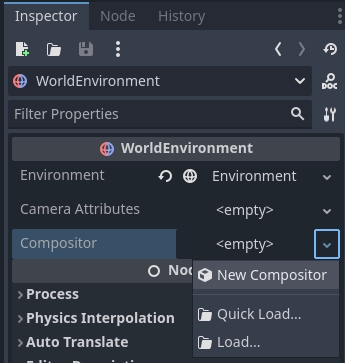
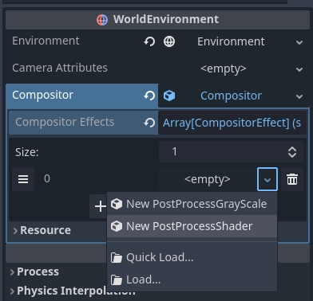
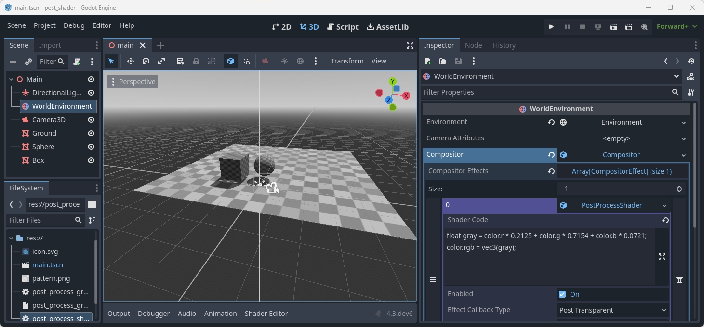

.. _doc_compositor:

The Compositor
==============

The compositor is a new feature in Godot 4 that allows control over
the rendering pipeline when rendering the contents of a :ref:`Viewport <class_Viewport>`.

It can be configured on a :ref:`WorldEnvironment <class_WorldEnvironment>`
node where it applies to all Viewports, or it can be configured on
a :ref:`Camera3D <class_Camera3D>` and apply only to
the Viewport using that camera.

The :ref:`Compositor <class_Compositor>` resource is used to configure
the compositor. To get started, simply create a new compositor on
the appropriate node:

.. note::
    The compositor is currently a feature that is only supported by
    the Mobile and Forward+ renderers.

Compositor effects
------------------

Compositor effects allow you to insert additional logic into the rendering
pipeline at various stages. This is an advanced feature that requires
a high level of understanding of the rendering pipeline to use to
its best advantage.

As the core logic of the compositor effect is called from the rendering
pipeline it is important to note that this logic will thus run within
the thread on which rendering takes place.
Care needs to be taken to ensure we don't run into threading issues.

To illustrate how to use compositor effects we'll create a simple
post processing effect that allows you to write your own shader code
and apply this full screen through a compute shader.
You can find the finished demo project `here <https://github.com/godotengine/godot-demo-projects/tree/master/compute/post_shader>`_.

We start by creating a new script called ``post_process_shader.gd``.
We'll make this a tool script so we can see the compositor effect work in the editor.
We need to extend our node from :ref:`CompositorEffect <class_CompositorEffect>`.
We must also give our script a class name.

.. code-block:: gdscript
    :caption: post_process_shader.gd

    @tool
    extends CompositorEffect
    class_name PostProcessShader

Next we're going to define a constant for our shader template code.
This is the boilerplate code that makes our compute shader work.

.. code-block:: gdscript

    const template_shader : String = "#version 450

    // Invocations in the (x, y, z) dimension
    layout(local_size_x = 8, local_size_y = 8, local_size_z = 1) in;

    layout(rgba16f, set = 0, binding = 0) uniform image2D color_image;

    // Our push constant
    layout(push_constant, std430) uniform Params {
        vec2 raster_size;
        vec2 reserved;
    } params;

    // The code we want to execute in each invocation
    void main() {
        ivec2 uv = ivec2(gl_GlobalInvocationID.xy);
        ivec2 size = ivec2(params.raster_size);

        if (uv.x >= size.x || uv.y >= size.y) {
            return;
        }

        vec4 color = imageLoad(color_image, uv);

        #COMPUTE_CODE

        imageStore(color_image, uv, color);
    }"

For more information on how compute shaders work,
please check :ref:`Using compute shaders <doc_compute_shaders>`.

The important bit here is that for every pixel on our screen,
our ``main`` function is executed and inside of this we load
the current color value of our pixel, execute our user code,
and write our modified color back to our color image.

``#COMPUTE_CODE`` gets replaced by our user code.

In order to set our user code, we need an export variable.
We'll also define a few script variables we'll be using:

.. code-block:: gdscript

    @export_multiline var shader_code : String = "":
        set(value):
            mutex.lock()
            shader_code = value
            shader_is_dirty = true
            mutex.unlock()

    var rd : RenderingDevice
    var shader : RID
    var pipeline : RID

    var mutex : Mutex = Mutex.new()
    var shader_is_dirty : bool = true

Note the use of a :ref:`Mutex <class_Mutex>` in our code.
Most of our implementation gets called from the rendering engine
and thus runs within our rendering thread.

We need to ensure that we set our new shader code, and mark our
shader code as dirty, without our render thread accessing this
data at the same time.

Next we initialize our effect.

.. code-block:: gdscript

    # Called when this resource is constructed.
    func _init():
        effect_callback_type = EFFECT_CALLBACK_TYPE_POST_TRANSPARENT
        rd = RenderingServer.get_rendering_device()

The main thing here is setting our ``effect_callback_type`` which tells
the rendering engine at what stage of the render pipeline to call our code.

.. note::

    Currently we only have access to the stages of the 3D rendering pipeline!

We also get a reference to our rendering device, which will come in very handy.

We also need to clean up after ourselves, for this we react to the
``NOTIFICATION_PREDELETE`` notification:

.. code-block:: gdscript

    # System notifications, we want to react on the notification that
    # alerts us we are about to be destroyed.
    func _notification(what):
        if what == NOTIFICATION_PREDELETE:
            if shader.is_valid():
                # Freeing our shader will also free any dependents such as the pipeline!
                rd.free_rid(shader)

Note that we do not use our mutex here even though we create our shader inside
of our render thread.
The methods on our rendering server are thread safe and ``free_rid`` will
be postponed cleaning up the shader until after any frames currently being
rendered are finished.

Also note that we are not freeing our pipeline. The rendering device does
dependency tracking and as the pipeline is dependent on the shader, it will
be automatically freed when the shader is destructed.

From this point onwards our code will run on the rendering thread.

Our next step is a helper function that will recompile the shader if the user
code was changed.

.. code-block:: gdscript

    # Check if our shader has changed and needs to be recompiled.
    func _check_shader() -> bool:
        if not rd:
            return false

        var new_shader_code : String = ""

        # Check if our shader is dirty.
        mutex.lock()
        if shader_is_dirty:
            new_shader_code = shader_code
            shader_is_dirty = false
        mutex.unlock()

        # We don't have a (new) shader?
        if new_shader_code.is_empty():
            return pipeline.is_valid()

        # Apply template.
        new_shader_code = template_shader.replace("#COMPUTE_CODE", new_shader_code);

        # Out with the old.
        if shader.is_valid():
            rd.free_rid(shader)
            shader = RID()
            pipeline = RID()

        # In with the new.
        var shader_source : RDShaderSource = RDShaderSource.new()
        shader_source.language = RenderingDevice.SHADER_LANGUAGE_GLSL
        shader_source.source_compute = new_shader_code
        var shader_spirv : RDShaderSPIRV = rd.shader_compile_spirv_from_source(shader_source)

        if shader_spirv.compile_error_compute != "":
            push_error(shader_spirv.compile_error_compute)
            push_error("In: " + new_shader_code)
            return false

        shader = rd.shader_create_from_spirv(shader_spirv)
        if not shader.is_valid():
            return false

        pipeline = rd.compute_pipeline_create(shader)
        return pipeline.is_valid()

At the top of this method we again use our mutex to protect accessing our
user shader code and our is dirty flag.
We make a local copy of the user shader code if our user shader code is dirty.

If we don't have a new code fragment, we return true if we already have a
valid pipeline.

If we do have a new code fragment we embed it in our template code and then
compile it.

.. warning::
    The code shown here compiles our new code in runtime.
    This is great for prototyping as we can immediately see the effect
    of the changed shader.

    This prevents precompiling and caching this shader which may be an issues
    on some platforms such as consoles.
    Note that the demo project comes with an alternative example where
    a ``glsl`` file contains the entire compute shader and this is used.
    Godot is able to precompile and cache the shader with this approach.

Finally we need to implement our effect callback, the rendering engine will call
this at the right stage of rendering.

.. code-block:: gdscript

    # Called by the rendering thread every frame.
    func _render_callback(p_effect_callback_type, p_render_data):
        if rd and p_effect_callback_type == EFFECT_CALLBACK_TYPE_POST_TRANSPARENT and _check_shader():
            # Get our render scene buffers object, this gives us access to our render buffers.
            # Note that implementation differs per renderer hence the need for the cast.
            var render_scene_buffers : RenderSceneBuffersRD = p_render_data.get_render_scene_buffers()
            if render_scene_buffers:
                # Get our render size, this is the 3D render resolution!
                var size = render_scene_buffers.get_internal_size()
                if size.x == 0 and size.y == 0:
                    return

                # We can use a compute shader here
                var x_groups = (size.x - 1) / 8 + 1
                var y_groups = (size.y - 1) / 8 + 1
                var z_groups = 1

                # Push constant
                var push_constant : PackedFloat32Array = PackedFloat32Array()
                push_constant.push_back(size.x)
                push_constant.push_back(size.y)
                push_constant.push_back(0.0)
                push_constant.push_back(0.0)

                # Loop through views just in case we're doing stereo rendering. No extra cost if this is mono.
                var view_count = render_scene_buffers.get_view_count()
                for view in range(view_count):
                    # Get the RID for our color image, we will be reading from and writing to it.
                    var input_image = render_scene_buffers.get_color_layer(view)

                    # Create a uniform set, this will be cached, the cache will be cleared if our viewports configuration is changed.
                    var uniform : RDUniform = RDUniform.new()
                    uniform.uniform_type = RenderingDevice.UNIFORM_TYPE_IMAGE
                    uniform.binding = 0
                    uniform.add_id(input_image)
                    var uniform_set = UniformSetCacheRD.get_cache(shader, 0, [ uniform ])

                    # Run our compute shader.
                    var compute_list := rd.compute_list_begin()
                    rd.compute_list_bind_compute_pipeline(compute_list, pipeline)
                    rd.compute_list_bind_uniform_set(compute_list, uniform_set, 0)
                    rd.compute_list_set_push_constant(compute_list, push_constant.to_byte_array(), push_constant.size() * 4)
                    rd.compute_list_dispatch(compute_list, x_groups, y_groups, z_groups)
                    rd.compute_list_end()

At the start of this method we check if we have a rendering device,
if our callback type is the correct one, and check if we have our shader.

.. note::

    The check for the effect type is only a safety mechanism.
    We've set this in our ``_init`` function, however it is possible
    for the user to change this in the UI.

Our ``p_render_data`` parameter gives us access to an object that holds
data specific to the frame we're currently rendering. We're currently only
interested in our render scene buffers, which provide us access to all the
internal buffers used by the rendering engine.
Note that we cast this to :ref:`RenderSceneBuffersRD <class_RenderSceneBuffersRD>`
to expose the full API to this data.

Next we obtain our ``internal size`` which is the resolution of our 3D render
buffers before they are upscaled (if applicable), upscaling happens after our
post processes have run.

From our internal size we calculate our group size, see our local size in our
template shader.

.. UPDATE: Not supported yet. When structs are supported here, update this
.. paragraph.

We also populate our push constant so our shader knows our size.
Godot does not support structs here **yet** so we use a
``PackedFloat32Array`` to store this data into. Note that we have
to pad this array with a 16 byte alignment. In other words, the
length of our array needs to be a multiple of 4.

Now we loop through our views, this is in case we're using multiview rendering
which is applicable for stereo rendering (XR). In most cases we will only have
one view.

.. note::

    There is no performance benefit to use multiview for post processing
    here, handling the views separately like this will still enable the GPU
    to use parallelism if beneficial.

Next we obtain the color buffer for this view. This is the buffer into which
our 3D scene has been rendered.

We then prepare a uniform set so we can communicate the color buffer to our
shader.

Note the use of our :ref:`UniformSetCacheRD <class_UniformSetCacheRD>` cache
which ensures we can check for our uniform set each frame.
As our color buffer can change from frame to frame and our uniform cache
will automatically clean up uniform sets when buffers are freed, this is
the safe way to ensure we do not leak memory or use an outdated set.

Finally we build our compute list by binding our pipeline,
binding our uniform set, pushing our push constant data,
and calling dispatch for our groups.

With our compositor effect completed, we now need to add it to our compositor.

On our compositor we expand the compositor effects property
and press ``Add Element``.

Now we can add our compositor effect:

After selecting our ``PostProcessShader`` we need to set our user shader code:

.. code-block:: glsl

    float gray = color.r * 0.2125 + color.g * 0.7154 + color.b * 0.0721;
    color.rgb = vec3(gray);

With that all done, our output is in grayscale.

.. note::

    For a more advanced example of post effects, check out the
    `Radial blur based sky rays <https://github.com/BastiaanOlij/RERadialSunRays>`_
    example project created by Bastiaan Olij.
