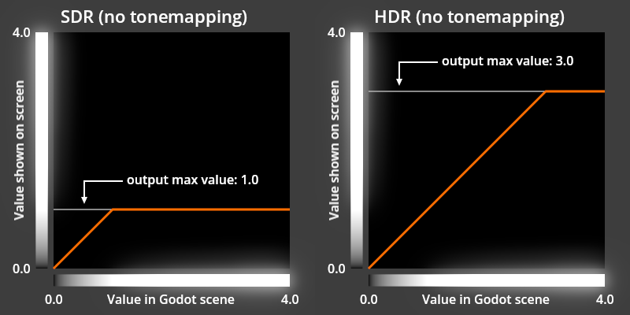
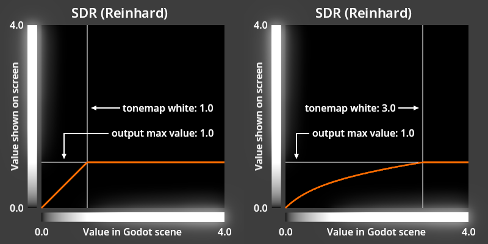
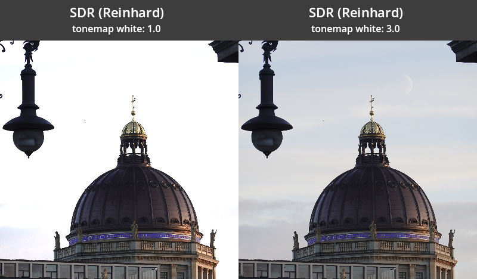

.. _doc_hdr_output:

HDR output
==========

HDR output is a feature that enables presentation of High Dynamic Range (HDR) visuals on 
HDR-capable screens. HDR **output** is not to be confused with the internal HDR rendering that 
is used by Godot for both Standard Dynamic Range (SDR) output and HDR output modes.

Enabling HDR output in your project
-----------------------------------

You can enable HDR output in any new or existing project using these steps:

1. Ensure *no* :ref:`Environment<class_environment>` resources use SDR-only features:

- Tonemap Mode: Filmic or ACES
- Glow Blend Mode: Soft Light
- Adjustments: Color Correction

2. Configure the :ref:`Rendering Device 
   Driver<class_ProjectSettings_property_rendering/rendering_device/driver>` project setting to 
   the following. This is the default on projects created in Godot 4.6 onwards, but you'll need to 
   set the Windows rendering driver manually if the project was created on an older version:

- macOS: metal
- iOS: metal
- Windows: d3d12

3. Turn on the :ref:`HDR 2D<class_ProjectSettings_property_rendering/viewport/hdr_2d>` project setting and enable :ref:`use_hdr_2d<class_Viewport_property_use_hdr_2d>`
   for all :ref:`SubViewports <class_SubViewport>` and :ref:`Windows <class_Window>` that should support HDR output.
4. Turn on the :ref:`Request HDR Output <class_ProjectSettings_property_display/window/hdr/request_hdr_output>` project setting and enable :ref:`hdr_output_requested<class_Window_property_hdr_output_requested>`
   for all other :ref:`Windows <class_Window>` that should support HDR output.

HDR output fundamentals
-----------------------

Godot uses the `Extended Dynamic Range (EDR) 
<https://developer.apple.com/videos/play/wwdc2021/10161/>`__ paradigm for HDR output. While SDR 
output allows color component values between ``0.0`` and ``1.0`` to be displayed, HDR output 
allows values higher than ``1.0``. The maximum value that can be displayed is provided by 
:ref:`Window.get_output_max_linear_value()<class_Window_method_get_output_max_linear_value>` 
and this method is valid when using SDR or HDR.

.. note::

   These graphs are presented as SDR images that do not contain any HDR color. To compensate for this limitation, the greyscale bars along each axis have a glow effect applied to represent values that are outside of the SDR range. The "output max value" in this graph represents the maximum linear color component value returned by :ref:`Window.get_output_max_linear_value()<class_Window_method_get_output_max_linear_value>`.

Designing for HDR output
------------------------

There are two primary approaches to make the most of HDR output: using the :ref:`output max 
linear value<class_Window_method_get_output_max_linear_value>` and using the 
:ref:`class_WorldEnvironment` node.

While both approaches can be used in the same project, the :ref:`output max linear 
value<class_Window_method_get_output_max_linear_value>` should generally not be used in scenes 
that are affected by a :ref:`class_WorldEnvironment`. The 
:ref:`Viewport.own_world_3d<class_Viewport_property_own_world_3d>` property can be used to 
separate which :ref:`Viewports<class_Viewport>` are affected by a :ref:`class_WorldEnvironment`.

Using output max linear value
^^^^^^^^^^^^^^^^^^^^^^^^^^^^^

In a traditional SDR-only game, the brightest presentation of a color is limited by either the 
red, green, or blue component of the color reaching a maximum of ``1.0``. Using modern HDR 
screens, this limitation no longer applies and color components above ``1.0`` can be accurately 
presented by an HDR screen. Godot provides the maximum color component value that can be 
presented by the screen through the :ref:`output max linear 
value<class_Window_method_get_output_max_linear_value>`. This value can be used in both SDR and 
HDR, which makes it easy to build your game for both output modes without needing to change 
behavior based on whether or not HDR output is enabled.

The :ref:`output max linear value<class_Window_method_get_output_max_linear_value>` may change 
often as the player adjusts their device brightness, enables or disables HDR output on their 
device, or moves the game window between screens, so it's important to retrieve this value 
every frame. The value will always equal ``1.0`` in SDR mode and may also equal ``1.0`` when 
HDR output is enabled and the player has adjusted their screen to its maximum brightness.

It is best to use this :ref:`output max linear 
value<class_Window_method_get_output_max_linear_value>` with "highlights" and special effects 
that are either brief or involve a small portion of the screen; if the majority of the screen 
is presented at this maximum brightness for more than a short time, it will cause the game to 
appear uncomfortably bright, as if the game is ignoring the device brightness setting. You may 
also find that some effects look best when limited to a maximum linear value that is greater 
than ``1.0``, but less than the :ref:`output max linear 
value<class_Window_method_get_output_max_linear_value>`. You can read more about how it is 
sometimes desirable to limit the maximum HDR value in the `HDR and User Interfaces 
<https://android-developers.googleblog.com/2025/09/hdr-and-user-interfaces.html>`__ post of the 
Android Developers Blog.

Transforming a color to be the brightest the screen can present can be done with a script. When 
working with :ref:`class_CanvasItem`, it may be convenient to apply the resulting modified 
color to the :ref:`modulate<class_canvasitem_property_modulate>` or 
:ref:`self_modulate<class_canvasitem_property_self_modulate>` property with the base color of 
the :ref:`class_CanvasItem` set to :ref:`white<class_color_constant_white>`. The following 
script demonstrates this:

.. tabs::
 .. code-tab:: gdscript GDScript
	extends CanvasItem

	# Set this to your desired color when the CanvasItem's base color is white.
	@export var sdr_self_modulate: Color = Color.WHITE

	# Set this to -1.0 to disable the maximum linear color value limit.
	@export_range(0, 20, 0.1, "or_less", "or_greater") var max_linear_value_limit: float = -1.0

	func _process(_delta: float) -> void:
		# Adjust the brightness of color to be the brightest possible, regardless
		# of SDR or HDR output, but no brighter than max_linear_value_limit.
		var max_linear_value = get_window().get_output_max_linear_value()
		if max_linear_value_limit >= 0.0:
			max_linear_value = minf(max_linear_value, max_linear_value_limit)
		self_modulate = normalize_color(sdr_self_modulate, max_linear_value)

	func normalize_color(srgb_color, max_linear_value = 1.0):
		# Color must be linear-encoded to use math operations.
		var linear_color = srgb_color.srgb_to_linear()
		var max_rgb_value = maxf(linear_color.r, maxf(linear_color.g, linear_color.b))
		var brightness_scale = max_linear_value / max_rgb_value
		linear_color *= brightness_scale
		# Undo changes to the alpha channel, which should not be modified.
		linear_color.a = srgb_color.a
		# Convert back to nonlinear sRGB encoding, which is required for Color in
		# Godot unless stated otherwise.
		return linear_color.linear_to_srgb()

Using a WorldEnvironment node
^^^^^^^^^^^^^^^^^^^^^^^^^^^^^^

To produce HDR output using a :ref:`class_WorldEnvironment`, your scenes will need color values 
that exceed what an SDR screen can present, so it is important to use a tonemapper like 
:ref:`Reinhard<class_Environment_constant_tone_mapper_reinhardt>` or 
:ref:`AgX<class_Environment_constant_tone_mapper_agx>` to handle display of bright scene values 
on both SDR and HDR screens. 

**Tonemapping and HDR**

The primary role of a tonemapper is to reduce the dynamic range of a natural scene with a very 
high dynamic range of brightness to a smaller dynamic range that can be presented on a screen. 
Tonemappers in Godot use the :ref:`output max linear 
value<class_Window_method_get_output_max_linear_value>` to determine the output range that the 
screen is capable of presenting. For example, with the 
:ref:`Reinhard<class_Environment_constant_tone_mapper_reinhardt>` tonemapper in Godot, linear 
scene values in the range of ``0.0`` to :ref:`tonemap 
white<class_Environment_property_tonemap_white>` are mapped to an output range of ``0.0`` to 
:ref:`output max linear value<class_Window_method_get_output_max_linear_value>`.

With this approach, you can adjust :ref:`tonemap 
white<class_Environment_property_tonemap_white>` to be sure that any linear scene value below 
:ref:`tonemap white<class_Environment_property_tonemap_white>` will be shown without clipping. 
This ensures that details are not lost when presenting the image on a screen with a lower 
dynamic range than the original scene.

While this behavior is perfectly stable in SDR, where the :ref:`output max linear 
value<class_Window_method_get_output_max_linear_value>` is fixed at ``1.0``, this behavior is 
dynamic with HDR based on the capabilities of the screen:

.. image:: img/rendering_hdr_output_hdr_tonemap.webp

As shown in the graphs above, the 
:ref:`Reinhard<class_Environment_constant_tone_mapper_reinhardt>` tonemapper will behave the 
same as the :ref:`Linear<class_Environment_constant_tone_mapper_linear>` tonemapper when 
:ref:`output max linear value<class_Window_method_get_output_max_linear_value>` is equal to or 
higher than :ref:`tonemap white<class_Environment_property_tonemap_white>`. This allows for 
accurate color reproduction on HDR screens that are capable of reproducing the original 
brighter scene values. When :ref:`output max linear 
value<class_Window_method_get_output_max_linear_value>` has increased to a be higher than 
:ref:`tonemap white<class_Environment_property_tonemap_white>`, white will be adjusted to match 
this :ref:`output max linear value<class_Window_method_get_output_max_linear_value>`.

The :ref:`AgX<class_Environment_constant_tone_mapper_agx>` tonemapper behaves similar to 
:ref:`Reinhard<class_Environment_constant_tone_mapper_reinhardt>` in this way, but its 
:ref:`tonemap white<class_Environment_property_tonemap_agx_white>` is always multiplied by 
:ref:`output max linear value<class_Window_method_get_output_max_linear_value>`. The 
:ref:`Linear<class_Environment_constant_tone_mapper_linear>` tonemapper applies no tonemapping 
at all; its :ref:`tonemap white<class_Environment_property_tonemap_white>` equals :ref:`output 
max linear value<class_Window_method_get_output_max_linear_value>` in all scenarios. The 
:ref:`Filmic<class_Environment_constant_tone_mapper_filmic>` and 
:ref:`ACES<class_Environment_constant_tone_mapper_aces>` tonemappers ignore :ref:`output max 
linear value<class_Window_method_get_output_max_linear_value>` entirely and always produce an 
image in the SDR range.

Mixing output max linear value and the WorldEnvironment node
^^^^^^^^^^^^^^^^^^^^^^^^^^^^^^^^^^^^^^^^^^^^^^^^^^^^^^^^^^^^^

The :ref:`output max linear value<class_Window_method_get_output_max_linear_value>` should 
generally not be used in scenes that are affected by a :ref:`class_WorldEnvironment`. This is 
because a number of effects of :ref:`Environment<class_environment>` expect stable scene values 
that do not change based on the screen capabilities. For example, the strength of the glow 
effect is directly influenced by the brightness of the scene. If the scene brightness changes 
based on :ref:`output max linear value<class_Window_method_get_output_max_linear_value>`, then 
the glow strength will change as well: a larger :ref:`output max linear 
value<class_Window_method_get_output_max_linear_value>` will produce a stronger glow effect, 
which is generally an undesirable behavior.

An exception to this rule is to change the :ref:`background 
mode<class_Environment_property_background_mode>` through a :ref:`class_WorldEnvironment` with 
a :ref:`Linear<class_Environment_constant_tone_mapper_linear>` tonemapper because the 
:ref:`Linear<class_Environment_constant_tone_mapper_linear>` tonemap mode disables tonemapping 
and the background rendering is not affected by the brightness of scene values.

Absolute luminance values
-------------------------

When using HDR output, :ref:`output max linear 
value<class_Window_method_get_output_max_linear_value>` is calculated based on the reference 
white luminance (the device brightness setting) and the maximum luminance of the screen.

Reference white luminance
^^^^^^^^^^^^^^^^^^^^^^^^^

The reference white luminance, or reference luminance for short, is simply the device 
brightness setting. This value is typically around 100 to 300 nits and is always represented by 
an :ref:`output max linear value<class_Window_method_get_output_max_linear_value>` of exactly 
``1.0``. This value may also be referred to as "paper white" or the "SDR white level" and 
matches the brightest possible SDR white value.

When the user changes their device brightness, they are simply adjusting their reference 
luminance. On a phone, this adjustment may happen automatically. On desktop computers, there 
are different ways to adjust this reference luminance depending on the operating system.

Maximum luminance
^^^^^^^^^^^^^^^^^

The maximum luminance is a property of an HDR screen. This value may be anywhere from 250 to 
2,000 nits or beyond.

Although this value is a property of the screen hardware and is expected to not change, some 
devices dynamically adapt this value to work within the constraints of the platform. For 
example, the reported maximum luminance of Windows laptops with built-in HDR screens will 
change as the user adjusts their laptop screen brightness while the reported reference 
luminance remains constant.

Output max linear value in practice
^^^^^^^^^^^^^^^^^^^^^^^^^^^^^^^^^^^

When in HDR mode, the :ref:`output max linear 
value<class_Window_method_get_output_max_linear_value>` will increase as the user decreases 
their device brightness setting because more HDR headroom becomes available. Similarly, as the 
user turns up their device brightness, they will have less HDR headroom available and 
:ref:`output max linear value<class_Window_method_get_output_max_linear_value>` will decrease. 
In some cases when using HDR mode with the highest device brightness, :ref:`output max linear 
value<class_Window_method_get_output_max_linear_value>` will equal ``1.0``, matching SDR 
behavior, because no HDR headroom is available.

Not all screens are equal
-------------------------

SDR standards were designed to match the capabilities of existing screens that were commonly 
used around the world. HDR standards have been intentionally written with the opposite 
approach: they are designed to utilize the capabilities of an ideal screen that is not yet 
widely available.

In practice, this means that common HDR screens may perform their own internal tonemapping, 
gamut mapping, or dynamic tonemapping (DTM) to support content that extends to a wider gamut 
and luminance range than what the physical hardware can achieve. These features may produce 
colors that are not representative of other screens so it's best to disable them, if possible, 
when developing your HDR game. You may be able to disable some or all of these features by 
enabling the HGiG mode on your screen or setting the screen's mode to "clip" and/or "stable".

Additionally, some HDR screens may present dark or saturated colors differently than others. 
This difference in appearance is often the result of the screen and device technologies. 
Devices with built-in HDR screens often have the most accurate HDR presentation of dark or 
saturated colors in typical viewing environments, but this may change over time as technologies 
develop.
