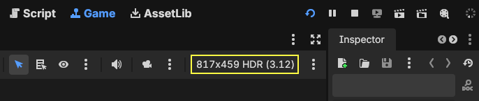
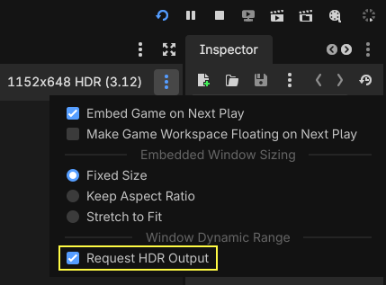
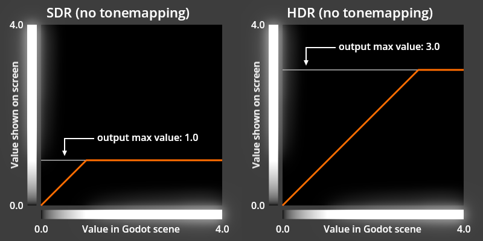
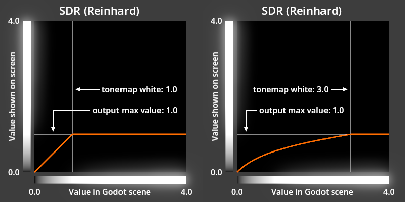
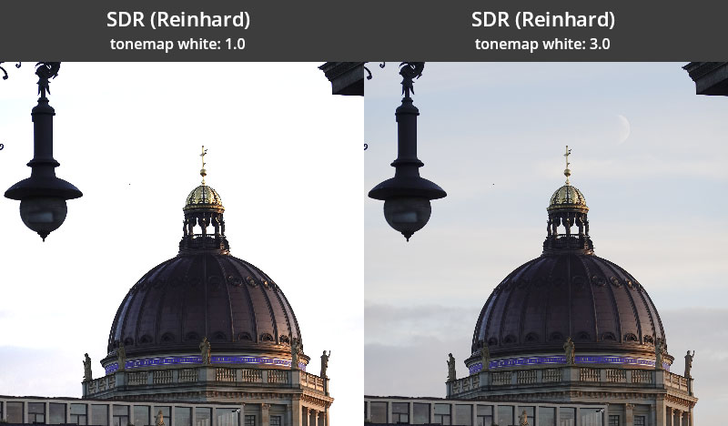
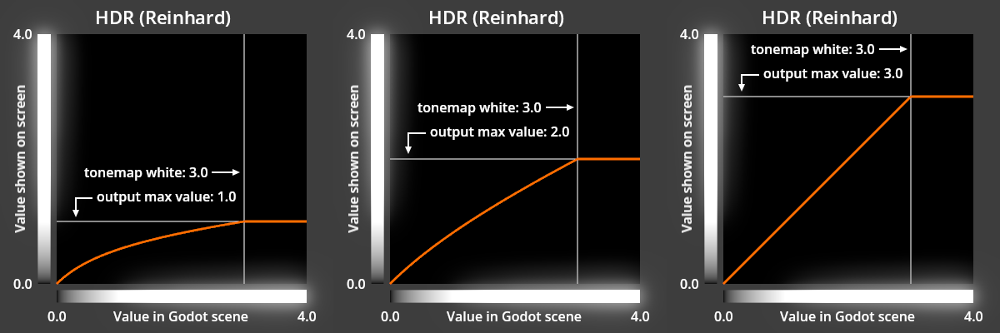

.. _doc_hdr_output:

HDR output
==========

HDR output is a feature that enables presentation of High Dynamic Range (HDR) visuals on
HDR-capable screens. HDR **output** is not to be confused with the internal HDR rendering that is
used by Godot for both Standard Dynamic Range (SDR) output and HDR output modes.

Enabling HDR output in your project
-----------------------------------

You can enable HDR output in any new or existing project using these steps:

1. Ensure *no* :ref:`Environment<class_environment>` resources use SDR-only features:

- Tonemap Mode: Filmic or ACES
- Glow Blend Mode: Soft Light
- Adjustments: Color Correction

2. Configure the :ref:`Renderer<class_ProjectSettings_property_rendering/renderer/rendering_method>`
   project setting to ``mobile`` or ``forward_plus``.
3. Configure the :ref:`Rendering Device Driver<class_ProjectSettings_property_rendering/rendering_device/driver>`
   advanced project setting to ``metal`` for iOS and ``d3d12`` for Windows.
4. Configure the :ref:`Display Server Driver.linuxbsd<class_ProjectSettings_property_display/display_server/driver.linuxbsd>`
   advanced project setting to ``wayland`` and enable the :ref:`Prefer Wayland<class_EditorSettings_property_run/platforms/linuxbsd/prefer_wayland>`
   editor setting.
5. Turn on the :ref:`HDR 2D<class_ProjectSettings_property_rendering/viewport/hdr_2d>` project
   setting and enable :ref:`use_hdr_2d<class_Viewport_property_use_hdr_2d>` for all
   :ref:`SubViewports <class_SubViewport>` and :ref:`Windows <class_Window>` that should support
   HDR output.
6. Turn on the :ref:`Request HDR Output <class_ProjectSettings_property_display/window/hdr/request_hdr_output>`
   project setting and enable :ref:`hdr_output_requested<class_Window_property_hdr_output_requested>`
   for all other :ref:`Windows <class_Window>` that should support HDR output.
7. *[Optional]* Provide in-game HDR settings by copying the example from the
   `HDR output demo project <https://github.com/godotengine/godot-demo-projects/tree/master/misc/hdr_output>`__
   to your project.

.. note::

   Some of these settings may already be configured correctly for HDR output in your project. For
   example, the Windows Rendering Device Driver is set to ``d3d12`` in projects created in Godot
   4.6 onwards, but will need to be changed if the project was created with an older version of
   Godot.

Using HDR output in Godot
-------------------------

Try out the `HDR output demo project <https://github.com/godotengine/godot-demo-projects/tree/master/misc/hdr_output>`__
as a first step to using HDR output in Godot. This demo contains examples of the concepts
described on this page and will help you ensure that your development environment is correctly
configured for HDR output.

HDR output in the Godot editor
^^^^^^^^^^^^^^^^^^^^^^^^^^^^^^

The Godot editor will use HDR output for its main window when the :ref:`Request HDR Output <class_ProjectSettings_property_display/window/hdr/request_hdr_output>`
project setting has been
enabled. You can tell if your game is running in SDR or HDR output mode based on the text on the
right side of game view toolbar: Your game is running in HDR mode when the text "HDR" appears next
to the window size.

The number in parentheses next to the "HDR" text is the current :ref:`output max linear value<class_Window_method_get_output_max_linear_value>`
which is described in the following sections. You can toggle the game's
:ref:`Window.hdr_output_requested<class_Window_property_hdr_output_requested>` property in the game
window options menu:

HDR output fundamentals
-----------------------

Godot uses the `Extended Dynamic Range (EDR) <https://developer.apple.com/videos/play/wwdc2021/10161/>`__
paradigm for HDR output. While SDR
output allows color component values between ``0.0`` and ``1.0`` to be displayed, HDR output
allows values higher than ``1.0``. The maximum value that can be displayed is provided by
:ref:`Window.get_output_max_linear_value()<class_Window_method_get_output_max_linear_value>` and
this method is valid when using SDR or HDR.

.. note::

   These graphs are presented as SDR images that do not contain any HDR color. To compensate for
   this limitation, the grayscale bars along each axis have a glow effect applied to represent
   values that are outside of the SDR range. The "output max value" in this graph represents the
   maximum linear color component value returned by
   :ref:`Window.get_output_max_linear_value()<class_Window_method_get_output_max_linear_value>`.

Designing for HDR output
------------------------

There are two primary approaches to make the most of HDR output: using the
:ref:`output max linear value<class_Window_method_get_output_max_linear_value>` and using
tonemapping.

While both approaches can be used in the same project, tonemapping should be used to produce HDR
output from a :ref:`Viewport<class_Viewport>` that uses lighting that exceeds the capabilities of an
SDR screen, indirect lighting, global illumination, emissive materials, post-processing effects, or
any other techniques that make use of the colors values in the scene.

The :ref:`output max linear value<class_Window_method_get_output_max_linear_value>` should only be
used to present colors directly to the screen without tonemapping and without influencing lighting,
post-processing effects, or surrounding color. This makes the
:ref:`output max linear value<class_Window_method_get_output_max_linear_value>` well suited for
:ref:`CanvasItems<class_CanvasItem>` or unshaded materials in a scene that has no lighting or basic
lighting that otherwise does not exceed the capabilities of an SDR screen.

The :ref:`Viewport.own_world_3d<class_Viewport_property_own_world_3d>` property can be used to
separate which :ref:`Viewports<class_Viewport>` are affected by tonemapping and other
:ref:`class_WorldEnvironment` effects.

Using output max linear value
^^^^^^^^^^^^^^^^^^^^^^^^^^^^^

In a traditional SDR-only game, the brightest presentation of a color is limited by either the
red, green, or blue component of the color reaching a maximum of ``1.0``. When using a modern HDR
screen this limitation no longer applies and color components above ``1.0`` can be accurately
presented. Godot provides the maximum color component value that can be presented by the screen
through the :ref:`output max linear value<class_Window_method_get_output_max_linear_value>`. This
value can be used in both SDR and HDR, which makes it easy to build your game for both output
modes without needing to change behavior based on whether or not HDR output is enabled.

The :ref:`output max linear value<class_Window_method_get_output_max_linear_value>` may change
often as the player adjusts their device brightness, enables or disables HDR output on their
device, or moves the game window between screens, so it's important to retrieve this value every
frame or use the :ref:`output max linear value changed<class_Window_signal_output_max_linear_value_changed>`
signal. The value will always equal ``1.0`` in SDR mode and may also equal ``1.0`` when HDR output
is enabled and the player has adjusted their screen to its maximum brightness.

It is best to use this :ref:`output max linear value<class_Window_method_get_output_max_linear_value>`
with "highlights" and special effects that
are either brief or involve a small portion of the screen; if the majority of the screen is
presented at this maximum brightness for more than a short time, it will cause the game to appear
uncomfortably bright, as if the game is ignoring the device brightness setting. You may also find
that some effects look best when limited to a maximum linear value that is greater than ``1.0``,
but less than the :ref:`output max linear value<class_Window_method_get_output_max_linear_value>`.
You can read more about how it is sometimes desirable to limit the maximum HDR value in the
`HDR and User Interfaces <https://android-developers.googleblog.com/2025/09/hdr-and-user-interfaces.html>`__
post of the Android Developers Blog.

Transforming a color to be the brightest the screen can present can be done with a script. When
working with :ref:`class_CanvasItem`, it may be convenient to apply the resulting modified color
to the :ref:`modulate<class_canvasitem_property_modulate>` or
:ref:`self_modulate<class_canvasitem_property_self_modulate>` property with the base color of the
:ref:`class_CanvasItem` set to :ref:`white<class_color_constant_white>`. The following script
demonstrates this:

.. tabs::
 .. code-tab:: gdscript GDScript

	extends CanvasItem

	# Set this to your desired color when the CanvasItem's base color is white.
	@export var sdr_self_modulate: Color = Color.WHITE

	# Set this to -1.0 to disable limiting the maximum color value.
	@export_range(0, 20, 0.1, "or_less", "or_greater") var max_linear_value_limit: float = -1.0

	func _enter_tree() -> void:
		var window: Window = get_window()
		window.output_max_linear_value_changed.connect(_on_output_max_linear_value_changed)
		_on_output_max_linear_value_changed(window.get_output_max_linear_value())

	func _exit_tree() -> void:
		get_window().output_max_linear_value_changed.disconnect(_on_output_max_linear_value_changed)

	func _on_output_max_linear_value_changed(output_max_linear_value: float) -> void:
		# Adjust the brightness of color to be the brightest possible, regardless
		# of SDR or HDR output, but no brighter than max_linear_value_limit.
		if max_linear_value_limit >= 0.0:
			output_max_linear_value = minf(output_max_linear_value, max_linear_value_limit)
		self_modulate = normalize_color(sdr_self_modulate, output_max_linear_value)

	func normalize_color(srgb_color, output_max_linear_value = 1.0):
		# Color must be linear-encoded to use math operations.
		var linear_color = srgb_color.srgb_to_linear()
		var max_rgb_value = maxf(linear_color.r, maxf(linear_color.g, linear_color.b))
		var brightness_scale = output_max_linear_value / max_rgb_value
		linear_color *= brightness_scale
		# Undo changes to the alpha channel, which should not be modified.
		linear_color.a = srgb_color.a
		# Convert back to nonlinear sRGB encoding, which is required for Color in
		# Godot unless stated otherwise.
		return linear_color.linear_to_srgb()

Using Tonemapping
^^^^^^^^^^^^^^^^^

To produce HDR output without using the :ref:`output max linear value<class_Window_method_get_output_max_linear_value>`
your scenes will need color values
that exceed what an SDR screen can present, so it is important to use a tonemapper like
:ref:`Reinhard<class_Environment_constant_tone_mapper_reinhardt>` or
:ref:`AgX<class_Environment_constant_tone_mapper_agx>` to handle display of these bright scene
values on both SDR and HDR screens.

**Tonemapping and HDR**

The primary role of a tonemapper is to reduce the dynamic range of a natural scene with a very
high dynamic range of brightness to a smaller dynamic range that can be presented on a screen.
Tonemappers in Godot use the :ref:`output max linear value<class_Window_method_get_output_max_linear_value>`
to determine the output range that the screen is capable of presenting. For example, with the
:ref:`Reinhard<class_Environment_constant_tone_mapper_reinhardt>` tonemapper in Godot, linear
scene values in the range of ``0.0`` to :ref:`tonemap white<class_Environment_property_tonemap_white>`
are mapped to an output range of ``0.0`` to
:ref:`output max linear value<class_Window_method_get_output_max_linear_value>`.

With this approach, you can adjust :ref:`tonemap white<class_Environment_property_tonemap_white>`
to be sure that any linear scene value below :ref:`tonemap white<class_Environment_property_tonemap_white>`
will be shown without clipping. This ensures that details are not lost when presenting the image
on a screen with a lower dynamic range than the original scene.

While this behavior is perfectly stable in SDR, where the :ref:`output max linear value<class_Window_method_get_output_max_linear_value>`
is fixed at ``1.0``, this behavior is dynamic with HDR based on the capabilities of the screen:

As shown in the graphs above, the
:ref:`Reinhard<class_Environment_constant_tone_mapper_reinhardt>` tonemapper will behave the same
as the :ref:`Linear<class_Environment_constant_tone_mapper_linear>` tonemapper when
:ref:`output max linear value<class_Window_method_get_output_max_linear_value>` is equal to or higher than
:ref:`tonemap white<class_Environment_property_tonemap_white>`. This allows for accurate color
reproduction on HDR screens that are capable of reproducing the original brighter scene values.
When :ref:`output max linear value<class_Window_method_get_output_max_linear_value>` has increased
to be higher than :ref:`tonemap white<class_Environment_property_tonemap_white>`, tonemap white
will be adjusted to match this output max linear value.

The :ref:`AgX<class_Environment_constant_tone_mapper_agx>` tonemapper behaves similar to
:ref:`Reinhard<class_Environment_constant_tone_mapper_reinhardt>` in this way, but its
:ref:`tonemap white<class_Environment_property_tonemap_agx_white>` is always multiplied by
:ref:`output max linear value<class_Window_method_get_output_max_linear_value>`. The
:ref:`Linear<class_Environment_constant_tone_mapper_linear>` tonemapper applies no tonemapping at
all; its :ref:`tonemap white<class_Environment_property_tonemap_white>` equals
:ref:`output max linear value<class_Window_method_get_output_max_linear_value>` in all scenarios. The
:ref:`Filmic<class_Environment_constant_tone_mapper_filmic>` and
:ref:`ACES<class_Environment_constant_tone_mapper_aces>` tonemappers ignore
:ref:`output max linear value<class_Window_method_get_output_max_linear_value>` entirely and always produce an
image in the SDR range.

Why not mix output max linear value with other techniques?
^^^^^^^^^^^^^^^^^^^^^^^^^^^^^^^^^^^^^^^^^^^^^^^^^^^^^^^^^^

Tonemapping, indirect lighting, global illumination, and post-processing effects all depend on
stable scene color values to produce consistent and predictable results in both SDR and HDR modes.
If a developer uses these types of techniques with a scene that has color values that change based
on :ref:`output max linear value<class_Window_method_get_output_max_linear_value>`, the results will
no longer be similar for screens with different capabilities.

For example, the strength of the glow effect
is directly influenced by the brightness of the scene. If the scene brightness changes based on
:ref:`output max linear value<class_Window_method_get_output_max_linear_value>`, then the glow
strength will change as well: a larger
:ref:`output max linear value<class_Window_method_get_output_max_linear_value>` will produce a
stronger glow effect, which is generally an undesirable behavior.

Absolute luminance values
-------------------------

When using HDR output, :ref:`output max linear value<class_Window_method_get_output_max_linear_value>`
is calculated based on the reference white luminance and the maximum luminance of the screen.

Reference white luminance
^^^^^^^^^^^^^^^^^^^^^^^^^

The reference white luminance, or reference luminance for short, represents the brightest possible
SDR white value. When a user changes the brightness setting of the device that is producing the
video signal, such as a desktop computer, laptop, or smartphone, they are simply adjusting their
reference luminance. On a smartphone this change may happen automatically via the smartphone's
automatic screen brightness feature and also happens when the user manually adjusts their screen
brightness. On desktop or laptop computers, there are different ways to adjust this reference
luminance depending on the operating system.

This value is typically around 100 to 300 nits and is always represented by an
:ref:`output max linear value<class_Window_method_get_output_max_linear_value>` of exactly ``1.0``.
This value may also be referred to as "paper white" or the "SDR white level".

Maximum luminance
^^^^^^^^^^^^^^^^^

The maximum luminance is a property of an HDR screen. This value may be anywhere from 250 to 2,000
nits or beyond.

Although this value is a property of the screen hardware and is expected to not change, some
devices dynamically adapt this value to work within the constraints of the platform. For example,
the reported maximum luminance of Windows laptops with built-in HDR screens will change as the
user adjusts their laptop screen brightness while the reported reference luminance remains
constant.

Output max linear value in practice
^^^^^^^^^^^^^^^^^^^^^^^^^^^^^^^^^^^

When in HDR mode, the :ref:`output max linear value<class_Window_method_get_output_max_linear_value>`
will increase as the user decreases their
reference luminance because more HDR headroom becomes available. Similarly, as the user increases
their reference luminance, they will have less HDR headroom available and
:ref:`output max linear value<class_Window_method_get_output_max_linear_value>` will decrease. In some cases when using
HDR mode with the highest reference luminance,
:ref:`output max linear value<class_Window_method_get_output_max_linear_value>` will equal ``1.0``, matching SDR behavior,
because no HDR headroom is available.

Not all screens are equal
-------------------------

SDR standards were designed to match the capabilities of existing screens that were commonly used
around the world. HDR standards have been intentionally written with the opposite approach: they
are designed to utilize the capabilities of an ideal screen that is not yet widely available.

In practice, this means that common HDR screens may perform their own internal tonemapping, gamut
mapping, or dynamic tonemapping (DTM) to support content that extends to a wider gamut and
luminance range than what the physical hardware can achieve. Some screens are not capable of
presenting very bright color values that fill more than a small (1% to 10%) portion of the
screen and will dim the entire image or part of the image temporarily when this happens. These
features may produce colors that are not representative of other screens so it's best to disable
them, if possible, when developing your HDR game. You may be able to disable some or all of these
features by enabling the HGiG mode on your screen or setting the screen's mode to "clip" and/or
"stable". Some HDR screens may present dark or saturated colors differently than others; this
difference in appearance is often the result of the screen technologies.
