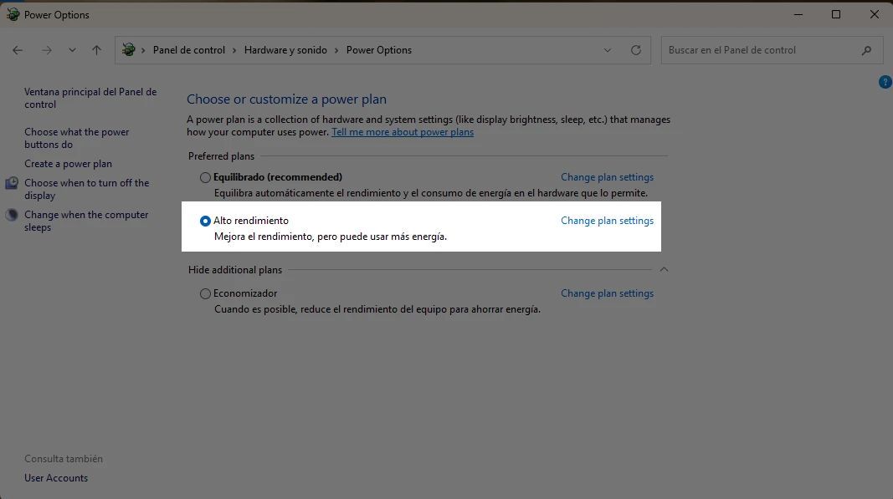
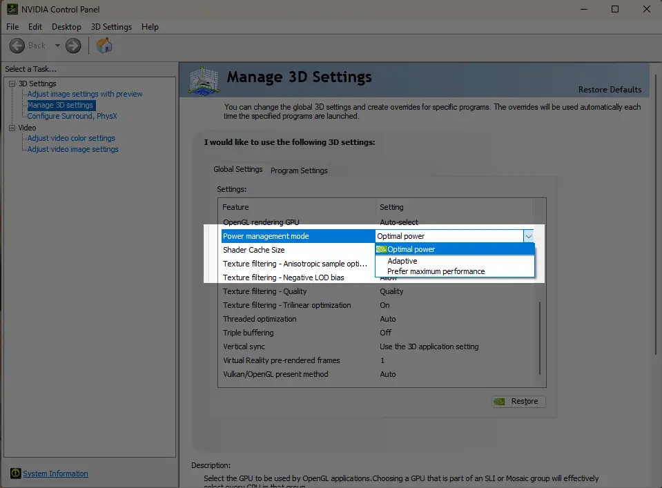
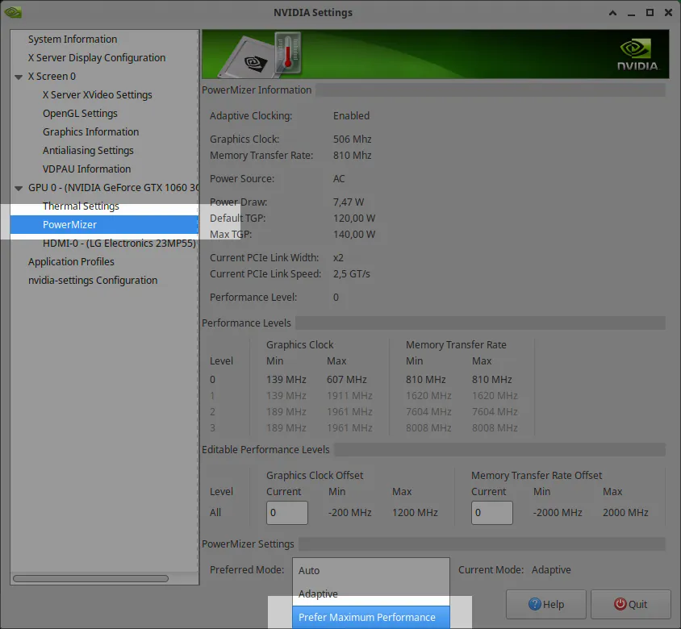
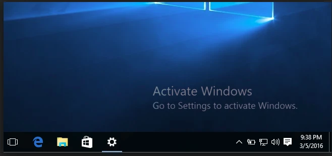
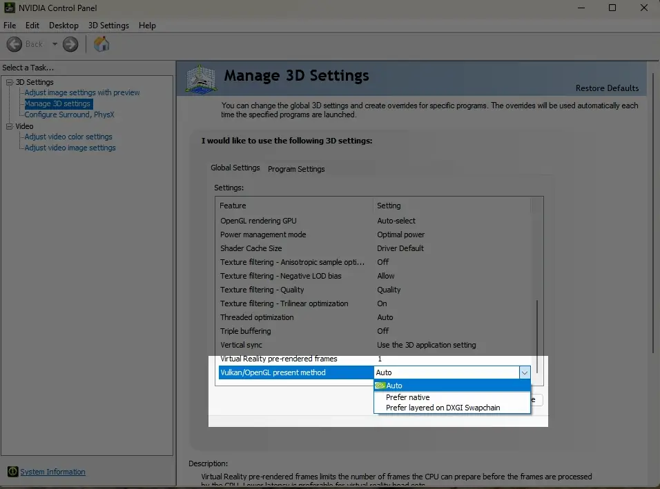
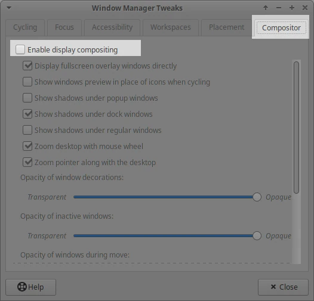

.. _doc_jitter_stutter:

Fixing jitter, stutter and input lag
====================================

What is jitter, stutter and input lag?
--------------------------------------

*Jitter* and *stutter* are two different alterations to visible motion of
objects on screen that may affect a game, even when running at full speed. These
effects are mostly visible in games where the world moves at a constant speed in
a fixed direction, like runners or platformers.

*Input lag* is unrelated to jitter and stutter, but is sometimes discussed
alongside. Input lag refers to visible on-screen delay when performing actions
with the mouse, keyboard, controller or touchscreen. It can be related to game
code, engine code or external factors (such as hardware). Input lag is most
noticeable in games that use the mouse to aim, such as first-person games.
Input lag can't be completely eliminated, but it can be reduced in several ways.

Distinguishing between jitter and stutter
-----------------------------------------

A game running at a normal framerate without exhibiting any effect will appear smooth:

.. image:: img/motion_normal.gif

A game exhibiting *jitter* will shake constantly in a very subtle way:

.. image:: img/motion_jitter.gif

Finally, a game exhibiting *stutter* will appear smooth, but appear to *stop* or
*roll back a frame* every few seconds:

.. image:: img/motion_stutter.gif

Jitter
------

There can be many causes of jitter, the most typical one happens when the game
*physics frequency* (usually 60 Hz) runs at a different resolution than the
monitor refresh rate. Check whether your monitor refresh rate is different from
60 Hz.

This is generally not a problem, given that most monitors are 60 Hz, and
starting with Godot 3.1, a frame timer was introduced that tries to synchronize
with refresh as well as possible.

Sometimes only some objects appear to jitter (character or background). This
happens when they are processed in different time sources (one is processed in
the physics step while another is processed in the idle step). Godot 3.1 does
some improvements to this, from allowing kinematic bodies to be animated in the
regular ``_process()`` loop, to further fixes in the frame timer.

Stutter
-------

Stutter may happen due to two different reasons. The first, and most obvious
one, is the game not being able to keep full framerate performance. Solving this
is game specific and will require optimization.

The second is more complicated, because it is often not associated to the engine
or game but the underlying operating system. Here is some information regarding
stutter on different OSs.

On platforms that support disabling V-Sync, stuttering can be made less
noticeable by disabling V-Sync in the project settings. This will however cause
tearing to appear, especially on monitors with low refresh rates. If your
monitor supports it, consider enabling variable refresh rate (G-Sync/FreeSync)
while leaving V-Sync enabled. This avoids mitigating some forms of stuttering
without introducing tearing.

Forcing your graphics card to use the maximum performance profile can also help
reduce stuttering, at the cost of increased GPU power draw.

Windows
~~~~~~~

Windows is known to cause stutter in windowed games. This mostly depends on the
hardware installed, drivers version and processes running in parallel (e.g.
having many browser tabs open may cause stutter in a running game). To avoid
this, starting with 3.1, Godot raises the game priority to "Above Normal". This
helps considerably but may not completely eliminate stutter.

Eliminating this completely requires giving your game full privileges to become
"time critical", which is not advised. Some games may do it, but it is advised
to learn to live with this problem, as it is common for Windows games and most
users won't play games windowed (games that are played in a window, e.g. puzzle
games, will usually not exhibit this problem anyway).

For fullscreen, Windows gives special priority to the game so stutter is no
longer visible and very rare. This is how most games are played.

When using a mouse with a polling rate of 1,000 Hz or more, consider using a
fully up-to-date Windows 11 installation which comes with fixes related to high
CPU utilization with high polling rate mice. These fixes are not available in
Windows 10 and older versions.

.. tip::

    Games should use the **Exclusive Fullscreen** window mode, as opposed to
    **Fullscreen** which is designed to prevent Windows from automatically
    treating the window as if it was exclusive fullscreen.

    **Fullscreen** is meant to be used by GUI applications that want to use
    per-pixel transparency without a risk of having it disabled by the OS. It
    achieves this by leaving a 1-pixel line at the bottom of the screen. By
    contrast, **Exclusive Fullscreen** uses the actual screen size and allows
    Windows to reduce jitter and input lag for fullscreen games.

Linux
~~~~~

Stutter may be visible on desktop Linux, but this is usually associated with
different video drivers and compositors. Some compositors may also trigger this
problem (e.g. KWin), so it is advised to try using a different one to rule it
out as the cause. Some window managers such as KWin and Xfwm allow you to
manually disable compositing, which can improve performance (at the cost of
tearing).

There is no workaround for driver or compositor stuttering, other than reporting
it as an issue to the driver or compositor developers. Stutter may be more
present when playing in windowed mode as opposed to fullscreen, even with
compositing disabled.

`Feral GameMode <https://github.com/FeralInteractive/gamemode>`__ can be used
to automatically apply optimizations (such as forcing the GPU performance profile)
when running specific processes.

macOS
~~~~~

Generally, macOS is stutter-free, although recently some bugs were reported when
running on fullscreen (this is a macOS bug). If you have a machine exhibiting
this behavior, please let us know.

Android
~~~~~~~

Generally, Android is stutter and jitter-free because the running activity gets
all the priority. That said, there may be problematic devices (older Kindle Fire
is known to be one). If you see this problem on Android, please let us know.

iOS
~~~

iOS devices are generally stutter-free, but older devices running newer versions
of the operating system may exhibit problems. This is generally unavoidable.

Troubleshooting guide
---------------------

After an extensive evaluation of reported tickets and thorough testing of Godot on different hardware,
we found that Godot is blamed for many stutter, jitter or input lag that is not caused by Godot,
but rather by third-party software or malfunctioning hardware.
This guide will help you find the root cause of these issues.
**Please read it carefully and exhaust all options before reporting a ticket on Godot.**

Bad HDMI / DisplayPort cable
~~~~~~~~~~~~~~~~~~~~~~~~~~~~

A broken cable may appear to function properly, but cause signal synchronization
issues that go apparently unnoticed. However, these issues can manifest when V-Sync
is enabled and apps (including but not limited to Godot) running in exclusive fullscreen
constantly have FPS jitter or slowdowns, even in the most basic of scenes.
If you see simple demo apps struggle to reach 60 FPS (e.g. it reaches 60 FPS, then
every 2 seconds slows down to 55 or 40 FPS and then goes back up), you may have a bad cable.

**Solution:** Replace the HDMI / DP cable.

**Workaround:** Disable V-Sync and use the FPS limiter by launching with: ``--disable-vsync --max-fps <fps>``

Broken monitor firmware
~~~~~~~~~~~~~~~~~~~~~~~

Similar to a bad HDMI / DP cable, a poor interaction between your monitor firmware and
your GPU can cause jitter or periodic slowdown.

Some monitors (typically the more recent/high-end ones) allow you to update their firmware.
In this case, download the latest firmware and apply it.
For many other monitors, this is not an option. Unfortunately, in this case,
the simple answer is to replace the monitor. You might have luck contacting
your monitor manufacturer (e.g. LG, Samsung, ViewSonic, etc) and/or your GPU vendor
(e.g. NVIDIA, AMD, Intel) and ask them for a solution or workaround.

**Solution:** Update firmware if possible, replace the monitor, or ask the manufacturer for a firmware/driver update.

**Workaround:** Disable V-Sync and use the FPS limiter by launching with: ``--disable-vsync --max-fps <fps>``

Multiple monitors
~~~~~~~~~~~~~~~~~

If you've got multiple monitors, ensure they are all in the same resolution, frequency (Hz),
and bit depth (e.g. 16-bit vs 24-bit, HDR vs SDR).

If they're not, change their settings until they match. If problems persist,
try disabling all but one of the monitors.

Overheating and throttling
~~~~~~~~~~~~~~~~~~~~~~~~~~

Jitter or stutter may be caused by an overheating CPU and/or GPU that throttles itself down.
You can use temperature monitor software such as
`Libre Hardware Monitor <https://github.com/LibreHardwareMonitor/LibreHardwareMonitor>`__ on Windows or
`lm-sensors <https://wiki.archlinux.org/title/Lm_sensors>`__ on Linux
to see if this is the case.

**Solution:** Fix the cooling problem.

Inconsistent power saving
~~~~~~~~~~~~~~~~~~~~~~~~~

In some cases, the OS or driver keeps switching the CPU and/or GPU frequencies up and
down. This causes an uneven experience.

**Solution (Windows):** Set the Power Profile to "High Performance":

.. tip::

    Sometimes "CPU Boost" where a single CPU core goes into overdrive can be a problem.
    You can prevent CPU Boost by editing your *current* energy plan and set
    **Processor power management > Maximum processor state** to 99% instead of 100%:

    .. image:: img/windows-no-boost.webp

For NVIDIA on Windows, set "Power management mode" on "Prefer maximum performance".

**Solution (Linux):** Set the CPU governor to Performance:

.. code:: sh

    sudo cpupower frequency-set -g performance

    # AMD
    echo high | sudo tee /sys/class/drm/card1/device/power_dpm_force_performance_level

You can try `CoreCtrl <https://gitlab.com/corectrl/corectrl>`__ or `Feral GameMode <https://github.com/FeralInteractive/gamemode>`__
for user-friendly GUI to control power profiles for individual applications.

On NVIDIA, open **nvidia-settings** and go to **GPU 0 > PowerMizer > Preferred Mode: Prefer Maximum Performance**.

Windows: Unlicensed
~~~~~~~~~~~~~~~~~~~

First of all, "unactivated" or "unlicensed" Windows can have arbitrary limitations imposed by Microsoft.
These limitations can change over time and an important one is that Microsoft may decide to restrict
applications from entering "Hardware Independent Flip" modes which provides the lowest latency experience
while in fullscreen.

Second, even if Microsoft decides to not artificially limit "Hardware Independent Flip"; if
you're seeing this watermark:

Chances are you're not running in "Hardware Independent Flip" because Windows must use DWM
compositing to display the watermark on top of Godot. DWM Compositing prevents entering
the desired mode, which increases jitter and input lag.

**Solution:** Activate Windows by buying an original license key.

Windows: Presentation Mode
~~~~~~~~~~~~~~~~~~~~~~~~~~

Windows has many ways of presenting to the screen. `Special K has an in-depth explanation of them <https://wiki.special-k.info/Presentation_Model>`__

But we can basically reduce them to the following:

**Good**

1. Hardware: Independent Flip (also called "iFlip").
2. Hardware: Legacy Flip.
3. Hardware Composed: Independent Flip.

**Bad**

1. Composed: Flip.

You can use `PresentMon <https://github.com/GameTechDev/PresentMon/releases>`__ to see which mode Godot is in.
While in Fullscreen, Godot should be in one of the "good" ones.

If Godot is not in one of the "bad" ones, there may be an overlay that is causing problems
(e.g. AMD Overlay, NVIDIA's overlay, Microsoft Game Bar, "Activate Windows" watermark, etc).

Godot can only enter the good ones if it's fully covering a single monitor with nothing on top.
Some newer hardware may be able to enter "Hardware Composed: Independent Flip" even if not
fullscreen though, thanks to support for multiple plane overlays (MPO).
This behavior can sometimes be unreliable (e.g. it may vary depending on monitor count or
whether HDR is enabled), so it's still better to use fullscreen whenever possible.

.. warning::

    **Set PresentMon to windowed mode**. Otherwise, PresentMon's overlay
    `ironically prevents apps <https://github.com/GameTechDev/PresentMon/issues/367>`__
    from entering the "good" modes as it is displayed on top of Godot.
    You will have to use the recording option and later see the CSV capture
    to see what mode Godot was in.

.. warning::

    Resources online assert that "Hardware Composed: Independent Flip" is the superior method of all.
    However, our measurements do not conclusively align with such claims. Ultimately, the best experience
    is done when all resources are entirely dedicated to one process. "Hardware Composed: Independent Flip"
    implies that resources are being diverted to display something else too, even if that something is
    just the kernel giving CPU time to the DWM process.

Windows: NVIDIA Presentation Method
~~~~~~~~~~~~~~~~~~~~~~~~~~~~~~~~~~~

.. note::

    This section only applies to Vulkan and OpenGL. It does not affect D3D12.

NVIDIA has two presentation methods: "Prefer native" and "Prefer layered on DXGI Swapchain":

Switching to one or the other may give you better results. 

Linux: NVIDIA
~~~~~~~~~~~~~

On Linux machines using proprietary NVIDIA drivers, every time the process **nvidia-smi** is launched, it
causes a stutter. Unfortunately, many third-party apps periodically launch **nvidia-smi** to get GPU temperature
and frequency and display it on an overlay or similar. For example, running **nvidia-smi** once
per second completely ruins the gaming experience.

If an app can tell you GPU frequency, fan speed or temperature, then it is a suspect.
Disabling or removing such apps will fix the problem.

You should report the developer of those broken apps that they must not launch **nvidia-smi** to
query such information, and ask them to use `NVML <https://developer.nvidia.com/management-library-nvml>`__ instead.

.. note::

    Regularly launching nvidia-smi is a widespread problem on Linux, big enough to have its own section,
    **but nvidia-smi.exe is also present on Windows**. It is rare for a Windows program to regularly
    launch nvidia-smi.exe, thus this specific problem is rare on that platform. But if nvidia-smi.exe gets
    periodically launched on Windows, the same problems (and solutions) apply.

The following is a non-exhaustive list of known apps to cause stutter on NVIDIA Linux systems:

 - `CPU-X <https://github.com/TheTumultuousUnicornOfDarkness/CPU-X>`__.
 - Linux Mint's Mate panel application "CPU Frequency Scaling Monitor" applet.

Linux: Xfce
~~~~~~~~~~~

Xfce's compositor is not good for low-latency games and can cause jitter. Disable it.

Open the **Start menu > Window Manager Tweaks > Compositor** and uncheck **Enable display compositing**.

If you still want to use a compositor on Xfce, prefer using a better one like picom:

.. code:: sh

    sudo apt install picom

You can configure picom at ``~/.config/picom/picom.conf``:

.. code:: text

    # menu        = { shadow = false; };
    dropdown_menu = { shadow = false; };
    popup_menu    = { shadow = false; };
    utility       = { shadow = false; };
    unredir-if-possible = true;

The important one is **unredir-if-possible** which allows Godot to draw directly to screen in
fullscreen mode, which minimizes latency.

Third-party software
~~~~~~~~~~~~~~~~~~~~

Software installed from third-parties (or even from OEM manufacturers) can cause stutter,
jitter, or considerable input lag. This is a very broad, general, and hard to diagnose problem
because the situation changes all the time with Software updates.

However there are a few things we've noticed (this list is not exhaustive):

- `OBS (Open Broadcaster Software) <https://obsproject.com/>`__ installs an implicit Vulkan Layer. Older versions of OBS caused problems with Godot. They should've been fixed, but implicit layers can always reintroduce problems. If you've got OBS Studio and suffer from stutter, jitter, or latency issues, try upgrading to latest version or uninstalling it.
- `RTSS (aka Rivatuner Statistics Server) <https://www.guru3d.com/download/rtss-rivatuner-statistics-server-download/>`__ installs an implicit Vulkan Layer and tries to inject inself into D3D12. Like OBS, this can cause problems. Try uninstalling it.
- `MSI Afterburner <https://www.msi.com/Landing/afterburner/graphics-cards>`__ uses RTSS under the hood and is subject to the same problems. Additionally, monitoring certain sensors (like GPU voltage and power draw) is known to cause stutter on certain hardware configurations. Try updating to latest version or uninstalling it. If the problem is resolved, you may try to narrow down which sensor is causing problems.
- `Steam Overlays <https://help.steampowered.com/en/faqs/view/3978-072C-18DF-FBF9>`__ use an implicit Vulkan Layer that can mess up with presentation or force serialization of GPU commands that could be executed in parallel for greater performance. Try disabling them.
- `Game Bar <https://www.microsoft.com/windows/tips/game-bar>`__ as previously covered, Game Bar may prevent Godot from entering "Hardware Independent Flip". Disable it to see if that fixes problems.
- `Discord Game Overlay <https://support.discord.com/hc/en-us/articles/217659737-Game-Overlay-101#h_01JPT35B3CA450SKEF4N9DX70R>`__. Same deal as with the other overlays.
- WeChat / WeGame is known to cause problems with Godot (`#83307 <https://github.com/godotengine/godot/issues/83307>`__, `#81652 <https://github.com/godotengine/godot/issues/81652>`__). Either uninstall it, remove the implicit Vulkan Layer, or use the `VK_LOADER_LAYERS_DISABLE environment variable <https://github.com/godotengine/godot/issues/81652#issuecomment-2510962586>`__ to disable it.
- RGB Led control software. A lot of software to control RGB lights (whether it's the keyboard, mouse, RAM sticks, fans, GPU, etc) are poorly written and known to cause stutter and jitter problems. Uninstall them. Prefer purchasing devices that are compatible with `Windows 11' Dynamic Lighting <https://support.microsoft.com/en-us/windows/control-dynamic-lighting-devices-in-windows-8e8f22e3-e820-476c-8f9d-9ffc7b6ffcd2>`__ control.

It is important that you first disable everything on this list and anything that you can think of that
could affect your system's smooth performance, since two or more of these apps could be simultaneously
causing problems. Therefore, disabling just one at a time will not solve anything.

If disabling everything fixes the problem, you can start enabling these apps and services one by one
until you find the culprit(s).

Input lag
---------

Project configuration
~~~~~~~~~~~~~~~~~~~~~

On platforms that support disabling V-Sync, input lag can be made less
noticeable by disabling V-Sync in the project settings. This will however cause
tearing to appear, especially on monitors with low refresh rates. It's suggested
to make V-Sync available as an option for players to toggle.

When using the Forward+ or Mobile rendering methods, another way to reduce
visual latency when V-Sync is enabled is to use double-buffered V-Sync instead
of the default triple-buffered V-Sync. Since Godot 4.3, this can be achieved by
reducing the **Display > Window > V-Sync > Swapchain Image Count** project
setting to ``2``.  The downside of using double buffering is that framerate will
be less stable if the display refresh rate can't be reached due to a CPU or GPU
bottleneck. For instance, on a 60 Hz display, if the framerate would normally
drop to 55 FPS during gameplay with triple buffering, it will have to drop down
to 30 FPS momentarily with double buffering (and then go back to 60 FPS when
possible). As a result, double-buffered V-Sync is only recommended if you can
*consistently* reach the display refresh rate on the target hardware.

Increasing the number of physics iterations per second can also reduce
physics-induced input latency. This is especially noticeable when using physics
interpolation (which improves smoothness but increases latency). To do so, set
**Physics > Common > Physics Ticks Per Second** to a value higher than the
default ``60``, or set ``Engine.physics_ticks_per_second`` at runtime in a
script. Values that are a multiple of the monitor refresh rate (typically
``60``) work best when physics interpolation is disabled, as they will avoid
jitter. This means values such as ``120``, ``180`` and ``240`` are good starting
points. As a bonus, higher physics FPSes make tunneling and physics instability
issues less likely to occur.

The downside of increasing physics FPS is that CPU usage will increase, which
can lead to performance bottlenecks in games that have heavy physics simulation
code. This can be alleviated by increasing physics FPS only in situations where
low latency is critical, or by letting players adjust physics FPS to match their
hardware. However, different physics FPS will lead to different outcomes in
physics simulation, even when ``delta`` is consistently used in your game logic.
This can give certain players an advantage over others. Therefore, allowing the
player to change the physics FPS themselves should be avoided for competitive
multiplayer games.

Lastly, you can disable input buffering on a per-rendered frame basis by calling
``Input.set_use_accumulated_input(false)`` in a script. This will make it so the
``_input()`` and ``_unhandled_input()`` functions in your scripts are called on
every input, rather than accumulating inputs and waiting for a frame to be
rendered. Disabling input accumulation will increase CPU usage, so it should be
done with caution.

.. tip::

    On any Godot project, you can use the ``--disable-vsync``
    :ref:`command line argument <doc_command_line_tutorial>` to forcibly disable V-Sync.
    Since Godot 4.2, ``--max-fps <fps>`` can also be used to set a FPS limit
    (``0`` is unlimited). These arguments can be used at the same time.

Hardware/OS-specific
~~~~~~~~~~~~~~~~~~~~

If your monitor supports it, consider enabling variable refresh rate
(G-Sync/FreeSync) while leaving V-Sync enabled, then cap the framerate in the
project settings to a slightly lower value than your monitor's maximum refresh
rate as per `this page <https://blurbusters.com/howto-low-lag-vsync-on/>`__.
For example, on a 144 Hz monitor, you can set the project's framerate cap to
``141``. This may be counterintuitive at first, but capping the FPS below the
maximum refresh rate range ensures that the OS never has to wait for vertical
blanking to finish. This leads to *similar* input lag as V-Sync disabled with
the same framerate cap (usually less than 1 ms greater), but without any
tearing.

This can be done by changing the **Application > Run > Max FPS** project
setting or assigning ``Engine.max_fps`` at runtime in a script.

On some platforms, you can also opt into a low-latency mode in the graphics
driver options (such as the NVIDIA Control Panel on Windows). The **Ultra**
setting will give you the lowest possible latency, at the cost of slightly lower
average framerates. Forcing the GPU to use the maximum performance profile
can also further reduce input lag, at the cost of higher power consumption
(and resulting heat/fan noise).

Finally, make sure your monitor is running at its highest possible refresh rate
in the OS' display settings.

Also, ensure that your mouse is configured to use its highest polling rate
(typically 1,000 Hz for gaming mice, sometimes more). High USB polling rates can
however result in high CPU usage, so 500 Hz may be a safer bet on low-end CPUs.
If your mouse offers multiple :abbr:`DPI (Dots Per Inch)` settings, consider also
`using the highest possible setting and reducing in-game sensitivity to reduce mouse latency <https://www.youtube.com/watch?v=6AoRfv9W110>`__.

On Linux, disabling compositing in window managers that allow it (such as KWin
or Xfwm) can reduce input lag significantly.

Latency reduction
~~~~~~~~~~~~~~~~~

Starting with Godot 4.5, new pacing methods were introduced to reduce latency (and alleviate jitter):

1. ``rendering/rendering_device/vsync/latency_mode``. It supports 4 options:

  * ``low_extreme`` (only available through the GDScript API and command line interface. Cannot be set by default).
  * ``low`` (default).
  * ``medium``.
  * ``high_throughput``.

2. ``PacingMethod``, a fallback solution when Waitable Swapchains is not available:

  * ``SEQUENTIAL``: The CPU always stalls for the GPU to minimize latency. **This can heavily penalize framerate and does not always result in lower latency**. This method can only reduce latency if the system was already fast enough to hit V-Sync's framerate.
  * ``PARALLEL``: The CPU and GPU try to run in parallel. This is the usual method of 2D and 3D rendering.
  * ``AUTO`` automatically selects between ``SEQUENTIAL`` or ``PARALLEL`` based on current CPU and GPU performance. ``AUTO`` will only select ``SEQUENTIAL`` if the system is fast enough.

Waitable Swapchains are by far the superior method, but if that's not available, ``AUTO``/``SEQUENTIAL`` will be used instead.

.. warning::

    In all cases (*including* Waitable Swapchain method), **lowering latency implies sacrificing framerate**.
    The question is, how much FPS (frames per second) are you willing to sacrifice for latency. The relationship is not linear.
    This means the lower the latency you want to achieve, the greater the FPS sacrifice, which can become very significant.
    This is not a bug, it is just the nature of how it works.

.. warning::

    Lowering latency makes Godot more susceptible to **microstutter**.
    Thus if you're experiencing microstutter, use these options to *increase* latency instead.

.. warning::

    ``low_extreme`` might get you better latency (or even be a placebo) but always at a very large FPS cost.
    Furthermore it may reintroduce microstutter. Caution is advised when seeking to lower latency too much.

    Just because ``low_extreme`` works great in your machine doesn't mean it will work fine
    in other machines. Don't deploy to end users with this setting as a default.

The following table summarizes what Godot does based on each setting and available feature:

.. table::
   :widths: auto

   +-----------------+-----------------------------------------------------------------+---------------------------------+
   | Setting         | Target: Frames of latency (if Waitable Swapchains are available)| Waitable Swapchains unavailable |
   +=================+=================================================================+=================================+
   | low_extreme     | 0                                                               | ``SEQUENTIAL``                  |
   +-----------------+-----------------------------------------------------------------+---------------------------------+
   | low             | 1                                                               | ``AUTO``                        |
   +-----------------+-----------------------------------------------------------------+---------------------------------+
   | medium          | rendering/rendering_device/vsync/frame_queue_size               | ``PARALLEL`` (Disabled)         |
   +-----------------+-----------------------------------------------------------------+---------------------------------+
   | high_throughput | Disabled                                                        | ``PARALLEL`` (Disabled)         |
   +-----------------+-----------------------------------------------------------------+---------------------------------+

This table is read like this:
 
 - If Waitable Swapchains are available, at "low", Godot will target 1 frame of latency. Otherwise, at "low" it will use ``AUTO`` as fallback.
 - If Waitable Swapchains are available, at "medium" Godot will use the value in ``frame_queue_size`` as target for frames of latency. Otherwise, it uses ``PARALLEL`` mode (which is the same as having no pacing method).

.. tip::

    Godot's behavior on version 4.4 and earlier corresponds to ``high_throughput``.

**Troubleshooting:**

If you suspect Godot's pacing methods are malfunctioning, there are several steps you can take.

The first thing we need to do is to run with ``--verbose`` to know which pacing methods are available.
You should see something like this:

.. code:: text

    Supported Pacing Methods (mask 03):
        SEQUENTIAL_SYNC
        WAITABLE_SWAPCHAIN
    Current Pacing Method (may change later): WAITABLE_SWAPCHAIN

In this case, Waitable Swapchain is being used. This is great! The second thing we should try is running with a different latency mode:
Let's say: ``--latency-mode medium``. There's 4 options to try (note: ``high_throughput`` just disables any pacing method).
If the problem is gone, then we're done.

But let's say we want to try another method. For some reason, we suspect waitable swapchains are malfunctioning.
We can try masking this feature out:

- ``--pacing-mode-mask 0x01`` will force to only use ``SEQUENTIAL_SYNC`` (if available).
- ``--pacing-mode-mask 0x02`` will force to only use ``WAITABLE_SWAPCHAIN`` (if available).

The following table shows the masks for each settings (these masks can be OR'ed together):

.. table::
   :widths: auto

   +--------------------+------+
   | Setting            | Mask |
   +====================+======+
   | SEQUENTIAL_SYNC    | 0x01 |
   +--------------------+------+
   | WAITABLE_SWAPCHAIN | 0x02 |
   +--------------------+------+
   | ANDROID_SWAPPY     | 0x04 |
   +--------------------+------+

Thus, by launching with ``--pacing-mode-mask 0x01`` we can experience how it runs by using ``SEQUENTIAL_SYNC``.
Now that we are in sequential sync pacing mode; again we can try ``--latency-mode`` makes any difference.
You can try ``low_extreme`` (``SEQUENTIAL``), ``low`` (``AUTO``) and ``medium`` (``PARALLEL``) to see if they make a difference.

**When to report issues:**

 - If ``WAITABLE_SWAPCHAIN`` at ``low`` or ``medium`` settings are causing problems. This could indicate an issue with the rendering API, the OS, or hardware.
 - If ``SEQUENTIAL_SYNC`` at ``low`` is causing problems but works fine at ``low_extreme`` or ``medium``. This would indicate a problem in Godot's ``AUTO`` algorithm.
 - If ``ANDROID_SWAPPY`` is causing problems.

**What NOT to report:**
 - ``low`` or ``low_extreme`` reduces the FPS.
 - ``AUTO`` does not improve latency.
 - ``SEQUENTIAL_SYNC`` does not improve latency.

Reporting jitter, stutter or input lag problems
-----------------------------------------------

If you are reporting a stutter or jitter problem (opening an issue) not caused
by any of the above reasons, please specify very clearly all the information
possible about device, operating system, driver versions, etc. This may help to
better troubleshoot it.

If you are reporting input lag problems, please include a capture made with a
high speed camera (such as your phone's slow motion video mode). The capture
**must** have both the screen and the input device visible so that the number of
frames between an input and the on-screen result can be counted. Also, make
sure to mention your monitor's refresh rate and your input device's polling rate
(especially for mice).

Also, make sure to use the correct term (jitter, stutter, input lag) based on the
exhibited behavior. This will help understand your issue much faster. Provide a
project that can be used to reproduce the issue, and if possible, include a
screen capture demonstrating the bug.
