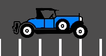
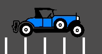

.. _doc_jitter_stutter:

Fixing jitter, stutter and input lag
====================================

What is jitter, stutter and input lag?
--------------------------------------

*Jitter* and *stutter* are two different alterations to visible motion of
objects on screen that may affect a game, even when running at full speed. These
effects are mostly visible in games where the world moves at a constant speed in
a fixed direction, like runners or platformers.

*Input lag* is unrelated to jitter and stutter, but is sometimes discussed
alongside. Input lag refers to visible on-screen delay when performing actions
with the mouse, keyboard, controller or touchscreen. It can be related to game
code, engine code or external factors (such as hardware). Input lag is most
noticeable in games that use the mouse to aim, such as first-person games.
Input lag can't be completely eliminated, but it can be reduced in several ways.

Distinguishing between jitter and stutter
-----------------------------------------

A game running at a normal framerate without exhibiting any effect will appear smooth:

.. image:: img/motion_normal.gif

A game exhibiting *jitter* will shake constantly in a very subtle way:

Finally, a game exhibiting *stutter* will appear smooth, but appear to *stop* or
*roll back a frame* every few seconds:

Jitter
------

There can be many causes of jitter, the most typical one happens when the game
*physics frequency* (usually 60 Hz) runs at a different resolution than the
monitor refresh rate. Check whether your monitor refresh rate is different from
60 Hz.

This is generally not a problem, given that most monitors are 60 Hz, and
starting with Godot 3.1, a frame timer was introduced that tries to synchronize
with refresh as well as possible.

Sometimes only some objects appear to jitter (character or background). This
happens when they are processed in different time sources (one is processed in
the physics step while another is processed in the idle step). Godot 3.1 does
some improvements to this, from allowing kinematic bodies to be animated in the
regular ``_process()`` loop, to further fixes in the frame timer.

.. note::

    You can use physics interpolation to mitigate physics-related jittering.
    See `lawnjelly's smoothing-addon <https://github.com/lawnjelly/smoothing-addon>`__
    for an add-on that can be dropped into any project to enable physics interpolation.

Stutter
-------

Stutter may happen due to two different reasons. The first, and most obvious
one, is the game not being able to keep full framerate performance. Solving this
is game specific and will require optimization.

The second is more complicated, because it is often not associated to the engine
or game but the underlying operating system. Here is some information regarding
stutter on different OSs.

On platforms that support disabling V-Sync, stuttering can be made less
noticeable by disabling V-Sync in the project settings. This will however cause
tearing to appear, especially on monitors with low refresh rates. If your
monitor supports it, consider enabling variable refresh rate (G-Sync/FreeSync)
while leaving V-Sync enabled. This avoids mitigating some forms of stuttering
without introducing tearing.

Forcing your graphics card to use the maximum performance profile can also help
reduce stuttering, at the cost of increased GPU power draw.

Windows
^^^^^^^

Windows is known to cause stutter in windowed games. This mostly depends on the
hardware installed, drivers version and processes running in parallel (e.g.
having many browser tabs open may cause stutter in a running game). To avoid
this, starting with 3.1, Godot raises the game priority to "Above Normal". This
helps considerably but may not completely eliminate stutter.

Eliminating this completely requires giving your game full privileges to become
"time critical", which is not advised. Some games may do it, but it is advised
to learn to live with this problem, as it is common for Windows games and most
users won't play games windowed (games that are played in a window, e.g. puzzle
games, will usually not exhibit this problem anyway).

For fullscreen, Windows gives special priority to the game so stutter is no
longer visible and very rare. This is how most games are played.

.. tip::

    Games should use the **Exclusive Fullscreen** window mode, as opposed to
    **Fullscreen** which is designed to prevent Windows from automatically
    treating the window as if it was exclusive fullscreen.

    **Fullscreen** is meant to be used by GUI applications that want to use
    per-pixel transparency without a risk of having it disabled by the OS. It
    achieves this by leaving a 1-pixel line at the bottom of the screen. By
    contrast, **Exclusive Fullscreen** uses the actual screen size and allows
    Windows to reduce jitter and input lag for fullscreen games.

Linux
^^^^^

Stutter may be visible on desktop Linux, but this is usually associated with
different video drivers and compositors. Some compositors may also trigger this
problem (e.g. KWin), so it is advised to try using a different one to rule it
out as the cause. Some window managers such as KWin and Xfwm allow you to
manually disable compositing, which can improve performance (at the cost of
tearing).

There is no workaround for driver or compositor stuttering, other than reporting
it as an issue to the driver or compositor developers. Stutter may be more
present when playing in windowed mode as opposed to fullscreen, even with
compositing disabled.

`Feral GameMode <https://github.com/FeralInteractive/gamemode>`__ can be used
to automatically apply optimizations (such as forcing the GPU performance profile)
when running specific processes.

macOS
^^^^^

Generally, macOS is stutter-free, although recently some bugs were reported when
running on fullscreen (this is a macOS bug). If you have a machine exhibiting
this behavior, please let us know.

Android
^^^^^^^

Generally, Android is stutter and jitter-free because the running activity gets
all the priority. That said, there may be problematic devices (older Kindle Fire
is known to be one). If you see this problem on Android, please let us know.

iOS
^^^

iOS devices are generally stutter-free, but older devices running newer versions
of the operating system may exhibit problems. This is generally unavoidable.

Input lag
---------

Project configuration
^^^^^^^^^^^^^^^^^^^^^

On platforms that support disabling V-Sync, input lag can be made less
noticeable by disabling V-Sync in the project settings. This will however cause
tearing to appear, especially on monitors with low refresh rates.

Increasing the number of physics iterations per second can also reduce
physics-induced input latency. This is especially noticeable when using physics
interpolation (which improves smoothness but increases latency). To do so, set
**Physics > Common > Physics Ticks Per Second** to a value higher than the
default ``60``, or set ``Engine.physics_ticks_per_second`` at run-time in a
script. Values that are a multiple of the monitor refresh rate (typically
``60``) work best when physics interpolation is disabled, as they will avoid
jitter. This means values such as ``120``, ``180`` and ``240`` are good starting
points. As a bonus, higher physics FPSes make tunneling and physics unstability
issues less likely to occur.

The downside of increasing physics FPS is that CPU usage will increase, which
can lead to performance bottlenecks in games that have heavy physics simulation
code. This can be alleviated by increasing physics FPS only in situations where
low latency is critical, or by letting players adjust physics FPS to match their
hardware. However, different physics FPS will lead to different outcomes in
physics simulation, even when ``delta`` is consistently used in your game logic.
This can give certain players an advantage over others. Therefore, allowing the
player to change the physics FPS themselves should be avoided for competitive
multiplayer games.

Lastly, you can disable input buffering on a per-rendered frame basis by calling
``Input.set_use_accumulated_input(false)`` in a script. This will make it so the
``_input()`` and ``_unhandled_input()`` functions in your scripts are called on
every input, rather than accumulating inputs and waiting for a frame to be
rendered. Disabling input accumulation will increase CPU usage, so it should be
done with caution.

Hardware/OS-specific
^^^^^^^^^^^^^^^^^^^^

If your monitor supports it, consider enabling variable refresh rate
(G-Sync/FreeSync) while leaving V-Sync enabled, then cap the framerate in the
project settings to a slightly lower value than your monitor's maximum refresh
rate as per `this page <https://blurbusters.com/howto-low-lag-vsync-on/>`__.
For example, on a 144 Hz monitor, you can set the project's framerate cap to
``141``. This may be counterintuitive at first, but capping the FPS below the
maximum refresh rate range ensures that the OS never has to wait for vertical
blanking to finish. This leads to *similar* input lag as V-Sync disabled with
the same framerate cap (usually less than 1 ms greater), but without any
tearing.

This can be done by changing the **Application > Run > Max FPS** project
setting or assigning ``Engine.max_fps`` at run-time in a script.

On some platforms, you can also opt into a low-latency mode in the graphics
driver options (such as the NVIDIA Control Panel on Windows). The **Ultra**
setting will give you the lowest possible latency, at the cost of slightly lower
average framerates. Forcing the GPU to use the maximum performance profile
can also further reduce input lag, at the cost of higher power consumption
(and resulting heat/fan noise).

Finally, make sure your monitor is running at its highest possible refresh rate
in the OS' display settings.

Also, ensure that your mouse is configured to use its highest polling rate
(typically 1,000 Hz for gaming mice, sometimes more). High USB polling rates can
however result in high CPU usage, so 500 Hz may be a safer bet on low-end CPUs.
If your mouse offers multiple :abbr:`DPI (Dots Per Inch)` settings, consider also
`using the highest possible setting and reducing in-game sensitivity to reduce mouse latency <https://www.youtube.com/watch?v=6AoRfv9W110>`__.

On Linux, disabling compositing in window managers that allow it (such as KWin
or Xfwm) can reduce input lag significantly.

Reporting jitter, stutter or input lag problems
-----------------------------------------------

If you are reporting a stutter or jitter problem (opening an issue) not caused
by any of the above reasons, please specify very clearly all the information
possible about device, operating system, driver versions, etc. This may help to
better troubleshoot it.

If you are reporting input lag problems, please include a capture made with a
high speed camera (such as your phone's slow motion video mode). The capture
**must** have both the screen and the input device visible so that the number of
frames between an input and the on-screen result can be counted. Also, make
sure to mention your monitor's refresh rate and your input device's polling rate
(especially for mice).

Also, make sure to use the correct term (jitter, stutter, input lag) based on the
exhibited behavior. This will help understand your issue much faster. Provide a
project that can be used to reproduce the issue, and if possible, include a
screen capture demonstrating the bug.
