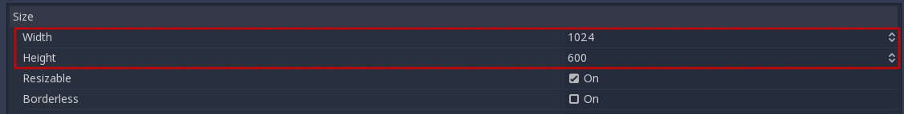
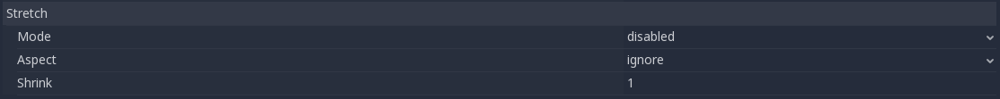
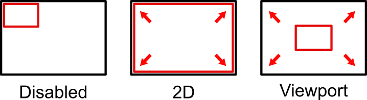
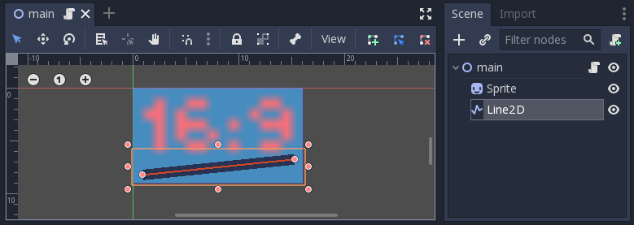
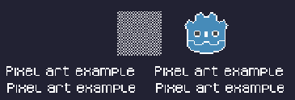
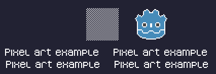

.. _doc_multiple_resolutions:

Multiple resolutions
====================

The problem of multiple resolutions
-----------------------------------

Developers often have trouble understanding how to best support multiple
resolutions in their games. For desktop and console games, this is more or less
straightforward, as most screen aspect ratios are 16:9 and resolutions
are standard (720p, 1080p, 1440p, 4K, …).

For mobile games, at first, it was easy. For many years, the iPhone and iPad
used the same resolution. When *Retina* was implemented, they just doubled
the pixel density; most developers had to supply assets in default and double
resolutions.

Nowadays, this is no longer the case, as there are plenty of different screen
sizes, densities, and aspect ratios. Non-conventional sizes are also becoming
increasingly popular, such as ultrawide displays.

For 3D games, there is not much of a need to support multiple resolutions (from
the aesthetic point of view). The 3D geometry will just fill the screen based on
the field of view, disregarding the aspect ratio. The main reason one may want
to support this, in this case, is for *performance* reasons (running in lower
resolution to increase frames per second).

For 2D and game UIs, this is a different matter, as art needs to be created
using specific pixel sizes in software such as Photoshop, GIMP or Krita.

Since layouts, aspect ratios, resolutions, and pixel densities can change so
much, it is no longer possible to design UIs for every specific screen.
Another method must be used.

One size fits all
-----------------

The most common approach is to use a single *base* resolution and
then fit it to everything else. This resolution is how most players are expected
to play the game (given their hardware). For mobile, Google has useful `stats
<https://developer.android.com/about/dashboards>`_ online, and for desktop,
Steam `also does <https://store.steampowered.com/hwsurvey/>`_.

As an example, Steam shows that the most common *primary display resolution* is
1920×1080, so a sensible approach is to develop a game for this resolution, then
handle scaling for different sizes and aspect ratios.

Godot provides several useful tools to do this easily.

.. seealso::

    You can see how Godot's support for multiple resolutions works in action using the
    `Multiple Resolutions and Aspect Ratios demo project <https://github.com/godotengine/godot-demo-projects/tree/master/gui/multiple_resolutions>`__.

Base size
---------

A base size for the window can be specified in the Project Settings under
**Display → Window**.

However, what it does is not completely obvious; the engine will *not*
attempt to switch the monitor to this resolution. Rather, think of this
setting as the "design size", i.e. the size of the area that you work
with in the editor. This setting corresponds directly to the size of the
blue rectangle in the 2D editor.

There is often a need to support devices with screen and window sizes
that are different from this base size. Godot offers many ways to
control how the viewport will be resized and stretched to different
screen sizes.

.. note::

   On this page, *window* refers to the screen area allotted to your game
   by the system, while *viewport* refers to the root object (accessible
   from ``get_tree().root``) which the game controls to fill this screen area.
   This viewport is a :ref:`Window <class_Window>` instance. Recall from the
   :ref:`introduction <doc_viewports>` that *all* Window objects are viewports.

To configure the stretch base size at runtime from a script, use the
``get_tree().root.content_scale_size`` property (see
:ref:`Window.content_scale_size <class_Window_property_content_scale_size>`).
Changing this value can indirectly change the size of 2D elements. However, to
provide an user-accessible scaling option, using
:ref:`doc_multiple_resolutions_stretch_scale` is recommended as it's easier to
adjust.

.. note::

   Godot follows a modern approach to multiple resolutions. The engine will
   never change the monitor's resolution on its own. While changing the
   monitor's resolution is the most efficient approach, it's also the least
   reliable approach as it can leave the monitor stuck on a low resolution if
   the game crashes. This is especially common on macOS or Linux which don't
   handle resolution changes as well as Windows.

   Changing the monitor's resolution also removes any control from the game
   developer over filtering and aspect ratio stretching, which can be important
   to ensure correct display for pixel art games.

   On top of that, changing the monitor's resolution makes alt-tabbing in and
   out of a game much slower since the monitor has to change resolutions every
   time this is done.

Resizing
--------

There are several types of devices, with several types of screens, which
in turn have different pixel density and resolutions. Handling all of
them can be a lot of work, so Godot tries to make the developer's life a
little easier. The :ref:`Viewport <class_Viewport>`
node has several functions to handle resizing, and the root node of the
scene tree is always a viewport (scenes loaded are instanced as a child
of it, and it can always be accessed by calling
``get_tree().root`` or ``get_node("/root")``).

In any case, while changing the root Viewport params is probably the
most flexible way to deal with the problem, it can be a lot of work,
code and guessing, so Godot provides a set of parameters in the
project settings to handle multiple resolutions.

Stretch settings
----------------

Stretch settings are located in the project settings and provide several options:

Stretch Mode
^^^^^^^^^^^^

The **Stretch Mode** setting defines how the base size is stretched to fit
the resolution of the window or screen.

The animations below use a "base size" of just 16×9 pixels to
demonstrate the effect of different stretch modes. A single sprite, also
16×9 pixels in size, covers the entire viewport, and a diagonal
:ref:`Line2D <class_Line2D>` is added on top of it:

.. Animated GIFs are generated from:
.. https://github.com/ttencate/godot_scaling_mode

-  **Stretch Mode = Disabled** (default): No stretching happens. One
   unit in the scene corresponds to one pixel on the screen. In this
   mode, the **Stretch Aspect** setting has no effect.

   .. image:: img/stretch_disabled_expand.gif

-  **Stretch Mode = Canvas Items**: In this mode, the base size specified in
   width and height in the project settings is
   stretched to cover the whole screen (taking the **Stretch Aspect**
   setting into account). This means that everything is rendered
   directly at the target resolution. 3D is unaffected,
   while in 2D, there is no longer a 1:1 correspondence between sprite
   pixels and screen pixels, which may result in scaling artifacts.

   .. image:: img/stretch_2d_expand.gif

-  **Stretch Mode = Viewport**: Viewport scaling means that the size of
   the root :ref:`Viewport <class_Viewport>` is set precisely to the
   base size specified in the Project Settings' **Display** section.
   The scene is rendered to this viewport first. Finally, this viewport
   is scaled to fit the screen (taking the **Stretch Aspect** setting into
   account).

   .. image:: img/stretch_viewport_expand.gif

To configure the stretch mode at runtime from a script, use the
``get_tree().root.content_scale_mode`` property (see
:ref:`Window.content_scale_mode <class_Window_property_content_scale_mode>`
and the :ref:`ContentScaleMode <enum_Window_ContentScaleMode>` enum).

Stretch Aspect
^^^^^^^^^^^^^^

The second setting is the stretch aspect. Note that this only takes effect if
**Stretch Mode** is set to something other than **Disabled**.

In the animations below, you will notice gray and black areas. The black
areas are added by the engine and cannot be drawn into. The gray areas
are part of your scene, and can be drawn to. The gray areas correspond
to the region outside the blue frame you see in the 2D editor.

-  **Stretch Aspect = Ignore**: Ignore the aspect ratio when stretching
   the screen. This means that the original resolution will be stretched
   to exactly fill the screen, even if it's wider or narrower. This may
   result in nonuniform stretching: things looking wider or taller than
   designed.

   .. image:: img/stretch_viewport_ignore.gif

-  **Stretch Aspect = Keep**: Keep aspect ratio when stretching the
   screen. This means that the viewport retains its original size
   regardless of the screen resolution, and black bars will be added to
   the top/bottom of the screen ("letterboxing") or the sides
   ("pillarboxing").

   This is a good option if you know the aspect ratio of your target
   devices in advance, or if you don't want to handle different aspect
   ratios.

   .. image:: img/stretch_viewport_keep.gif

-  **Stretch Aspect = Keep Width**: Keep aspect ratio when stretching the
   screen. If the screen is wider than the base size, black bars are
   added at the left and right (pillarboxing). But if the screen is
   taller than the base resolution, the viewport will be grown in the
   vertical direction (and more content will be visible to the bottom).
   You can also think of this as "Expand Vertically".

   This is usually the best option for creating GUIs or HUDs that scale,
   so some controls can be anchored to the bottom
   (:ref:`doc_size_and_anchors`).

   .. image:: img/stretch_viewport_keep_width.gif

-  **Stretch Aspect = Keep Height**: Keep aspect ratio when stretching
   the screen. If the screen is taller than the base size, black
   bars are added at the top and bottom (letterboxing). But if the
   screen is wider than the base resolution, the viewport will be grown
   in the horizontal direction (and more content will be visible to the
   right). You can also think of this as "Expand Horizontally".

   This is usually the best option for 2D games that scroll horizontally
   (like runners or platformers).

   .. image:: img/stretch_viewport_keep_height.gif

-  **Stretch Aspect = Expand**: Keep aspect ratio when stretching the
   screen, but keep neither the base width nor height. Depending on the
   screen aspect ratio, the viewport will either be larger in the
   horizontal direction (if the screen is wider than the base size) or
   in the vertical direction (if the screen is taller than the original
   size).

   .. image:: img/stretch_viewport_expand.gif

.. tip::

    To support both portrait and landscape mode with a similar automatically
    determined scale factor, set your project's base resolution to be a *square*
    (1:1 aspect ratio) instead of a rectangle. For instance, if you wish to design
    for 1280×720 as the base resolution but wish to support both portrait and
    landscape mode, use 720×720 as the project's base window size in the
    Project Settings.

    To allow the user to choose their preferred screen orientation at run-time,
    remember to set **Display > Window > Handheld > Orientation** to ``sensor``.

To configure the stretch aspect at runtime from a script, use the
``get_tree().root.content_scale_aspect`` property (see
:ref:`Window.content_scale_aspect <class_Window_property_content_scale_aspect>`
and the :ref:`ContentScaleAspect <enum_Window_ContentScaleAspect>` enum).

.. _doc_multiple_resolutions_stretch_scale:

Stretch Scale
^^^^^^^^^^^^^

The **Scale** setting allows you to add an extra scaling factor on top of
what the **Stretch** options above already provide. The default value of ``1.0``
means that no additional scaling occurs.

For example, if you set **Scale** to ``2.0`` and leave **Stretch Mode** on
**Disabled**, each unit in your scene will correspond to 2×2 pixels on the
screen. This is a good way to provide scaling options for non-game applications.

If **Stretch Mode** is set to **canvas_items**, 2D elements will be scaled
relative to the base window size, then multiplied by the **Scale** setting. This
can be exposed to players to allow them to adjust the automatically determined
scale to their liking, for better accessibility.

If **Stretch Mode** is set to **viewport**, the viewport's resolution is divided
by **Scale**. This makes pixels look larger and reduces rendering resolution
(with a given window size), which can improve performance.

To configure the stretch scale at runtime from a script, use the
``get_tree().root.content_scale_factor`` property (see
:ref:`Window.content_scale_factor <class_Window_property_content_scale_factor>`).

.. _doc_multiple_resolutions_stretch_scale_mode:

Stretch Scale Mode
^^^^^^^^^^^^^^^^^^

Since Godot 4.2, the **Stretch Scale Mode** setting allows you to constrain the
automatically determined scale factor (as well as the manually specified
**Stretch Scale** setting) to integer values. By default, this setting is set to
``fractional``, which allows any scale factor to be applied (including fractional
values such as ``2.5``). When set to ``integer``, the value is rounded down to
the nearest integer. For example, instead of using a scale factor of ``2.5``, it
would be rounded down to ``2.0``. This is useful to prevent distortion when
displaying pixel art.

Compare this pixel art which is displayed with the ``viewport`` stretch mode,
with the stretch scale mode set to ``fractional``:

   Checkerboard doesn't look "even". Line widths in the logo and text varies wildly.

This pixel art is also displayed with the ``viewport`` stretch mode, but the
stretch scale mode is set to ``integer`` this time:

   Checkerboard looks perfectly even. Line widths are consistent.

For example, if your viewport base size is 640×360 and the window size is 1366×768:

- When using ``fractional``, the viewport is displayed at a resolution of
  1366×768 (scale factor is roughly 2.133×). The entire window space is used.
  Each pixel in the viewport corresponds to 2.133×2.133 pixels in the displayed
  area. However, since displays can only display "whole" pixels, this will lead
  to uneven pixel scaling which results in incorrect appearance of pixel art.
- When using ``integer``, the viewport is displayed at a resolution of 1280×720
  (scale factor is 2×). The remaining space is filled with black bars on all
  four sides, so that each pixel in the viewport corresponds to 2×2 pixels in
  the displayed area.

This setting is effective with any stretch mode. However, when using the
``disabled`` stretch mode, it will only affect the **Stretch Scale** setting by
rounding it *down* to the nearest integer value. This can be used for 3D games
that have a pixel art UI, so that the visible area in the 3D viewport doesn't
reduce in size (which occurs when using ``canvas_items`` or ``viewport`` stretch
mode with the ``integer`` scale mode).

.. tip::

    Games should use the **Exclusive Fullscreen** window mode, as opposed to
    **Fullscreen** which is designed to prevent Windows from automatically
    treating the window as if it was exclusive fullscreen.

    **Fullscreen** is meant to be used by GUI applications that want to use
    per-pixel transparency without a risk of having it disabled by the OS. It
    achieves this by leaving a 1-pixel line at the bottom of the screen. By
    contrast, **Exclusive Fullscreen** uses the actual screen size and allows
    Windows to reduce jitter and input lag for fullscreen games.

    When using integer scaling, this is particularly important as the 1-pixel
    height reduction from the **Fullscreen** mode can cause integer scaling to
    use a smaller scale factor than expected.

Common use case scenarios
-------------------------

The following settings are recommended to support multiple resolutions and aspect
ratios well.

Desktop game
^^^^^^^^^^^^

**Non-pixel art:**

- Set the base window width to ``1920`` and window height to ``1080``. If you have a
  display smaller than 1920×1080, set **Window Width Override** and **Window Height Override** to
  lower values to make the window smaller when the project starts.
- Alternatively, if you're targeting high-end devices primarily, set the base
  window width to ``3840`` and window height to ``2160``.
  This allows you to provide higher resolution 2D assets, resulting in crisper
  visuals at the cost of higher memory usage and file sizes.
  Note that this will make non-mipmapped textures grainy on low resolution devices,
  so make sure to follow the instructions described in
  :ref:`doc_multiple_resolutions_reducing_aliasing_on_downsampling`.
- Set the stretch mode to ``canvas_items``.
- Set the stretch aspect to ``expand``. This allows for supporting multiple aspect ratios
  and makes better use of tall smartphone displays (such as 18:9 or 19:9 aspect ratios).
- Configure Control nodes' anchors to snap to the correct corners using the **Layout** menu.

**Pixel art:**

- Set the base window size to the viewport size you intend to use. Most pixel
  art games use viewport sizes between 256×224 and 640×480. 640×360 is a good
  baseline, as it scales to 1280×720, 1920×1080, 2560×1440, and 3840×2160 without
  any black bars when using integer scaling. Higher viewport sizes will require
  using higher resolution artwork, unless you intend to show more of the game
  world at a given time.
- Set the stretch mode to ``viewport``.
- Set the stretch aspect to ``keep`` to enforce a single aspect ratio (with
  black bars). As an alternative, you can set the stretch aspect to ``expand`` to
  support multiple aspect ratios.
- If using the ``expand`` stretch aspect, Configure Control nodes' anchors to
  snap to the correct corners using the **Layout** menu.
- Set the stretch scale mode to ``integer``. This prevents uneven pixel scaling
  from occurring, which makes pixel art not display as intended.

.. note::

    The ``viewport`` stretch mode provides low-resolution rendering that is then
    stretched to the final window size. If you are OK with sprites being able to
    move or rotate in "sub-pixel" positions or wish to have a high resolution 3D
    viewport, you should use the ``canvas_items`` stretch mode instead of the ``viewport``
    stretch mode.

Mobile game in landscape mode
^^^^^^^^^^^^^^^^^^^^^^^^^^^^^

Godot is configured to use landscape mode by default. This means you don't need
to change the display orientation project setting.

- Set the base window width to ``1280`` and window height to ``720``.
- Alternatively, if you're targeting high-end devices primarily, set the base
  window width to ``1920`` and window height to ``1080``.
  This allows you to provide higher resolution 2D assets, resulting in crisper
  visuals at the cost of higher memory usage and file sizes. Many devices have
  even higher resolution displays (1440p), but the difference with 1080p is
  barely visible given the small size of smartphone displays.
  Note that this will make non-mipmapped textures grainy on low resolution devices,
  so make sure to follow the instructions described in
  :ref:`doc_multiple_resolutions_reducing_aliasing_on_downsampling`.
- Set the stretch mode to ``canvas_items``.
- Set the stretch aspect to ``expand``. This allows for supporting multiple aspect ratios
  and makes better use of tall smartphone displays (such as 18:9 or 19:9 aspect ratios).
- Configure Control nodes' anchors to snap to the correct corners using the **Layout** menu.

.. tip::

    To better support tablets and foldable phones (which frequently feature
    displays with aspect ratios close to 4:3), consider using a base resolution
    that has a 4:3 aspect ratio while following the rest of the instructions
    here. For instance, you can set the base window width to ``1280`` and the
    base window height to ``960``.

Mobile game in portrait mode
^^^^^^^^^^^^^^^^^^^^^^^^^^^^

- Set the base window width to ``720`` and window height to ``1280``.
- Alternatively, if you're targeting high-end devices primarily, set the base
  window width to ``1080`` and window height to ``1920``.
  This allows you to provide higher resolution 2D assets, resulting in crisper
  visuals at the cost of higher memory usage and file sizes. Many devices have
  even higher resolution displays (1440p), but the difference with 1080p is
  barely visible given the small size of smartphone displays.
  Note that this will make non-mipmapped textures grainy on low resolution devices,
  so make sure to follow the instructions described in
  :ref:`doc_multiple_resolutions_reducing_aliasing_on_downsampling`.
- Set **Display > Window > Handheld > Orientation** to ``portrait``.
- Set the stretch mode to ``canvas_items``.
- Set the stretch aspect to ``expand``. This allows for supporting multiple aspect ratios
  and makes better use of tall smartphone displays (such as 18:9 or 19:9 aspect ratios).
- Configure Control nodes' anchors to snap to the correct corners using the **Layout** menu.

.. tip::

    To better support tablets and foldable phones (which frequently feature
    displays with aspect ratios close to 4:3), consider using a base resolution
    that has a 3:4 aspect ratio while following the rest of the instructions
    here. For instance, you can set the base window width to ``960`` and the
    base window height to ``1280``.

Non-game application
^^^^^^^^^^^^^^^^^^^^

- Set the base window width and height to the smallest window size that you intend to target.
  This is not required, but this ensures that you design your UI with small window sizes in mind.
- Keep the stretch mode to its default value, ``disabled``.
- Keep the stretch aspect to its default value, ``ignore``
  (its value won't be used since the stretch mode is ``disabled``).
- You can define a minimum window size by setting ``OS.min_window_size`` in a
  script's ``_ready()`` function. This prevents the user from resizing the application
  below a certain size, which could break the UI layout.

.. note::

    Godot doesn't support manually overriding the 2D scale factor yet, so it is
    not possible to have hiDPI support in non-game applications. Due to this, it
    is recommended to leave **Allow Hidpi** disabled in non-game applications to
    allow for the OS to use its low-DPI fallback.

hiDPI support
-------------

By default, Godot projects are considered DPI-aware by the operating system.
This is controlled by the **Display > Window > Dpi > Allow Hidpi** project setting,
which should be left enabled whenever possible. Disabling DPI awareness can break
fullscreen behavior on Windows.

Since Godot projects are DPI-aware, they may appear at a very small window size
when launching on an hiDPI display (proportionally to the screen resolution).
For a game, the most common way to work around this issue is to make them
fullscreen by default. Alternatively, you could set the window size in an
:ref:`autoload <doc_singletons_autoload>`'s ``_ready()`` function according to
the screen size.

To ensure 2D elements don't appear too small on hiDPI displays:

- For games, use the ``canvas_items`` or ``viewport`` stretch modes so that 2D
  elements are automatically resized according to the current window size.
- For non-game applications, use the ``disabled`` stretch mode and set the
  stretch scale to a value corresponding to the display scale factor in an
  :ref:`autoload <doc_singletons_autoload>`'s ``_ready()`` function.
  The display scale factor is set in the operating system's settings and can be queried
  using :ref:`screen_get_scale<class_DisplayServer_method_screen_get_scale>`. This
  method is currently only implemented on macOS. On other operating systems, you
  will need to implement a method to guess the display scale factor based on the
  screen resolution (with a setting to let the user override this if needed). This
  is the approach currently used by the Godot editor.

The **Allow Hidpi** setting is only effective on Windows and macOS. It's ignored
on all other platforms.

.. note::

    The Godot editor itself is always marked as DPI-aware. Running the project
    from the editor will only be DPI-aware if **Allow Hidpi** is enabled in the
    Project Settings.

.. _doc_multiple_resolutions_reducing_aliasing_on_downsampling:

Reducing aliasing on downsampling
---------------------------------

If the game has a very high base resolution (e.g. 3840×2160), aliasing might
appear when downsampling to something considerably lower like 1280×720.

To resolve this, you can :ref:`enable mipmaps <doc_importing_images_mipmaps>` on
all your 2D textures. However, enabling mipmaps will increase memory usage which
can be an issue on low-end mobile devices.

Handling aspect ratios
----------------------

Once scaling for different resolutions is accounted for, make sure that
your *user interface* also scales for different aspect ratios. This can be
done using :ref:`anchors <doc_size_and_anchors>` and/or :ref:`containers
<doc_gui_containers>`.

Field of view scaling
---------------------

The 3D Camera node's **Keep Aspect** property defaults to the **Keep Height**
scaling mode (also called *Hor+*). This is usually the best value for desktop
games and mobile games in landscape mode, as widescreen displays will
automatically use a wider field of view.

However, if your 3D game is intended to be played in portrait mode, it may make
more sense to use **Keep Width** instead (also called *Vert-*). This way,
smartphones with an aspect ratio taller than 16:9 (e.g. 19:9) will use a
*taller* field of view, which is more logical here.

Scaling 2D and 3D elements differently using Viewports
------------------------------------------------------

Using multiple Viewport nodes, you can have different scales for various
elements. For instance, you can use this to render the 3D world at a low
resolution while keeping 2D elements at the native resolution. This can improve
performance significantly while keeping the HUD and other 2D elements crisp.

This is done by using the root Viewport node only for 2D elements, then creating
a Viewport node to display the 3D world and displaying it using a
SubViewportContainer or TextureRect node. There will effectively be two viewports
in the final project. One upside of using TextureRect over SubViewportContainer is
that it allows enable linear filtering. This makes scaled 3D viewports look
better in many cases.

See the
`3D viewport scaling demo <https://github.com/godotengine/godot-demo-projects/tree/master/viewport/3d_scaling>`__
for examples.
