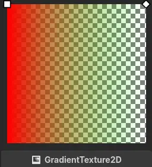
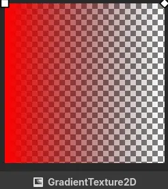

.. _doc_premultiplied_alpha_blending:

Premultiplied alpha blending
============================

The premultiplied alpha blend mode is available in
:ref:`CanvasItemMaterial <class_CanvasItemMaterial>`,
:ref:`BaseMaterial3D <class_BaseMaterial3D>`,
:ref:`CanvasItem shaders <doc_canvas_item_shader>`, and
:ref:`Spatial shaders <doc_spatial_shader>`.

It is a close alternative to the mix blend mode, with both of them calculating
the final color using the blended color's transparency (alpha channel) to
interpolate between the blended color and the background color's RGB
channels. Its name comes from the requirement for the blended color's RGB
channels to be multiplied by the alpha channel.

The premultiplied alpha import setting of Godot's texutre types does this
multiplication, allowing them to be used in materials and shaders with this
blend mode.

The premultiplied alpha blend mode in Godot's materials and shaders changes the
blending formula to account for the color's RGB channels having already been
multiplied by the alpha.

.. code-block:: glsl

    // Blends the source (blended) color over the destination (background) color.
    vec4 blend_mix(vec4 src, vec4 dst) {
        vec3 rgb = vec3(src.rgb * src.a + dst.rgb * (1.0 - src.a));
        float a = src.a + dst.a * (1.0 - src.a);
        return vec4(rgb, a);
    }

    // Expects the color's rgb channels to be premultiplied by the alpha channel.
    vec4 blend_premul_alpha(vec4 src, vec4 dst) {
        vec3 rgb = vec3(src.rgb + dst.rgb * (1.0 - src.a));
        float a = src.a + dst.a * (1.0 - src.a);
        return vec4(rgb, a);
    }

Correct interpolation
---------------------

Initially it seems like the two versions are identical, but that is not the
case when texture sampling comes into effect. When getting a color from a
texture at a given texture coordinate, the sampler will interpolate a color
from the surrounding pixels. The texture's color not being premultiplied by
its alpha, perhaps counterintuitively, results in a loss of information.

Consider the extreme case of an opaque red and a transparent green pixel right
next to each other. If we were to blend them individually using the mix
blending formula, we would override the background, and change nothing,
respectively. The interpolated color, however, is a half-transparent yellow.
This gradient texture simulates the undesired blending result.

If the color channels of the texture are premultiplied by the alpha and we drop
the multiplication from the blending formula, the interpolated pixel is the
expected half-transparent red.

To understand this phenomenon, it helps to conceptualize the terms of the
blending equation.

- The alpha channel of the source color is a mask for the background, it
  determines the absolute amount of remaining background color.

- The source color multiplied by the source alpha is the absolute amount of
  newly added color.

These two are summed to produce the result of the blend.

These are the values used by the blending equation and they need to be
interpolated. The non-premultiplied source color by itself is incomplete
information and interpolating it leads to garbage results.

Transparent background support
------------------------------

The mix blending equation requires that the background is opaque. To blend two
transparent colors correctly starting from non-premultiplied alpha colors, the
following equation is required, and it is not available in blend modes.

.. code-block:: glsl

    // Blends a transparent color over another transparent color.
    vec4 blend(vec4 src, vec4 dst) {
        vec3 rgb = vec3(src.rgb * src.a + dst.rgb * dst.a * (1.0 - src.a));
        float a = src.a + dst.a * (1.0 - src.a);
        return vec4(rgb / a, a);
    }

With premultiplied alpha however, it works just fine, as long as both the
blended and background colors have premultiplied alpha. This is useful to allow
for drawing on intermediate textures to work with transparency, or as a
performance optimization when blending colors sequentially in a shader.

When using premultiplied alpha colors in a shader, it is possible to return the
color to being usable in other blend modes by dividing its RGB channels by the
alpha.
