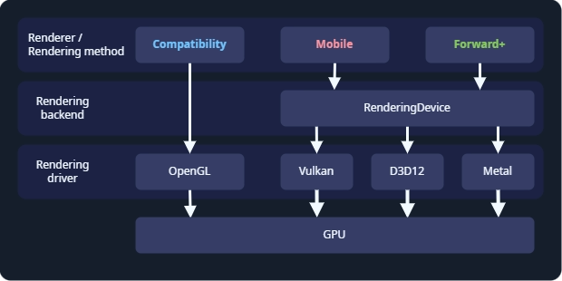

.. _doc_renderers:

Overview of renderers
=====================

.. seealso::

    This page gives an overview of Godot's renderers, focusing on the differences
    between their rendering features. For more technical details on the renderers,
    see :ref:`doc_internal_rendering_architecture`.

Introduction
------------

Godot 4 includes three renderers:

- **Forward+**. The most advanced renderer, suited for desktop platforms only.
  Used by default on desktop platforms. This renderer uses **Vulkan**, **Direct3D 12**,
  or **Metal** as the rendering driver, and it uses the **RenderingDevice** backend.
- **Mobile**. Fewer features, but renders simple scenes faster. Suited for mobile
  and desktop platforms. Used by default on mobile platforms. This renderer uses
  **Vulkan**, **Direct3D 12**, or **Metal** as the rendering driver, and it uses
  the **RenderingDevice** backend.
- **Compatibility**, sometimes called **GL Compatibility**. The least advanced
  renderer, suited for low-end desktop and mobile platforms. Used by default on
  the web platform. This renderer uses **OpenGL** as the rendering driver.

Renderers, rendering drivers, and RenderingDevice
~~~~~~~~~~~~~~~~~~~~~~~~~~~~~~~~~~~~~~~~~~~~~~~~~

    driver. The Forward+ and Mobile renderers run on RenderingDevice, which can use
    Vulkan, Direct3D 12, or Metal as a rendering driver.
  :align: center

  Godot's rendering abstraction layers.

The *renderer*, or *rendering method*, determines which features are available.
Most of the time, this is the only thing you need to think about. Godot's renderers
are **Forward+**, **Mobile**, and **Compatibility**.

The *rendering driver* tells the GPU what to do, using a graphics API. Godot can
use the **OpenGL**, **Vulkan**, **Direct3D 12**, and **Metal** rendering drivers.
Not every GPU supports every rendering driver, and therefore not every GPU supports
all renderers. Vulkan, Direct3D 12, and Metal are modern, low-level graphics APIs,
and requires newer hardware. OpenGL is an older graphics API that runs on most hardware.

RenderingDevice is a *rendering backend*, an abstraction layer between the renderer
and the rendering driver. It is used by the Forward+ and Mobile renderers, and
these renderers are sometimes called "RenderingDevice-based renderers".

Choosing a renderer
-------------------

Choosing a renderer is a complex question, and depends on your hardware and the
which platforms you are developing for. As a starting point:

Choose **Forward+** if:

    - You are developing for desktop.
    - You have relatively new hardware which supports Vulkan, Direct3D 12, or Metal.
    - You are developing a 3D game.
    - You want to use the most advanced rendering features.

Choose **Mobile** if:

    - You are developing for newer mobile devices, desktop XR, or desktop.
    - You have relatively new hardware which supports Vulkan, Direct3D 12, or Metal.
    - You are developing a 3D game.
    - You want to use advanced rendering features, subject to the limitations
      of mobile hardware.

Choose **Compatibility** if:

    - You are developing for older mobile devices, older desktop devices, or
      standalone XR. The Compatibility renderer supports the widest range of hardware.
    - You are developing for web. In this case, Compatibility is the only choice.
    - You have older hardware which does not support Vulkan. In this case,
      Compatibility is the only choice.
    - You are developing a 2D game, or a 3D game which does not need advanced
      rendering features.
    - You want the best performance possible on all devices and don't need advanced
      rendering features.

Keep in mind every game is unique, and this is only a starting point. For example,
you might choose to use the Compatibility renderer even though you have the latest
GPU, so you can support the widest range of hardware. Or you might want to use the
Forward+ renderer for a 2D game, so you can advanced features like compute shaders.

Switching between renderers
~~~~~~~~~~~~~~~~~~~~~~~~~~~

In the editor, you can always switch between renderers by clicking on the renderer
name in the upper-right corner of the editor.

Switching between renderers may require some manual tweaks to your scene, lighting,
and environment, since each renderer is different. In general, switching between
the Mobile and Forward+ renderers will require fewer adjustments than switching
between the Compatibility renderer and the Forward+ or Mobile renderers.

Since Godot 4.4, when using Forward+ or Mobile, if Vulkan is not supported, the
engine will fall back to Direct3D 12 and vice versa. If the attempted fallback
driver is not supported either, the engine will then fall back to Compatibility
when the RenderingDevice backend is not supported. This allows the project to run
anyway, but it may look different than the intended appearance due to the more
limited renderer. This behavior can be disabled in the project settings by unchecking
:ref:`Rendering > Rendering Device > Fallback to OpenGL 3<class_ProjectSettings_property_rendering/rendering_device/fallback_to_opengl3>`.

Feature comparison
------------------

This is not a complete list of the features of each renderer. If a feature is
not listed here, it is available in all renderers, though it may be much faster
on some renderers. For a list of *all* features in Godot, see :ref:`doc_list_of_features`.

Hardware with RenderingDevice support is hardware which can run Vulkan, Direct3D
12, or Metal.

Overall comparison
~~~~~~~~~~~~~~~~~~

.. Note that these tables use emojis, which are not monospaced in most editors.
.. The tables look malformed but are not. When making changes, check the nearby
.. lines for guidance.

+---------------------+--------------------------+--------------------------+--------------------------+
| Feature             | Compatibility            | Mobile                   | Forward+                 |
+=====================+==========================+==========================+==========================+
| **Required**        | Older or low-end.        | Newer or high-end.       | Newer or high-end.       |
| **hardware**        |                          | Requires Vulkan, Direct3D| Requires Vulkan, Direct3D|
|                     |                          | 12, or Metal support.    | 12, or Metal support.    |
+---------------------+--------------------------+--------------------------+--------------------------+
| Runs on new hardware| ✔️ Yes.                  | ✔️ Yes.                  | ✔️ Yes.                  |
+---------------------+--------------------------+--------------------------+--------------------------+
| Runs on old and     | ✔️ Yes.                  | ✔️ Yes, but slower than  | ✔️ Yes, but slowest of   |
| low-end hardware    |                          | Compatibility.           | all renderers.           |
+---------------------+--------------------------+--------------------------+--------------------------+
| Runs on hardware    | ✔️ Yes.                  | ❌ No.                   | ❌ No.                   |
| without             |                          |                          |                          |
| RenderingDevice     |                          |                          |                          |
| support             |                          |                          |                          |
+---------------------+--------------------------+--------------------------+--------------------------+
| **Target platforms**| Mobile, low-end desktop, | Mobile, desktop.         | Desktop.                 |
|                     | web.                     |                          |                          |
|                     |                          |                          |                          |
+---------------------+--------------------------+--------------------------+--------------------------+
| Desktop             | ✔️ Yes.                  | ✔️ Yes.                  | ✔️ Yes.                  |
+---------------------+--------------------------+--------------------------+--------------------------+
| Mobile              | ✔️ Yes (low-end).        | ✔️ Yes (high-end).       | ⚠️ Supported, but poorly |
|                     |                          |                          | optimized. Use Mobile or |
|                     |                          |                          | Compatibility instead.   |
+---------------------+--------------------------+--------------------------+--------------------------+
| XR                  | ✔️ Yes. Recommended for  | ✔️ Yes. Recommended for  | ⚠️ Supported, but poorly |
|                     | standalone headsets.     | desktop headsets.        | optimized. Use Mobile or |
|                     |                          |                          | Compatibility instead.   |
+---------------------+--------------------------+--------------------------+--------------------------+
| Web                 | ✔️ Yes.                  | ❌ No.                   | ❌ No.                   |
+---------------------+--------------------------+--------------------------+--------------------------+
| 2D Games            | ✔️ Yes.                  | ✔️ Yes, but              | ✔️ Yes, but              |
|                     |                          | Compatibility is usually | Compatibility is usually |
|                     |                          | good enough for 2D.      | good enough for 2D.      |
+---------------------+--------------------------+--------------------------+--------------------------+
| 3D Games            | ✔️ Yes.                  | ✔️ Yes.                  | ✔️ Yes.                  |
+---------------------+--------------------------+--------------------------+--------------------------+
| **Feature set**     | 2D and core 3D features. | Most rendering features. | All rendering features.  |
+---------------------+--------------------------+--------------------------+--------------------------+
| 2D rendering        | ✔️ Yes.                  | ✔️ Yes.                  | ✔️ Yes.                  |
| features            |                          |                          |                          |
+---------------------+--------------------------+--------------------------+--------------------------+
| Core 3D rendering   | ✔️ Yes.                  | ✔️ Yes.                  | ✔️ Yes.                  |
| features            |                          |                          |                          |
+---------------------+--------------------------+--------------------------+--------------------------+
| Advanced            | ❌ No.                   | ⚠️ Yes, limited by       | ✔️ Yes. All rendering    |
| rendering features  |                          | mobile hardware.         | features are supported.  |
+---------------------+--------------------------+--------------------------+--------------------------+
| New features        | ⚠️ Some new rendering    | ✔️ Most new rendering    | ✔️ All new features are  |
|                     | features are added to    | features are added to    | added to Forward+. As the|
|                     | Compatibility. Features  | Mobile. Mobile usually   | focus of new development,|
|                     | are added after Mobile   | gets new features as     | Forward+ gets features   |
|                     | and Forward+.            | Forward+ does.           | first.                   |
+---------------------+--------------------------+--------------------------+--------------------------+
| Rendering cost      | Low base cost, but       | Medium base cost, and    | Highest base cost, and   |
|                     | high scaling cost.       | medium scaling cost.     | low scaling cost.        |
+---------------------+--------------------------+--------------------------+--------------------------+
| Rendering driver    | OpenGL.                  | Vulkan, Direct3D 12, or  | Vulkan, Direct3D 12, or  |
|                     |                          | Metal.                   | Metal.                   |
+---------------------+--------------------------+--------------------------+--------------------------+

Lights and shadows
~~~~~~~~~~~~~~~~~~

See :ref:`doc_lights_and_shadows` for more information.

+-------------------------+--------------------------+--------------------------+--------------------------+
| Feature                 | Compatibility            | Mobile                   | Forward+                 |
+=========================+==========================+==========================+==========================+
| Lighting approach       | Forward                  | Forward                  | Clustered Forward        |
|                         |                          |                          |                          |
+-------------------------+--------------------------+--------------------------+--------------------------+
| Maximum                 | 8 per mesh. Can be       | 8 per mesh, 256 per view.| 512 per cluster. Can be  |
| OmniLights              | increased.               |                          | increased.               |
+-------------------------+--------------------------+--------------------------+--------------------------+
| Maximum                 | 8 per mesh. Can be       | 8 per mesh, 256 per view.| 512 per cluster. Can be  |
| SpotLights              | increased.               |                          | increased.               |
+-------------------------+--------------------------+--------------------------+--------------------------+
| Maximum                 | 8                        | 8                        | 8                        |
| DirectionalLights       |                          |                          |                          |
+-------------------------+--------------------------+--------------------------+--------------------------+
| PCSS for                | ❌ Not supported.        | ✔️ Supported.            | ✔️ Supported.            |
| OmniLight and SpotLight |                          |                          |                          |
+-------------------------+--------------------------+--------------------------+--------------------------+
| PCSS for                | ❌ Not supported.        | ❌ Not supported.        | ✔️ Supported.            |
| DirectionalLight        |                          |                          |                          |
+-------------------------+--------------------------+--------------------------+--------------------------+
| Light projector         | ❌ Not supported.        | ✔️ Supported.            | ✔️ Supported.            |
| textures                |                          |                          |                          |
+-------------------------+--------------------------+--------------------------+--------------------------+

Global Illumination
~~~~~~~~~~~~~~~~~~~

See :ref:`doc_introduction_to_global_illumination` for more information.

+-------------------------+--------------------------+--------------------------+--------------------------+
| Feature                 | Compatibility            | Mobile                   | Forward+                 |
+=========================+==========================+==========================+==========================+
| ReflectionProbe         | ✔️ Supported, 2 per      | ✔️ Supported, 8 per      | ✔️ Supported, unlimited. |
|                         | mesh.                    | mesh.                    |                          |
+-------------------------+--------------------------+--------------------------+--------------------------+
| LightmapGI              | ⚠️ Rendering of baked    | ✔️ Supported.            | ✔️ Supported.            |
|                         | lightmaps is supported.  |                          |                          |
|                         | Baking requires hardware |                          |                          |
|                         | with RenderingDevice     |                          |                          |
|                         | support.                 |                          |                          |
+-------------------------+--------------------------+--------------------------+--------------------------+
| VoxelGI                 | ❌ Not supported.        | ❌ Not supported.        | ✔️ Supported.            |
|                         |                          |                          |                          |
+-------------------------+--------------------------+--------------------------+--------------------------+
| Screen-Space            | ❌ Not supported.        | ❌ Not supported.        | ✔️ Supported.            |
| Indirect Lighting (SSIL)|                          |                          |                          |
+-------------------------+--------------------------+--------------------------+--------------------------+
| Signed Distance Field   | ❌ Not supported.        | ❌ Not supported.        | ✔️ Supported.            |
| Global Illumination     |                          |                          |                          |
| (SDFGI)                 |                          |                          |                          |
+-------------------------+--------------------------+--------------------------+--------------------------+

Environment and post-processing
~~~~~~~~~~~~~~~~~~~~~~~~~~~~~~~

See :ref:`doc_environment_and_post_processing` for more information.

+-------------------------+--------------------------+--------------------------+--------------------------+
| Feature                 | Compatibility            | Mobile                   | Forward+                 |
+=========================+==========================+==========================+==========================+
| Fog (Depth and Height)  | ✔️ Supported.            | ✔️ Supported.            | ✔️ Supported.            |
+-------------------------+--------------------------+--------------------------+--------------------------+
| Volumetric Fog          | ❌ Not supported.        | ❌ Not supported.        | ✔️ Supported.            |
+-------------------------+--------------------------+--------------------------+--------------------------+
| Tonemapping             | ✔️ Supported.            | ✔️ Supported.            | ✔️ Supported.            |
+-------------------------+--------------------------+--------------------------+--------------------------+
| Screen-Space Reflections| ❌ Not supported.        | ❌ Not supported.        | ✔️ Supported.            |
+-------------------------+--------------------------+--------------------------+--------------------------+
| Screen-Space Ambient    | ❌ Not supported.        | ❌ Not supported.        | ✔️ Supported.            |
| Occlusion (SSAO)        |                          |                          |                          |
+-------------------------+--------------------------+--------------------------+--------------------------+
| Screen-Space            | ❌ Not supported.        | ❌ Not supported.        | ✔️ Supported.            |
| Indirect Lighting (SSIL)|                          |                          |                          |
+-------------------------+--------------------------+--------------------------+--------------------------+
| Signed Distance Field   | ❌ Not supported.        | ❌ Not supported.        | ✔️ Supported.            |
| Global Illumination     |                          |                          |                          |
| (SDFGI)                 |                          |                          |                          |
+-------------------------+--------------------------+--------------------------+--------------------------+
| Glow                    | ✔️ Supported.            | ✔️ Supported.            | ✔️ Supported.            |
+-------------------------+--------------------------+--------------------------+--------------------------+
| Adjustments             | ✔️ Supported.            | ✔️ Supported.            | ✔️ Supported.            |
+-------------------------+--------------------------+--------------------------+--------------------------+
| Custom post-processing  | ✔️ Supported.            | ✔️ Supported.            | ✔️ Supported.            |
| with fullscreen quad    |                          |                          |                          |
+-------------------------+--------------------------+--------------------------+--------------------------+
| Custom post-processing  | ❌ Not supported.        | ✔️ Supported.            | ✔️ Supported.            |
| with CompositorEffects  |                          |                          |                          |
+-------------------------+--------------------------+--------------------------+--------------------------+

Antialiasing
~~~~~~~~~~~~

See :ref:`doc_3d_antialiasing` for more information.

+-------------------+--------------------------+--------------------------+--------------------------+
| Feature           | Compatibility            | Mobile                   | Forward+                 |
+===================+==========================+==========================+==========================+
| MSAA 3D           | ✔️ Supported.            | ✔️ Supported.            | ✔️ Supported.            |
+-------------------+--------------------------+--------------------------+--------------------------+
| MSAA 2D           | ❌ Not supported.        | ✔️ Supported.            | ✔️ Supported.            |
+-------------------+--------------------------+--------------------------+--------------------------+
| TAA               | ❌ Not supported.        | ❌ Not supported.        | ✔️ Supported.            |
+-------------------+--------------------------+--------------------------+--------------------------+
| FSR2              | ❌ Not supported.        | ❌ Not supported.        | ✔️ Supported.            |
+-------------------+--------------------------+--------------------------+--------------------------+
| FXAA              | ❌ Not supported.        | ✔️ Supported.            | ✔️ Supported.            |
+-------------------+--------------------------+--------------------------+--------------------------+
| SSAA              | ✔️ Supported.            | ✔️ Supported.            | ✔️ Supported.            |
+-------------------+--------------------------+--------------------------+--------------------------+
| Screen-space      | ❌ Not supported.        | ✔️ Supported.            | ✔️ Supported.            |
| roughness limiter |                          |                          |                          |
+-------------------+--------------------------+--------------------------+--------------------------+

StandardMaterial features
~~~~~~~~~~~~~~~~~~~~~~~~~

See :ref:`doc_standard_material_3d` for more information.

+-------------------------+--------------------------+--------------------------+--------------------------+
| Feature                 | Compatibility            | Mobile                   | Forward+                 |
+=========================+==========================+==========================+==========================+
| Sub-surface scattering  | ❌ Not supported.        | ❌ Not supported.        | ✔️ Supported.            |
|                         |                          |                          |                          |
+-------------------------+--------------------------+--------------------------+--------------------------+

Shader features
~~~~~~~~~~~~~~~

See :ref:`doc_shading_reference` for more information.

+-------------------------+--------------------------+--------------------------+--------------------------+
| Feature                 | Compatibility            | Mobile                   | Forward+                 |
+=========================+==========================+==========================+==========================+
| Screen texture          | ✔️ Supported.            | ✔️ Supported.            | ✔️ Supported.            |
+-------------------------+--------------------------+--------------------------+--------------------------+
| Depth texture           | ✔️ Supported.            | ✔️ Supported.            | ✔️ Supported.            |
|                         |                          |                          |                          |
+-------------------------+--------------------------+--------------------------+--------------------------+
| Normal/Roughness texture| ❌ Not supported.        | ❌ Not supported.        | ✔️ Supported.            |
+-------------------------+--------------------------+--------------------------+--------------------------+
| Compute shaders         | ❌ Not supported.        | ⚠️ Supported, but comes  | ✔️ Supported.            |
|                         |                          | with a performance       |                          |
|                         |                          | penalty on older devices.|                          |
+-------------------------+--------------------------+--------------------------+--------------------------+

Other features
~~~~~~~~~~~~~~

+-------------------------+--------------------------+--------------------------+--------------------------+
| Feature                 | Compatibility            | Mobile                   | Forward+                 |
+=========================+==========================+==========================+==========================+
| Variable rate           | ❌ Not supported.        | ✔️ Supported.            | ✔️ Supported.            |
| shading                 |                          |                          |                          |
+-------------------------+--------------------------+--------------------------+--------------------------+
| Decals                  | ❌ Not supported.        | ✔️ Supported.            | ✔️ Supported.            |
+-------------------------+--------------------------+--------------------------+--------------------------+
| Depth of field blur     | ❌ Not supported.        | ✔️ Supported.            | ✔️ Supported.            |
+-------------------------+--------------------------+--------------------------+--------------------------+
| Adaptive and Mailbox    | ❌ Not supported.        | ✔️ Supported.            | ✔️ Supported.            |
| VSync modes             |                          |                          |                          |
+-------------------------+--------------------------+--------------------------+--------------------------+
| 2D HDR Viewport         | ❌ Not supported.        | ✔️ Supported.            | ✔️ Supported.            |
+-------------------------+--------------------------+--------------------------+--------------------------+
| RenderingDevice         | ❌ Not supported.        | ✔️ Supported.            | ✔️ Supported.            |
| access                  |                          |                          |                          |
+-------------------------+--------------------------+--------------------------+--------------------------+
