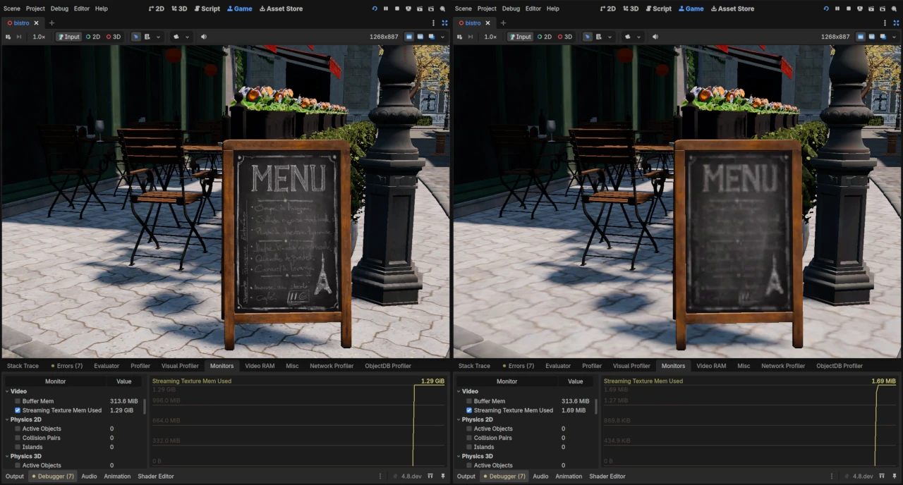
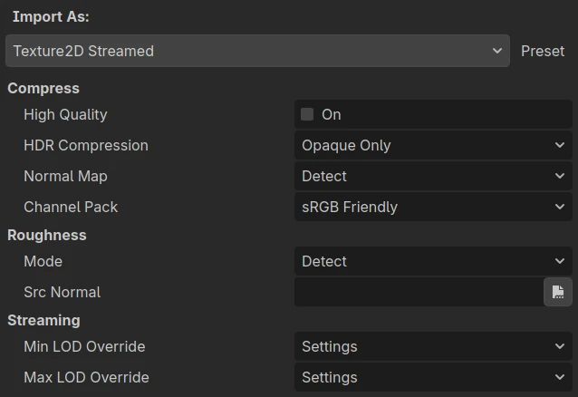
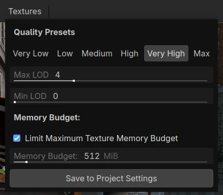

.. _doc_texture_streaming:

Texture streaming
=================

.. warning::

    Texture streaming is **experimental**. Its project settings, import options
    and API may change in future Godot releases.

Texture streaming lets Godot keep only the mipmap levels a texture actually
needs in VRAM, and load or unload the remaining ones while the game runs.
A 4096×4096 albedo texture that only ever covers a few dozen pixels on screen
does not need its full-resolution mipmap resident, and a texture that is not
visible at all does not need much of anything.

This makes it possible to use high-resolution textures without the VRAM cost of
having them all loaded.

Streaming is most useful for projects that are VRAM-bound: large 3D scenes with
many unique high-resolution materials. Projects that already fit in VRAM will
not gain anything from it and should leave it disabled.

   aggressive Min LOD

   The same scene with texture streaming forced to max quality (left) and
   an aggressive Min LOD (right), with the ``video/streaming_texture_mem_used``
   monitor showing the difference in VRAM usage.

.. note::

    Texture streaming only works for textures used in **3D rendering**, and
    requires the **Forward+** or **Mobile** renderer. It has no effect with the
    **Compatibility** renderer, which prints a warning at startup when streaming
    is enabled.

    Textures used only in 2D or in the UI produce no streaming feedback and
    would remain at their lowest allowed quality — keep using the regular
    Texture2D importer for those.

How it works
------------

Streaming is driven by *feedback from the rendering itself*, rather than by
distance heuristics or manually authored LOD levels:

1. While rendering, the fragment shader computes the mipmap level that the
   material's textures would need. Each material using streamed textures
   writes the highest quality level it needs into a feedback buffer.
2. The feedback buffer is read back periodically and processed. The requested
   level is clamped to the allowed LOD range, and — if a memory budget is set
   — adjusted so all streamed textures fit inside that budget.
3. Textures that were not requested for a while slowly decay towards lower
   quality, so memory is reclaimed from things that went off-screen.
4. Whenever a texture's target level differs from the level currently in VRAM,
   a reload is queued on an I/O thread, which reads the required mipmaps from
   the imported ``.stex`` file and replaces the texture. The number of these
   operations per second can be throttled via settings.

Because feedback is gathered per material, all streamed textures used by one
material share the same decision. This works well for the usual case where a
material's albedo, normal and roughness maps have the same UV scale.

LOD levels
----------

Everything in the streaming system is expressed in mipmap levels, where **0 is
the full-resolution image** and each level above that halves the resolution:

+-----------+---------------------------+
| LOD level | Size of a 4096² texture   |
+===========+===========================+
| 0         | 4096×4096                 |
+-----------+---------------------------+
| 1         | 2048×2048                 |
+-----------+---------------------------+
| 2         | 1024×1024                 |
+-----------+---------------------------+
| 3         | 512×512                   |
+-----------+---------------------------+
| 4         | 256×256                   |
+-----------+---------------------------+
| …         | …                         |
+-----------+---------------------------+
| 13        | 1×1 (lowest supported)    |
+-----------+---------------------------+

Two limits control the range a texture may use:

- **Min LOD** is the *best* quality a texture is allowed to reach. ``0`` allows
  full resolution. Raising it caps the resolution of every streamed texture,
  which is a cheap way to offer a "texture quality" option on lower-end
  hardware.
- **Max LOD** is the *worst* quality a texture may fall back to, and also the
  level a texture is first loaded at. For example, with a max lod of ``3``, a
  4096x4096 texture never drops below 512×512.

The values are always clamped so that ``Min LOD <= Max LOD``.

The gap between **Min LOD** and **Max LOD** should be kept as small as memory
allows: textures start at **Max LOD** and decay back towards it, so the wider
the gap, the more levels a texture climbs through and the more noticeable the
sharpening becomes. A gap just big enough for your textures to fit keeps
transitions short and subtle.

Setting **Min LOD** equal to **Max LOD** pins every streamed texture to that
level: quality stays constant and no streaming transitions occur, while the
sharper mipmap levels are still never loaded. This can be used to implement
a "texture quality" setting.

Some textures may require a **Max LOD** setting that prevents it from losing
important detail like alpha channels used for alpha scissors or other fine
details like an atlas.

Enabling streaming
------------------

Streaming has two requirements that are needed: streaming has to be enabled
in the project, and textures have to be imported into a streamable format.

1. Enable
   :ref:`Rendering > Textures > Streaming > Enabled<class_ProjectSettings_property_rendering/textures/streaming/enabled>`
   in the Project Settings (advanced settings must be turned on to see it).
   This setting requires a restart to take effect.
2. Import the textures you want to stream with the **Texture2D Streamed**
   importer, as described below.

Textures that are not imported as streamed textures behave as before: they
stay present in VRAM. Streaming can be adopted gradually, starting with the
largest textures in the project.

Importing streamed textures
---------------------------

Select one or more images in the FileSystem dock, open the **Import** dock,
and set **Importer** to **Texture2D Streamed**, then click **Reimport**. The
images are imported to Godot's ``.stex`` format, which stores each mipmap
level so that individual levels can be read on demand, and loading them
produces a
:ref:`StreamedTexture2D<class_StreamedTexture2D>` instead of a
:ref:`CompressedTexture2D<class_CompressedTexture2D>`.

   Import options shown after setting the importer to Texture2D Streamed.

The compression options (**High Quality**, **HDR Compression**, **Normal Map**,
**Channel Pack**) and the roughness options behave the same as in the regular
:ref:`Texture2D importer<class_ResourceImporterTexture>`. One of the
:ref:`Import S3TC BPTC<class_ProjectSettings_property_rendering/textures/vram_compression/import_s3tc_bptc>`
or
:ref:`Import ETC2 ASTC<class_ProjectSettings_property_rendering/textures/vram_compression/import_etc2_astc>`
project settings should be enabled.

Two options are specific to streaming: **Streaming > Min Lod Override** and
**Streaming > Max Lod Override** replace the project-wide LOD limits for this
texture only. **Settings** (the default) keeps using the project settings;
otherwise, pick an explicit LOD level. Use this for textures that need to be
sharper than the project default (a hero asset seen up close) or that never need
to be sharp (a large ground texture only seen from far away).

The same two limits are also exposed on the loaded resource as
:ref:`StreamedTexture2D.min_lod_override<class_StreamedTexture2D_property_min_lod_override>`
and
:ref:`StreamedTexture2D.max_lod_override<class_StreamedTexture2D_property_max_lod_override>`,
which can be changed from a script.

``.dds`` files cannot currently be imported as streamed textures.

.. note::

    Only 2D textures are streamable. Texture arrays, cubemaps and 3D textures
    (:ref:`ResourceImporterLayeredTexture<class_ResourceImporterLayeredTexture>`)
    are not part of the streaming system.

Project settings
----------------

All settings live under **Rendering > Textures > Streaming** and are visible
with advanced settings enabled:

- :ref:`Enabled<class_ProjectSettings_property_rendering/textures/streaming/enabled>`
  (default ``false``) — feature enable setting. Requires a restart.
- :ref:`Min Lod<class_ProjectSettings_property_rendering/textures/streaming/min_lod>`
  (default ``0``) — best quality any streamed texture may reach.
- :ref:`Max Lod<class_ProjectSettings_property_rendering/textures/streaming/max_lod>`
  (default ``3``) — worst quality a streamed texture may fall back to, and the
  level textures are first loaded at.
- :ref:`Memory Budget Enabled<class_ProjectSettings_property_rendering/textures/streaming/memory_budget_enabled>`
  (default ``false``) — enables the VRAM budget below.
- :ref:`Memory Budget Mb<class_ProjectSettings_property_rendering/textures/streaming/memory_budget_mb>`
  (default ``512``) — VRAM budget for all streamed textures together, in MB.
- :ref:`Max Ops Per Second<class_ProjectSettings_property_rendering/textures/streaming/max_ops_per_second>`
  (default ``200``) — throttle on mipmap operations. Higher values adapt faster
  but do more I/O and texture work per frame.
- :ref:`Inactivity Decay Rate Ms<class_ProjectSettings_property_rendering/textures/streaming/inactivity_decay_rate_ms>`
  (default ``5000``) — time per LOD level of quality decay for textures that
  stop being requested.

The memory budget
~~~~~~~~~~~~~~~~~

When a memory budget is set and enabled, the streaming system will not simply
give every texture the resolution it asked for.  If the total exceeds the
budget, it starts reducing textures until the total fits, preferring, in order,
textures that currently have *more* resolution than they asked for, textures that
have not been requested for the longest, and textures that would free the most
memory.

The budget only covers streamed textures. Render targets, meshes, shadow atlases
and non-streamed textures are not counted, so the budget must be set well below
the total VRAM you expect to have available.

A budget is not required. Without a budget, each texture simply gets what the
feedback asks for within its LOD range, which already avoids keeping
full-resolution mipmaps around for distant or off-screen surfaces.

Tuning streaming in the editor
------------------------------

When streaming is enabled, the 3D viewport toolbar enables a **Textures** button.
It opens a panel with quality presets (**Very Low** to **Max**), sliders for
**Min LOD** and **Max LOD**, and a **Limit Maximum Texture Memory Budget**
checkbox with a budget slider.

   The Textures panel in the 3D viewport toolbar.

Changes are applied immediately as runtime overrides so you can see their
effect in the viewport. This provides a good way to find the LOD range
and budget your project can live with. Press **Save to Project Settings**
to save the current values to project settings.

Controlling streaming at runtime
--------------------------------

The :ref:`TextureStreaming<class_TextureStreaming>` singleton exposes the same
options to scripts, which can be used to implement a graphics quality option in
your game:

.. tabs::
 .. code-tab:: gdscript

    # Cap texture quality: no texture is loaded above 1/4 of its resolution.
    TextureStreaming.min_lod_override = 2
    # Never let textures drop below 1/32 resolution.
    TextureStreaming.max_lod_override = 5
    # Limit streamed textures to 256 MB of VRAM.
    TextureStreaming.memory_budget_mb_override = 256

These overrides take precedence over the project settings. Setting an LOD
override above ``13``, or the budget override to ``4294967295``, clears the
override and returns to the project setting.

Hiding streaming during loading screens
~~~~~~~~~~~~~~~~~~~~~~~~~~~~~~~~~~~~~~~

Streaming reacts to what has already been rendered, so right after a scene load
or a teleport within a scene, textures are still at low resolution and increase
in quality over the next frames. To minimize visual disruptions you can call
:ref:`flush_texture_streaming()<class_TextureStreaming_method_flush_texture_streaming>`
to complete all pending streaming work immediately, ignoring any throttling. It then
emits :ref:`flush_completed<class_TextureStreaming_signal_flush_completed>` when
every texture has reached its target resolution.

.. tabs::
 .. code-tab:: gdscript

    func _ready() -> void:
        TextureStreaming.flush_completed.connect(_on_streaming_flushed)

    func finish_level_load() -> void:
        # Keep the loading screen visible until textures are resident.
        TextureStreaming.flush_texture_streaming()

    func _on_streaming_flushed() -> void:
        loading_screen.hide()

Monitoring VRAM usage
~~~~~~~~~~~~~~~~~~~~~

:ref:`TextureStreaming.get_memory_budget_bytes_used()<class_TextureStreaming_method_get_memory_budget_bytes_used>`
returns how much VRAM the streamed textures currently take. The same value is available as the
``video/streaming_texture_mem_used`` monitor in the editor's **Debugger >
Monitors** tab, and through
:ref:`Performance.get_monitor()<class_Performance_method_get_monitor>` with
:ref:`Performance.RENDER_STREAMING_TEXTURE_MEM_USED<class_Performance_constant_RENDER_STREAMING_TEXTURE_MEM_USED>`.

Custom shaders
--------------

Feedback is generated automatically for spatial shaders that use ``UV``, which
covers :ref:`BaseMaterial3D<class_BaseMaterial3D>` and most custom shaders. If a
shader samples its streamed textures with coordinates that are not ``UV`` — for
instance a triplanar or world-space projection — write the coordinates the
textures are actually sampled with to the ``STREAMING_UV`` built-in in
``fragment()``, and the streaming system will use those instead:

.. code-block:: glsl

    shader_type spatial;

    uniform sampler2D albedo_texture;
    uniform float scale = 0.25;

    void fragment() {
        vec2 world_uv = (MODEL_MATRIX * vec4(VERTEX, 1.0)).xz * scale;
        ALBEDO = texture(albedo_texture, world_uv).rgb;
        // Tell the streaming system which coordinates were sampled.
        STREAMING_UV = world_uv;
    }

Without this, a shader that only uses non-``UV`` coordinates produces no
feedback, and its textures decay to **Max LOD**. Shaders that write no UVs at
all and do not use streamed textures are unaffected.

Limitations
-----------

- Streaming requires the Forward+ or Mobile renderer; the Compatibility renderer
  ignores it.
- Feedback comes from 3D (spatial) rendering only. A streamed texture used
  exclusively in 2D, in the UI, or in a shader that produces no feedback gets no
  requests, and therefore settles at **Max LOD**. Use the regular Texture2D
  importer for those textures.
- Depth-only passes (shadow maps, depth prepass) do not contribute feedback.
- Feedback is per material, not per texture, so textures used by the same
  material with very different UV scales all follow the same decision.
- A texture always reports its full dimensions
  (:ref:`Texture2D.get_width()<class_Texture2D_method_get_width>` and
  friends) even while a lower mipmap is resident, and
  :ref:`Texture2D.get_image()<class_Texture2D_method_get_image>` always reads
  the full-resolution image from disk.
- Streaming reads from the imported ``.stex`` files during gameplay, so it trades
  VRAM for disk I/O. On storage with high latency, expect textures to take
  longer to sharpen.

.. seealso::

    :ref:`doc_importing_images` covers the regular, non-streamed texture import
    workflow and the compression options in more detail.
