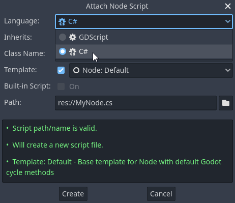

.. _doc_c_sharp:

C# basics
=========

Introduction
------------

This page provides a brief introduction to C#, both what it is and
how to use it in Godot. Afterwards, you may want to look at
:ref:`how to use specific features <doc_c_sharp_features>`, read about the
:ref:`differences between the C# and the GDScript API <doc_c_sharp_differences>`,
and (re)visit the :ref:`Scripting section <doc_scripting>` of the
step-by-step tutorial.

C# is a high-level programming language developed by Microsoft. In Godot,
it is implemented with .NET 6.0.

.. attention::

    Projects written in C# using Godot 4 currently cannot be exported to the web
    platform. To use C# on that platforms, consider Godot 3 instead.
    Android and iOS platform support is available as of Godot 4.2, but is
    experimental and :ref:`some limitations apply <doc_c_sharp_platforms>`.

.. note::

    This is **not** a full-scale tutorial on the C# language as a whole.
    If you aren't already familiar with its syntax or features, see the
    `Microsoft C# guide <https://docs.microsoft.com/en-us/dotnet/csharp/index>`_
    or look for a suitable introduction elsewhere.

.. _doc_c_sharp_setup:

Prerequisites
-------------

Godot bundles the parts of .NET needed to run already compiled games.
However, Godot does not bundle the tools required to build and compile
games, such as MSBuild and the C# compiler. These are
included in the .NET SDK, and need to be installed separately.

In summary, you must have installed the .NET SDK **and** the .NET-enabled
version of Godot.

Download and install the latest stable version of the SDK from the
`.NET download page <https://dotnet.microsoft.com/download>`__.

.. important::

    Be sure to install the 64-bit version of the SDK(s)
    if you are using the 64-bit version of Godot.

If you are building Godot from source, make sure to follow the steps to enable
.NET support in your build as outlined in the :ref:`doc_compiling_with_dotnet`
page.

Configuring an external editor
------------------------------

C# support in Godot's built-in script editor is minimal. Consider using an
external IDE or editor, such as  `Visual Studio Code <https://code.visualstudio.com/>`__
or MonoDevelop. These provide autocompletion, debugging, and other
useful features for C#. To select an external editor in Godot,
click on **Editor → Editor Settings** and scroll down to
**Dotnet**. Under **Dotnet**, click on **Editor**, and select your
external editor of choice. Godot currently supports the following
external editors:

- Visual Studio 2022
- Visual Studio Code
- MonoDevelop
- Visual Studio for Mac
- JetBrains Rider

See the following sections for how to configure an external editor:

JetBrains Rider
~~~~~~~~~~~~~~~

After reading the "Prerequisites" section, you can download and install
`JetBrains Rider <https://www.jetbrains.com/rider/download>`__.

In Godot's **Editor → Editor Settings** menu:

- Set **Dotnet** -> **Editor** -> **External Editor** to **JetBrains Rider**.

In Rider:

- Set **MSBuild version** to **.NET Core**.
- Install the **Godot support** plugin.

Visual Studio Code
~~~~~~~~~~~~~~~~~~

After reading the "Prerequisites" section, you can download and install
`Visual Studio Code <https://code.visualstudio.com/download>`__ (aka VS Code).

In Godot's **Editor → Editor Settings** menu:

- Set **Dotnet** -> **Editor** -> **External Editor** to **Visual Studio Code**.

In Visual Studio Code:

- Install the `C# <https://marketplace.visualstudio.com/items?itemName=ms-dotnettools.csharp>`__ extension.

.. note::

    If you are using Linux you need to install the `Mono SDK <https://www.mono-project.com/download/stable/#download-lin>`__
    for the C# tools plugin to work.

To configure a project for debugging, you need a ``tasks.json`` and ``launch.json`` file in
the ``.vscode`` folder with the necessary configuration. An example configuration can be
found `here <https://github.com/godotengine/godot-csharp-vscode/issues/43#issuecomment-1258321229>`__ .
In the ``launch.json`` file, make sure the ``program`` parameter in the relevant configuration points to your Godot executable, either by
changing it to the path of the executable or by defining a ``GODOT4`` environment variable that points to the
executable. Now, when you start the debugger in Visual Studio Code, your Godot project will run.

.. note::

    There is also a `C# Tools for Godot <https://marketplace.visualstudio.com/items?itemName=neikeq.godot-csharp-vscode>`__
    Visual Studio Code extension, that is meant to make this setup easier and to provide further useful tools.
    But it is not yet updated to work with Godot 4.

Visual Studio (Windows only)
~~~~~~~~~~~~~~~~~~~~~~~~~~~~

Download and install the latest version of
`Visual Studio <https://visualstudio.microsoft.com/downloads/>`__.
Visual Studio will include the required SDKs if you have the correct
workloads selected, so you don't need to manually install the things
listed in the "Prerequisites" section.

While installing Visual Studio, select this workload:

- .NET desktop development

In Godot's **Editor → Editor Settings** menu:

- Set **Dotnet** -> **Editor** -> **External Editor** to **Visual Studio**.

.. note:: If you see an error like "Unable to find package Godot.NET.Sdk",
          your NuGet configuration may be incorrect and need to be fixed.

          A simple way to fix the NuGet configuration file is to regenerate it.
          In a file explorer window, go to ``%AppData%\NuGet``. Rename or delete
          the ``NuGet.Config`` file. When you build your Godot project again,
          the file will be automatically created with default values.

Creating a C# script
--------------------

After you successfully set up C# for Godot, you should see the following option
when selecting **Attach Script** in the context menu of a node in your scene:

Note that while some specifics change, most concepts work the same
when using C# for scripting. If you're new to Godot, you may want to follow
the tutorials on :ref:`doc_scripting` at this point.
While some documentation pages still lack C# examples, most notions
can be transferred from GDScript.

Project setup and workflow
--------------------------

When you create the first C# script, Godot initializes the C# project files
for your Godot project. This includes generating a C# solution (``.sln``)
and a project file (``.csproj``), as well as some utility files and folders
(``.godot/mono``).
All of these but ``.godot/mono`` are important and should be committed to your
version control system. Everything under ``.godot`` can be safely added to the
ignore list of your VCS.
When troubleshooting, it can sometimes help to delete the ``.godot/mono`` folder
and let it regenerate.

Example
-------

Here's a blank C# script with some comments to demonstrate how it works.

.. code-block:: csharp

    using Godot;

    public partial class YourCustomClass : Node
    {
        // Member variables here, example:
        private int _a = 2;
        private string _b = "textvar";

        public override void _Ready()
        {
            // Called every time the node is added to the scene.
            // Initialization here.
            GD.Print("Hello from C# to Godot :)");
        }

        public override void _Process(double delta)
        {
            // Called every frame. Delta is time since the last frame.
            // Update game logic here.
        }
    }

As you can see, functions normally in global scope in GDScript like Godot's
``print`` function are available in the ``GD`` static class which is part of
the ``Godot`` namespace. For a full list of methods in the ``GD`` class, see the
class reference pages for
:ref:`@GDScript <class_@gdscript>` and :ref:`@GlobalScope <class_@globalscope>`.

.. note::

    Keep in mind that the class you wish to attach to your node should have the same
    name as the ``.cs`` file. Otherwise, you will get the following error:

    *"Cannot find class XXX for script res://XXX.cs"*

General differences between C# and GDScript
-------------------------------------------

The C# API uses ``PascalCase`` instead of ``snake_case`` in GDScript/C++.
Where possible, fields and getters/setters have been converted to properties.
In general, the C# Godot API strives to be as idiomatic as is reasonably possible.

For more information, see the :ref:`doc_c_sharp_differences` page.

.. warning::

    You need to (re)build the project assemblies whenever you want to see new
    exported variables or signals in the editor. This build can be manually
    triggered by clicking the **Build** button in the top right corner of the
    editor.

    .. image:: img/build_dotnet.webp

    You will also need to rebuild the project assemblies to apply changes in
    "tool" scripts.

Current gotchas and known issues
--------------------------------

As C# support is quite new in Godot, there are some growing pains and things
that need to be ironed out. Below is a list of the most important issues
you should be aware of when diving into C# in Godot, but if in doubt, also
take a look over the official
`issue tracker for .NET issues <https://github.com/godotengine/godot/labels/topic%3Adotnet>`_.

- Writing editor plugins is possible, but it is currently quite convoluted.
- State is currently not saved and restored when hot-reloading,
  with the exception of exported variables.
- Attached C# scripts should refer to a class that has a class name
  that matches the file name.
- There are some methods such as ``Get()``/``Set()``, ``Call()``/``CallDeferred()``
  and signal connection method ``Connect()`` that rely on Godot's ``snake_case`` API
  naming conventions.
  So when using e.g. ``CallDeferred("AddChild")``, ``AddChild`` will not work because
  the API is expecting the original ``snake_case`` version ``add_child``. However, you
  can use any custom properties or methods without this limitation.
  Prefer using the exposed ``StringName`` in the ``PropertyName``, ``MethodName`` and
  ``SignalName`` to avoid extra ``StringName`` allocations and worrying about snake_case naming.

As of Godot 4.0, exporting .NET projects is supported for desktop platforms
(Linux, Windows and macOS). Other platforms will gain support in future 4.x
releases.

Common pitfalls
---------------

You might encounter the following error when trying to modify some values in Godot
objects, e.g. when trying to change the X coordinate of a ``Node2D``:

.. code-block:: csharp
    :emphasize-lines: 5

    public partial class MyNode2D : Node2D
    {
        public override _Ready()
        {
            Position.X = 100.0f;
            // CS1612: Cannot modify the return value of 'Node2D.Position' because
            // it is not a variable.
        }
    }

This is perfectly normal. Structs (in this example, a ``Vector2``) in C# are
copied on assignment, meaning that when you retrieve such an object from a
property or an indexer, you get a copy of it, not the object itself. Modifying
said copy without reassigning it afterwards won't achieve anything.

The workaround is simple: retrieve the entire struct, modify the value you want
to modify, and reassign the property.

.. code-block:: csharp

    var newPosition = Position;
    newPosition.X = 100.0f;
    Position = newPosition;

Since C# 10, it is also possible to use `with expressions <https://learn.microsoft.com/en-us/dotnet/csharp/language-reference/operators/with-expression>`_
on structs, allowing you to do the same thing in a single line.

.. code-block:: csharp

    Position = Position with { X = 100.0f };

You can read more about this error on the `C# language reference <https://learn.microsoft.com/en-us/dotnet/csharp/language-reference/compiler-messages/cs1612>`_.

Performance of C# in Godot
--------------------------

According to some preliminary `benchmarks <https://github.com/cart/godot3-bunnymark>`_,
the performance of C# in Godot — while generally in the same order of magnitude
— is roughly **~4×** that of GDScript in some naive cases. C++ is still
a little faster; the specifics are going to vary according to your use case.
GDScript is likely fast enough for most general scripting workloads.

Most properties of Godot C# objects that are based on ``GodotObject``
(e.g. any ``Node`` like ``Control`` or ``Node3D`` like ``Camera3D``) require native (interop) calls as they talk to
Godot's C++ core.
Consider assigning values of such properties into a local variable if you need to modify or read them multiple times at
a single code location:

.. code-block:: csharp

    using Godot;

    public partial class YourCustomClass : Node3D
    {
        private void ExpensiveReposition()
        {
            for (var i = 0; i < 10; i++)
            {
                // Position is read and set 10 times which incurs native interop.
                // Furthermore the object is repositioned 10 times in 3D space which
                // takes additional time.
                Position += new Vector3(i, i);
            }
        }

        private void Reposition()
        {
            // A variable is used to avoid native interop for Position on every loop.
            var newPosition = Position;
            for (var i = 0; i < 10; i++)
            {
                newPosition += new Vector3(i, i);
            }
            // Setting Position only once avoids native interop and repositioning in 3D space.
            Position = newPosition;
        }
    }

Passing raw arrays (such as ``byte[]``) or ``string`` to Godot's C# API requires marshalling which is
comparatively pricey.

The implicit conversion from ``string`` to ``NodePath`` or ``StringName`` incur both the native interop and marshalling
costs as the ``string`` has to be marshalled and passed to the respective native constructor.

Using NuGet packages in Godot
-----------------------------

`NuGet <https://www.nuget.org/>`_ packages can be installed and used with Godot,
as with any C# project. Many IDEs are able to add packages directly.
They can also be added manually by adding the package reference in
the ``.csproj`` file located in the project root:

.. code-block:: xml
    :emphasize-lines: 2

        <ItemGroup>
            <PackageReference Include="Newtonsoft.Json" Version="11.0.2" />
        </ItemGroup>
        ...
    </Project>

As of Godot 3.2.3, Godot automatically downloads and sets up newly added NuGet
packages the next time it builds the project.

Profiling your C# code
----------------------

The following tools may be used for performance and memory profiling of your managed code:

- JetBrains Rider with dotTrace/dotMemory plugin.
- Standalone JetBrains dotTrace/dotMemory.
- Visual Studio.

Profiling managed and unmanaged code at once is possible with both JetBrains tools and Visual Studio, but limited to Windows.

Using ``async``/``await``
-------------------------

You might face a scenario where you must ``await`` a method call.
You will notice that when you use ``await``, you are required to mark the method you use it in as ``async``, 
and change the return type to an awaitable type, such as ``Task`` or ``Task<T>``. 
Consequently, you must call your now ``async`` method using ``await``, 
which propagates the problem all the way up the call chain.
This is why many people compare ``async``/``await`` to a "zombie virus", 
because it tends to spread once introduced.

In Godot, the conclusion to this spread is the entry point methods of a node, such as ``_Ready()`` or ``_Process()``.
You will notice that the return types of these methods are ``void`` rather than ``Task``.
It is considered conventional wisdom in C# to avoid ``async void`` at all times, with the exception of event handlers.
The problem is that it is impossible to change the signatures of these methods since they are defined by the classes they inherit.

There are a couple options to address this problem, but each option comes with its own caveats and considerations. 
To compare these options, we will work with the following script:

.. code-block:: csharp

    using Godot;
    using System;
    using System.Threading.Tasks;

    public partial class AsyncTestNode : Node
    {
        private int _taskCount = 0;
        private DateTime start;
        public override void _Ready()
        {
            start = DateTime.Now;
        }
    
        public override void _Process(double delta)
        {

        }

        // Prints the amount of time since _Ready started, the current thread, and the name of the calling method
        // It prints this once when DoStuffAsync is first called, then once again after `duration` in seconds
        private async Task DoStuffAsync(double duration, string methodName)
        {
            var taskId = ++_taskCount;
            PrintCurrentThread($"Task {taskId} started from {methodName}");
            await Task.Delay(TimeSpan.FromSeconds(duration));
            PrintCurrentThread($"Task {taskId} completed");
        }
    
        private void PrintCurrentThread(string info)
        {
            var timeStamp = DateTime.Now - start;
            GD.PrintT(timeStamp.ToString(@"mm\:ss\.ff"), $"Thread: {System.Environment.CurrentManagedThreadId}", info);
        }
    }

The first option is to start the task through the Task factory.

.. code-block:: csharp

    // This function can be put in a global static class for convenience
    public static Task StartTaskFromFactory(Func<Task> newTask)
    {
        return Task.Factory.StartNew(newTask,
                                    CancellationToken.None, 
                                    TaskCreationOptions.None, 
                                    TaskScheduler.FromCurrentSynchronizationContext());
    }

    public override void _Ready()
    {
        start = DateTime.Now;

        StartTaskFromFactory(async () => await DoStuffAsync(.5, nameof(_Ready)));
    }

    public override void _Process(double delta)
    {
        if (_taskCount < 3)
            StartTaskFromFactory(async () => await DoStuffAsync(.5, nameof(_Process)));
    }

The second option is to mark the entry point method as async anyway.

.. code-block:: csharp
    
    public override async void _Ready()
    {
        start = DateTime.Now;
        await DoStuffAsync(.5, nameof(_Ready));
    }

    public override async void _Process(double delta)
    {
        if (_taskCount < 3)
            await DoStuffAsync(.5, nameof(_Process));
    }

Both the manual task starting method and the ``async void`` method 
behave identically to an equivalent script written in GDScript 
that uses its version of the ``await`` keyword; 
the method pauses once it reaches the ``await``-ed method call.
The game loop will run until the task completes, at which point execution will continue on the main thread.

Let's look at the output from the above code:

.. code-block::

    00:00.00	Thread: 1	Task 1 started from _Ready
    00:00.02	Thread: 1	Task 2 started from _Process
    00:00.03	Thread: 1	Task 3 started from _Process
    00:00.50	Thread: 1	Task 1 completed
    00:00.53	Thread: 1	Task 2 completed
    00:00.53	Thread: 1	Task 3 completed

The first observation from the output is that the game loop continues 
without waiting for the completion of the ``_Ready()`` method. 
This continuation can introduce issues, especially if methods like ``_Process()`` 
rely on variables or objects that get initialized only after the ``await`` call in ``_Ready()``.
Such asynchronous timing problems are termed `Race Condition <https://en.wikipedia.org/wiki/Race_condition#In_software/>`_, 
which is one of the main hazards when working with asynchronous code.
To avoid errors due to race conditions, be sure to check that values are initialized before you use them, 
and use ``IsInstanceValid()`` after you ``await`` a function.

Here is a pattern you can adopt to avoid race conditions:

.. code-block:: csharp

    public partial class SampleAsyncNode : Node
    {
        [Signal] public delegate void InitializedEventHandler();
        [Export] public int EntityID { get; set; } = 1;
    
        readonly SomeCustomRepository _db = new();
        private int _health;
        private bool _init;
    
        // We will check IsInvalid after we await async methods
        // Otherwise we risk the continuation running in a disposed context
        private bool IsInvalid => !IsInstanceValid(this) || this.IsQueuedForDeletion();
    
        public override async void _Ready()
        {
            var entity = await _db.FindAsync(EntityID);
    
            // Even though we are still in _Ready(), we need to check IsInvalid
            // It's possible that this node was freed by its parent, or some other source while awaiting
            if (IsInvalid)
                return;
    
            _health = entity.Health;
            _init = true;
            EmitSignal(SignalName.Initialized);
        }
    
        public async Task DealDamage(int damage)
        {
            // DealDamage depends on _health being inititalized
            // Awaiting Initialized will cause all calls to DealDamage to queue up
            // Once Initialized is emitted, all queued DealDamage calls will continue at once
            await ToSignal(this, SignalName.Initialized);
    
            // If you don't want to queue calls while waiting for initialization, just return if not initialized
            // if (!_init)
            //     return;
    
            if (IsInvalid)
                return;
    
            _health -= damage;
    
            // If the number of queued calls to DealDamage is greater than the initial value of _health...
            // This line will free the node before all calls to DealDamage are continued
            // That is why it is important to check IsInvalid after awaiting
            if (_health < 0)
                QueueFree();
        }
    
        public override void _ExitTree()
        {
            // If this unit was freed before initialization completed...
            // Emit the Initialized signal so that everything awaiting it will be released
            if (!_init)
                EmitSignal(SignalName.Initialized);
    
            _db.Dispose();
        }
    }

The third option is to execute the ``async`` method synchronously. 
This is most commonly done when you need to use an asynchronous 
method from a third party library that has no synchronous equivalent, 
and it is not feasible to convert everything upstream to ``async``.

.. code-block:: csharp

    public override void _Ready()
    {
        start = DateTime.Now;
    
        Task.Run(async () => await DoStuffAsync(.5, nameof(_Ready))).GetAwaiter().GetResult();
    }
    
    public override void _Process(double delta)
    {
        if (_taskCount < 3)
            Task.Run(async () => await DoStuffAsync(.5, nameof(_Process))).GetAwaiter().GetResult();
    }

Let's look at the output from the above code:

.. code-block::

    00:00.00	Thread: 4	Task 1 started from _Ready
    00:00.50	Thread: 4	Task 1 completed
    00:00.52	Thread: 4	Task 2 started from _Process
    00:01.02	Thread: 4	Task 2 completed
    00:01.03	Thread: 4	Task 3 started from _Process
    00:01.53	Thread: 4	Task 3 completed

The output from running the tasks synchronously shows that 
the tasks executed in the expected order for synchronous operations. 
The output also shows that the code was executed on Thread 4, 
rather than Thread 1 like in the first two options.
This is important to keep in mind, because any code that is not 
executed on the main thread (Thread 1) cannot interact with the scene tree, as it is not thread safe.
You should use ``CallDeferred``/``SetDeferred``, ``CallThreadSafe``/``SetThreadSafe``, 
or ``CallDeferredThreadGroup``/``SetDeferredThreadGroup`` to interact with thread 
safe objects or APIs from threads other than the main thread.
