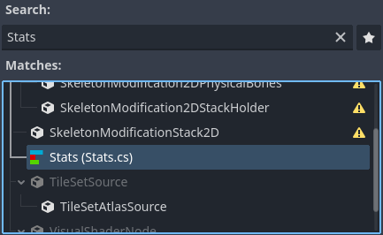

.. _doc_c_sharp_global_classes:

C# global classes
=================

Global classes (also known as named scripts) are types registered in Godot's editor so they can be used
more conveniently. These classes show up in the *Add Node* and *Create Resource* dialogs,
and :ref:`exported properties <doc_c_sharp_exports>` are restricted to instances of the global class or derived classes.
Global classes are registered with the ``[GlobalClass]`` attribute.

.. code-block:: csharp

    using Godot;

    [GlobalClass]
    public partial class MyNode : Node
    {
    }

The ``MyNode`` type will be registered as a global class with the same name as the type's name.

.. image:: img/globalclasses_addnode.webp

The ``[Icon]`` attribute also allows to provide the path to an icon so it can
be used as the class' icon in the editor.

.. code-block:: csharp

    using Godot;

    [GlobalClass, Icon("res://Stats/StatsIcon.svg")]
    public partial class Stats : Resource
    {
        [Export]
        public int Strength { get; set; }

        [Export]
        public int Defense { get; set; }

        [Export]
        public int Speed { get; set; }
    }

The ``Stats`` class is a custom resource registered as a global class. :ref:`Exporting properties <doc_c_sharp_exports>` of the
type ``Stats`` will only allow instances of this resource type to be assigned, and the inspector
will let you create and load instances of this type easily.

.. image:: img/globalclasses_exportedproperty1.webp

.. image:: img/globalclasses_exportedproperty2.webp
