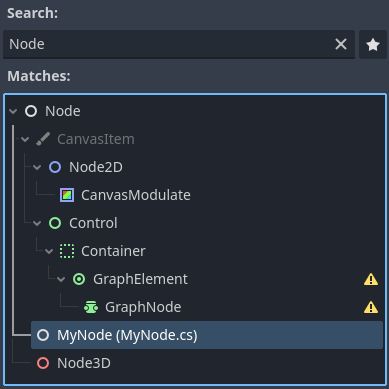
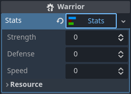

.. _doc_c_sharp_global_classes:

C# global classes
=================

Global classes (also known as named scripts) are types registered in Godot's editor so they can be used
more conveniently.

- Global classes show up in the *Add Node* and *Create Resource* dialogs.
- If an :ref:`exported property <doc_c_sharp_exports>` is a global class, the
  inspector restricts assignment, allowing only instances of that global class
  or any derived classes.

Global classes are registered with the ``[GlobalClass]`` attribute.

.. code-block:: csharp

    using Godot;

    [GlobalClass]
    public partial class MyNode : Node
    {
    }

The ``MyNode`` type will be registered as a global class with the same name as the type's name.

The *Select a Node* window for the ``MyNode`` exported property filters the list
of nodes in the scene to match the assignment restriction.

.. code-block:: csharp

    public partial class Main : Node
    {
        [Export]
        public MyNode MyNode { get; set; }
    }

If a custom type isn't registered as a global class, the assignment is
restricted to the Godot type the custom type is based on. For example, inspector
assignments to an export of the type ``MySimpleSprite2D`` are restricted to
``Sprite2D`` and derived types.

.. code-block:: csharp

    public partial class MySimpleSprite2D : Sprite2D
    {
    }

When combined with the ``[GlobalClass]`` attribute, the ``[Icon]`` attribute
allows providing a path to an icon to show when the class is displayed in the
editor.

.. code-block:: csharp

    using Godot;

    [GlobalClass, Icon("res://Stats/StatsIcon.svg")]
    public partial class Stats : Resource
    {
        [Export]
        public int Strength { get; set; }

        [Export]
        public int Defense { get; set; }

        [Export]
        public int Speed { get; set; }
    }

.. image:: img/globalclasses_createresource.webp

The ``Stats`` class is a custom resource registered as a global class. :ref:`Exporting properties <doc_c_sharp_exports>` of the
type ``Stats`` will only allow instances of this resource type to be assigned, and the inspector
will let you create and load instances of this type easily.

.. image:: img/globalclasses_exportedproperty1.webp

