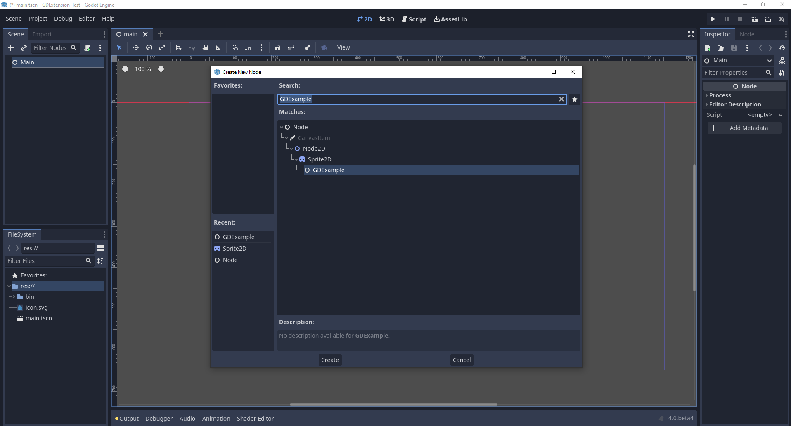
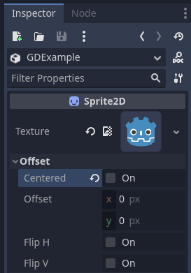

.. _doc_godot_cpp_getting_started:

Getting started
===============

Workflow overview
-----------------

As a GDExtension, godot-cpp is more complicated to use than :ref:`GDScript <doc_gdscript>` and :ref:`C# <doc_c_sharp>`.
If you decide to work with it, here's what to expect your workflow to look like:

* Create a new godot-cpp project (from the `template <https://github.com/godotengine/godot-cpp-template>`__, or from scratch, as explained below).
* Develop your code with your :ref:`favorite IDE <toc-devel-configuring_an_ide>` locally.
* Build and test your code with the earliest compatible Godot version.
* Create builds for all platforms you want to support (e.g. using `GitHub Actions <https://github.com/godotengine/godot-cpp-template/blob/main/.github/workflows/builds.yml>`__).
* Optional: Publish on the `Godot Asset Library <https://godotengine.org/asset-library/asset>`__.

Example project
---------------

For your first godot-cpp project, we recommend starting with this guide to understand the technology involved with
godot-cpp. After you're done, you can use the `godot-cpp template <https://github.com/godotengine/godot-cpp-template>`__,
which has better coverage of features, such as a GitHub action pipeline and useful ``SConstruct`` boilerplate code.
However, the template does not explain itself to a high level of detail, which is why we recommend going through this
guide first.

Setting up the project
----------------------

There are a few prerequisites you'll need:

- A Godot 4 executable.
- A C++ compiler.
- SCons as a build tool.
- A copy of the `godot-cpp repository <https://github.com/godotengine/godot-cpp>`__.

See also :ref:`Configuring an IDE <toc-devel-configuring_an_ide>`
and :ref:`Compiling <toc-devel-compiling>` as the build tools are identical
to the ones you need to compile Godot from source.

You can download the `godot-cpp repository <https://github.com/godotengine/godot-cpp>`__ from GitHub or let Git do the work for you.
Note that this repository has different branches for different versions
of Godot. GDExtensions will not work in older versions of Godot (only Godot 4 and up) and vice versa, so make sure you download the correct branch.

.. note::
    To use `GDExtension <https://godotengine.org/article/introducing-gd-extensions>`__
    you need to use the godot-cpp branch that matches the version of Godot that you are
    targeting. For example, if you're targeting Godot 4.1, use the ``4.1`` branch. Throughout
    this tutorial we use ``4.x``, which will need to be replaced with the version of Godot you
    are targeting.

    The ``master`` branch is the development branch which is updated regularly
    to work with Godot's ``master`` branch.

.. warning::
    GDExtensions targeting an earlier version of Godot should work in later
    minor versions, but not vice-versa. For example, a GDExtension targeting Godot 4.2
    should work just fine in Godot 4.3, but one targeting Godot 4.3 won't work in Godot 4.2.

    There is one exception to this: extensions targeting Godot 4.0 will **not** work with
    Godot 4.1 and later (see :ref:`updating_your_gdextension_for_godot_4_1`).

If you are versioning your project using Git, it is recommended to add it as
a Git submodule:

.. code-block:: none

    mkdir gdextension_cpp_example
    cd gdextension_cpp_example
    git init
    git submodule add -b 4.x https://github.com/godotengine/godot-cpp
    cd godot-cpp
    git submodule update --init

Alternatively, you can also clone it to the project folder:

.. code-block:: none

    mkdir gdextension_cpp_example
    cd gdextension_cpp_example
    git clone -b 4.x https://github.com/godotengine/godot-cpp

.. note::

    If you decide to download the repository or clone it into your folder,
    make sure to keep the folder layout the same as we've setup here. Much of
    the code we'll be showcasing here assumes the project has this layout.

If you cloned the example from the link specified in the introduction, the
submodules are not automatically initialized. You will need to execute the
following commands:

.. code-block:: none

    cd gdextension_cpp_example
    git submodule update --init

This will initialize the repository in your project folder.

Building the C++ bindings
-------------------------

Now that we've downloaded our prerequisites, it is time to build the C++
bindings.

The repository contains a copy of the metadata for the current Godot release,
but if you need to build these bindings for a newer version of Godot, call
the Godot executable:

.. code-block:: none

    godot --dump-extension-api

The resulting ``extension_api.json`` file will be created in the executable's
directory. Copy it to the project folder and add ``custom_api_file=<PATH_TO_FILE>``
to the scons command below.

To generate and compile the bindings, use this command (replacing ``<platform>``
with ``windows``, ``linux`` or ``macos`` depending on your OS):

The build process automatically detects the number of CPU threads to use for
parallel builds. To specify a number of CPU threads to use, add ``-jN`` at the
end of the SCons command line where ``N`` is the number of CPU threads to use.

.. code-block:: none

    cd godot-cpp
    scons platform=<platform> custom_api_file=<PATH_TO_FILE>
    cd ..

This step will take a while. When it is completed, you should have static
libraries that can be compiled into your project stored in ``godot-cpp/bin/``.

.. note::

    You may need to add ``bits=64`` to the command on Windows or Linux.

Creating a simple plugin
------------------------

Now it's time to build an actual plugin. We'll start by creating an empty Godot
project in which we'll place a few files.

Open Godot and create a new project. For this example, we will place it in a
folder called ``demo`` inside our GDExtension's folder structure.

In our demo project, we'll create a scene containing a Node called "Main" and
we'll save it as ``main.tscn``. We'll come back to that later.

Back in the top-level GDExtension module folder, we're also going to create a
subfolder called ``src`` in which we'll place our source files.

You should now have ``demo``, ``godot-cpp``, and ``src``
directories in your GDExtension module.

Your folder structure should now look like this:

.. code-block:: none

    gdextension_cpp_example/
    |
    +--demo/                  # game example/demo to test the extension
    |
    +--godot-cpp/             # C++ bindings
    |
    +--src/                   # source code of the extension we are building

In the ``src`` folder, we'll start with creating our header file for the
GDExtension node we'll be creating. We will name it ``gdexample.h``:

.. code-block:: cpp
    :caption: gdextension_cpp_example/src/gdexample.h

    #pragma once

    #include <godot_cpp/classes/sprite2d.hpp>

    namespace godot {

    class GDExample : public Sprite2D {
        GDCLASS(GDExample, Sprite2D)

    private:
        double time_passed;

    protected:
        static void _bind_methods();

    public:
        GDExample();
        ~GDExample();

        void _process(double delta) override;
    };

    } // namespace godot

There are a few things of note to the above. We include ``sprite2d.hpp`` which
contains bindings to the Sprite2D class. We'll be extending this class in our
module.

We're using the namespace ``godot``, since everything in GDExtension is defined
within this namespace.

Then we have our class definition, which inherits from our Sprite2D through a
container class. We'll see a few side effects of this later on. The
``GDCLASS`` macro sets up a few internal things for us.

After that, we declare a single member variable called ``time_passed``.

In the next block we're defining our methods, we have our constructor
and destructor defined, but there are two other functions that will likely look
familiar to some, and one new method.

The first is ``_bind_methods``, which is a static function that Godot will
call to find out which methods can be called and which properties it exposes.
The second is our ``_process`` function, which will work exactly the same
as the ``_process`` function you're used to in GDScript.

Let's implement our functions by creating our ``gdexample.cpp`` file:

.. code-block:: cpp
    :caption: gdextension_cpp_example/src/gdexample.cpp

    #include "gdexample.h"
    #include <godot_cpp/core/class_db.hpp>

    using namespace godot;

    void GDExample::_bind_methods() {
    }

    GDExample::GDExample() {
        // Initialize any variables here.
        time_passed = 0.0;
    }

    GDExample::~GDExample() {
        // Add your cleanup here.
    }

    void GDExample::_process(double delta) {
        time_passed += delta;

        Vector2 new_position = Vector2(10.0 + (10.0 * sin(time_passed * 2.0)), 10.0 + (10.0 * cos(time_passed * 1.5)));

        set_position(new_position);
    }

This one should be straightforward. We're implementing each method of our class
that we defined in our header file.

Note our ``_process`` function, which keeps track of how much time has passed
and calculates a new position for our sprite using a sine and cosine function.

There is one more C++ file we need; we'll name it ``register_types.cpp``. Our
GDExtension plugin can contain multiple classes, each with their own header
and source file like we've implemented ``GDExample`` up above. What we need now
is a small bit of code that tells Godot about all the classes in our
GDExtension plugin.

.. code-block:: cpp
    :caption: gdextension_cpp_example/src/register_types.cpp

    #include "register_types.h"

    #include "gdexample.h"

    #include <gdextension_interface.h>
    #include <godot_cpp/core/defs.hpp>
    #include <godot_cpp/godot.hpp>

    using namespace godot;

    void initialize_example_module(ModuleInitializationLevel p_level) {
        if (p_level != MODULE_INITIALIZATION_LEVEL_SCENE) {
            return;
        }

        GDREGISTER_RUNTIME_CLASS(GDExample);
    }

    void uninitialize_example_module(ModuleInitializationLevel p_level) {
        if (p_level != MODULE_INITIALIZATION_LEVEL_SCENE) {
            return;
        }
    }

    extern "C" {
    // Initialization.
    GDExtensionBool GDE_EXPORT example_library_init(GDExtensionInterfaceGetProcAddress p_get_proc_address, const GDExtensionClassLibraryPtr p_library, GDExtensionInitialization *r_initialization) {
        godot::GDExtensionBinding::InitObject init_obj(p_get_proc_address, p_library, r_initialization);

        init_obj.register_initializer(initialize_example_module);
        init_obj.register_terminator(uninitialize_example_module);
        init_obj.set_minimum_library_initialization_level(MODULE_INITIALIZATION_LEVEL_SCENE);

        return init_obj.init();
    }
    }

The ``initialize_example_module`` and ``uninitialize_example_module`` functions get
called respectively when Godot loads our plugin and when it unloads it. All
we're doing here is parse through the functions in our bindings module to
initialize them, but you might have to set up more things depending on your
needs. We call the ``GDREGISTER_RUNTIME_CLASS`` macro for each of our classes
in our library. This will make them run only in game, like the default for GDScript.

The important function is the third function called ``example_library_init``.
We first call a function in our bindings library that creates an initialization object.
This object registers the initialization and termination functions of the GDExtension.
Furthermore, it sets the level of initialization (core, servers, scene, editor, level).

At last, we need the header file for the ``register_types.cpp`` named
``register_types.h``.

.. code-block:: cpp
    :caption: gdextension_cpp_example/src/register_types.h

    #pragma once

    #include <godot_cpp/core/class_db.hpp>

    using namespace godot;

    void initialize_example_module(ModuleInitializationLevel p_level);
    void uninitialize_example_module(ModuleInitializationLevel p_level);

Compiling the plugin
--------------------

To compile the project we need to define how SCons using should compile it
using an ``SConstruct`` file which references the one in ``godot-cpp``.
Writing it from scratch is outside the scope of this tutorial, but you can
:download:`the SConstruct file we prepared <files/cpp_example/SConstruct>`.
We'll cover a more customizable, detailed example on how to use these
build files in a subsequent tutorial.

.. note::

    This ``SConstruct`` file was written to be used with the latest ``godot-cpp``
    master, you may need to make small changes using it with older versions or
    refer to the ``SConstruct`` file in the Godot 4.x documentation.

Once you've downloaded the ``SConstruct`` file, place it in your GDExtension folder
structure alongside ``godot-cpp``, ``src`` and ``demo``, then run:

.. code-block:: bash

    scons platform=<platform>

You should now be able to find the module in ``demo/bin/<platform>``.

When building for iOS, package the module as a static `.xcframework`, you can use
following commands to do so:

::

    # compile simulator and device modules
    scons arch=universal ios_simulator=yes platform=ios target=<target>
    scons arch=arm64 ios_simulator=no platform=ios target=<target>

    # assemble xcframeworks
    xcodebuild -create-xcframework -library demo/bin/libgdexample.ios.<target>.a -library demo/bin/libgdexample.ios.<target>.simulator.a -output demo/bin/libgdexample.ios.<target>.xcframework
    xcodebuild -create-xcframework -library godot-cpp/bin/libgodot-cpp.ios.<target>.arm64.a -library godot-cpp/bin/libgodot-cpp.ios.<target>.universal.simulator.a  -output demo/bin/libgodot-cpp.ios.<target>.xcframework

.. note::

    Here, we've compiled both godot-cpp and our gdexample library as debug
    builds. For optimized builds, you should compile them using the
    ``target=template_release`` switch.

Using the GDExtension module
----------------------------

Before we jump back into Godot, we need to create one more file in
``demo/bin/``.

This file lets Godot know what dynamic libraries should be
loaded for each platform and the entry function for the module. It is called ``gdexample.gdextension``.

.. code-block:: none

    [configuration]

    entry_symbol = "example_library_init"
    compatibility_minimum = "4.1"
    reloadable = true

    [libraries]

    macos.debug = "res://bin/libgdexample.macos.template_debug.framework"
    macos.release = "res://bin/libgdexample.macos.template_release.framework"
    ios.debug = "res://bin/libgdexample.ios.template_debug.xcframework"
    ios.release = "res://bin/libgdexample.ios.template_release.xcframework"
    windows.debug.x86_32 = "res://bin/libgdexample.windows.template_debug.x86_32.dll"
    windows.release.x86_32 = "res://bin/libgdexample.windows.template_release.x86_32.dll"
    windows.debug.x86_64 = "res://bin/libgdexample.windows.template_debug.x86_64.dll"
    windows.release.x86_64 = "res://bin/libgdexample.windows.template_release.x86_64.dll"
    linux.debug.x86_64 = "res://bin/libgdexample.linux.template_debug.x86_64.so"
    linux.release.x86_64 = "res://bin/libgdexample.linux.template_release.x86_64.so"
    linux.debug.arm64 = "res://bin/libgdexample.linux.template_debug.arm64.so"
    linux.release.arm64 = "res://bin/libgdexample.linux.template_release.arm64.so"
    linux.debug.rv64 = "res://bin/libgdexample.linux.template_debug.rv64.so"
    linux.release.rv64 = "res://bin/libgdexample.linux.template_release.rv64.so"
    android.debug.x86_64 = "res://bin/libgdexample.android.template_debug.x86_64.so"
    android.release.x86_64 = "res://bin/libgdexample.android.template_release.x86_64.so"
    android.debug.arm64 = "res://bin/libgdexample.android.template_debug.arm64.so"
    android.release.arm64 = "res://bin/libgdexample.android.template_release.arm64.so"

    [dependencies]
    ios.debug = {
        "res://bin/libgodot-cpp.ios.template_debug.xcframework": ""
    }
    ios.release = {
        "res://bin/libgodot-cpp.ios.template_release.xcframework": ""
    }

This file contains a ``configuration`` section that controls the entry function of the module.
You should also set the minimum compatible Godot version with ``compatibility_minimum``,
which prevents older version of Godot from trying to load your extension.
The ``reloadable`` flag enables automatic reloading of your extension by the editor every time you recompile it,
without needing to restart the editor. This only works if you compile your extension in debug mode (default).

The ``libraries`` section is the important bit: it tells Godot the location of the
dynamic library in the project's filesystem for each supported platform. It will
also result in *just* that file being exported when you export the project,
which means the data pack won't contain libraries that are incompatible with the
target platform.

Finally, the ``dependencies`` section allows you to name additional dynamic
libraries that should be included as well. This is important when your GDExtension
plugin implements someone else's library and requires you to supply a
third-party dynamic library with your project.

Here is another overview to check the correct file structure:

.. code-block:: none

    gdextension_cpp_example/
    |
    +--demo/                  # game example/demo to test the extension
    |   |
    |   +--main.tscn
    |   |
    |   +--bin/
    |       |
    |       +--gdexample.gdextension
    |
    +--godot-cpp/             # C++ bindings
    |
    +--src/                   # source code of the extension we are building
    |   |
    |   +--register_types.cpp
    |   +--register_types.h
    |   +--gdexample.cpp
    |   +--gdexample.h

Time to jump back into Godot. We load up the main scene we created way back in
the beginning and now add a newly available GDExample node to the scene:

We're going to assign the Godot logo to this node as our texture, disable the
``centered`` property:

We're finally ready to run the project:

.. video:: img/gdextension_cpp_animated.webm
   :alt: Screen recording of a game window, with Godot logo moving in the top-left corner
   :autoplay:
   :loop:
   :muted:
   :align: default

Adding properties
-----------------

GDScript allows you to add properties to your script using the ``export``
keyword. In GDExtension you have to register the properties with a getter and
setter function or directly implement the ``_get_property_list``, ``_get`` and
``_set`` methods of an object (but that goes far beyond the scope of this
tutorial).

Lets add a property that allows us to control the amplitude of our wave.

In our ``gdexample.h`` file we need to add a member variable and getter and setter
functions:

.. code-block:: cpp

    ...
    private:
        double time_passed;
        double amplitude;

    public:
        void set_amplitude(const double p_amplitude);
        double get_amplitude() const;
    ...

In our ``gdexample.cpp`` file we need to make a number of changes, we will only
show the methods we end up changing, don't remove the lines we're omitting:

.. code-block:: cpp

    void GDExample::_bind_methods() {
        ClassDB::bind_method(D_METHOD("get_amplitude"), &GDExample::get_amplitude);
        ClassDB::bind_method(D_METHOD("set_amplitude", "p_amplitude"), &GDExample::set_amplitude);

        ADD_PROPERTY(PropertyInfo(Variant::FLOAT, "amplitude"), "set_amplitude", "get_amplitude");
    }

    GDExample::GDExample() {
        // Initialize any variables here.
        time_passed = 0.0;
        amplitude = 10.0;
    }

    void GDExample::_process(double delta) {
        time_passed += delta;

        Vector2 new_position = Vector2(
            amplitude + (amplitude * sin(time_passed * 2.0)),
            amplitude + (amplitude * cos(time_passed * 1.5))
        );

        set_position(new_position);
    }

    void GDExample::set_amplitude(const double p_amplitude) {
        amplitude = p_amplitude;
    }

    double GDExample::get_amplitude() const {
        return amplitude;
    }

Once you compile the module with these changes in place, you will see that a
property has been added to our interface. You can now change this property and
when you run your project, you will see that our Godot icon travels along a
larger figure.

Let's do the same but for the speed of our animation and use a setter and getter
function. Our ``gdexample.h`` header file again only needs a few more lines of
code:

.. code-block:: cpp

    ...
        double amplitude;
        double speed;
    ...
        void _process(double delta) override;
        void set_speed(const double p_speed);
        double get_speed() const;
    ...

This requires a few more changes to our ``gdexample.cpp`` file, again we're only
showing the methods that have changed so don't remove anything we're omitting:

.. code-block:: cpp

    void GDExample::_bind_methods() {
        ...
        ClassDB::bind_method(D_METHOD("get_speed"), &GDExample::get_speed);
        ClassDB::bind_method(D_METHOD("set_speed", "p_speed"), &GDExample::set_speed);

        ADD_PROPERTY(PropertyInfo(Variant::FLOAT, "speed", PROPERTY_HINT_RANGE, "0,20,0.01"), "set_speed", "get_speed");
    }

    GDExample::GDExample() {
        time_passed = 0.0;
        amplitude = 10.0;
        speed = 1.0;
    }

    void GDExample::_process(double delta) {
        time_passed += speed * delta;

        Vector2 new_position = Vector2(
            amplitude + (amplitude * sin(time_passed * 2.0)),
            amplitude + (amplitude * cos(time_passed * 1.5))
        );

        set_position(new_position);
    }

    ...

    void GDExample::set_speed(const double p_speed) {
        speed = p_speed;
    }

    double GDExample::get_speed() const {
        return speed;
    }

Now when the project is compiled, we'll see another property called speed.
Changing its value will make the animation go faster or slower.
Furthermore, we added a property range which describes in which range the value can be.
The first two arguments are the minimum and maximum value and the third is the step size.

.. note::

    For simplicity, we've only used the hint_range of the property method.
    There are a lot more options to choose from. These can be used to
    further configure how properties are displayed and set on the Godot side.

Signals
-------

Last but not least, signals fully work in GDExtension as well. Having your extension
react to a signal given out by another object requires you to call ``connect``
on that object. We can't think of a good example for our wobbling Godot icon, we
would need to showcase a far more complete example.

This is the required syntax:

.. code-block:: cpp

    some_other_node->connect("the_signal", Callable(this, "my_method"));

To connect our signal ``the_signal`` from some other node with our method
``my_method``, we need to provide the ``connect`` method with the name of the signal
and a ``Callable``. The ``Callable`` holds information about an object on which a method
can be called. In our case, it associates our current object instance ``this`` with the
method ``my_method`` of the object. Then the ``connect`` method will add this to the
observers of ``the_signal``. Whenever ``the_signal`` is now emitted, Godot knows which
method of which object it needs to call.

Note that you can only call ``my_method`` if you've previously registered it in
your ``_bind_methods`` method. Otherwise Godot will not know about the existence
of ``my_method``.

To learn more about ``Callable``, check out the class reference here: :ref:`Callable <class_Callable>`.

Having your object sending out signals is more common. For our wobbling
Godot icon, we'll do something silly just to show how it works. We're going to
emit a signal every time a second has passed and pass the new location along.

In our ``gdexample.h`` header file, we need to define a new member ``time_emit``:

.. code-block:: cpp

    ...
        double time_passed;
        double time_emit;
        double amplitude;
    ...

This time, the changes in ``gdexample.cpp`` are more elaborate. First,
you'll need to set ``time_emit = 0.0;`` in either our ``_init`` method or in our
constructor. We'll look at the other 2 needed changes one by one.

In our ``_bind_methods`` method, we need to declare our signal. This is done
as follows:

.. code-block:: cpp

    void GDExample::_bind_methods() {
        ...
        ADD_PROPERTY(PropertyInfo(Variant::FLOAT, "speed", PROPERTY_HINT_RANGE, "0,20,0.01"), "set_speed", "get_speed");

        ADD_SIGNAL(MethodInfo("position_changed", PropertyInfo(Variant::OBJECT, "node"), PropertyInfo(Variant::VECTOR2, "new_pos")));
    }

Here, our ``ADD_SIGNAL`` macro can be a single call with a ``MethodInfo`` argument.
``MethodInfo``'s first parameter will be the signal's name, and its remaining parameters
are ``PropertyInfo`` types which describe the essentials of each of the method's parameters.
``PropertyInfo`` parameters are defined with the data type of the parameter, and then the name
that the parameter will have by default.

So here, we add a signal, with a ``MethodInfo`` which names the signal "position_changed". The
``PropertyInfo`` parameters describe two essential arguments, one of type ``Object``, the other
of type ``Vector2``, respectively named "node" and "new_pos".

Next, we'll need to change our ``_process`` method:

.. code-block:: cpp

    void GDExample::_process(double delta) {
        time_passed += speed * delta;

        Vector2 new_position = Vector2(
            amplitude + (amplitude * sin(time_passed * 2.0)),
            amplitude + (amplitude * cos(time_passed * 1.5))
        );

        set_position(new_position);

        time_emit += delta;
        if (time_emit > 1.0) {
            emit_signal("position_changed", this, new_position);

            time_emit = 0.0;
        }
    }

After a second has passed, we emit our signal and reset our counter. We can add
our parameter values directly to ``emit_signal``.

Once the GDExtension library is compiled, we can go into Godot and select our sprite
node. In the **Node** dock, we can find our new signal and link it up by pressing
the **Connect** button or double-clicking the signal. We've added a script on
our main node and implemented our signal like this:

.. code-block:: gdscript

    extends Node

    func _on_Sprite2D_position_changed(node, new_pos):
        print("The position of " + node.get_class() + " is now " + str(new_pos))

Every second, we output our position to the console.

Next steps
----------

We hope the above example showed you the basics. You can build upon this example to create full-fledged scripts
to control nodes in Godot using C++!

Instead of basing your project off the above example setup, we recommend to restart now by cloning the
`godot-cpp template <https://github.com/godotengine/godot-cpp-template>`__, and base your project off of that.
It has better coverage of features, such as a GitHub build action and additional useful ``SConstruct`` boilerplate.
