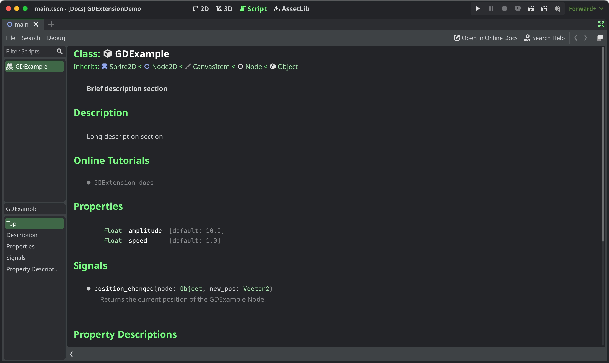

.. _doc_godot_cpp_docs_system:

Adding documentation
====================

.. note::

    Adding documentation for GDExtensions is only possible with Godot 4.3 and later.

The GDExtension documentation system works in a similar manner to the built-in engine documentation: It uses
:ref:`XML files <doc_class_reference_primer>` (one per class) to document the exposed constructors, properties, methods,
constants, signals, and more.

To get started, identify your project's test project folder, which should contain a Godot project with your extension
installed and working. If you are using `godot-cpp-template <https://github.com/godotengine/godot-cpp-template>`__, your
GDExtension project already has a ``project`` folder. Alternatively, you can add one by following the steps
described in :ref:`doc_godot_cpp_getting_started`.
Inside the ``project`` folder, run the following terminal command:

.. code-block:: shell

    # Replace "godot" with the full path to a Godot editor binary
    # if Godot is not installed in your `PATH`.
    godot --doctool ../ --gdextension-docs

This command instructs Godot to generate documentation via the ``--doctool`` and ``--gdextension-docs`` commands.
The ``../`` argument specifies the base path of your GDExtension.

After running this command, you should find XML files for your registered GDExtension classes inside the ``doc_classes``
folder in your GDExtension project. You could edit them now, but for this tutorial, the empty files will suffice.

Now that you have XML files containing your documentation, the next step is to include them in your GDExtension binary.
Assuming you are using SCons as your build system, you can add the following lines to your ``SConstruct`` file. If you
are using `godot-cpp-template <https://github.com/godotengine/godot-cpp-template>`__, your file already contains code
for this.

.. code-block:: py

    if env["target"] in ["editor", "template_debug"]:
        doc_data = env.GodotCPPDocData("src/gen/doc_data.gen.cpp", source=Glob("doc_classes/*.xml"))
        sources.append(doc_data)

The ``if`` statement avoids adding the documentation to release builds of your GDExtension, where it is not needed.
SCons then loads all the XML files inside the ``doc_classes`` directory, and appends the resulting targets
to the ``sources`` array, to be included in your GDExtension build.

After building, launch your Godot project again. You can open the documentation of one of your extension
classes either using :kbd:`Ctrl + Click` on a class name in the script editor, or inside by finding it in the Editor
help dialog. If everything went well, you should see something like this:

Writing and styling documentation
---------------------------------

The format of the class reference XML files is the same as the one used by Godot. Is is documented in
:ref:`doc_class_reference_primer`.

If you are looking for pointers to write high quality documentation, feel free to refer to Godot's
`documentation guidelines <https://contributing.godotengine.org/en/latest/documentation/guidelines/index.html>`__.

Publishing documentation online
-------------------------------

You may want to publish an online reference for your GDExtension, similar to this website.
The most important step is to build reStructuredText (``.rst``) files from your XML class reference:

.. code-block:: shell

    # You need a version.py file, so download it first.
    curl -sSLO https://raw.githubusercontent.com/godotengine/godot/refs/heads/master/version.py

    # Edit version.py according to your project before proceeding.
    # Then, run the rst generator. You'll need to have Python installed for this command to work.
    curl -sSL https://raw.githubusercontent.com/godotengine/godot/master/doc/tools/make_rst.py | python3 - -o "docs/classes" -l "en" doc_classes

Your ``.rst`` files will now be available in ``docs/classes/``. From here, you can use
any documentation builder that supports reStructuredText syntax to create a website from them.

`godot-docs <https://github.com/godotengine/godot-docs>`_ uses `Sphinx <https://www.sphinx-doc.org/en/master/>`_.
You can use the repository as a basis to build your own documentation system.
The following guide describes the basic steps, but they are not exhaustive:
you will need a bit of personal insight to make it work.

1. Add `godot-docs <https://github.com/godotengine/godot-docs>`_ as a submodule to your ``docs/`` folder.
2. Copy over its ``conf.py``, ``index.rst``, ``.readthedocs.yaml`` files into ``/docs/``. You may later decide to copy over and edit more of godot-docs' files, like ``_templates/layout.html``.
3. Modify these files according to your project. This mostly involves adjusting paths to point to the ``godot-docs`` subfolder, as well as strings to reflect it's your project rather than Godot you're building the docs for.
4. Create an account on `readthedocs.org <http://readthedocs.org>`_. Import your project, and modify its base ``.readthedocs.yaml`` file path to ``/docs/.readthedocs.yaml``.

Once you have completed all these steps, your documentation should be available at ``<repo-name>.readthedocs.io``.
