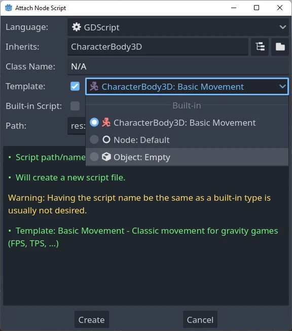
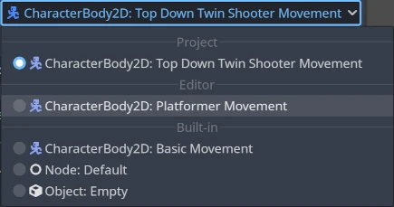

.. _doc_creating_script_templates:

Creating script templates
=========================

Godot provides a way to use script templates as seen in the
``Script Create Dialog`` while creating a new script:

A set of built-in script templates are provided with the editor, but it is
also possible to create new ones and set them by default, both per project
and at editor scope.

Templates are linked to a specific node type, so when you create a script
you will only see the templates corresponding to that particular node, or
one of its parent types.
For example, if you are creating a script for a CharacterBody3D, you will
only see templates defined for CharacterBody3Ds, Node3Ds or Nodes.

Locating the templates
----------------------

There are two places where templates can be managed.

Editor-defined templates
~~~~~~~~~~~~~~~~~~~~~~~~

These are available globally throughout any project. The location of these
templates are determined per each OS:

-  Windows: ``%APPDATA%\Godot\script_templates\``
-  Linux: ``$HOME/.config/godot/script_templates/``
-  macOS: ``$HOME/Library/Application Support/Godot/script_templates/``

If you're getting Godot from somewhere other than the official website, such
as Steam, the folder might be in a different location. You can find it using
the Godot editor. Go to ``Editor > Open Editor Data/Settings Folder`` and it
will open a folder in your file browser, inside that folder is the
``script_templates`` folder.

Project-defined templates
~~~~~~~~~~~~~~~~~~~~~~~~~

The default path to search for templates is the
``res://script_templates/`` directory. The path can be changed by configuring the project setting
:ref:`Editor > Script > Templates Search Path<class_ProjectSettings_property_editor/script/templates_search_path>`,
both via code and the editor.

If no ``script_templates`` directory is found within a project, it is simply
ignored.

Template organization and naming
~~~~~~~~~~~~~~~~~~~~~~~~~~~~~~~~

Both editor and project defined templates are organized in the following way:

::

  template_path/node_type/file.extension

where:

* ``template_path`` is one of the 2 locations discussed in the previous two sections.

* ``node_type`` is the node it will apply to (for example, :ref:`Node <class_Node>`, or :ref:`CharacterBody3D <class_CharacterBody3D>`),
  This is **case-sensitive**. If a script isn't in the proper ``node_type`` folder, it won't be detected.

* ``file`` is the custom name you can chose for the template (for example, ``platformer_movement`` or ``smooth_camera``).

* ``extension`` indicates which language the template will apply to (it should be ``gd`` for GDScript or ``cs`` for C#).

For example:

-  ``script_templates/Node/smooth_camera.gd``
-  ``script_templates/CharacterBody3D/platformer_movement.gd``

Default behavior and overriding it
----------------------------------

By default:

* the template's name is the same as the file name (minus the extension, prettyfied)

* the description is empty

* the space indent is set to 4

* the template will not be set as the default for the given node

It is possible to customize this behavior by adding meta headers at the start
of your file, like this:

.. tabs::

 .. code-tab:: gdscript GDScript

  # meta-name: Platformer movement
  # meta-description: Predefined movement for classical platformers
  # meta-default: true
  # meta-space-indent: 4

 .. code-tab:: csharp

  // meta-name: Platformer movement
  // meta-description: Predefined movement for classical platformers
  // meta-default: true
  // meta-space-indent: 4

In this case, the name will be set to "Platformer movement", with the given custom description, and
it will be set as the default template for the node in which directory it has been saved.

This is an example of utilizing custom templates at editor and project level:

.. note:: The script templates have the same extension as the regular script
          files. This may lead to an issue of a script parser treating those templates as
          actual scripts within a project. To avoid this, make sure to ignore the
          directory containing them by creating an empty ``.gdignore`` file. The directory won't be
          visible throughout the project's filesystem anymore, yet the templates can be
          modified by an external text editor anytime.

.. tip::

    By default, every C# file inside the project directory is included in the compilation.
    Script templates must be manually excluded from the C# project to avoid build errors.
    See `Exclude files from the build <https://learn.microsoft.com/en-us/visualstudio/msbuild/how-to-exclude-files-from-the-build>`_ in the Microsoft documentation.

It is possible to create editor-level templates that have the same level as a project-specific
templates, and also that have the same name as a built-in one, all will be shown on the new script
dialog.

Default template
----------------

To override the default template, create a custom template at editor or project level inside a
``Node`` directory (or a more specific type, if only a subtype wants to be overridden) and start
the file with the ``meta-default: true`` header.

Only one template can be set as default at the same time for the same node type.

The ``Default`` templates for basic Nodes, for both GDScript and C#, are shown here so you can
use these as the base for creating other templates:

.. tabs::

 .. code-tab:: gdscript GDScript

    # meta-description: Base template for Node with default Godot cycle methods

    extends _BASE_

    # Called when the node enters the scene tree for the first time.
    func _ready() -> void:
        pass # Replace with function body.

    # Called every frame. 'delta' is the elapsed time since the previous frame.
    func _process(delta: float) -> void:
        pass

 .. code-tab:: csharp

    // meta-description: Base template for Node with default Godot cycle methods

    using _BINDINGS_NAMESPACE_;
    using System;

    public partial class _CLASS_ : _BASE_
    {
        // Called when the node enters the scene tree for the first time.
        public override void _Ready()
        {
        }

        // Called every frame. 'delta' is the elapsed time since the previous frame.
        public override void _Process(double delta)
        {
        }
    }

The Godot editor provides a set of useful built-in node-specific templates, such as
``basic_movement`` for both :ref:`CharacterBody2D <class_CharacterBody2D>` and
:ref:`CharacterBody3D <class_CharacterBody3D>` and ``plugin`` for
:ref:`EditorPlugin <class_EditorPlugin>`.

List of template placeholders
-----------------------------

The following describes the complete list of built-in template placeholders
which are currently implemented.

Base placeholders
~~~~~~~~~~~~~~~~~

+--------------------------+----------------------------------------------------+
| Placeholder              | Description                                        |
+==========================+====================================================+
| ``_BINDINGS_NAMESPACE_`` | The name of the Godot namespace (used in C# only). |
+--------------------------+----------------------------------------------------+
| ``_CLASS_``              | The name of the new class.                         |
+--------------------------+----------------------------------------------------+
| ``_CLASS_SNAKE_CASE_``   | The name of the new class as ``snake_case``        |
|                          | (used in GDScript only).                           |
+--------------------------+----------------------------------------------------+
| ``_BASE_``               | The base type a new script inherits from.          |
+--------------------------+----------------------------------------------------+
| ``_TS_``                 | Indentation placeholder. The exact type and number |
|                          | of whitespace characters used for indentation is   |
|                          | determined by the ``text_editor/indent/type`` and  |
|                          | ``text_editor/indent/size`` settings in the        |
|                          | :ref:`EditorSettings <class_EditorSettings>`       |
|                          | respectively. Can be overridden by the             |
|                          | ``meta-space-indent`` header on the template.      |
+--------------------------+----------------------------------------------------+

Type placeholders
~~~~~~~~~~~~~~~~~

There used to be, in Godot 3.x, placeholders for GDScript type hints that
would get replaced whenever a template was used to create a new script, such as:
``%INT_TYPE%``, ``%STRING_TYPE%``, ``%FLOAT_TYPE%`` or ``%VOID_RETURN%``.

The placeholders no longer work for Godot 4.x, but if the setting
``text_editor/completion/add_type_hints`` from
:ref:`EditorSettings <class_EditorSettings>` is disabled, type hints
for parameters and return types will be automatically removed for a few
base types:

* ``int``
* ``String``
* ``Array[String]``
* ``float``
* ``void``
* ``:=`` will be transformed into ``=``
