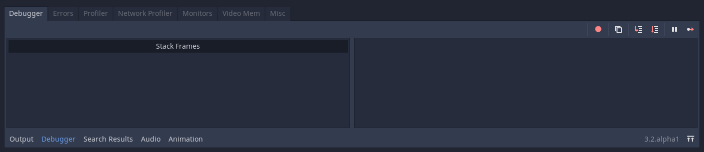

.. _doc_debugger_panel:

Debugger panel
==============

Many of Godot's debugging tools, including the debugger, can be found in the
debugger panel at the bottom of the screen. Click on **Debugger** to open it.

The debugger panel is split into several tabs, each focusing on a specific task.

Debugger
++++++++

The Debugger tab opens automatically when the GDScript compiler reaches
a breakpoint in your code.

It gives you a `stack trace <https://en.wikipedia.org/wiki/Stack_trace>`__,
information about the state of the object, and buttons to control the program's
execution. When the debugger breaks on a breakpoint, a green triangle arrow is
visible in the script editor's gutter. This arrow indicates the line of code the
debugger broke on.

.. tip::

    You can create a breakpoint by clicking the gutter in the left of the script
    editor (on the left of the line numbers). When hovering this gutter, you
    will see a transparent red dot appearing, which turns into an opaque red dot
    after the breakpoint is placed by clicking. Click the red dot again to
    remove the breakpoint. Breakpoints created this way persist across editor
    restarts, even if the script wasn't saved when exiting the editor.

    You can also use the ``breakpoint`` keyword in GDScript to create a
    breakpoint that is stored in the script itself. Unlike breakpoints created by
    clicking in the gutter, this keyword-based breakpoint is persistent across
    different machines when using version control.

You can use the buttons in the top-right corner to:

- Skip all breakpoints. That way, you can save breakpoints for future
  debugging sessions.
- Copy the current error message.
- **Step Into** the code. This button takes you to the next line of code,
  and if it's a function, it steps line-by-line through the function.
- **Step Over** the code. This button goes to the next line of code,
  but it doesn't step line-by-line through functions.
- **Break**. This button pauses the game's execution.
- **Continue**. This button resumes the game after a breakpoint or pause.

.. warning::

    Breakpoints won't break on code if it's
    :ref:`running in a thread <doc_using_multiple_threads>`.
    This is a current limitation of the GDScript debugger.

Errors
++++++

This is where error and warning messages are printed while running the game.

You can disable specific warnings in **Project Settings > Debug > GDScript**.

Profiler
++++++++

The debugger comes with three profilers for your processor, network operations,
and video memory.

The profiler is used to show why individual frames take as long as they do
to process and render.

Unlike other debugging tools, the profiler does not start automatically. It can
be started at any time during gameplay by pressing the start button. You can
even start the profiler before opening the game to profile startup performance.
It can also be started and stopped while the game is running without losing
information from when it was last running. The information it records won't
go away unless you click clear, or close the game, reopen it and start
the profiler again.

After starting and stopping the profiler, you should see things being kept track
of on the left and a graph on the right. The items listed on the left are
everything that contributes to frame time, and they should each have a value
for time and calls for the current frame you are looking at.

The frame number in the top right tells you which frame you are currently
looking at. You can change this by using the up or down arrows, typing in the
frame number, or clicking on the graph.

If you want to add something to your graph or think it looks too cluttered,
you can check and uncheck the box next to an item to add or remove it
from the graph.

Network Profiler
++++++++++++++++

The Network Profiler contains a list of all the nodes that communicate over the
multiplayer API and, for each one, some counters on the amount of incoming and
outgoing network interactions. It also features a bandwidth meter that displays
the total bandwidth usage at any given moment.

Monitors
++++++++

The monitors are graphs of several aspects of the game while its running such as
FPS, memory usage, how many nodes are in a scene and more. All monitors keep
track of stats automatically, so even if one monitor isn't open while the game
is running, you can open it later and see how the values changed.

Video RAM
+++++++++

The **Video RAM** tab shows the video RAM usage of the game while it is running.
It provides a list of every resource using video RAM by resource path, the type
of resource it is, what format it is in, and how much Video RAM that resource is
using. There is also a total video RAM usage number at the top right of the panel.

.. image:: img/video_ram.png

Misc
++++

The **Misc** tab contains tools to identify the control nodes you are clicking
at runtime:

- **Clicked Control** tells you where the clicked node is in the scene tree.
- **Clicked Control Type** tells you the type of the node you clicked is.
